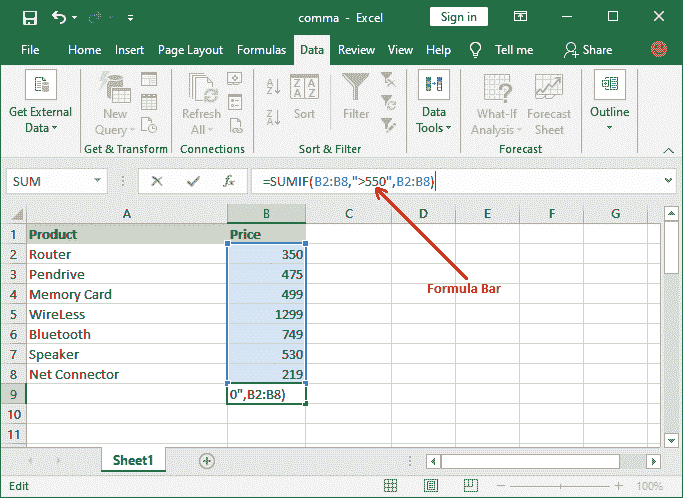
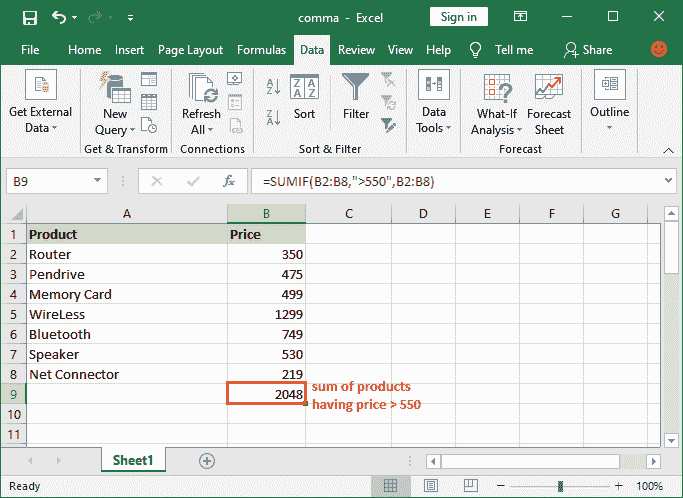
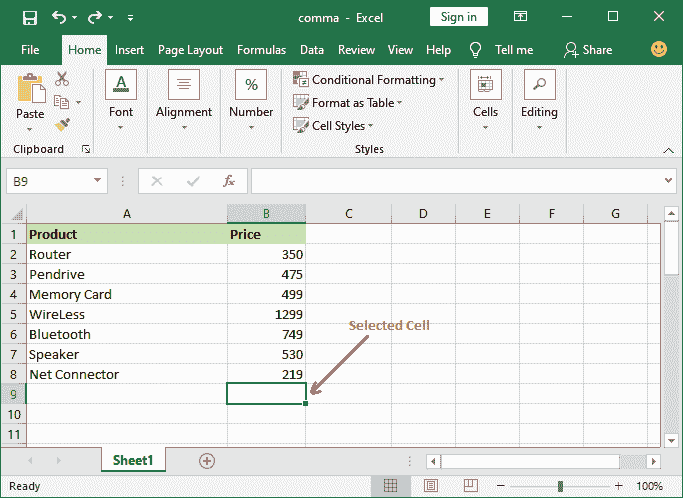
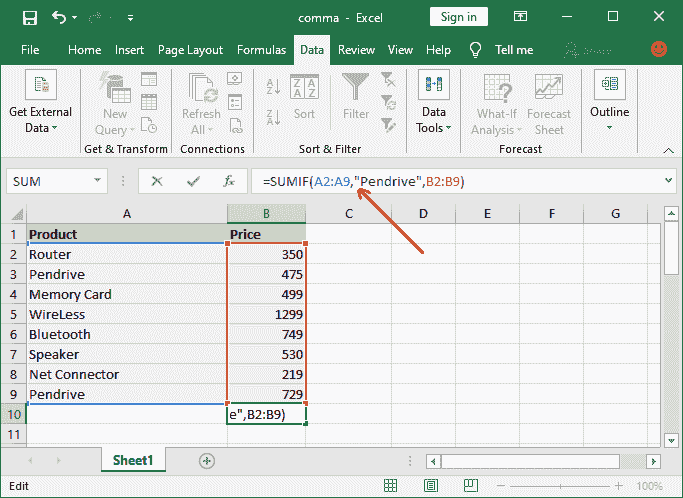
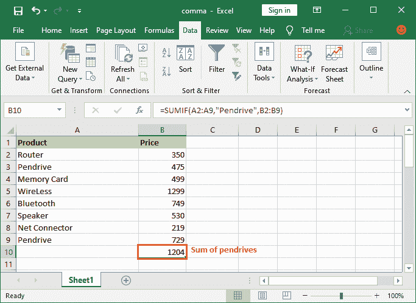

# Excel sumif 函数

> 原文:[https://www.javatpoint.com/excel-sumif-function](https://www.javatpoint.com/excel-sumif-function)

SUMIF 函数用于汇总一列中某些特定单元格的值，这些单元格符合特定标准。SUMIF 是**一个条件函数**，用于对一列中任何特定单元格的值求和。SUMIF 函数是 [Excel](https://www.javatpoint.com/excel-tutorial) 中一个函数组的八个函数之一。

有时，用户要求合计满足用户设置的标准的值。您可以使用 SUMIF 方法轻松完成。SUMIF 函数帮助用户将列数据和一个条件相加。我们将向您简要介绍 **SUMIF 函数**根据条件对列值求和。

### 要点

1.  SUMIF 函数只支持一个条件。所以，不要在多种情况下使用这个函数。
2.  Excel 为多个条件提供了 SUMIFS 函数。
3.  用双引号("")将文本字符串条件括起来。
4.  通配符，例如？和*可以用在 SUMIF 函数中。

**语法**

```
The syntax of the SUMIF function is:
=SUMIF(range,criteria, [sum_range])  

```

**论据**

SUMIF 函数有三个主要参数，它们是永久性的:

**范围:**是指要评估的单元格范围，以入围符合给定标准的单元格。

**标准:**是指判断要添加哪些细胞的条件。它可以是数字或文本。

**Sum _range:** 提供要添加的实际单元格。这是一个可选的参数。如果我们省略函数的这一部分，SUMIF 函数会将“range”视为“sum_range”，从而添加 range 参数的单元格。

**返回值**

SUMIF 函数返回满足或满足指定条件的列的单元格的总和。

## SUMIF 与小计有何不同

**SUMIF 函数**是 Excel 电子表格中使用的一个函数，用于计算某个条件下的列值总和。该函数仅帮助合计满足定义标准的列数据。

虽然，SUMIF 有点类似于 Subtotal 方法，因为 SUMIF 和 Subtotal 方法都不会合计整个列的数据。Subtotal 方法在对列应用筛选器后使用，而 SUMIF 可以直接在具有条件的表上使用。

简单来说，可以说 SUMIF 函数在普通的 Excel 电子表格上执行，而 Subtotal 函数只适用于筛选的表数据，以合计一列数据。

现在，让我们看看如何使用 SUMIF 函数来计算带有某些条件的列数据的总和。让我们用一个例子来理解-

## 使用 SUMIF 基于标准对列值求和

**例 1: SUMIF**

我们有产品及其价格的数据集。我们将计算所有价格大于 550 的产品的总和。请记住，表数据不会被过滤。所以，不要混淆。

使用下面的 SUMIF 公式，得到满足定义条件的单元格总数。

```
=SUMIF(B2:B8,">550",B2:B8)

```

按照以下步骤使用 SUMIF 函数计算总和:

**第一步:**打开工作表，选择要粘贴结果的单元格。


**第二步:**转到**配方栏**将上面的配方粘贴进去。



**第三步:**按**回车**键得到结果。



#### 注意:您可以在数值和测试条件下使用 SUMIF 公式。

假设我们必须计算电子表格中所有笔驱动器的总和。在这种情况下，使用 Pen drive 作为条件，并包括 A 和 B 列，即“产品”和“价格”。

**例 2: SUMIF**

在本例中，我们将使用与上例中相同的 Excel 表格数据，其中包含产品及其价格的数据集。我们将计算该 Excel 列表中所有笔驱动器的总和。它需要的公式与上面的例子有点不同。

使用下面的 SUMIF 公式，得到满足定义条件的单元格总数。

```
=SUMIF(A2:A9,"Pendrive ",B2:B9)

```

**第一步:**打开工作表，选择要粘贴结果的单元格。



**第二步:**在公式栏中复制粘贴以下 SUMIF 公式:



**第三步:**按下**进入**键，获取本 Excel 电子表格中的笔驱动器总价。



在这里，您可以看到我们在此表中有两种不同价格的 Pen drive 产品。这一次，您将看到两个笔式驱动器的总和，其总价为 1204，如上面步骤中计算的那样。

### 一些重要的公式

您也可以使用 SUMIF 函数，如下所示:

```
=SUMIF(A2:A9,"M*",B2:B9)   //sum the cells containing M at the beginning in cell A
=SUMIF(A2:A9,"*er",B2:B9)   //sum the cells containing er at the end in cell A
=SUMIF(A2:A9,"*ea*",B2:B9)   //sum the cells containing ea in between in cell A
=SUMIF(A2:A9,"???",B2:B9)   //sum the cells having three characters in cell A

```

除此之外，SUMIFS 是另一个与 SUMIF 几乎相似的功能。

* * *