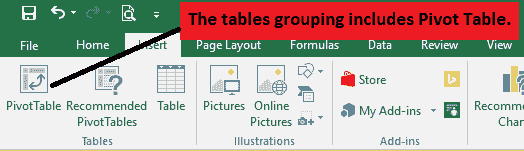

# 什么是透视表？

> 原文：<https://www.javatpoint.com/excel-pivot-table>

数据透视表是在数据处理环境中使用的**数据汇总设备**。数据透视表用于汇总、排序、重新排列、分组、检查、汇总或存储在数据库中标准记录。它允许它的客户把列变成行，把行变成段。它允许按任何信息字段分组。当我们必须总结和分析大量数据时，透视表是理想的安排。

## 从空白数据透视表开始

1.打开文档 GL 数据透视表 Data.xlsx。工作表中有一个查询，包括经济数据仓库中的 2011 财年成本。

2.将光标定位在信息中的任何单元格上。

#### 注意:请确保您的信息是表格格式，并且没有清晰的行或列。此外，每一列必须有一个不同的标题，高一行。

3.转到功能区，打开标签。

*   点击向下箭头，获得选择列表。

## 创建您的第一个透视表

要制作数据透视表，请执行以下操作:

1.点击信息表格中的一个单元格

2.从功能区的“插入”标签中选择“数据透视表”

3.如上图所示，点击选择表格/范围按钮

4.默认情况下，数据透视表位于“新建工作表”下

5.点击按钮确认默认设置。

6.我们会得到下面的小窗口。

7.按下单元格地址 A1

8.按键盘上的 Ctrl + A 选择所有记录单元格

9.您演示的小窗口现在出现如下

10.按关闭按钮返回选项窗口

11.按下确定按钮。

12.一个清晰的**数据透视表**和**字段列表**将出现在一个新的工作表上。

13.制作数据透视表时，必须选择要包含的字段。每个字段只是源信息中的一个列部分。在“数据透视表字段列表”中，选中要包含的每个字段的容器。

14.所选字段将包含在字段列表下方的四个区域之一中。在本例中，**订单标识**字段已添加到行区域，而**金额**已添加到值区域。另一方面，您可以单击、按住并拖动字段到所需的区域。

15.数据透视表将计算并显示所选字段的轮廓。在本例中，数据透视表显示每个客户的销售额。

## 刷新数据

如果我们转换源工作表中的任何信息，数据透视表将不会自动更新。要进行物理更新，请选择数据透视表，然后选择分析→刷新。

**打开文件时刷新数据**

有一种可以打开的替代方法，可以在打开文档时刷新信息。要设置自动打开工作簿时升级数据透视表数据的选项，请执行以下操作:

1.从数据透视表工具中，按选项选项卡，然后在透视表组中，按选项命令。

2.打开记录时，按下数据选项卡并勾选刷新信息。

3.按确定。

## 旋转数据

也许，数据透视表最好的一点是，它们可以快速透视或重新排列信息，允许我们以各种方式查看工作表数据。

**更改行**

1.按住并将任何当前字段拖出行区域。田野将会消失。

2.将另一个字段从字段列表拖到行区域。在本例中，我们将使用名字字段。

3.数据透视表将更改或透视以显示新信息。

**添加列**

数据透视表一次只显示一列信息。要显示各种列，我们必须向“列”区域添加一个字段。

1.将字段从字段列表拖到列区域。在本例中，我们将使用区域字段。

2.数据透视表将包含多列。

## 过滤

过滤器可以用来精确筛选数据透视表中的信息，允许我们只看到需要的数据。

**添加过滤器**

1.将字段从字段记录拖到筛选区域。在本例中，我们将使用名字字段。

2.筛选将出现在数据透视表中。按下下拉箭头，然后选中“选择多个元素”旁边的容器。

3.取消选中不想包含在数据透视表中的任何元素的容器。在本例中，我们将取消选中几个不同名字的容器，然后按“确定”。

4.数据透视表将符合镜像更改。

## 分组数据

在数据透视表文档的行和列标签区域，可以用自定义方法对字段中的元素进行分组。对信息进行分组可以帮助您隔离满足您特定需求的数据子集，这些数据不能以不同的方式轻松分组，例如排序和过滤。您可能希望使用以下方法之一进行分组:

*   将数字字段中的数字分组
*   分组日期或时间
*   将选定的元素分组

**分组字段**

1.选择数据透视表中的信息。

2.右键单击所选信息，然后按组。

3.按确定。

**按日期分组**

1.按日期段内的任意单位。

2.右键单击并单击组。

3.选择月份，然后按确定。

4.数据透视表将符合镜像更改。

* * *