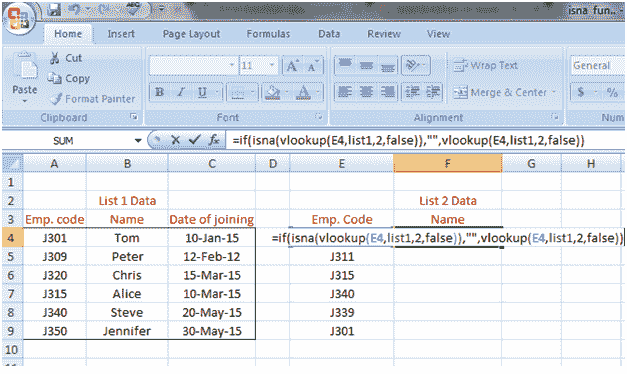
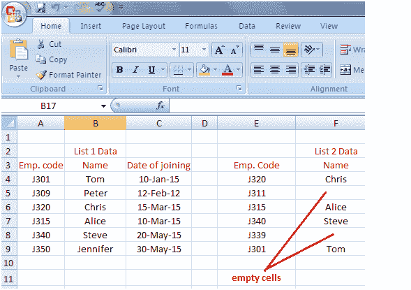

# Excel ISNA 函数

> 原文：<https://www.javatpoint.com/excel-isna-function>

**ISNA 功能有助于消除#N/A 码错误**

使用 ISNA 函数，我们可以告诉 Excel 将单元格留空或显示任何所需的文本，如“未找到”，而不是显示#N/A 代码错误。请参见示例中如何使用该函数:

功能是:

```
=if(isna(vlookup(E4,list1,2,false)),"",vlookup(E4,list1,2,false))

```

上述功能有三个部分:

第一部分: **=if(isna(vlookup(E4，列表 1，2，false))，**表示如果函数没有在列表 1 中找到单元格 E4 的值，那么显示第二部分。

第二部分:**、**表示将单元格留空。您可以在要显示的引号之间写入文本，而不是空白单元格。

第三部分: **vlookup(E4，list1，2，false)**表示如果函数找到值，那么照常执行 vlookup。请参见下面给出的图片:

 

* * *