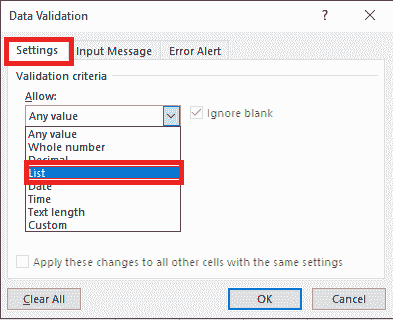
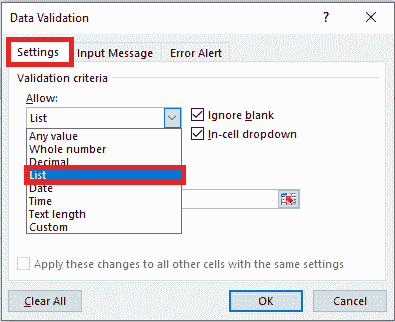
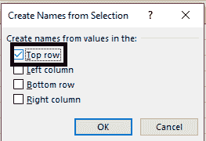

# 如何在 Excel 中创建下拉列表？

> 原文:[https://www . javatpoint . com/如何创建-下拉列表-excel 中](https://www.javatpoint.com/how-to-create-drop-down-list-in-excel)

下拉列表是一种很好的方式，可以让客户端从预定义的列表中进行选择。

当让客户填充一个结构或制作一个直观的 excel 仪表板时，可以很好地利用它。

下拉列表在社交网站和应用程序中非常常见，对客户来说非常自然。

## 创建下拉列表

要在 Excel 中创建下拉列表，请执行以下步骤。

1.  使用单元格中的数据。
2.  手动输入数据。
3.  使用 OFFSET 公式。

### 使用单元格中的数据。

1.我们有一个元素列表，如下所示:

2.选择一个我们需要制作下拉列表的单元格。

3.单击数据，然后选择数据工具→数据验证。

4.将显示“数据验证”对话框。

5.在设置图标中，选择列表作为验证标准

6.当我们选择列表时，源字段会显示出来。

7.在源字段中，输入= $L$18+'[Book2.xlsx] Sheet 2 '！$ a3:$ A8 或基本上在“来源”字段中按下，并使用鼠标选择单元格，然后按下“确定”。这将在单元格 C2 中嵌入一个下拉列表。

8.确保选中单元格内下拉选项(默认选中)。如果未选中此选项，单元格不会显示下拉列表，我们可以在列表中手动输入值。

### 通过手动输入数据

在该示例中，源字段中使用了单元格引用。我们还可以通过在源字段中手动输入元素来精确地添加元素。

例如，假设我们需要在单元格的下拉列表中显示两个选项，是和否。下面是我们如何在数据验证源字段中准确输入:

选择我们需要生成下拉列表的单元格(本例中为 C2 单元格)。

单击数据并选择数据工具->数据验证。

在“数据验证”对话框的“设置”图标内，选择“列表”作为验证标准。

当我们选择列表时，源字段会显示出来。

在来源字段中，输入是、否

确保测试了单元格内下拉选项。

按确定。

这将在选定的单元格中制作一个下拉列表。源字段中记录的所有元素(用逗号分隔)都记录在下拉菜单的不同行中。

在源字段中输入的所有内容，用逗号隔开，显示在下拉列表的不同行中。

### 动态下拉列表

当我们在列表末尾包含一个元素时，我们可以利用一个公式来自然地刷新下拉列表。

1.在第一张工作表中，选择单元格 B1。

2.在数据图标的数据工具组中，按数据验证。

将显示“数据验证”对话框。

3.在“允许”框中，按列表。

4.按源框，输入公式:=OFFSET (Sheet2！$A$1，0，0，COUNTA (Sheet2！$A: $A)，1)

5.按确定。

6.在第二张纸上，在列表的末尾添加一个新元素。

### 删除下拉列表

要删除 Excel 中的下拉列表，请执行以下步骤。

1.用下拉菜单选择单元格。

2.在数据图标的数据工具组中，按数据验证。

将显示“数据验证”对话框。

3.按全部清除。

4.按确定。

### 相关下拉列表

有时，我们可能有多个下拉列表，我们需要第二个下拉列表中显示的元素依赖于客户端在第一个下拉列表中选择的内容。

这些被称为依赖或条件下拉列表。

以下是在 Excel 中创建从属和条件下拉记录的步骤:

*   选择我们需要第一个(主)下拉列表的单元格。
*   在数据选项卡上，选择数据验证。这将打开数据验证对话框。

在数据验证对话框的设置图标内，选择列表。

在“源”字段中，指示包含要在第一个下拉列表中显示的元素的范围。

按确定。这将使下拉列表为 1。

选择整个数据集(本例中为 A1: C8)。

单击公式并选择定义的名称，然后从选择创建(或者我们可以使用键盘快捷键控制+ Shift + F3)。

在“从所选内容创建命名”对话框中，选中顶部行选项，并取消选中所有其他选项。这样做可以产生两个姓名字段(“员工姓名”和“性别”)。“员工姓名”字段定义文件中的所有员工姓名，“性别”字段代表文件中的性别。

按确定。

选择需要依赖和条件下拉列表的单元格(本例中为 E3)。

单击数据并选择数据验证。

在“数据验证”对话框的设置图标内，确保选择了列表。

在源数据中，输入公式=间接(D3)。这里，D3 是包含主下拉列表的单元格。

按确定。

* * *