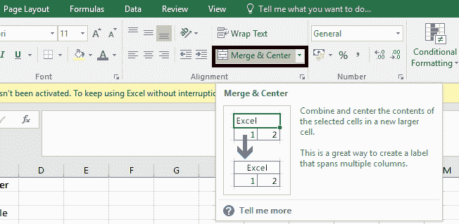
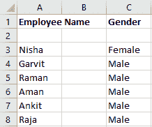
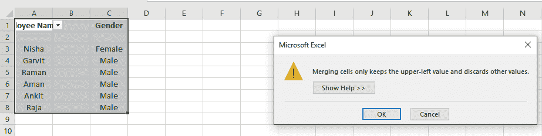

# 如何在微软 Excel 中合并单元格？

> 原文:[https://www . javatpoint . com/如何合并-microsoft-excel 中的单元格](https://www.javatpoint.com/how-to-merge-cells-in-microsoft-excel)

我们可以用不同的方法在 Excel 中合并单元格。

最常用的方法之一是利用主页选项卡中的**合并&中心**选项。

使用合并和中心的问题是它可以合并单元格，但不能合并这些单元格中的文本。假设我们有一个数据集，如下所示:

如果我们选择单元格 A1 和 B1，并使用合并和居中选项，它将保留最左侧单元格(本例中为 A1)中的文本，并删除所有其他单元格中的文本。

Excel 并不是完全无情的，尽管它会在这种情况发生之前警告你。如果您尝试合并包含文本的单元格，它会显示一个警告弹出窗口，让您知道这一点(如下所示)。

如果我们继续并单击“确定”，它将合并两个单元格，并且只保留最左边单元格的文本。在上面的例子中，它将结合 A1 和 B1，并将只显示员工姓名。

* * *