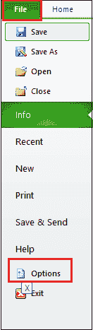
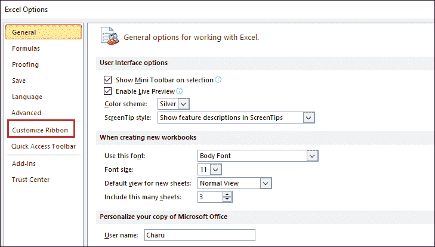
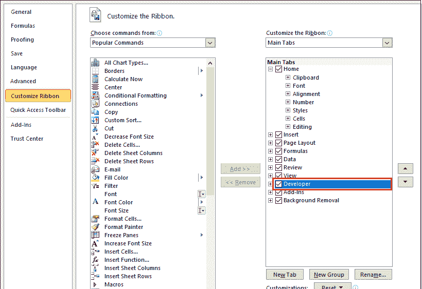
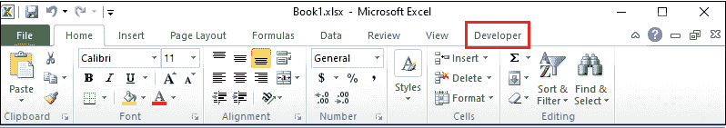
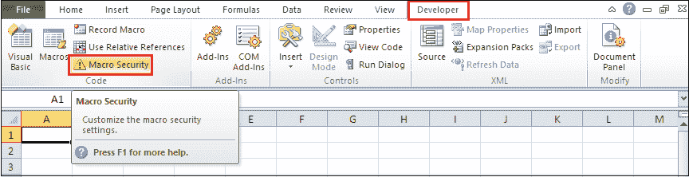
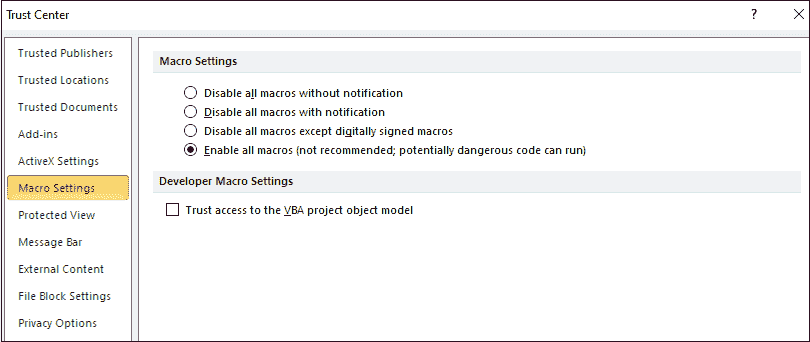
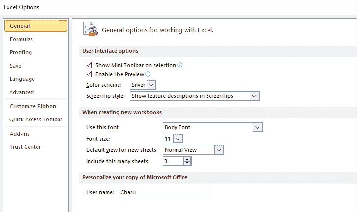
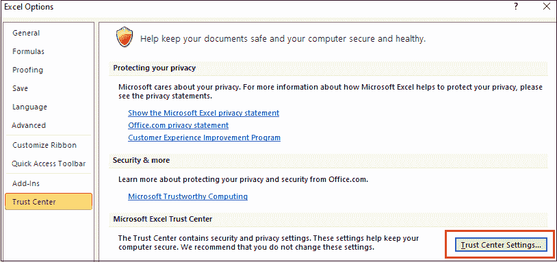
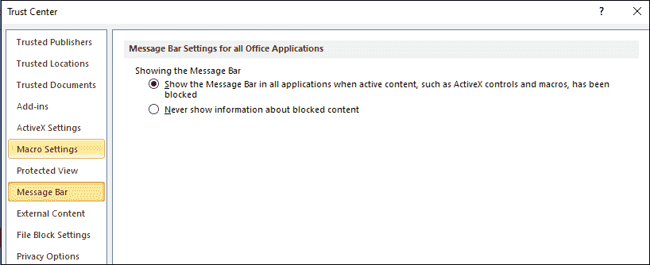
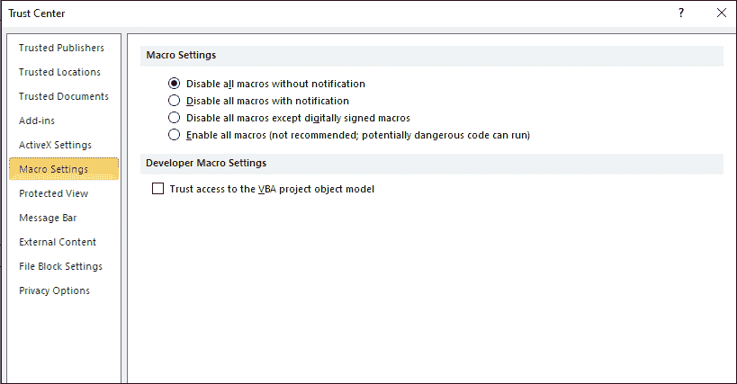

# 如何在 excel 中启用宏

> 原文：<https://www.javatpoint.com/how-to-enable-macros-in-excel>

宏是一组小而简单的计算机程序，可用于**在 Excel 中执行、记录和自动化常见的重复任务**。当我们需要执行任务时，它可以随时运行。

就安全级别而言，宏是危险的，因为它们会损坏或删除硬盘上的可用文件，并破坏我们的 Microsoft Office 安装。

#### 注意:默认情况下，宏在微软 Excel 中是禁用的。

### 启用宏

在 excel 中启用宏之前，请确保仅启用安全宏。

我们使用以下两种方法在 excel 中启用宏-

**方法 1:使用开发者选项卡**启用宏

#### 注意:在消息栏中创建和启用宏。首先，我们需要在功能区中启用开发人员选项卡。

**第一步:在功能区**添加显影剂标签

1.启动一个[微软 Excel](https://www.javatpoint.com/excel-tutorial) 文件。

2.单击 Excel 文件左上角的**文件选项卡**，然后单击选项选项卡。

3.单击 **Excel 选项**对话框中的**自定义功能区**选项。

4.屏幕上将出现一个**自定义功能区**窗口。在面板右侧，点击**自定义功能区**选项，点击**主选项卡**下的**开发者选项卡**，点击**确定**按钮，如下图截图所示。

现在，您可以看到开发人员选项卡出现在功能区上。

**第二步:**一旦功能区出现开发者选项卡，点击**开发者选项卡**并点击**代码部分**中的**宏安全**选项。

**步骤 3:** 将出现一个**信任中心**对话框，选择**宏设置**选项。点击**启用所有宏(不推荐；潜在危险代码可以运行)**宏设置**部分下的**单选按钮，然后点击屏幕下方的**确定**按钮。

**方法 2:通过信任中心设置**启用宏

通过信任中心设置启用宏的步骤如下-

#### 注意:我们使用以下步骤在 Microsoft Excel 2010、2013、2016 和 2019 中启用宏。

**第一步:**打开要启用宏的 Microsoft Excel 文件。

**第二步:**点击屏幕左上角的**文件**标签。屏幕上将出现文件选项列表。点击**选项**标签。

**第三步:**屏幕上会出现一个 Excel 选项对话框。点击左窗格中的**信任中心**选项。

**第四步:**点击**微软 Excel 信任中心**部分下的**信任中心设置**按钮，如下图截图所示。

**第五步:**屏幕上出现**信任中心**对话框，点击左侧窗格中的**宏设置**选项。

**第六步:**点击**启用所有宏(不推荐；潜在危险代码可以运行)**宏设置**选项下的**单选按钮，然后点击**信任中心**对话框底部的**确定**按钮。

**第七步:**在 **Excel 选项**对话框底部，点击**确定**按钮。

现在，所有宏都将在微软 Excel 上运行，没有警告消息。

### 禁用宏

以下步骤用于禁用微软 Excel 文档中的宏-

**第一步:**打开一个微软 Excel 文档。

**第二步:**转到 Excel 文档**左上角**的**文件**选项卡。屏幕上将出现文件选项列表，点击**选项**。

**第三步:**点击 **Excel 选项**对话框左窗格的**信任中心**选项。

**第四步:**点击**微软 Excel 信任中心**中的**信任中心设置**按钮。

**步骤 5:** 屏幕上会出现一个**信任中心**对话框，左侧窗格有**宏设置**选项。

**第六步:**点击**不通知**禁用所有宏，点击屏幕下方**确定**按钮。

现在，您可以看到宏现在已从 Excel 文档中禁用。

* * *