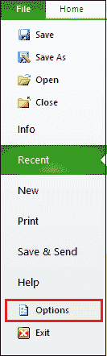
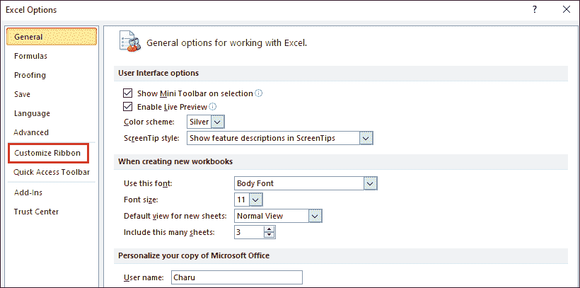
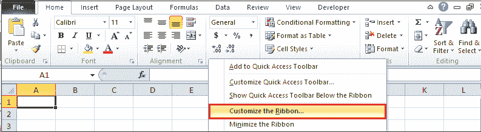
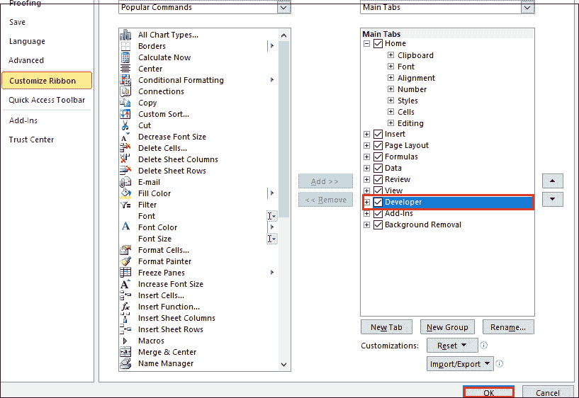
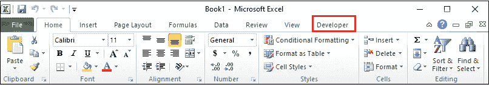
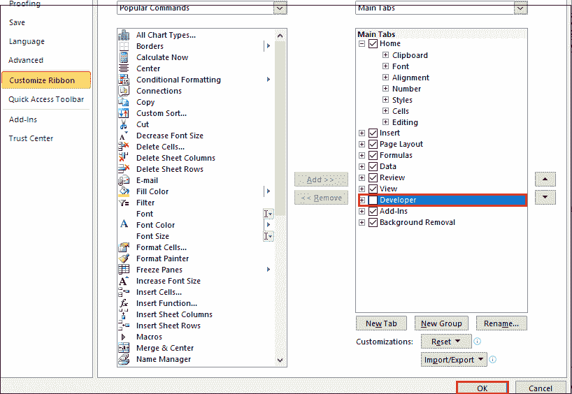
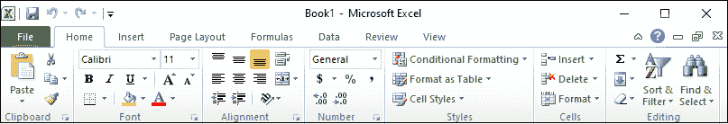

# 如何在 Excel 中启用开发人员选项卡

> 原文:[https://www . javatpoint . com/如何在 excel 中启用开发人员选项卡](https://www.javatpoint.com/how-to-enable-the-developer-tab-in-excel)

开发人员选项卡是 Excel 文档中的**内置选项卡**，允许我们访问各种常用功能来创建**宏、[Visual Basic for Applications(VBA)](https://www.javatpoint.com/vba)、控件(插入 ActiveX 和表单控件)以及加载项**。它还允许我们导入和导出 [XML](https://www.javatpoint.com/what-is-xml) 文件，管理 XML 地图，使用 XML 命令等等。

#### 注意:默认情况下，功能区上不显示“开发人员”选项卡。

### 在 Excel 中启用开发人员选项卡

当您启用“开发人员”选项卡时，它将自动出现在 Excel 文档中，然后是“视图”选项卡。

在 Excel 中启用开发人员选项卡有以下步骤-

#### 注意:以下步骤有助于您在 Microsoft Excel 2007、Excel 2010、Excel 2013、Excel 2016、Excel 2019 和 Office365 中启用“开发人员”选项卡。

**步骤 1:** 打开新的或现有的[微软 Excel](https://www.javatpoint.com/excel-tutorial) 文档。

**第二步:**点击文档左上角的**文件**选项。屏幕上将出现文件选项列表。点击**选项**标签。

**第三步:**屏幕上会出现 **Excel 选项**对话框。单击左窗格中的**自定义功能区**选项。

#### 注意:也可以通过右键单击功能区上的任意位置并选择“自定义功能区”选项来打开“自定义功能区”对话框。

**第四步:自定义功能区**选项出现在屏幕右侧。**勾选**主选项卡**下的【开发人员】复选框**，然后点击【自定义功能区】对话框底部的**确定**按钮，如下图截图所示。

现在，您可以看到开发人员选项卡已经添加到微软 Excel 功能区。

#### 注意:启用开发人员选项卡是一个一次性过程，现在每当我们打开新的 Microsoft Excel 文档时，开发人员选项卡都会自动出现在功能区上。

### 禁用开发人员选项卡

启用开发人员选项卡后，您还可以使用下面提到的最简单的步骤将其禁用-

**步骤 1:** 打开新的或现有的微软 Excel 文档。

**步骤 2:** 右键单击功能区上的任意位置。弹出一个小对话框，点击**自定义功能区**选项。

**第三步:**出现**自定义功能区**对话框，左侧选择**自定义功能区**选项。在右侧**主选项卡**下，**取消勾选**开发者选项卡，点击屏幕下方**确定**按钮，如下图截图所示。

现在，您可以从功能区看到“开发人员”选项卡已被禁用。

* * *