# 如何在 Excel 中计算时差

> 原文:[https://www . javatpoint . com/如何计算 excel 中的时差](https://www.javatpoint.com/how-to-calculate-time-difference-in-excel)

在 Excel 中，有很多处理日期和时间的函数。但是没有具体的函数可以用来计算时间值之间的差异。

在 Excel 中，计算两次之间的**差可能很棘手。时间在内部处理为 0 到 1 之间的数字。**

计算时差最简单的方法是用一个时间减去另一个时间。

它之所以有效，是因为 Excel 以整数存储日期，以十进制值存储时间。只有 Excel 单元格的格式会导致单元格的内容显示为日期或时间，而不是简单的数字。

因此，当您想要计算两次之间的差值时，可以减去时间值，类似于减去任何其他数值。

### 将单元格格式化为时间

在 [Excel](https://www.javatpoint.com/excel-tutorial) 中，计算时差时，可能希望结果显示为时间。

如果没有显示为时间，您可以使用以下任一方法将单元格格式化为“时间”格式:

**方法 1:使用 Excel 功能区选项**格式化单元格

应用简单“时间”格式的最简单方法是选择单元格格式，然后从功能区下拉菜单中选择 ***【时间】*** 选项。这可以在功能区的 ***主页*** 选项卡上的“号码”组中找到，如下所示:

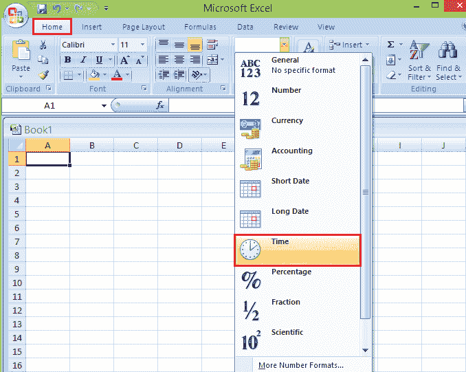

**方法 2:使用“设置单元格格式”对话框**设置单元格格式

如果您需要更多的时间格式选择，您可能更喜欢使用“设置单元格格式”对话框应用单元格格式，如下所示:

**步骤 1:** 选择要格式化的单元格。

**第二步:**打开“单元格格式”对话框。

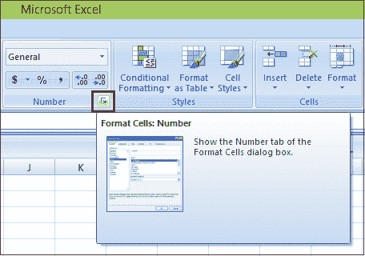

**第三步:**点击 Excel 功能区主页选项卡上“数字”分组中的对话框启动器。

***或*** 可以使用键盘快捷键 Ctrl + 1。

**第四步:**确保选择了“单元格格式”对话框的 ***编号*** 标签。

**第五步:**从 ***类别*** 列表中，选择 ***时间*** 选项。

#### 注意:如果您想要默认时间以外的时间，您可以选择“单元格格式”对话框右侧的列表选项之一。

**第六步:**点击 ***确定*** 应用所选格式，关闭【单元格格式】对话框。

**例**

以下电子表格的单元格 C2 显示了一个简单的示例，说明如何通过从单元格 B2 中减去单元格 A2 中的时间来计算时差。

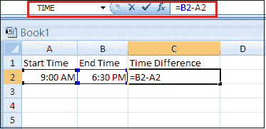

在上面的例子中，单元格 A2 中的时间由数字 0.375 表示，单元格 B2 中的时间由数字 0.270833333 表示。将这两个数相减得到的结果为 0.395833333，格式化为时间为 ***09:30:00*** (即 9 小时 30 分 0 秒)。

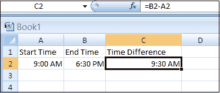

时间值是一个格式化为时间的数值，但是当您从另一个值中扣除一个值时，它会返回一个十进制数，您需要再次将其格式化为时间。

格式化结果值时，它会将这些值显示为小时和分钟(从 00:00 开始)，而不是显示小时和分钟的实际差异。

所以如果你有 9 小时 30 分钟的差异，它会显示为上午 09:30。

### 时差的计算方法

以下是六种不同的方法，您可以使用它们来获得时间值之间的差异，例如:

1.  获得小时和分钟的差异。
2.  在小时数上有所不同。
3.  在完成的时间内获得不同。
4.  在几分钟内获得差异。
5.  以秒为单位获取差异。
6.  将差值计算为负值。

以下是对计算时差的所有六种方法的逐步解释，并举例说明:

**1。获得小时和分钟的差异**

这是最常见的获得两次差的方法之一。

**第一步:**假设你有一个开始和结束时间，你需要得到两者的差值。

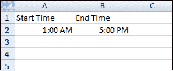

**第二步:**首先，你可以从开始时间中扣除结束时间，你会得到如下的差值。

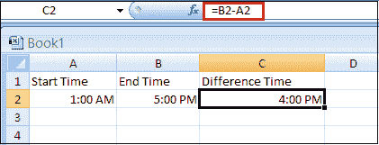

**第三步:**现在，你需要把这个时间转换成小时和分钟。

*   选择单元格并打开格式选项(Ctrl + 1)。
*   然后，选择“时间”类别，选择第二种时间格式。
*   点击确定按钮。

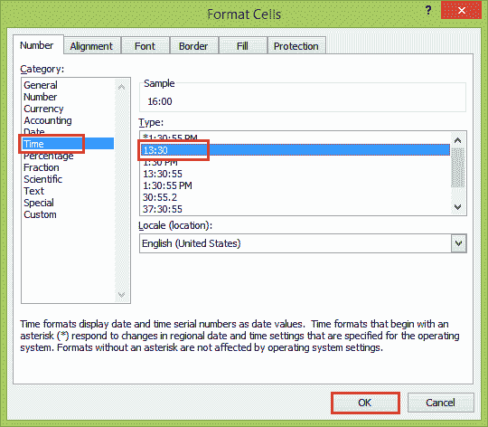

一旦您这样做，它会将时差格式转换为小时和分钟，而不是正常的时间格式。

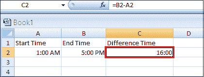

**2。获得不同的小时数**

这不是一种常见的获取时差的方法，但是如果您想要区分以小时为单位而不是以正常数字为单位的开始和结束时间，这仍然是有用和重要的。

例如，如果开始时间和结束时间之差为 4 小时 30 分钟，则应显示为 4.5 小时。这是用来表示时差这种形式的公式。

```

=(end time - start time)*24

```

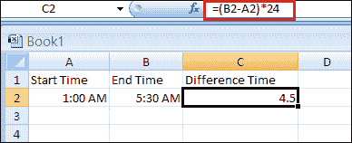

输入此公式后，它会以数字形式返回小时，以小数形式返回分钟。

Excel 以数字形式存储日期和时间，当您从开始时间中扣除结束时间时，它会返回一个小数。

当你把它乘以 24，它会把十进制数转换成小时和分钟数。

**3。完成时间不同**

您也可以用这个简单的公式计算两次之间的完成小时数。

```

=INT((end time - start time)*24)

```

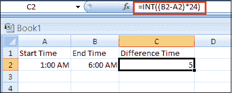

这个公式用于第二种方法。唯一的区别是这里我们用 INT 包装了它。

函数的作用是:通过向下取整返回整数小数部分。因此，当你输入这个公式时，首先它会返回一个小时的十进制数，然后 INT 去掉小数部分，给你完整的小时数。

**4。以分钟为单位获得差异**

有时，您需要以分钟而不是小时来跟踪时差。在这种情况下，使用以下公式。

```

=(end time - start time)*1440

```

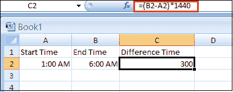

在这个公式中，从结束时间中扣除开始时间后，我们将其乘以 1440，这是我们在 24 小时内的总分钟数。

当你输入这个公式时，你会在几分钟内得到两个值之间的差值。

**5。获得秒差**

如果您的时间值中有秒，您可以使用下面的公式来获取开始和结束时间之间的总完成秒。

```

=(end time - start time)*86400

```

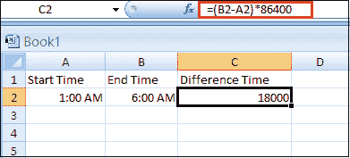

这里 86400 是 24 小时内的总秒数，当你输入这个公式时，它会以秒为单位返回开始和结束时间的差值。

**6。将差值计算为负值**

在上面所有的例子中，我们都有结束时间，它大于开始时间。假设您有两个结束时间大于开始时间的时间值。

例如，如果开始时间是第一天晚上 11:00，结束时间是第二天凌晨 3:00。

结束时间小于开始时间，简单的减法公式将不起作用并返回负值，这将导致 Excel 以哈希字符的形式字符串显示错误(即#######)。

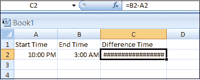

所以，有一个公式可以避免这个问题:

```

=If(end>start, end - start, 1 - start + end)

```

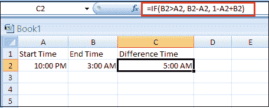

在这个公式中，你有一个条件，如果结束时间大于开始时间，那么它会简单地从开始时间中扣除结束时间；否则，首先会从 1 中扣除开始时间，然后将其添加到结束时间中。

通过从 1 中减去开始时间，您将获得第 1 天的总时间，当您将其添加到结束时间时，您将获得第 1 天和第 2 天的总时间，这是真正的差异。

或将 Excel 日期系统改为 1904 日期系统。正常显示负时间(带负号)最快最简单的方法是切换到 1904 年的日期系统。

*   点击 ***办公按钮*** 。
*   转到 ***Excel 选项*** 。
    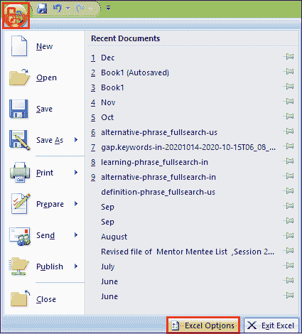
*   然后选择 ***【高级】*** 选项，在计算本工作簿 部分时向下滚动至 ***，并在 ***处打勾【使用 1904 日期系统】***
    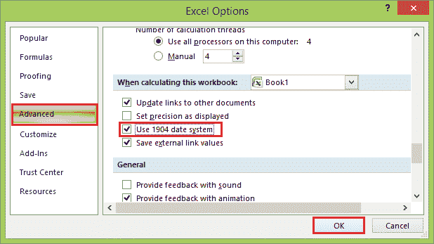***
*   点击 ***确定*** 按钮，现在负数会正确显示，如下图负数。
    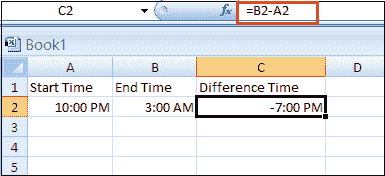

* * *