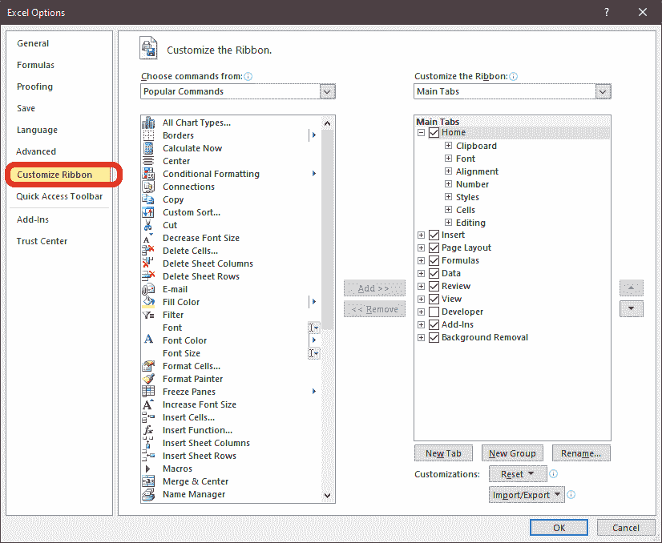

# 如何在微软 Excel 中插入复选框

> 原文：<https://www.javatpoint.com/how-to-insert-checkbox-in-ms-excel>

复选框是允许我们为给定数据选择一个或多个可用选项的按钮。复选框是一种用于简化数据输入的表单控件。这些复选框非常适合创建带有多个选项的表单。要在 excel 工作表中添加复选框，只需遵循一些指导步骤。

要在工作表中插入复选框，我们需要在微软 Excel 中启用**开发者**选项。*步骤可能因微软 Excel 版本*而异。在 Windows 10 的 MS Excel 2010 中，在工作表中添加复选框需要使用以下步骤:

**第一步:**在电脑系统上打开[微软 Excel](https://www.javatpoint.com/excel-tutorial) ，只需在搜索选项卡上搜索或直接点击微软 Excel 图标(如果桌面上有)，如下图所示:

**步骤 2:** 首先要在 Excel 工作表中启用**开发人员**选项，为此，请执行以下步骤:

1)点击**文件**，在**帮助**下，点击【选项】，如下图所示:

2)将打开一个窗口，从中选择并点击**自定义功能区**，如下图所示:

3)在**主选项卡**下，您会注意到除了**开发者**复选框外，所有复选框都已选中，如下图所示:

4)点击**开发者**复选框，按**确定**。

**第 3 步:**启用**开发者**标签。点击工具栏上的**开发者**标签，在**视图**旁边，如下图所示:

**第 4 步:**在**开发者**选项卡中，您将看到**插入**选项，如下图所示:

**第四步:**在**下插入**，点击**表单控件**，点击**复选框**符号，如下图所示:

**第五步:**现在，选择要添加复选框的单元格，复选框将插入单元格，如下图所示:

**第六步:**但是应该知道我们一次只能添加一个复选框。要添加更多的复选框，请复制现有的复选框并将其粘贴到另一个单元格，然后继续操作，直到满足您的需要。

**步骤 7:** 如果要编辑或删除控件的默认文本，请单击该控件并更新文本。

#### 注意:应该知道用户不能编辑控件的大小及其与文本的距离。

## 格式选项

我们可以编辑和自定义复选框，并按照我们的要求按照以下步骤进行:

**第一步:**将光标移动到复选框上，右键单击，将显示选项列表，如下图所示:

**第二步:**然后点击**格式控制**，将打开**格式控制**对话框，如下图所示:

**第三步:**在**格式控制**对话框下，点击**控制**选项卡(最后一个选项)，如下图所示:

**步骤 4:****控制**选项卡允许进行以下修改:

*   **选中:**显示选中的选项按钮。
*   **未选中:**显示清除选项按钮。
*   **单元格链接:**取携带选项按钮当前状态的单元格引用。
*   **三维着色:**该选项用于将三维效果应用于插入的复选框。

**步骤 5:** 应用格式后，点击**确定**。

用户可以根据自己需要的展示和外观进行其他修改。

* * *