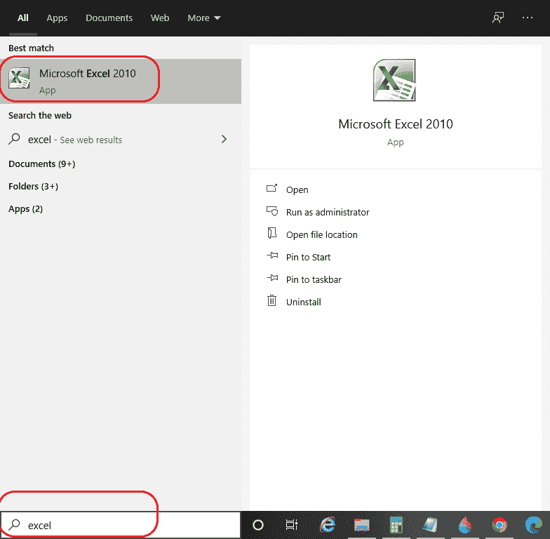

# 如何在微软 Excel 中插入 PDF

> 原文：<https://www.javatpoint.com/how-to-insert-pdf-in-ms-excel>

在某些情况下，对于 excel 数据，可能需要在 excel 电子表格中插入另一个对象，如 PDF。一般在准备报告、制作产品目录等时都需要添加 pdf。

在这里，我们将学习如何将 [Pdf](https://www.javatpoint.com/pdf) 插入到 excel 工作表中，以及我们可以通过多少种方式这样做。我们还将学习如何调整插入的 PDF 并对其进行自定义。

## 将 PDF 插入 Excel 的选项

我们可以通过两种方式/选项将 PDF 插入到 Excel 工作表中，如下所示:

**选项 1:** *显示为图标:*插入的 pdf 文件将作为图标插入。

**选项 2:** *链接到文件:*插入的 pdf 文件将作为链接插入。

让我们一步一步地讨论这两个选项。

### 将 PDF 作为图标插入 Excel

**按照以下步骤将 pdf 文件插入到 MS Excel 2010 工作表中:**

**第一步:**在电脑系统上打开[微软 Excel](https://www.javatpoint.com/excel-tutorial) ，只需在搜索选项卡上搜索或直接点击微软 Excel 图标(如果桌面上有)，如下图所示:

**第二步:**接下来，我们需要一个 **PDF 阅读器**，比如 **Adobe Acrobat 阅读器**。因此，如果您的系统上没有安装它，请安装它。否则**跳过**这一步。

**第三步:**点击**在**首页**旁边插入**，在下方点击**对象**，如下图快照所示:

**第 4 步:**将打开**对象**对话框，选择**新建**选项，如下图所示:

**步骤 5:** 现在，如果您的系统上安装了 Adobe Acrobat Reader 或任何其他 PDF 阅读器，其名称将显示在选项中，如上图所示。

**步骤 6:** 选择“Adobe Acrobat 文档”，在右侧，您将看到“显示为图标”复选框。点击图标，如下图所示:

#### 注意:如果您没有单击“显示为图标”复选框，您将选择的 pdf 将作为打开的 pdf 插入。

**第 7 步:**如果您想更改 pdf 的图标，请点击**更改图标…** 并选择您想要的图标，如下所示:

**第八步:**点击**确定**浏览到你要插入的 pdf 所在的位置，点击**打开**。

**第九步:**选中的 pdf 会以图标的形式插入到 excel 工作表中，如下图所示:

#### 注意:当我们在 excel 工作簿中插入一个对象时，该对象的大小会变得比以前更大。

您可以将 pdf 拖到任何您想要的地方，并根据您的需要调整其大小。

### 使用链接到文件在 Excel 中插入 PDF

在一些 excel 数据组织中，我们可能希望将 pdf 作为链接插入，用户可以单击该链接并查看附加的 pdf。使用*链接到文件*选项，我们可以这样做，它通过创建链接使我们的 excel 工作簿成为实时报告。因此，如果对文件进行了任何修改，所有这些更改都将反映在 Excel 文档中。但是请记住我们的 excel 工作簿和 pdf 文件(即对象必须放在一个位置)。此外，通过链接 pdf，不用担心 pdf 的大小，因为在这样的选项中，pdf 的大小保持不变。我们需要按照以下步骤将 pdf 插入 excel 工作表:

**第一步:**打开 MS Excel 工作表，如下图快照所示:

**步骤 2:** 选择要插入 pdf 文档的单元格。

**第三步:**点击**首页**旁边的**插入**标签，如下图所示:

**第四步:**在**插入**下，点击**对象**，将打开对象对话框，如下图所示:

**第五步:**点击【对象】对话框下的**从文件创建**选项，如上图所示。

**第六步:浏览**找到要插入的 pdf 所在的位置，点击**插入**，如下图所示:

**第 7 步:**在对话框右侧可以看到两个复选框选项，如下图所示:

**第 8 步:**点击两个复选框，即“显示为图标”和“链接到文件”，然后点击**确定，**pdf 将被插入 excel 表中，如下图所示:

#### 注意:如果不选择“显示为图标”，则插入的整个将在工作表上打开。所以勾选两个复选框。

使用这两个选项，我们可以将 pdf 文件附加到 excel 工作表中。

### 调整插入的 Pdf

微软 Excel 不允许插入的 PDF 与微软 Excel 中的单元格排序。但是，我们可以通过以下步骤调整 PDF 文件:

1)将光标移动到插入的 PDF 文件上，右键点击，会弹出如下所示的下拉菜单:

2)在其中，单击“格式化对象”选项，对话框将打开，如下所示:

3)在**格式对象**对话框中，点击“属性”，如下图所示:

4)在**属性**下，选择“使用单元格移动和调整大小”，然后根据您的喜好点击**确定**。pdf 会被调整。

### 查看/重命名插入的 PDF

我们还可以按照以下步骤查看和重命名插入的 PDF:

**查看 PDF 文档**

1)将光标移动到 PDF 图标上，右键单击它，从中选择“Acrobat 文档对象”，然后在它下面单击“打开”，如下图所示:

2)插入的 PDF 文档将在 **Adobe Acrobat** 窗口中打开，如下图所示:

3)现在，如果您有任何更改，点击 **Acrobat 文档对象**中的**保存**图标，更改也会保存到您的 excel 表格中。

### 要重命名 PDF 文档:

1)将光标移动到 PDF 图标上，右键单击它，从中选择“Acrobat 文档对象”，然后在它下面单击“转换”，如下图所示:

2)将打开**转换**对话框，如下图所示:

3)如果没有勾选“显示为图标”，勾选后点击**更改图标…** 选项，如下图所示:

4)将打开**更改图标**对话框，您可以在其中更改图标(如果需要)，在该对话框下方的**标题**下，更改名称并根据您的喜好进行更改，如下所示:

5)点击**确定**再点击一个**确定**，修改会反映到你插入的 PDF 中。

* * *