# 如何在 Excel 中更改日期格式

> 原文：<https://www.javatpoint.com/how-to-change-the-date-format-in-excel>

Microsoft Excel 允许我们更改默认日期格式，并选择其他多种日期格式，如 2008 年 12 月 20 日、2008 年 12 月 20 日、2012 年 12 月 12 日、2021 年 10 月 24 日等。

**Excel 中的默认日期格式**

默认日期格式在控制面板设置中设置，即日/月/年。

在[微软 Excel](https://www.javatpoint.com/excel-tutorial) 中，默认日期格式在格式单元格中可见。

**在 Excel 中查看默认日期格式的步骤-**

1.**右键单击 Excel 文档中的任意位置**。屏幕上会出现一个选项列表。点击**设置单元格格式**选项。

2.点击类别下的**日期**。标有星号(*)的日期格式是默认的 Microsoft Excel 日期格式，如下图所示。

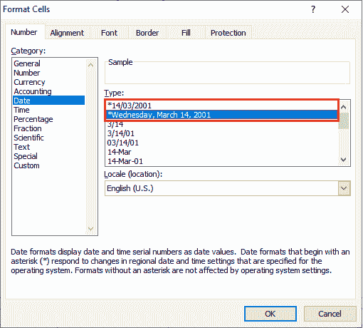

## 更改日期格式的方法

按照下面给出的方法更改 Excel 文档中的日期格式-

### 方法 1:使用单元格格式对话框更改日期格式

**步骤 1:** 打开新的或现有的微软 Excel 文档。

**第二步:选择或高亮显示想要更改日期格式的单元格**。您也可以选择一个空单元格来插入日期。

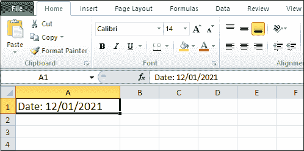

#### 注意:在我们的例子中，我们在单元格 A1 中插入日期。

**第三步:**从键盘上按下 **Ctrl + 1 键(对于 Windows)或控制+ 1 或命令+1 键(对于 Mac)** 。屏幕上将出现“设置单元格格式”对话框，在该对话框中执行以下操作-

1.  点击**数字标签**。
2.  点击类别列表下的**日期**。
3.  **在类型:部分选择您想要的日期格式**。在样本框中，将显示您选择的日期。
4.  点击“单元格格式”对话框底部的**确定**按钮，如下图所示。

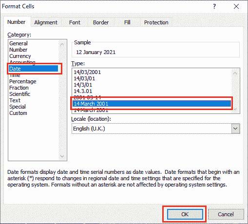

#### 注 1:在我们的情况下，我们选择 2001 年 3 月 14 日的日期格式。

#### 注 2:如果要根据显示日期的另一种语言使用日期格式，请在“区域设置(位置)”下拉菜单中选择语言，然后选择所需的位置。

下面的截图显示，默认的微软 Excel 日期格式已更改为您想要的日期格式。

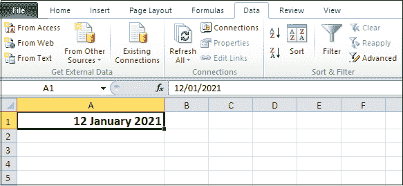

#### 注意:使用以上步骤，如果您仍然无法更改日期格式，请在 excel 文档中进行以下更改。

**步骤 1:** 选择一个单元格。

**步骤 2:** 转到功能区的**数据**选项卡。点击**数据工具**部分的**文本到列**按钮。

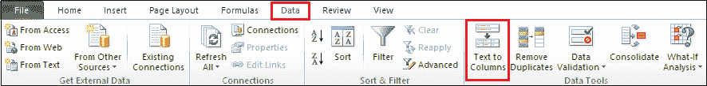

**步骤 3:** 一个**将文本转换为列**向导出现在屏幕上，选中**分隔的**单选按钮。点击**下一步**按钮。

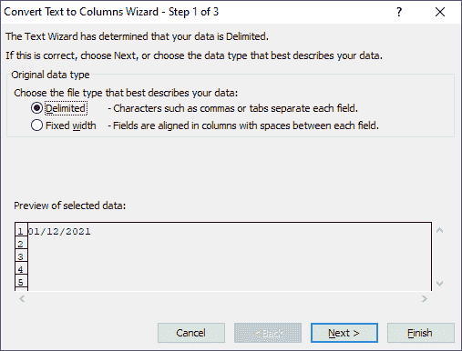

**第 4 步:**点击**下一步**按钮，转换文本为列向导-第 3 步，共 3 步。

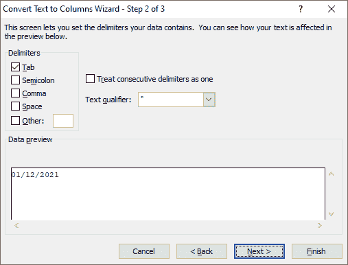

**第五步:**点击**栏目日期格式**部分下与**日期**关联的下拉菜单，从**日期**下拉菜单中选择任意日期格式，点击【文本转栏目向导】底部的**完成**按钮。

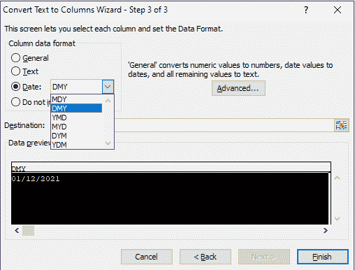

#### 注:在我们的情况下，我们选择 DMY 格式。

现在，按照“使用单元格格式更改日期格式”对话框中提到的步骤更改日期格式。

### 方法 2:在 Excel 中创建自定义日期格式

Microsoft Excel 提供了在 Excel 文档中创建自定义日期格式的最简单方法。它允许我们使用“ddd”显示日期名称(如 Sun、Mon)，使用“dddd”显示完整的日期名称(如星期日、星期一)。同样，它使用“mmm”显示像(1 月，2 月)这样的短月份，使用“mmmm”显示像(1 月，2 月)这样的完整月份名称。

### Excel 日期格式代码列表

**天码**

*   它用于日期 1-31
*   dd -用于日期 01-031
*   ddd -它用于短日名称，如太阳、周一、周二
*   dddd -它用于全名，如星期日、星期一、星期二

**月码**

*   m - m 用于将月份表示为 1-12
*   mm - mm 用于表示 01-12 月
*   嗯嗯是用来把月份降级为一月，二月，三月，....十二月
*   mmmm - mmmm 用于表示一月、二月、三月，......，十二月
*   mmmmm - mmmmm 是表示一个月的第一个字母。

**年份代码**

*   **yy -** yy 表示 00-99 年
*   **yyyy -** yyyy 表示 2000 年、2002 年、2010 年、2012 年

### 在 Excel 中创建自定义日期格式的步骤

自定义日期格式是创建和更改日期格式最简单快捷的方法。也称为用文本字符串给数字添加后缀。

在 Excel 中创建自定义日期格式有以下步骤-

**步骤 1:** 选择要创建自定义日期格式的单元格。

**第二步:在选中的单元格上右键**，点击菜单中的**设置单元格格式**选项，也可以按键盘上的 **Ctrl + 1** 键，打开设置单元格格式对话框。

**第三步:**在**类别**部分，点击**自定义**标签。按退格键删除常规。在**类型**:部分输入您想要的日期格式，点击对话框底部的**确定**按钮。

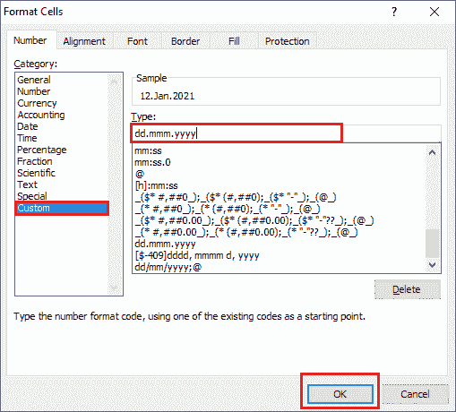

下面的截图显示日期格式 DD/mm/yyyy(2021 年 1 月 12 日)转换为 dd.mmm.yyyy (12。2021 年 1 月)日期格式。

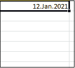

### 使用日期创建自定义日期

微软 Excel 还允许我们用日期创建日期。以下是创建自定义日期时需要遵循的步骤。

**步骤 1:** 选择要创建日期格式的单元格。

**第二步:**按 **Ctrl + 1** 键打开单元格格式对话框。

**第三步:**点击**类别**下的**自定义**选项。删除类型:部分下的常规，输入格式 dd/mmmm/yyyy(dddd)以查看 2021 年 1 月 12 日(星期二)格式的日期。点击单元格格式对话框底部的**确定**按钮。

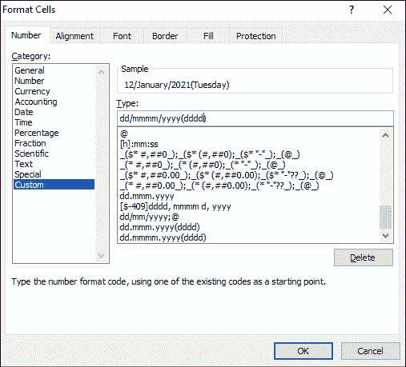

#### 注意:在我们的情况下，我们希望更改 12.01.2021 日期格式。

下面的截图显示，2021 年 1 月 12 日的日期格式更改为 2021 年 1 月 12 日(星期二)的日期格式。

#### 注意:使用以上步骤，还可以将 MM/DD/YYYY(2018 年 10 月 12 日)日期格式转换为 DD/MM/YYYY(2018 年 12 月 10 日)日期格式。

* * *