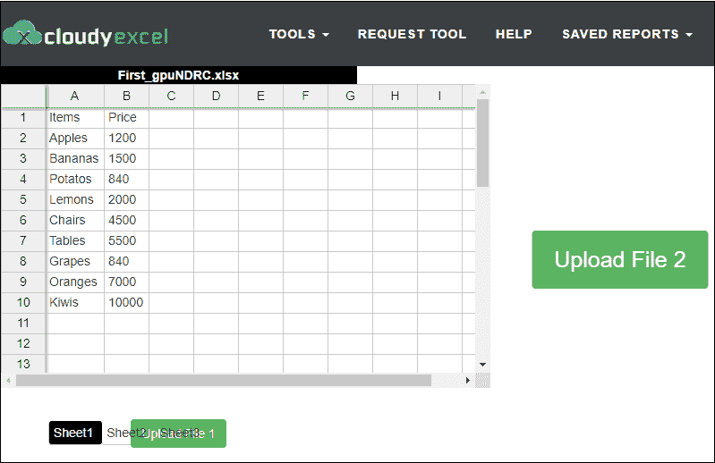
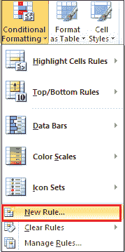

# 如何比较两张 Excel 表格

> 原文：<https://www.javatpoint.com/how-to-compare-two-excel-sheet>

当很多用户对同一个 Excel 工作表进行更改时，比较两个 Excel 工作表对我们来说很重要。这有助于我们**识别与工作表相关的问题**，如**重复记录、链接断开、公式不一致以及格式错误。**当需要比较大量数据时，Excel 工作表变得难以比较。

#### 注意:微软 Excel 还允许我们比较两个不同的 Excel 工作表，并将其合并为一个工作表。

有多种方法可以比较同一工作表或不同工作表中的两个 excel 工作表。你可以根据自己的要求选择其中一种，根据数据选择合适的比较方法-

1.  [使用并排查看按钮](#using-View-Side-by-Side-button)比较两张 Excel 表格
2.  [使用在线平台](#using-online-platform)对比两张 excel 表
3.  [使用公式](#using-formulas)对比两张 Excel 表
4.  [使用条件格式比较两张 excel 表格](#using-conditional-formatting)
5.  [使用第三方工具- XL 比较器](#using-third-party-tool)比较两张 excel 表

### 方法 1:使用“并排查看”按钮比较两张 Excel 工作表

用于比较两个 excel 工作表的内置 Excel 功能中的“并排查看”按钮。用眼睛比较小尺寸的 excel 表格是最简单、最快捷、最省时、最容易的方法。要比较 Excel 工作表，我们使用功能区中**视图选项卡**下的并排视图按钮。

#### 注意:仅当 Excel 工作表中存在小数据集时，才建议使用此方法。

**比较两张 excel 表格的步骤**

要并排比较两张 Excel 表，请按照下面给出的步骤操作

**第一步:**打开新的或现有的[微软 Excel](https://www.javatpoint.com/excel-tutorial) 要比较的工作表。

#### 注意:要打开新的 Microsoft Excel 工作表，请在搜索栏底部键入 Microsoft Excel。(适用于 Windows 2010)

**第二步:**根据您的需求，在 Excel 表中输入数据。

**第三步:**转到**文件- >新建**打开一张新的空白 Excel 表进行对比。

#### 注 1:也可以从键盘上按 Ctrl + N 键，打开新的空白表单。

#### 注意 2:要打开现有图纸，请转到“文件”选项卡，并从列表中选择“打开”。浏览要比较的工作表，然后单击“确定”按钮。

**第四步:**点击功能区的**视图**选项卡，然后点击**窗口**部分的**并排视图**选项。

#### 注意:您也可以单击“新建窗口”选项来打开类似的 Excel 文档进行比较。

**第五步:**现在，可以看到两个工作表都是水平显示的，以供比较。

**第 6 步:**要垂直(并排)查看两张纸**，点击**窗口**部分的**排列所有**按钮。屏幕上会出现一个小的**排列窗口**对话框，点击**垂直**关联的单选按钮，点击**确定**按钮，如下图截图所示。**

**

现在，您可以看到两个工作表都垂直(并排)显示在屏幕上。

#### 注意:此方法自动启用同步滚动选项。现在，您可以逐行或逐列同时滚动两个工作表来比较数据。

**使用并排查看按钮**并排比较多个 excel 表格

Microsoft Excel 2010 及以上版本允许我们使用“窗口”部分的“并排查看”按钮同时比较两个以上的 Excel 工作表。

按照下面给出的最简单的步骤，使用并排视图来比较多个 Excel 工作表-

**第一步:**打开要比较的 Microsoft Excel 工作表。

**步骤 2:** 创建多个要与现有文档进行比较的 Excel 工作表。

1.  要打开一张空白纸，按键盘上的 **Ctrl + N** 键。
2.  要打开所需的文档，请转到文件->打开->浏览所需的文件位置->单击打开按钮。
3.  要与现有工作表进行比较，请转到功能区上的**查看**选项卡，然后单击**窗口**部分中的**新窗口**选项。

现在，您可以看到所有工作表都将出现在屏幕底部。

**步骤 3:** 转到功能区的**视图**选项卡，点击**窗口**部分的**并排视图**选项。

**第四步:**点击**窗口**部分下的**排列**按钮。将出现一个小的**排列窗口**对话框。点击**排列**部分下的**平铺**单选按钮，点击**确定**按钮。

因此，您可以看到多个 Excel 工作表并排显示。

### 方法二:使用在线平台对比两张 Excel 表格

微软 Excel 允许我们使用在线平台比较两张 Excel 表。这个方法帮助你**轻松搜索并突出两个微软 Excel 工作表的区别**。这种方法的主要缺点是需要高速互联网连接来比较 excel 工作表。

#### 注意:在我们的例子中，我们使用 cloudyexcel 网站来比较 excel 表。

**比较两张 excel 表格的步骤**

按照下面给出的步骤，使用 cloudyexcel -比较两个 excel 表

**第一步:**打开任意网页浏览器。在浏览器上键入或复制粘贴以下链接。您只需点击以下链接，即可打开 cloudyexcel 网站。[https://www.cloudyexcel.com/compare-excel/](https://www.cloudyexcel.com/compare-excel/)

**第二步:**屏幕上会出现一个 cloudyexcel 官网。点击**上传文件 1** 按钮，上传第一张 excel 表格进行对比。

**第三步:浏览要对比的 Excel 表**，点击**打开**按钮上传表。

**第四步:**点击**上传文件 2** 按钮上传第二张 Excel 表，如下图截图所示。

#### 注意:再次遵循步骤 3。

**第五步:**一旦两张 Excel 表上传成功。点击**查找差异！！！**按钮。

下面的截图显示了两个 Excel 工作表之间的比较。

#### 注意:cloudyexcel 允许我们轻松快速地比较两个以上的 Microsoft Excel 工作表。

### 方法三:用公式比较两张 Excel 表格

这是比较 Excel 工作表数据和确定工作表之间差异的最快方法。

#### 注意:在这种方法中，您需要一个单独的 Excel 表来查看差异。

**比较两张 Excel 表格的步骤**

按照下面给出的步骤比较两张 Excel 表格-

**步骤 1:** 双击微软 Excel 图标，打开一个新的微软 Excel 文档。

**第二步:**在 Excel 表中输入要比较的数据。用您想要的文件名保存工作表(在我们的例子中，我们使用第一个文件名作为 **First.xlsx**

#### 注意:要保存工作表，请转到文件->另存为->浏览文件位置->单击保存按钮。

同样，打开第二个 excel 文档，在上面输入数据，并将其保存为 Second.xlsx

**第三步:**创建或打开一个新的 Excel 工作表，并用文件名 Compare.xlsx 保存。

**第四步:**打出公式 **IF(第一！a！< >秒！A1、“第一价值”:&第一！1 & CHAR(10) &秒值:“&秒！第 3 页单元格 A1 中的 A1，“”**并按回车键。**注:**在上述公式中，IF 条件用于检查两张表中的单元格差异。**第五步:**屏幕上会出现一个小对话框。选择要比较的纸张，按**确定**按钮。

### 方法 4:使用条件格式比较两张 excel 表格

条件格式是内置的 Microsoft excel 功能，可帮助我们快速分析(突出显示)两个 excel 工作表之间的差异。在这种方法中，您可以比较同一 excel 工作簿中的两个工作表。

#### 注意:当你有很多数据要比较时，这不是一个好方法。

**比较两张 excel 表格的步骤**

下面讨论了比较两张 excel 表的步骤列表-

**第一步:**双击桌面上的微软 Excel 图标，打开一个微软 Excel 文档。

**第二步:**准备一份数据清单，进行比较。输入数据后，点击当前 excel 工作表底部的工作表 2，如下图所示。

**第三步:**在第二张表中，输入要与前一张表进行比较的数据。

**第 4 步:选择或突出显示您想要查看其变化的工作表中的数据**。

#### 注意:在我们的案例中，我们选择了表 2 中的价格单元格。

**第五步:**进入功能区的**主页**选项卡，点击**样式**部分的**条件格式**按钮。

**第 6 步:**将出现选项列表。点击**新规则**。

**步骤 7:** 屏幕上将出现一个小的**新格式规则对话框**，在该对话框中执行以下操作-

1.  点击**使用公式**确定选择规则类型:部分下的格式化单元格选项。
2.  先打公式 **=B2 < >！B2** 在格式值中该公式为真的部分。

#### 注意:在我们的例子中，B2 是我们从中选择数据的单元格。首先是我们要比较的表。

3.  点击**格式按钮**指定差异的格式，如下图所示。

**第 8 步:**单击**填充选项卡**指定要用于单元格样式的荧光笔，然后单击“设置单元格格式”对话框底部的**确定**按钮。见截图。

**第 9 步:**点击新格式规则对话框底部的**确定**按钮。

现在，您可以看到具有不同值的单元格已经用您选择的颜色突出显示。见下面截图。

### 方法 5:使用第三方工具 XL Comparator 比较两张 excel 表

XL Comparator 是一个**免费的，基于网络的，在线的，简单的，以及易于使用的**工具。它用于比较两个 Excel 表，无需任何编程或安装软件。它基于列比较两个 excel 工作表。

**比较两张 Excel 表格的步骤**

使用 XL 比较器比较两个 Excel 工作表有以下步骤-

**第一步:**打开任何网页浏览器，在上面输入或复制粘贴下面的链接，或者你可以简单地点击下面给出的链接-[https://www.xlcomparator.net/](https://www.xlcomparator.net/)

**第二步:**屏幕上会出现一个 XL Compare 主页。单击与第一个文件关联的“选择文件”按钮，以上传第一个 excel 工作表。

**第三步:**浏览第一个文件位置，点击**打开**按钮，上传第一张 excel 表。

**第四步:**第一张 excel 表上传成功后，点击与第二个文件关联的选择文件按钮，上传第二张表。

**第五步:**浏览第二张 excel 表位置。点击打开按钮，上传第二张 excel 表格。

**第六步:**上传完两张 excel 表后，点击**下一步**按钮，如截图所示。

**第 7 步:**屏幕上出现一个小弹出菜单，信息为**请等待文件发送到 XL Comparator。文件越大意味着时间越长**。点击**确定**按钮。

**第 8 步:**在左侧，点击**文件列**下拉菜单，选择您想要比较的列。

同样，在右侧，单击文件列下拉菜单并选择要比较的列。

点击**“第二个. xlsx”**单选按钮中的“第一个. xlsx”的每一行(已选中)

点击屏幕下方的**下一步**按钮，如下图截图所示。

#### 注意:在我们的例子中，我们想要比较价格栏。

**第九步:**点击**点击此处链接**下载表单。

* * ***