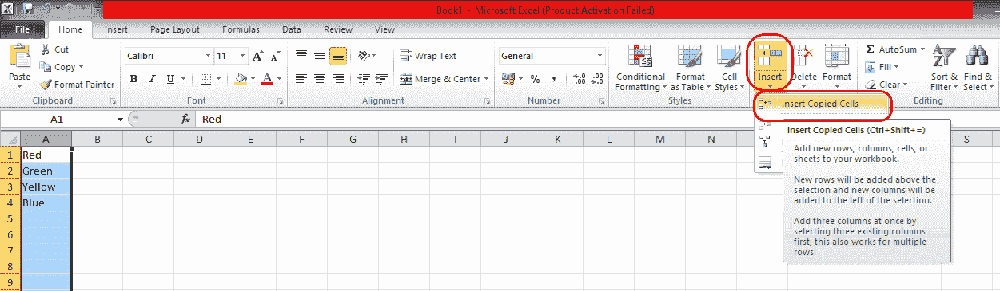

# 如何在 Excel 中移动列

> 原文：<https://www.javatpoint.com/how-to-move-columns-in-excel>

移动数据意味着将数据从一列放到另一列。微软 Excel 的特点是我们可以移动所有类型的数据，包括隐藏的单元格、公式及其结果值、单元格格式和注释。但是，当单元格包含公式时，不会调整单元格引用。因此可能会出现#REF！误差值，为了消除误差，我们需要手动调整参考。

对于在 MS Excel 中移动列，我们可以使用剪切或复制方法，也可以使用鼠标方法。因此，我们将讨论在电子表格中移动列的两种方法。

## 使用剪切或复制方法

**使用 MS Excel 2010 上的剪切或复制方法移动列时，请遵循以下步骤:**

**第一步:**在电脑系统上打开 MS Excel，只需在搜索选项卡上搜索或直接点击 MS Excel 图标(如果桌面上有)，如下图所示:

**第二步:**在一列中键入一些数据，假设在 A 列中输入数据，如下所示:

**第三步:**现在，将光标移动到顶部的**单元格 A** 上，会出现一个向下的箭头，点击该单元格，就会选择完整的 A 列，如下图所示:

**第四步:**在**首页**选项卡的剪贴板组下，点击【剪切】或【复制】，或者可以按【Ctrl + C】(复制)或【Ctrl + X】(剪切)，如下图所示:

如果您希望将相同的数据复制到另一列，请使用**复制**选项；否则，如果要剪切数据并粘贴到另一列，请使用**剪切**。

**第 5 步:**选择要保存复制或剪切数据的列，右键单击该列，然后单击**插入剪切单元格**(如果使用剪切选项)或**插入复制单元格**(如果使用复制选项)。这里，我们复制了数据:

另一种方法是在**主页**选项卡上，您将看到**插入下拉菜单**选项，点击它并点击**插入复制的单元格**或**插入剪切的单元格**，如下图所示:

**第 6 步:**数据将被移动或复制到另一列，如下图所示，我们已经将 A 列数据复制到 D 列:

#### 注意:如果将“粘贴”或“Ctrl + V”选项替换为“插入”选项，则目标单元格的现有数据将被替换。因此，建议使用上述选项。

## 使用鼠标移动列

通过鼠标光标，我们可以使用以下步骤移动列:

**第一步:**在电脑系统上打开 MS Excel，只需在搜索选项卡上搜索或直接点击 MS Excel 图标(如果桌面上有)，如下图所示:

**步骤 2:** 在一列中键入一些数据假设在 A 列中输入一些数据，如下图所示:

**步骤 3:** 现在，要移动列的数据，我们可以执行以下任一选项:

1.  将光标移动到要移动数据的列的边框，并将指针移动到所选内容的边框。当它变成移动指针(带有四个方向箭头)时，将列拖到要放置它的另一列。
2.  按住 **CTRL** 键，同时指向所选内容的边框，当您看到指针变成带有星号(*)符号的复制指针时，将该列拖到您要放置数据的另一列。

#### 注意:在这种情况下，数据只能移动到相邻的行或列。人们应该知道，当通过鼠标操作时，用户不能移动不相邻的列。

**第三步:**然后将选中列的数据移动到另一列，你会看到如下所示的输出:

* * *