# 如何在 Excel 中添加或删除超链接

> 原文:[https://www . javatpoint . com/如何在 excel 中添加或删除超链接](https://www.javatpoint.com/how-to-add-or-remove-hyperlink-in-excel)

超链接也称为**网络链接**。它是蓝色或紫色的文本或图片。当我们单击此文本或图片时，它将访问当前文档的特定部分或包含更多详细信息的新文档。

### 添加超链接

[微软 Excel](https://www.javatpoint.com/excel-tutorial) 会自动插入超链接。当我们把一个网站或者一个电子邮件地址写到一个单元格中然后按回车键的时候，但是在 Excel 中也有一些其他的方法来添加超链接。下面讨论一些最简单的添加超链接的方法-

**方法 1:使用插入超链接对话框**

使用插入超链接对话框添加超链接有以下步骤-

**第一步:**点击要添加超链接的单元格。

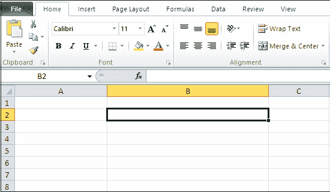

#### 注意:在我们的例子中，我们使用细胞 B2。

**第二步:**转到 Excel 文档顶部的**插入选项卡**，点击**链接**部分下的**超链接**按钮。

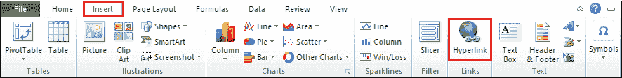

**第三步:**屏幕上将出现**插入超链接对话框**，在该对话框中执行以下操作-

*   点击**链接下的**现有文件或网页**选项至:**
*   选择当前 Excel 工作表的名称。
*   在**文本中输入链接的名称，显示**文本框。
*   点击【插入超链接】对话框底部的**确定**按钮，如下图截图所示。

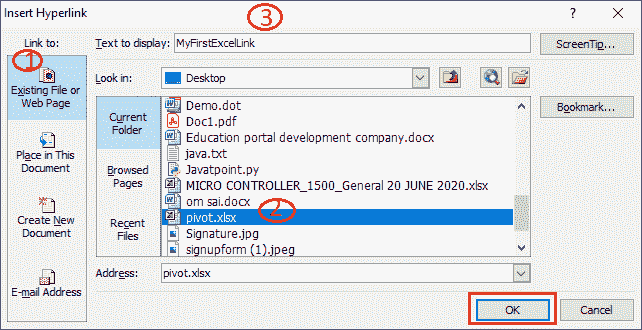

现在，一个超链接被添加到您想要的单元格中。请看下面的截图-

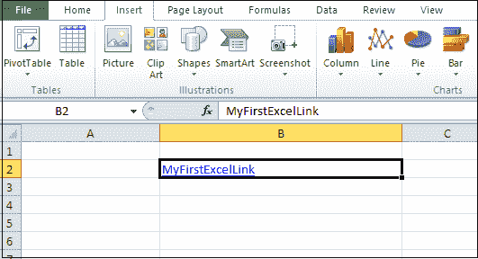

**方法 2:用 Darg 创建超链接并放下**

按照给定的步骤创建带有拖放功能的超链接

**步骤 1:** 打开一个新的或现有的微软 Excel 文档，并将其保存在您想要的位置。

**第二步:**点击想要链接的单元格。

**第三步:**将光标放在单元格的边框上，按鼠标右键将单元格拖动到另一张纸上。按下 Alt 键并拖动单元格。

**第四步:**一旦单元格被激活，释放 Alt 键，并拖动到您想要超链接的单元格。

**第五步:**松开鼠标右键，会出现一个弹出菜单，其中点击【在此创建超链接】选项。

现在，您可以看到超链接将出现在所需的单元格中。

### 删除超链接

微软 Excel 允许我们从文档中快速删除超链接。

**方法 1:使用移除超链接选项**

在 Microsoft Excel 中，“删除超链接”选项用于删除同一 Excel 文档中的多个(所有)超链接。

按照以下步骤删除超链接-

**步骤 1:** 选择包含超链接的 Excel 单元格。

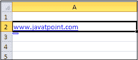

#### 注意:在我们的例子中，我们想要删除单元格 A2 中的超链接。

**第二步:**从键盘按 Ctrl+C 键复制一个超链接。

**第三步:**右键点击选中的单元格，弹出菜单点击移除超链接。

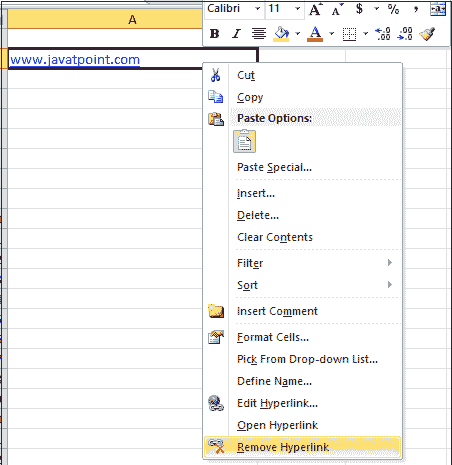

现在，您可以看到超链接已从选定的单元格中移除。

**方法 2:使用清除按钮**移除所有超链接

使用清除按钮删除所有超链接有以下步骤-

#### 注意:下面提到的步骤用于删除 Microsoft Excel 2010、Excel 2013、Excel 2016 和 Excel 2019 中的所有超链接。

**第一步:**选择包含超链接的单元格(如单元格范围、列、行或整个 Excel 文档)。

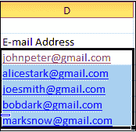

**步骤 2:** 转到功能区的**主页**选项卡。点击**编辑**部分下**清除**旁边的下拉图标。屏幕上将出现清除选项列表，点击**移除超链接**选项，如给定截图所示。

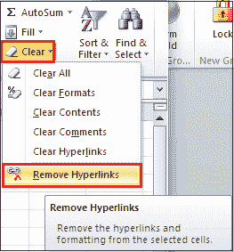

#### 注意:你也可以右键点击选中的单元格，会出现一个选项列表。单击删除超链接选项。

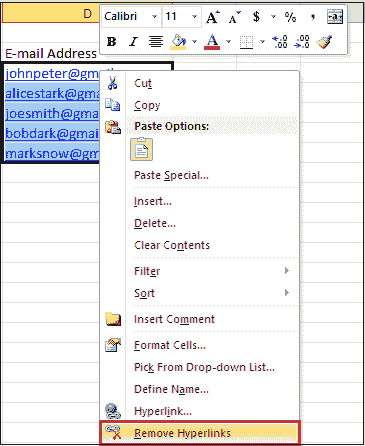

现在，所有超链接都从 Microsoft Excel 文档中删除，如下所示。

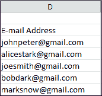

**防止 Excel 表单自动创建超链接**

正如我们已经讨论过的，当我们键入电子邮件地址并按回车键时，微软 Excel 会自动在文档中创建超链接。您也可以使用以下步骤关闭它们-

**第一步:**打开一个微软 Excel 文档。

**第二步:**转到文档左上角的**文件**选项卡。屏幕上将出现文件选项列表，点击**选项**选项卡。

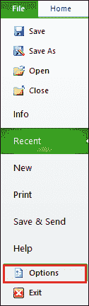

**第三步:**点击左窗格的**校对**，然后点击**自动更正选项...**。

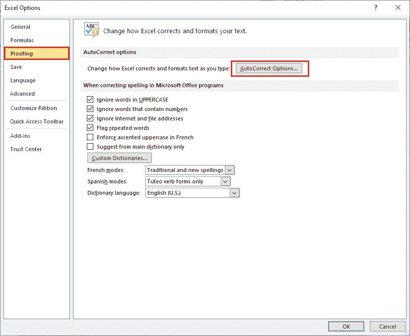

**第四步:**屏幕上将出现**自动更正对话框**。单击**键入时自动套用格式选项卡，**在“键入时替换”部分下，取消选中带有超链接的互联网和网络路径。点击自动电流对话框底部的**确定**按钮，如下图所示。

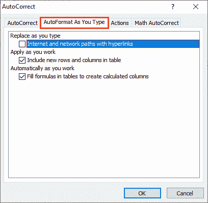

* * *