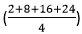
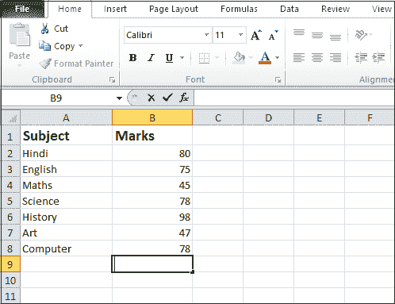
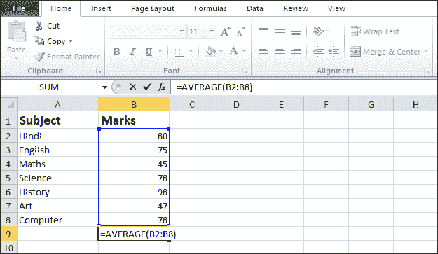
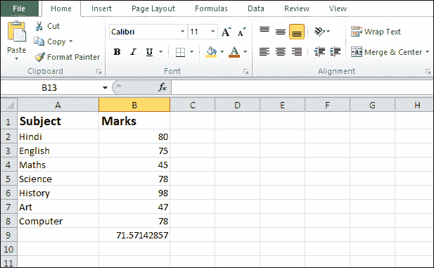
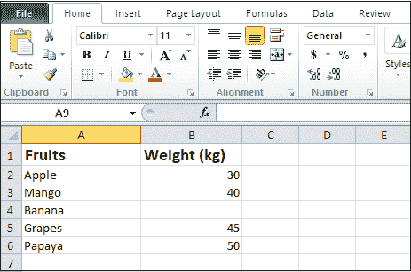
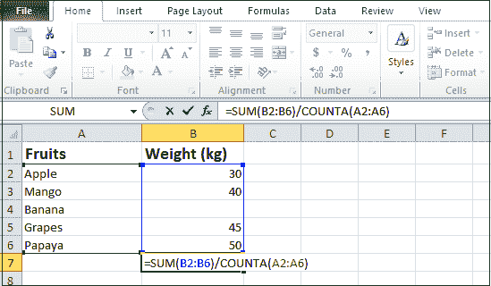
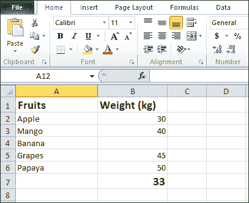
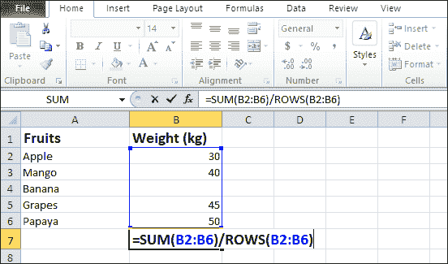
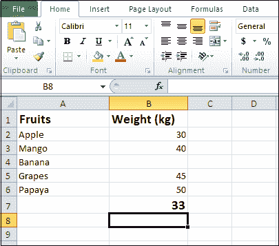

# 如何在 Excel 中计算平均值

> 原文：<https://www.javatpoint.com/how-to-calculate-mean-in-excel>

我们知道，微软 Excel 文档是用来**快速组织分析大量数据**的。它还允许我们执行数值分析，如计算平均值、中位数、模式等。

算术平均值也称为**平均值。**计算方法是将所有数字相加，然后除以这些数字的总和。例如，2、8、16 和 24 的平均值是 = 12.5。

**平均值的使用**

平均值的使用列表如下-

*   均值用于比较历史数据。
*   它用于确定关键绩效指标和配额。
*   它用于指导业务战略和项目管理。
*   它用于找到给定数据集的中点。
*   它帮助我们找到一组数据集的平均值。

**在 Excel 中计算平均值的方法**

在 Excel 中计算平均值有以下三种方法-

1.  在 Excel 中使用平均值函数计算平均值
2.  用求和和计数函数计算平均值
3.  用求和和行函数计算平均值

**方法 1:使用 AVERAGE 函数**在 Excel 中计算平均值

在微软 Excel 中，我们使用 AVERAGE 函数来计算给定数据的均值。在 Excel 文档中计算平均值是最简单也是最常用的方法。AVERAGE 函数中有 **255 个单独的输入参数**。输入参数可以是**数字、单元格引用、范围、数组以及常量。**

在 Excel 中，有以下 AVERAGE 函数用于计算平均值-

1.  **AVERAGE -** AVERAGE 函数返回给定数字的平均值。
2.  **AVERAGEA -** AVERAGEA 函数返回包含任何数据的单元格的平均值。(数据可以是数字、布尔值以及文本值)。
3.  **AVERAGIEF-**该函数用于根据单一标准计算数字的平均值。
4.  **AVERAGIEFS-**该函数用于根据多个标准查找数字的平均值。

**微软 Excel 文档中计算平均值的公式**

以下公式用于计算[微软 Excel](https://www.javatpoint.com/excel-tutorial) 文档中的平均值-

=AVERAGE(B2:B15)

使用上面的公式，您可以计算列 b 中第 2 行到第 15 行的平均值

#### 注意:您也可以根据需要选择单元格。

### 在 Excel 中使用平均值函数计算平均值的步骤

在 Excel 文档中计算平均值有以下步骤-

#### 注意:使用以下步骤，您可以在 Microsoft Excel 2010、Excel 2013、Excel 2016 和 Microsoft Office 365 中计算平均值。

**步骤 1:** 双击 Excel 图标，打开新的或现有的 Microsoft Excel 文档。

**第二步:**将数据输入微软 Excel 文档。在这个例子中，我们将计算学生在各种科目中获得的分数的平均值。请看下面的截图。

**第 3 步:**输入所需数据后，将光标放在要计算平均值的单元格上(在本例中，我们使用单元格 B9)

**第 4 步:**在 AVERAGE(数字 1、[数字 2])前键入等号(=)，...)在选定的单元格中。在我们的例子中，我们使用=AVERAGE(B2:B8)。如下图所示。

#### 注 1:在我们的例子中，B2 是数据开始的单元格，B8 是数据结束的单元格。

#### 注意 2: AVERAGE 函数自动忽略不包含任何数字的空单元格。

**第五步:**一旦你的 AVERAGE 功能完成，按下键盘上的**回车键**。

下面的截图显示计算出的平均值将出现在您选择的单元格中。(在我们的例子中，计算出的平均值将出现在单元格 B9 中)。

### 方法 2:使用求和和计数函数计算平均值

这是一种计算均值的先进方法。在这种方法中，SUM 函数用于对所有给定的数字求和，COUNTA 函数用于计算数量。

#### 注意:当给定数据集中存在文本值和数值时，通常使用此方法。

在 Microsoft Excel 中，使用 SUM 和 COUNTA 函数使用以下公式计算平均值:

=SUM(B2:B6)/COUNTA(A2:A6)

在上式中，A 和 B 表示我们的日期出现在 A 和 B 栏中

2 和 6 表示数据位于 2 到 6 之间。

**使用 SUM 和 COUNTA 函数计算平均值的步骤**

遵循下面给出的最简单的步骤，使用 SUM 和 COUNTA 函数计算平均值-

**第一步:**双击微软 Excel 图标打开微软 Excel 文档。

#### 注意 1:如果你想打开一个新的工作表，那么点击文件->新建->空白文档。

#### 注意 2:如果你想打开一个现有的文档，那么点击文件->打开->浏览你想要的文件位置->点击打开按钮。

**第二步:**在微软 Excel 文档中输入数据，计算平均值，如截图所示。

**第 3 步:**将光标放在要查看计算平均值的单元格上。

#### 注意:在我们的例子中，我们使用单元格 B9 来显示计算的平均值。

**第四步:**将光标放在选中的单元格内，在单元格内输入 **=SUM(B2:B6)/COUNT(A2:A6)** ，如下图截图所示。

#### 注 1:在我们的例子中，我们使用 SUM 函数对权重求和(即 30+40+45+50)，使用 Count 函数对水果总数进行计数。

**第五步:**按**回车键**完成 SUM 和 COUNTA 功能。

现在，您可以看到计算出的平均值将出现在您选择的单元格中。请看下面的截图。

#### 注意:在我们的例子中，计算的平均值结果 165/5 = 33 将出现在 B7 单元中。

### 方法 3:在 Excel 中使用求和和行函数计算平均值

这种方法几乎类似于使用求和和计数函数计算平均值。在这种方法中，SUM 函数将给定数据范围内的所有数值相加，ROWS 函数将计算特定间隔内存在的行数。

**使用求和和行函数计算平均值的公式**

=SUM(B2:B6)/ROWS(B2:B6)

在上面的公式中，B2:B6 表示我们的数据出现在 B 列，它的范围在 2 到 6 之间。

**使用求和和行功能计算平均值的步骤**

遵循下面给出的最简单的步骤，使用 SUM 和 ROWS 函数计算平均值-

**步骤 1:** 打开新的或现有的微软 Excel 文档。

**第二步:**准备一个 Excel 文档，里面有计算平均值的数据。

**第 3 步:**将光标放在想要显示结果的单元格中(在本例中，我们使用了单元格 B7)

**第四步:**如下图截图所示，在所选单元格中输入公式 **=SUM(B2:B6)/ROWS(B2:B6)** 。

#### 注意:在我们的例子中，我们使用 SUM 函数对所有权重求和(即 30+40+45+50)，并使用 Rows 函数计算文档中存在的 ROWS 总数。

**第五步:**从键盘上按下**回车键**。

下面的截图显示了所选单元格中计算平均值的结果。

#### 注意:在我们的例子中，结果 33 将出现在我们选择的单元格中，即 B7。

* * *