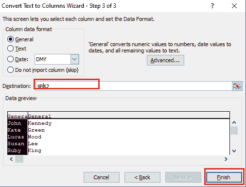

# 如何在 Excel 中分离文本

> 原文:[https://www.javatpoint.com/how-to-separate-text-in-excel](https://www.javatpoint.com/how-to-separate-text-in-excel)

分隔文本是 Excel 的基本功能之一。它帮助您改进文档，以便更好地过滤、排序和分析。

在 Excel 中有以下方法来分隔文本-

### **方法 1:在 Excel 中使用文本到列**分离文本

“文本到列”功能是分离文本最常用的方法。此方法在 [Microsoft Excel](https://www.javatpoint.com/excel-tutorial) 2010、2013、2016、2019 及更早版本中将单个单元格分为两个或多个单元格。在此方法中，指定的分隔符(如逗号、分号、空格、制表符或其他)用于分隔文本。

例如，您可以将名字和姓氏从一个单独的列(全名)分成两个单独的列。

按照下面给出的步骤在 Excel 中分隔文本-

**第一步:选择或突出显示**包含要分隔的文本的单元格或列。

**步骤 2:** 转到功能区的**数据**选项卡。点击**数据工具**部分的**文本到列**标签。

**第 3 步:**屏幕上将出现一个**将文本转换为列向导**，选择**分隔字符，如逗号或制表符分隔每个字段单选按钮**。点击向导底部的**下一步**按钮。

**第 4 步:**根据分隔符部分的数据选择您喜欢的分隔符。在**数据预览**部分查看您的数据预览。点击**转换文本为列向导**底部的**下一步**按钮。

#### 注意:在我们的例子中，我们使用空格分隔符来分隔数据。

**步骤 5:** 现在，在下一个向导中，将出现以下选项-

**General -** 用于将数值转换为数字，将数据值转换为日期，并保留为文本。

**文本-** 用于将所有值转换为文本格式。

**日期-** 用于将所有值转换为日期格式，如 MDY、DMY、YMD、DYM、MYD 和 YDM。

选择**通用单选按钮**，在**目的地部分**输入数据目的地，点击**完成**按钮。

下面的截图显示文本(全名)被分成两列(名字和姓氏)。

### 方法 2:使用函数将文本分成列

微软 Excel 允许我们结合使用 **LEFT、RIGHT、LEN、SEARCH 以及 FIND** 功能来分离文本。

**分开名和姓**

1.我们用下面的公式把名字和全名分开

=LEFT(A4, SEARCH(" ",A4,1))

左函数用于分隔名字。

A4 是包含全名的单元格。

搜索函数用于查找 num_char 的值。

2.我们用下面的公式把姓和全名分开

=RIGHT(A4,LEN(A4)-SEARCH(" ",A4,1))

右函数用于分隔姓氏。

A4 是包含全名的单元格。

SEARCH 和 LEN 函数用于查找 num_char 的值。

**将名字和姓氏分成列的步骤**

**步骤 1:** 打开新的或现有的微软 Excel 文档。

**第 2 步:**键入或选择要分离的文本。

**第三步:**将光标放在要显示名字的单元格上。在所选单元格中输入公式**=左(A4，搜索("，A4，1))** 。

#### 注意:在我们的例子中，我们使用单元格 B4 来显示名字。

**第四步:**按**回车键**将名字和全名分开。

**第五步:**将光标放在要显示姓氏的单元格上。在所选单元格中输入公式**=右(A4，LEN(A4)-搜索("，A4，1))** 。

**第六步:**从键盘按下**回车键**显示姓氏。

下面给出的截图显示名字和姓氏与全名是分开的。

**在单独的列中分开名字、中间名和姓氏的步骤**

微软 Excel 允许我们在单独的列中分隔名字、中间名和姓氏-

1.我们用下面的公式把名字和全名分开

=LEFT(A5, SEARCH(" ",A5,1))

LEFT 函数用于区分名字和全名。

A5 是包含全名的单元格。

搜索函数用于查找 num_chars 的值。

我们用下面的公式把中间名和全名分开

=MID(A5,SEARCH(" ",A5,1)+1,SEARCH(" ",A5,SEARCH(" ",A5,1)+1)-SEARCH(" ",A5,1))

中间名功能用于将中间名和全名分开。

A5 是包含全名的单元格。

我们用下面的公式把姓和全名分开

=RIGHT(A5,LEN(A5)-SEARCH(" ",A5,SEARCH(" ",A5,1)+1))

右功能用于区分姓氏和全名。

SEARCH 和 LEN 函数用于查找 num_chars 的值。

### 在不同的列中分隔名字、中间名和姓氏的步骤

按照下面给出的步骤将名字、中间名和姓氏从文本中分离出来-

**步骤 1:** 打开新的或现有的微软 Excel 文档。

**第二步:**将光标放在要查看名字的单元格上，在所选单元格中键入公式 **=LEFT(A5，SEARCH("，A5，1))** 。

**第三步:**从键盘上按下**回车键**。您可以看到名字将出现在选定的单元格中。

**第四步:**将光标放在想要显示中间名的单元格上。在所选单元格中键入公式 **=MID(A5，SEARCH("，A5，1)+1，SEARCH("，A5，SEARCH("，A5，1)+1)-SEARCH("，A5，1))** 。

**第五步:**按**回车键**显示选中单元格的中间名。

**第 6 步:**将光标放在要显示姓氏的单元格上。在所需单元格中键入公式**=右(A5，LEN(A5)-搜索("，A5，SEARCH("，A5，1)+1))** 。

**第七步:**从键盘上按下**回车键**。

现在，您可以看到名字、中间名以及姓氏与给定的文本是分开的。

### 方法 3:在指定位置分隔文本

在 Microsoft Excel 中，您还可以使用左、中、右函数在指定位置分隔文本-

**左函数-** 在 Excel 中，左函数用于从**开头(左)**中分离特定数量的字符。

**Mid 函数-** 在 Excel 中，Mid 函数用于将指定数量的字符从 **mid(中间)中分离出来。**

**Right 函数-** 在 Excel 中，Right 函数用于将指定数量的字符从**端(右侧)分开。**

### 从指定位置分离文本的步骤

从指定位置分离文本有以下步骤-

**步骤 1:** 打开一个新的微软 Excel 文档。

**第二步:**输入想要分隔的文本。

**第三步:**将光标放在要查看分隔文本的单元格上。

1.  键入公式**= LEFT(“javaTpoint”，4)** 将文本从开头分开。(参见截图中的单元格 B1)。
2.  键入公式**= MID(“javaTpoint”，5，1)** 将文本从中间分开。(见截图中的细胞 B2)。
3.  键入公式**= RIGHT(“javaTpoint”，5)** 将文本从末尾分开(参见截图中的单元格 B3)

### 方法 4:将文本和数字分开

Microsoft 允许您将包含数字的文本分成两个不同的列。

### 将文本与数字分开的步骤

将文本与数字分开的步骤如下-

**第一步:**打开包含要分隔的文本的 Microsoft Excel 文档。

**第二步:选择或突出显示**包含带数字的文本的列。

**第三步:**进入功能区的**数据选项卡**，点击**数据工具**部分的**文本转列**选项。

**步骤 4:** 屏幕上将出现一个**将文本转换为列向导**，并带有选中的**分隔的**单选按钮。点击**固定宽度**单选按钮，点击屏幕下方的**下一步**按钮。

**第五步:**在**数据预览**部分使用垂直分隔线调整宽度，点击**下一步**按钮，如给定截图所示。

**第 6 步:**在下一个向导中，点击**高级**按钮。

**第七步:**将出现**高级文本导入设置**对话框，选择**小数点分隔符**和**千位分隔符**。点击**确定**按钮。

**第 8 步:**在**目的地**文本框中输入或浏览您想要的目的地，然后点击**完成**按钮。

下面给出的截图显示数字和文本是分开的。

* * *