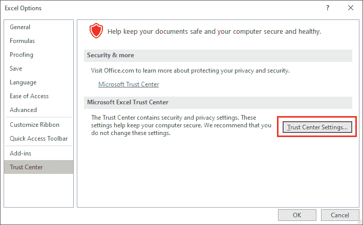

# 如何在 Excel 中恢复一个宏？

> 原文:[https://www.javatpoint.com/how-to-recover-a-macro-in-excel](https://www.javatpoint.com/how-to-recover-a-macro-in-excel)

您经常会遇到 Excel 中宏丢失的问题，并且您也深受其害。您担心宏在关闭 Excel 文件后是如何被删除的，以及它在哪里消失的。在这种情况下，唯一的选择就是恢复宏。本章将给出 Excel 宏的完整指南。

在本章中，您将学习在 [MS Excel](https://www.javatpoint.com/excel-tutorial) 中恢复宏。在本章指南的帮助下，您将能够在 Excel 工作表中非常容易地恢复宏。在此之前，你应该知道什么是宏。

## 什么是宏？

宏是微软 Excel 最有用的功能之一。也可以定义为需要重复执行的任务的记录。它通过代表用户做重复的任务来节省用户的时间并提高生产率。

基本上，记录的宏包含重复的任务。有时，当一个 Excel 工作簿损坏时，我们记录的宏也会丢失，这与损坏的工作簿有关。在这种情况下，我们必须恢复 Excel 工作簿来恢复宏。

## 恢复宏或损坏的 Excel 文件的软件

市场上有各种各样的软件工具可以用来恢复 Excel 中丢失的宏。使用这些专业工具，您可以恢复损坏的 Excel 文件。它允许用户轻松恢复 Excel 工作表中损坏的数据，如图表、工作表、单元格注释和其他重要数据。

这里，我们有一个流行的软件工具来恢复丢失的宏:

*   微软 Excel 修复工具

## 什么是 MS Excel 修复工具？

MS Excel 修复工具是一款**专业工具，用于恢复丢失的宏**或损坏的 Excel 文件。它是一个简单易用且独特的工具，可以在一个修复周期内修复多个 excel 文件。除此之外，该工具还可以从首选位置恢复整个数据。

*   使用这个工具，人们可以很容易地修复文件中的损坏，修复工作表中的错误，排序问题和不可访问的损坏的 Excel 文件。
*   微软 Excel 修复工具兼容 Windows 和 Mac 操作系统。
*   这个工具最有意思的是它支持 Excel 的所有版本。
*   这个工具的演示是免费的。

### 使用微软 Excel 修复工具的步骤

**第一步:**首先从这里下载你电脑系统上的 **MS Excel 修复工具**([http://www.repairmsexcel.com/blog/free-download-for-mac](http://www.repairmsexcel.com/blog/free-download-for-mac))。

**步骤 2:** 通过运行下载的 exe 文件，将此软件工具安装到您的一个设备文件夹中，并同意所有条款和条件，然后单击“下一步”。(您只需按照所有说明安装即可。)

**第三步:**你会得到如下所示的界面。在这里，按下**确定**按钮并向前移动。

**第四步:**如果知道损坏的 excel 文件的路径，点击**浏览**按钮，选择损坏的**。xsl** 或**。xslx** 文件。

**第五步:**如果不知道被破坏的文件路径，点击**搜索**按钮定位被破坏的文件，并从这里选择一个文件夹。它将自动从您选择的文件夹中找到并修复损坏的文件。

所有的 Excel 文件都会被列出，如上图所示。

**步骤 6:** 选择损坏的文件后，点击**修复**按钮，开始扫描修复损坏的文件

**步骤 7:** 在这里，您将看到正在修复一个损坏的文件。

**步骤 8:** 扫描完成后，您可以从右侧面板预览现在修复的损坏文件。

**步骤 9:** 选择保存修复文件的首选位置，并将其保存在您的设备上。

#### 注意:它可能需要一个激活密钥来激活 Excel 的恒星修复工具。

## 恢复个人宏工作簿的步骤

这里，我们有一些恢复个人宏工作簿的简单步骤。这些是在 Excel 崩溃期间禁用宏时恢复的简单易行的步骤。

使用 Excel 执行这些步骤并恢复宏:

**步骤 1:** 打开 MS Excel，未损坏的 Excel 工作簿，导航至**文件**菜单选项卡。

**第二步:**向下滚动，点击 Excel 屏幕左侧面板的**选项**。

**第三步:**一个新的窗口会显示你点击窗口左侧面板上**插件**的位置。

**第四步:**在**管理**下拉列表中，选择并设置**禁用项目**(列表最后一项)。

**第五步:**点击**确定**按钮，重启你的 MS Excel 应用程序。

## 宏恢复方法

除了上面讨论的所有方法之外，我们还有一些恢复宏的方法。有时，我们会遇到工作簿损坏的问题，从而导致宏丢失。在这种情况下，唯一的选择是恢复损坏的工作簿，使宏重新与工作簿连接。

1.  [将计算选项设置为手动](#Set-the-calculation-option-to-manual)
2.  [更改宏安全选项](#Change-the-macro-security-option)

### 方法 1:将计算选项设置为手动

为此，您需要按照下面给出的步骤来获取您的宏:

**第一步:**简单打开 MS Excel，不要打开损坏的 Excel 工作簿。

**第二步:**导航至菜单栏中的**公式**选项卡，将**计算选项**更改为**手动**。(公式|计算选项|手动)

**将安全设置设置为高**

现在，按照以下步骤将安全设置设置为高:

**第三步:**现在，导航到**文件**选择**选项**，然后点击**公式**选项卡。(文件|选项|公式)如果您使用的是 MS Excel 2016。

**第 4 步:**在**计算选项设置**下，设置最大变化，点击**确定**按钮。

**步骤 5:** 现在，打开故障排除(损坏)工作簿。如果疑难解答工作簿成功运行，您将看到宏被禁用。

设置完上述设置后，我们希望能成功获得丢失的宏。

### 方法 2:更改宏安全选项

要更改宏安全选项，您需要按照以下步骤更改宏安全选项:

**第一步:**简单打开 MS Excel，不要打开损坏的 Excel 工作簿。

**第二步:**在 Microsoft Excel 2016 中，导航至**文件**选择**选项**，然后点击**公式**选项卡。(**文件|选项|公式**)

**第三步:**在 Excel 选项窗口左侧面板，点击**信任中心**。

**第四步:**点击**信任中心设置**按钮，会在你面前打开一个新窗口。

**第五步:**在这里，转到新屏幕左侧面板的**宏设置**，在宏设置下标记**禁用所有宏并通知**单选按钮。

点击**确定**按钮，关闭所有标签。

**步骤 6:** 现在，尝试打开损坏的工作簿。如果工作簿成功打开，将显示一条消息，说明宏已被禁用。

或者在第二种情况下，如果 Excel 没有打开和关闭，这意味着这个方法没有工作。

* * *