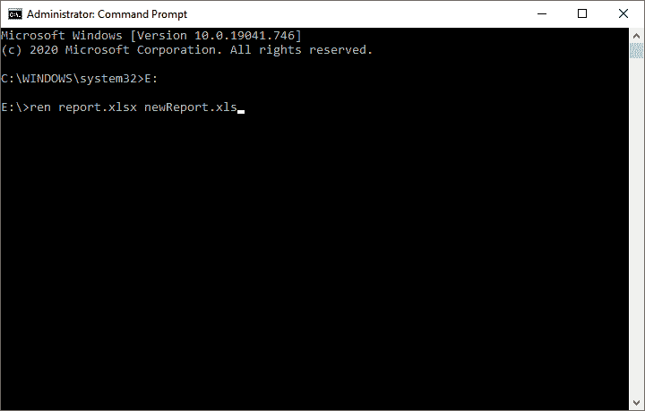

# 如何恢复损坏的 Excel 文件？

> 原文：<https://www.javatpoint.com/how-to-recover-a-corrupted-excel-file>

Excel 文件是办公室中最常用的文档，经常会出现文件损坏的问题。您可能还遇到了此损坏的 Excel 文件问题，并且由于文件损坏，您的重要数据可能会随之丢失。您担心在关闭 Excel 文件后，您的数据是如何以及在哪里消失的，以及您将如何找回这些数据。在这种情况下，您可以恢复损坏的 Excel 文件。

在本章中，我们将给出一个完整的恢复 Excel 损坏文件的指南。我们将在本章中讨论的方法可以修复和修复 Excel 2007 及以上版本的 Excel 文件。

除此之外，我们还将简要介绍导致 Excel 文件损坏的原因。

### 如何发现 Excel 文件损坏？

当一个 excel 文件损坏时，你会得到一个错误，如下图所示。打开任何损坏的文件时都会产生此错误。


关于损坏的 Excel 文件的几点:

*   无法读取损坏的 Excel 文件。
*   您将无法打开损坏的 Excel 文件，因为损坏的 Excel 文件无法打开。
*   除此之外，Excel 无法打开 **xlsx** 文件。
*   要么无法打开损坏的 Excel 文件并获得如上所示的错误消息，要么无法获得该损坏文件中的垃圾值和数据。

## Excel 文件损坏的原因

Excel 文件损坏可能有多种原因，这可能会产生几个问题。用户可能会丢失他的重要数据。由于以下原因，Excel 文件可能会损坏:

1.  恶意软件感染
2.  系统关闭不当
3.  突然断电问题
4.  在不同版本的 Excel 软件中编辑文件
5.  Excel 文件的大尺寸
6.  操作系统有任何问题吗
7.  由于微软电子表格应用程序的任何问题
8.  存储介质上的坏扇区

您已经看到了 Excel 文件损坏的原因。现在，您将看到如何恢复损坏的 Excel 文件数据。

## 恢复损坏的 Excel 文件的最简单方法

有多种方法可以恢复损坏的 Excel 文件。但是在这里，我们有最常用和最简单的方法来恢复 Excel 文件。你可以使用任何你觉得容易使用的。这里，我们有 6 种不同的方法-

1.  [禁用插件](#Disable-Ad-ins)
2.  [禁用保护视图](#Disable-Protected-View)
3.  [检查或更改文件扩展名](#Check-or-change-file-extension)
4.  [使用损坏的 Excel 修复工具](#Use-Corrupted-Excel-Repair-Tool)
5.  [使用内置开启&维修工具](#Use-built-in-Open-Repair-utility)
6.  [检查或修改组件服务设置](#Check-or-modify-Component-Service-settings)

请按照下面的章节详细查看方法。

### 方法 1:禁用插件

打开损坏的 Excel 文件时，您可能会收到一条错误消息。这可能是因为冲突的组件外接程序。因此，禁用 COM 加载项并查看结果。为此，请仔细按照下面的步骤逐一操作-

**第一步:**在 [MS Excel](https://www.javatpoint.com/excel-tutorial) 中打开一个新文件，导航菜单栏中的**文件**选项卡。


**第二步:**在 Excel 左侧面板，进入**选项**选项卡，点击。它将打开一个包含不同 Excel 选项的新窗口。


**步骤 3:** 现在，点击 Excel 选项窗口面板上的**插件**。


**第四步:**在此页面，将**管理**下拉菜单更改为 **COM 加载项**并点击**转到**。


**第五步:**取消勾选这里的所有复选框，点击**确定**按钮。


**第 6 步:**设置好所有东西后，尝试打开损坏的 Excel 文件，查看结果。如果此方法成功修复了错误，则有一个或多个外接程序是其背后的原因。

**第七步:**最后，**启用加载项**返回，尝试重启受影响的 Excel 文件。

同样，对其余的外接程序执行相同的过程。请注意，如果启用某个特定的外接程序会重新出现问题，您必须禁用该特定的外接程序才能修复该问题。

### 方法 2:禁用受保护视图

还有一种方法可以恢复损坏的 Excel 文件，方法是禁用**保护视图**。但这可能会引起注意:它可能会损害您计算机的隐私。禁用受保护的视图会使您的计算机面临安全威胁。

因此，要从安全线程中保存您的计算机，请在访问受影响的 Excel 文件后重新启用受保护的视图。这意味着-如果您在禁用受保护视图后能够访问损坏的文件，请在您的设备上以另一个名称保存该文件，然后**再次启用受保护视图**。

请按照下面的步骤一个接一个地仔细操作-

**第一步:**在 MS Excel 应用程序中打开一个新文件，导航到菜单栏中的**文件**选项卡。


**第二步:**在 Excel 的左侧面板，转到**选项**，将打开一个包含 Excel 选项的新窗口。


**第三步:**点击此面板左侧**信托中心**。


**第四步:**点击本窗口**信任中心设置**按钮。


**第五步:**在此，在屏幕左侧面板，点击此信任中心页面上的**保护视图**。


**第 6 步:**取消选中此处的所有复选框，并按下**确定**按钮。


**第 7 步:**现在，尝试打开受影响的 Excel 文件。如果它成功打开，没有任何错误或垃圾数据，这个方法是有效的。否则，请转到下一个方法来恢复丢失的数据。

### 方法 3:检查或更改文件扩展名

由于扩展名不正确，Excel 文件可能已损坏。有时候，用户错误地放错了分机。这可能会导致文件损坏或数据不可用。

此外，您当前使用的版本可能不支持 Excel 文件的扩展名。因此，它无法访问和读取您的 Excel 文件的数据。因此，请尝试使用此方法更改受影响的 Excel 文件的扩展名。它将帮助您访问您的 Excel 文件数据。

以下是更改 Excel 文件扩展名的步骤。仔细跟着他们-

**步骤 1:** 将受影响的 Excel 文件复制到系统的路由驱动器中，如 D 驱动器或 E 驱动器中。

**步骤 2:** 以管理员身份运行命令提示符(CMD)。


#### 注意:命令提示符必须以管理员身份运行，因为文件中的任何更改都需要管理员权限。

**步骤 3:** 在命令提示符下，将位置更改为您复制受影响的 Excel 文件的驱动器。**例如，**卷 e

**命令**

```

E:

```

按下**进入**键。


**步骤 4:** 在命令提示符下重新定位到 E 驱动器后，运行以下命令。

**ren filename . xlsx filename . xls**

例如-

```

ren report.xlsx newReport.xls

```



**第五步:**现在，尝试在 MS Excel 中打开修复后的文件，看问题是否已经解决。

如果此方法仍然不起作用，并且您的问题尚未解决，请转到下一个方法。

### 方法 4:使用损坏的 Excel 修复工具

除了所有这些方法，我们还有一个软件工具来恢复损坏的 Excel 文件。市场上有一些软件可以帮助用户从损坏的 Excel 文件中恢复丢失的数据。

**为损坏的 Excel 文件选择软件的指南**

在选择软件修复损坏的 Excel 文件之前，请遵循以下指导原则:

**操作系统兼容性**

您选择的软件必须与您正在使用的操作系统兼容。虽然几乎每个软件都支持 Windows 和 Mac 操作系统。如果没有，请切换到受支持的操作系统或使用任何其他软件。

**办公应用兼容性**

你必须寻找支持不同版本 Excel 的软件。因此，受影响的文件将很容易修复。

**支持不同的文件系统**

您将选择的软件工具必须支持各种文件系统，如 APFS、HFS、HFS+、FAT32 等。

**保存前预览的机制**

软件工具应该有一个机制，允许用户在修复时和保存之前查看文档。因此，如果修复的文档不正确，用户将不会保留它。

因此，我们将使用**恒星修复 Excel** 工具。它易于使用，但需要激活密钥来下载文档。

### Excel 工具的明星修复

**恒星修复 for Excel** 工具是一款软件，用于修复损坏的 Excel 文件，并从中恢复数据。它很容易使用。您可以使用此软件工具来修复受影响的 Excel 文件并取回数据。

以下是恢复丢失的 Excel 文件的步骤。仔细跟着他们-

**第一步:**首先从这里下载你电脑系统上的 **MS Excel 修复工具**([http://www.repairmsexcel.com/blog/free-download-for-mac](http://www.repairmsexcel.com/blog/free-download-for-mac))。


**步骤 2:** 通过运行其下载的 exe 文件将其安装到您的一个设备文件夹中，并点击该窗口上的**运行**按钮。


**第 3 步:**同意所有条款和条件，点击下一步。(您只需按照所有说明安装即可。)


**第四步:**你会得到如下所示的界面。在这里，按下**确定**按钮并向前移动。


**第五步:**如果知道损坏的 excel 文件的路径，点击**浏览**按钮，选择损坏的**。xsl** 或**。xslx** 文件。


**第六步:**如果不知道被破坏的文件路径，点击**搜索**按钮定位被破坏的文件，并从这里选择一个文件夹。它将自动从您选择的文件夹中找到并修复损坏的文件。


所有的 Excel 文件都会被列出，如上图所示。

**步骤 7:** 选择损坏的文件后，点击**修复**按钮，开始扫描和修复损坏的文件


**第 8 步:**在这里，你会看到选中的损坏文件修复正在进行中。


**步骤 9:** 修复完成后，您可以从右侧面板预览现在修复的损坏文件。


**步骤 10:** 选择保存修复文件的首选位置，并将其保存在您的设备上。

#### 注意:它可能需要一个激活密钥来激活 Excel 的恒星修复工具。

### 方法 5:使用内置的打开和修复实用程序

我们还有一个选项可以修复损坏的 Excel 并从中恢复数据，即内置的打开和修复实用程序。使用这种方法，您可以修复损坏的 Excel 文件并找回丢失的数据。

这个方法和上面讨论的其他方法一样简单。使用内置的打开和修复实用程序方法，按照以下步骤恢复受影响的文件:

**第一步:**打开 MS Excel 应用程序，导航至菜单栏中的**文件**选项卡。


**第二步:**点击左侧面板的**打开**，在电脑系统中搜索损坏的 Excel 文件。


**第 3 步:**从设备中选择损坏的 Excel 文件，然后单击**打开**下拉按钮，在该按钮下一步选择或从下拉列表中单击**打开并修复**。


#### 注意:虽然如果你知道你的损坏的 Excel 文件，你可以直接打开它到 Excel。但是损坏的 Excel 文件要么生成错误，要么向您显示垃圾数据。

**第四步:**这里有两个选项可以选择**修复**文件或者**从中提取数据**。点击**修复**按钮，开始修复您损坏的 Excel 文件。


**注意:**点击**提取数据**按钮，只会保留文件的数据，不会保留格式。

**第五步:**在 Excel 中直接从设备打开修复后的 Excel 文件，看文件是否正确修复。如果此方法不起作用，请选择任何其他方法。

### 方法 6:检查或修改组件服务设置

最后但同样重要的是，如果上面讨论的所有其他方法都不起作用，我们还有一个方法。您可以检查或修改组件服务设置。但是请记住在**组件服务**设置中的修改将会进行一些注册表更改。

因此，请确保在修改组件服务设置时不要出错。请仔细遵循下面给出的每个步骤来恢复损坏的文件数据。

**第一步:**点击桌面屏幕左下方的**开始**按钮。

**第二步:**在此输入并搜索**组件服务**。


**第三步:**右键点击搜索结果中的组件服务，以管理员身份运行**。**

**

**第四步:**展开左侧窗口面板中的**组件服务**，然后展开**电脑**和**我的电脑**。(组件服务> >电脑> >我的电脑)


**第五步:**将组件服务展开到我的电脑后，右键点击选择**属性**。


**步骤 6:** 在这里，首先导航到**默认属性**选项卡，从下拉菜单中将**默认身份验证级别**更改为**连接**，将**默认模拟级别**更改为**识别**。


**第七步:**点击**应用**，然后点击**确定**按钮。它会弹出一个通知窗口，请求允许更改 DCOM 设置。点击**是**并完成更改。


**第七步:**现在，打开受影响的 Excel 文件。如果它成功打开，没有任何错误或垃圾数据，这个方法是有效的。否则，您可以选择上面讨论的任何其他方法来恢复文件。

以下是恢复损坏的 Excel 文件的所有主要方法。你可以使用这些方法中你认为简单和最好的任何一种。

* * ***