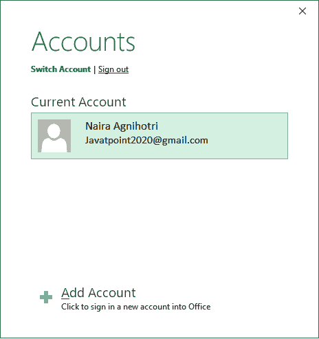

# 如何恢复一个 Excel 文件？

> 原文：<https://www.javatpoint.com/how-to-recover-an-excel-file>

Excel 文件是办公室中最常用的文档。由于文件未保存或任何其他原因，您经常会遇到数据在 Excel 中丢失的问题。您担心如何在关闭 Excel 文件后获取已经丢失的数据。在这种情况下，唯一的选择是恢复 Excel 文件。

有各种选项可以保护您的数据安全，例如在 Excel 备份或 OneDrive 上备份文件。有时，如果您错误地关闭了文件而没有保存它，您可以从那里取回它。

本章将提供一个完整的指南，指导您在关闭 Excel 而不保存文件的情况下恢复 Excel 文件。我们将在本章中讨论的所有方法都将在 Excel 2010 及更高版本上工作。除此之外，我们还将向您简要介绍如何备份您的 Excel 文件。

**常见问题**

这里我们有一些常见的问题，可能与上述主题有关。

*   **恢复 Excel 文件**
*   **从 Excel 备份工具**恢复未保存的 Excel 文件
*   **从 OneDrive 备份中恢复未保存的 Excel 文件**
*   **从窗口文件历史中恢复被覆盖的 Excel 文件**

### 如何防止 Excel 数据丢失

在转到恢复方法之前，我们建议您在使用 Excel 时需要遵循一些事情。所以，你的数据不会丢失。这些预防措施将防止您丢失 Excel 数据。

1.  当您创建一个 Excel 文件并在其中存储您的基本数据时。因此，首先，保存文件，这样您就可以保存由于断电问题或未保存的文件而丢失的数据。
2.  如果要更新现有 Excel 文件中的内容，尽量使用 **Ctrl + S** 快捷键频繁提前保存。
3.  将文件备份到 Excel 备份存储或 OneDrive。因此，如果您错误地删除了任何文件，您可以从那里恢复它们。
4.  除此之外，还可以使用 Excel 的自动保存功能，每隔 **五分钟**在**保存一份文件数据。您可以更改自动节省时间。**

## 恢复电子表格文档的方法

有许多方法可以恢复未保存的 Excel 文档。

[方法一:从 Excel 本身恢复未保存的 Excel 文档](#Method1)

[方法二:从 Excel 备份中恢复一个 Excel 文件](#Method2)

[方法 3:从 OneDrive 备份中恢复一个 Excel 文件](#Method3)

[方法四:提前保存文件，防止数据丢失](#Method4)

[方法 5:使用自动恢复功能防止数据丢失](#Method5)

### 方法 1:从 Excel 本身恢复未保存的 Excel 文档

以防您没有保存文件就关闭了文件。此方法是恢复最近未保存的文件的最简单的方法。意外删除或损坏 Excel 文件可能会造成大量数据丢失，这也会浪费您的时间和精力。

因此，使用内置的 Excel 备份功能来保存您的 Excel 文件的备份副本。如果您的 Excel 文件丢失，您可以从 Excel 备份工具中恢复它。

它确实包含任何复杂的步骤。按照以下步骤恢复未保存的 Excel 文件:

**第一步:**打开 Excel 应用程序，进入菜单栏的**文件**选项卡。

#### 注意:请记住，我们在本教程中使用的是微软 Excel 版本。所以，所有的方法都将在 Excel 2016 上工作。

**第二步:**点击**最近**查看最近创建或更新的所有 Excel 文件。

**第三步:**向下滚动到最近的 Excel 文档，然后点击**恢复未保存的文档**，该文档将包含未保存的 Excel 文档列表。

你可能不会得到这个**恢复未保存的工作簿**选项，点击**更多工作簿**，那么你肯定会得到这个选项。

**第 4 步:**您的草稿文件夹将在一个新窗口中打开，其中包含未保存的 Excel 文件。我们有**一个未保存的文档**你可以在下面的截图中看到。

**第五步:**选择并打开未保存的文件。

**步骤 6:** 如果您选择的文件是您要查找的正确文件，请从文件顶部业务栏中的**另存为**按钮启用将其保存在您的设备中。

您也可以使用以下步骤获取未保存的文件。这两种方法都会将您带到存储临时文件的文件夹，用户不会将临时文件永久保存在他们的设备中。

## 检查临时文件

[Excel](https://www.javatpoint.com/excel-tutorial) 为未保存的临时 Excel 文件创建备份。有时，我们需要这些我们没有保存的文件。当 Excel 为临时文件创建备份时，可以恢复这些文件。基本上，需要这些文件来恢复未保存的更改。获取文件非常容易。按照以下几个步骤获取文件:

**第一步:**打开 Excel，导航至**文件**菜单选项卡。

**第二步:**点击 Excel 屏幕左侧面板的**信息**按钮。

**第三步:**进入**管理工作簿**下拉列表，点击。它将探索两个选项，选择**恢复未保存的工作簿**或**删除所有未保存的工作簿**。

**第四步:**点击**恢复未保存的工作簿**恢复未保存的临时 Excel 文件。

**第 5 步:**将带您进入或打开文件资源管理器，其中将包含未保存的 Excel 文件列表。如果你在这里得到任何文件，选择或双击它在 Excel 中打开。您可能会从这里得到一些对 Excel 文件的更改。

**第六步:**除此之外，如果你去**文件>T5】选项> >保存**，你会得到自动恢复文件的位置。您也可以从这里更改未保存文件的位置。

您可以签出这个文件夹，看看这里是否还有其他有用的文件。或者，您也可以从这里禁用特定工作簿的自动恢复。

## 从 Excel 备份中恢复 Excel 文件

文件中的意外删除或更改会破坏您的工作。在早期版本的微软 Excel 中，每次保存文件时，**都会自动创建该 Excel 文件的备份副本**。Excel 备份功能在较新版本的 Excel 中仍然存在，但它是隐藏的。因此，您必须为每个文件单独设置一个备份。简单来说，每个 Excel 文件都需要为云备份设置单独的备份设置。

#### 注意:Excel 备份功能在较新版本的 Excel 中可用，但它是隐藏的。

当文件中发生任何意外更改时，此备份文件会帮助用户。它允许用户获取您的 Excel 文件的最新副本。除此之外，还可以从 Excel 备份下载文件，以防不小心删除了 Excel 文件。如果有 Excel 文件的备份，可以从那里下载。

正如我们已经告诉您的，每个 Excel 文件都需要建立单独的备份设置。因此，我们有以下步骤来设置 Excel 备份文件的设置:

**第一步:**打开 Excel，导航至**文件**菜单选项卡。

**第二步:**点击 Excel 屏幕左侧面板的**另存为**按钮。

**第三步:**点击**文档**文件夹，直接将文件保存在该文件夹中，或者点击**浏览**按钮，会打开一个窗口，选择保存 Excel 文件的位置。选择保存文件的文件夹。

**第四步:**你将被移动到设备文件夹保存 Excel 文件。在这里，在窗口面板的底部，点击**工具**下拉按钮，选择**通用选项**。

**第五步:**将打开一个包含少量选项的弹出窗口。在该弹出窗口中，选中**“始终创建备份”**复选框，并点击下面的**确定**按钮。

您也可以设置密码来打开和修改 Excel 文件。它会限制用户。

**第 5 步:**现在，通过提供名称保存该 Excel 文件，并点击**保存**按钮。

现在，每当您保存文件时，Excel 都会创建文件的备份副本。如果您错误地从系统中删除了文件，您可以从备份中下载最后更新的文件。

## 使用 OneDrive 备份工具保护您的文件

文件中的意外删除或更改会破坏您的工作。丢失重要数据也可能是时间和金钱的巨大损失。微软 Excel 提供了 OneDrive 备份工具，可以备份您的文件并保护您的数据。Excel 允许其用户将他们的文件存储在 **OneDrive** 上作为**备份副本**。

> 通过使用 **OneDrive 备份工具**，您将增加一个保护层，防止丢失文件。

该备份工具使用户能够通过使用电子邮件 id 和密码注册微软帐户，在云上上传他们的 Excel 文件。在这里，你可以存储他们的文件。使用此功能的一大优势是，用户可以随时随地访问其微软帐户，并随时获取其文件。

当文件中发生任何意外更改时，此备份会帮助用户。它允许用户获取并下载你的 Excel 文件的最新副本。除此之外，还可以从 Excel 备份下载文件，以防不小心删除了 Excel 文件。

**当文件已经备份到一个驱动器时恢复文件**

**第一步:**转到**文件>打开**，在这里你会得到一个 OneDrive 选项；点击它。

**步骤 2:** 在这里，您将获得一个 OneDrive 文件夹，您的 Excel 文件将在其中进行备份。

**步骤 3:** 它会将您带到 OneDrive 备份文件夹。您将看到两个文件已经备份。选择任意文件，点击**打开**按钮。

### 首次设置 OneDrive 的步骤

这里，我们有以下步骤从 Excel 设置 OneDrive 备份设置:

**第一步:**打开 Excel，新建一个 Excel 电子表格或打开一个已有的 Excel 文件(电子表格)。

**步骤 2:** 导航至**文件**菜单选项卡。

**第三步:**转到 Excel 左侧面板的**另存为**将文件保存到云/OneDrive 上。

**第四步:**点击 **OneDrive** 将你的 Excel 文件上传存储到 OneDrive 云存储。

**第五步:**点击 **OneDrive** 将文件上传并存储到 OneDrive 云存储中。

如果您已经在 Microsoft 上拥有帐户，请使用您注册的电子邮件 id 和密码登录。否则，注册微软帐户。

我们已经在微软有一个账户了。所以，我们点击**登录**按钮，登录进去。

**第 6 步:**输入您的邮箱 Id，点击**下一步**按钮。

**第七步:**输入密码，点击**登录**按钮。

**第 8 步:**取消标记**如果您不想让微软管理您的设备，请允许组织管理您的设备**，然后单击**确定**按钮。

您已成功登录到您的 Microsoft 帐户，现在您已经准备好将备份文件上传并存储在 OneDrive 上。

**第九步:**登录后，你会被移至另存为窗口，双击 **OneDrive** 图标，这里会显示你的已签名账号。

OneDrive 将向您显示与您的 Excel 链接的帐户。

跳过**第 9 步**进入下一步。

**第十步:**再次点击**另存为**和 **OneDrive** 将文件保存到云端。

**第 11 步:**现在，点击右侧面板的 **OneDrive JTP** ，它会将您连接到服务器，并允许您在 OneDrive Cloud 上保存当前保存的 Excel 文件的备份副本。

#### 注意:您的设备必须有兴趣地连接，这样您的文件才能毫无问题地上传到 OneDrive 服务器。

**步骤 12:** 在这里，进入默认的**表单**文件夹，然后**文档**，然后在这里保存你的 Excel 文件。您还可以看到，该文件将保存在[【电子邮件保护】](/cdn-cgi/l/email-protection)微软帐户中。

**步骤 13:** 现在，将文件保存在这个**表单>文档**文件夹中，点击**保存**按钮。

您的文件已成功保存在 OneDrive 云上。下一次，当你将保存另一个文件时，你不需要再次签名。只需按照步骤 10 中的步骤，将文件作为备份拷贝存储在 OneDrive 上。直接将文件保存在 OneDrive 上，以保留 Excel 文件的备份副本，防止数据丢失。

您可以获得文件的最新备份。它会代表您自动更新文件。

## 尽早保存文件以防止数据丢失

大多数情况下，要取回数据或恢复未保存的文件并不容易。但是，有多种功能可用于恢复丢失的 Excel 文件。但是，在文件中进行任何更改后，每个用户都可以更容易地快速保存文件。每 2 - 3 分钟保存一次文件应该是习惯。

经常使用 **Ctrl + S** 快捷键保存你更新的文件数据。它将帮助您覆盖文件中以前的数据和更改。

这是防止数据丢失的最简单方法。通过快速保存文件，用户将不会面临由于断电问题、错误地关闭文件而不保存或任何其他原因而导致的数据丢失问题。

## 使用自动恢复功能防止数据丢失

丢失重要数据也会损失时间和金钱。因此，为了防止数据丢失，您可以采取一些预防措施，以便保护您的数据。您可以避免数据丢失的痛苦，因为很难恢复准确的数据，也很浪费时间。

微软 Excel 提供了**自动恢复**的内置功能。该功能允许用户在特定时间后，例如**5 分钟或更短时间内，设置保存和自动恢复 Excel 文件中更新信息的时间。**

 ****自动恢复**的默认时间为 **10** 。您可以根据需要从设置中更改自动恢复时间。

**步骤**

导航到**文件>选项>保存**在 Excel 中，你会得到这个自动恢复选项。

通过在此设置时间，Excel 将在每 5 分钟内保存一份您的电子表格。除此之外，我们还会推荐你使用 **Ctrl + S** 快捷键自己保存更新后的文件。

* * ***