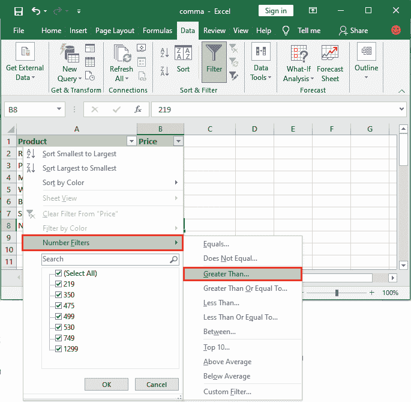

# 如何在 Excel 中对一列求和？

> 原文：<https://www.javatpoint.com/how-to-sum-a-column-in-excel>

Excel 是一个需要计算进行数据分析的工具。这是一种将数据存储在 Excel 电子表格中的数字方式。为了做一些分析，我们对它执行数学函数。Excel 还向用户提出了各种内置功能，以便在此 Excel 表上执行。

在 Excel 中计算一列的和很容易。本章将向您展示如何在 Excel 中计算一列或选定单元格的总和。

[Excel](https://www.javatpoint.com/excel-tutorial) 提出了几种求一列之和的方法-

1.  单击一次即可对一列求和
2.  使用自动求和计算一列的总和
3.  应用**求和**函数(数学函数)手动求和一列
4.  使用**小计**计算所选单元格的总和
5.  将数据转换为 Excel 以获得一列的总和

请参见下面的详细方法:

## 单击一次即可对一列求和

计算一列的总和是 Excel 最简单的方法之一。这是一种快速的方法，可以轻松地一次点击得到一列的总和。

请记住-此方法将只显示选定列的总数，但不保存它。结果将显示在 Excel 底部的**状态栏**中。

**动作:**选择列，在 Excel 电子表格底部的状态栏上看到结果(总和)。

**例如-**

让我们举个例子，借助它来理解:

### 费用总和栏

现在，我们将看到给定数据的**费用列**的总和。在状态栏底部可以看到所选列(费用)的总和，即**总和= 48004**


### 卖出栏的总和

现在再看一栏的总和，即**卖出**栏。您可以在状态栏底部看到所选列(销售)的总和。总和= 318095


## 使用自动求和计算一列的总和

自动求和是在 Excel 电子表格中查找列总和的另一种方法。当您希望将结果保存在 Excel 表中以备将来使用时，此方法很有帮助。可以使用 Excel 的这个自动求和功能。

#### 注意:用户可以在将来需要时使用这个计算出的总和结果，因为 Excel 会保留它。

**自动求和**也是想要保留结果时，对一列求和最简单的方法。让我们看看这个 AutoSum 函数是如何在 Excel 中使用的，以及它是如何工作的——

**例如**

我们有一个 Excel 电子表格，其中包含一些产品及其价目表。我们将使用 **AutoSum** 功能计算这些产品的总价。请遵循以下步骤:

**第 1 步:**选择要计算其总和的列正下方的一个空单元格。


**步骤 2:** 现在，转到**公式**选项卡，单击公式选项卡中函数库部分内的**自动求和**按钮。


**第三步:**按**回车**键完成动作，显示计算出的价格之和一栏。该列的总和将被自动计算并粘贴到选定的单元格中。


计算价格列的总和时没有范围选择。我们已经总结了所有值的列。

## 手动将 Sum()函数应用于列

您也可以将 Sum()函数手动应用于列，而不是自动求和。 **Sum()** 功能使用户能够通过将总和应用于列数据来手动计算总和。像自动求和功能一样，它也将求和结果保存在 Excel 表中。

你在想手动应用 Sum 函数的主要目的是什么，它与 AutoSum 有何不同？使用此函数，可以计算选定单元格的总和，而不是该列的所有值，并将计算结果粘贴到 Excel 工作表的任何位置。

**目的**

有时，如果我们想计算几个选定单元格的总和，我们需要手动计算总和。手动使用 Excel 的 **SUM()** 功能，找出所选单元格或单元格范围的总和。

让我们看看这个 Sum 函数是如何手动应用于一个列的，以及它是如何工作的

**例如**

对于本例，我们将使用前面方法中使用的相同的 Excel 电子表格，其中包含一些产品及其价目表。我们将使用 **Sum()** 方法计算这些产品的总价。请遵循以下步骤:

**第 1 步:**单击一个空单元格，在该单元格中粘贴所选单元格的总和。


**第二步:**使用以下 SUM 公式

```

=sum(from cell number:to cell number)

```

**例如**

=sum(B2:B11)

它会将来自 B2 像元值的数据加总到 B11 像元。


**提示:**对于大范围的计算，可以使用 Sum()公式中的范围，如(B3:B5000)。

**第三步:**现在按**回车**键得到结果。请注意，所选单元格(从 B2 到 B5)的总和已粘贴在下面。


在这里，您会看到一个黄色的错误类型符号，表示用于此单元格的公式适用于单元格区域。


在公式栏中，您可以看到应用于结果单元格的公式。

#### 注意:SUM()函数甚至可以用于隐藏和过滤的行数据。

## 使用小计计算选定单元格的总和

**小计**和 Sum 函数有点不一样。小计是一个数学函数，仅用于计算可见单元格的总和。与 Sum()方法不同，它在合计列数据时不包括隐藏或筛选的行数据。

Subtotal 函数只计算一列中可见行数据的总和。要了解这个函数的全部功能，步骤有点复杂。否则，就像上面使用的其他函数(Sum，AutoSum)一样简单。我们将向您简要介绍每一步。

我们将此表数据用于小计函数:


**在表格中添加过滤器**

为了向您展示 Subtotal 函数的实际用途，我们将首先根据一些条件过滤表数据。例如，我们将在价格列上添加一个过滤器，并通过设置大于条件(例如，大于 350)来过滤表数据。

**第一步:**打开 Excel 表格过滤数据，进入**数据**页签。


**第二步:**首先点击一个有效的列，然后点击**过滤器**图标，在表格的每一列添加过滤器按钮。


**第三步:**这些新增的过滤按钮可以通过输入条件来过滤数据。您将看到每个数据列都添加了一个下拉箭头。


#### 注意:这些过滤器为字符串和数字类型列值启用单独的 t 过滤器。

**第 4 步:**点击该过滤器下拉列表，在此选择浏览**数字过滤器**选项。我们点击了**价格**过滤按钮。


**步骤 5:** 从数字过滤器中选择一个条件来过滤数据。我们将选择**大于**的条件来过滤表格数据。



您也可以通过取消价格列数据的标记来从这里排除任何行。

**第五步:**当您从这里选择任意数字过滤器时，它会打开一个面板，向其提供值。在此提供过滤表格数据的值，点击**确定**按钮应用过滤。


**第 6 步:**对价格列应用大于过滤器后，会看到表数据已经过滤。价格高于 450 的行是可见的。


产品价格低于 450 的行被过滤器隐藏。

### 使用自动汇总功能对列数据进行小计

我们现在将使用**自动求和**功能对一个列数据求和，但是在应用过滤器之后。只有到那时，它才会作为小计功能工作。这一次它将不包括当前不可见的隐藏或过滤数据。

按照以下步骤对列数据进行小计:

**第 7 步:**选择要计算其总和的列正下方的一个空单元格。


**第 8 步:**现在，转到**公式**选项卡，单击公式选项卡函数库部分中的**自动求和**按钮。


**第 9 步:**按 **Ente** r 键完成动作，显示价格栏的计算总和。该列的总和将被自动计算并粘贴到选定的单元格中。


这里，Excel 会保留结果。但是，如果您只想查看可见单元格的总数，而不想保留结果，则可以选择列中的数据范围，并在状态栏中查看总和。

### 将数据转换为 Excel 以获得一列的总和

这是获取 Excel 电子表格中一列总和的另一种方法。如果经常需要对一列求和，可以将电子表格转换为 Excel 表格。用户可以很容易地对列和行进行合计。它还允许您对该列表执行一些其他操作。

按照以下步骤操作:

**第一步:**按 **Ctrl + T** 快捷键，格式化 Excel 表格的单元格区域。简单地说，它将创建一个电子表格的表格。它将打开一个**创建表格**面板窗口。


**第 2 步:**在此创建表格面板上点击**确定**按钮。


**第三步:**Excel 菜单栏将出现新的**设计**页签；导航到此选项卡。在此设计选项卡中，标记表格样式选项内的**总行数复选框**。


**第 4 步:**当您选中**合计行**复选框时，Excel 表格的末尾会自动添加一个新行。该行将包含该表中所有项目的总和。


**第 5 步:**要确保结果数据是行的总和，请单击该结果编号，如这里的 **4121** ，这将启用该旁边的**小向下箭头**按钮。


**第六步:**点击那个**小向下箭头**按钮。你会让你从这个方法中得到的，比如- sum，min，max，average 等。默认情况下，总和总是计算出来的，您也可以在下面的截图中看到。


使用此选项，您可以让每个列的总数。

**步骤 7:** 同样，从向下箭头下拉列表中选择任何其他操作，如**最大，**找出该列中存在的最大值。


**第八步:**看到这里已经出现了列的最大值。


同样，您也可以通过从这里选择相应的操作来找到此列的总和、最小值、最大值或平均值。

## 使用 SUMIF 基于标准对列值求和

除了上面讨论的所有这些方法之外，我们还有一个对列值求和的条件方法。除了 Subtotal 方法之外，这些方法给出了整列的总和。有时，用户需要合计满足用户设置的条件的值。因此，我们将向您简要介绍另一个基于条件对列值求和的 Excel 函数。

**SUMIF** 是一个在 Excel 电子表格中使用的函数，通过应用一些条件来合计列值。该函数仅帮助合计满足定义标准的列数据。您可以使用 SUMIF 方法轻松完成。

让我们用一个例子来理解-

**例 1: SUMIF**

我们有产品及其价格的数据集。我们将计算所有价格大于 550 的产品的总和。

使用下面的 SUMIF 公式，得到满足定义条件的单元格总数。

```

=SUMIF(B2:B8,">550",B2:B8)

```

按照以下步骤使用 SUMIF 函数计算总和:

**第一步:**打开工作表，选择要粘贴结果的单元格。


**第二步:**转到**配方栏**将上面的配方粘贴进去。


**第三步:**按**回车**键得到结果。


#### 注意:您可以在数值和测试条件下使用 SUMIF 公式。

假设我们必须计算电子表格中所有笔驱动器的总和。在这种情况下，使用 Pen drive 作为条件，并包括 A 列和 B 列。即产品和价格。

**例 2: SUMIF**

在公式栏中复制并粘贴以下 SUMIF 公式:

```

=SUMIF(A2:A9,"Pendrive ",B2:B9)

```


按下**进入**键，获取本 Excel 电子表格中的笔驱动器总价。


除此之外，SUMIFS 是另一个与 SUMIF 几乎相似的功能。

* * *