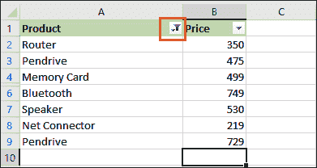
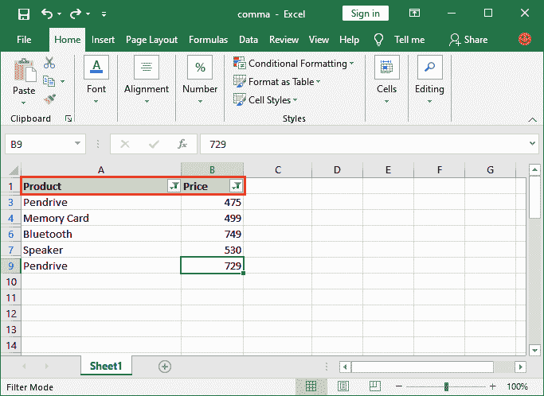
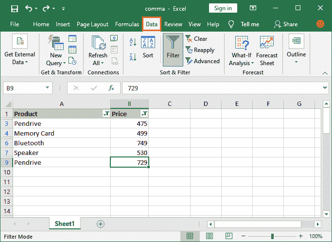
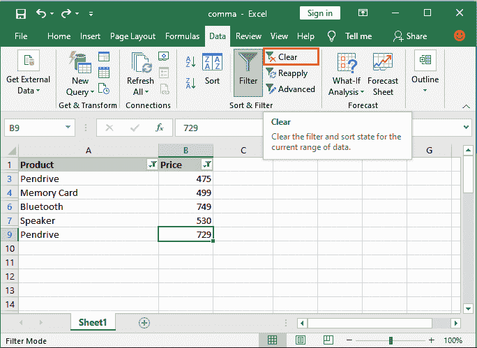
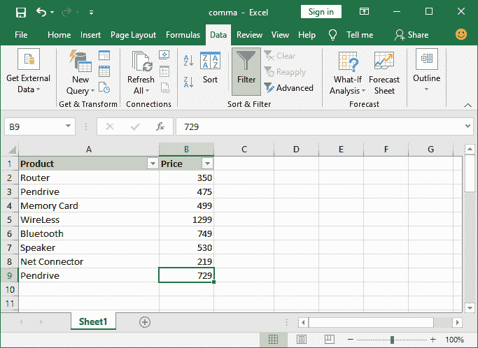
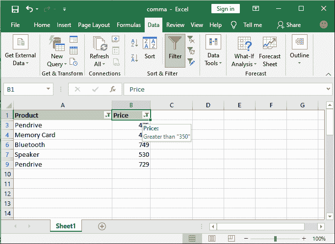
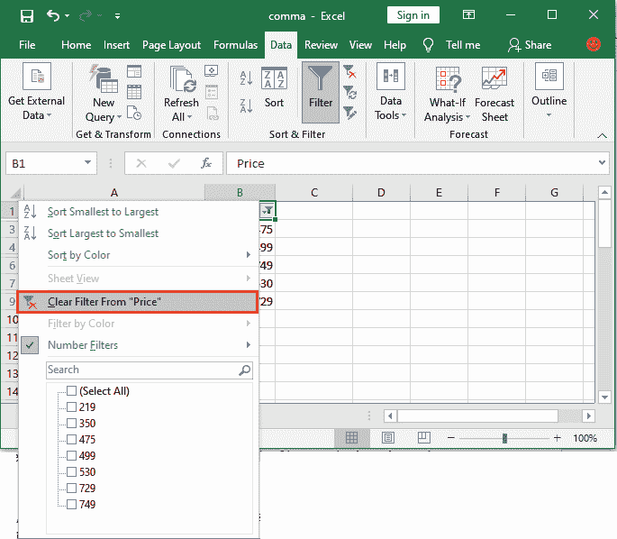
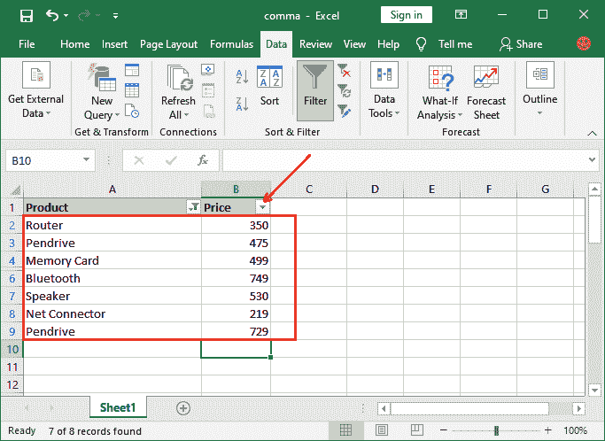

# 如何在 Excel 中移除过滤器？

> 原文:[https://www . javatpoint . com/如何移除 excel 中的过滤器](https://www.javatpoint.com/how-to-remove-the-filter-in-excel)

过滤器应用于 Excel 表格，显示相关数据，隐藏其他数据来分析某些东西。基本上，它用于分析目的。但是当我们在 Excel 表格上设置过滤器时，它会隐藏一些表格的数据，以便更好地分析。工作完成后，我们希望备份包含全部数据的原始 Excel 工作表。

在这种情况下，我们必须从该 Excel 表中删除过滤器，以获取所有数据并使其在表中可见。在本章中，您将学习如何从 Excel 表中删除筛选器。在此之前，我们将向您简要介绍过滤器。

在开始学习如何从 Excel 表中删除筛选器之前，您应该知道什么是筛选器。

## 什么是过滤器？

在 [Excel](https://www.javatpoint.com/excel-tutorial) 中使用过滤器显示相关数据，隐藏文件中的其他信息。它**不删除或移除 Excel 工作表数据**；它只是隐藏了不满足过滤条件的数据。

过滤器可以应用于数字数据和字符串数据。它为两者提供了截然不同的条件。您可以在 Excel 表格中添加多个过滤器来分析数据。现在，从 Excel 表格中移除一个过滤器。

## 如何发现过滤器应用于一个列？

在开始移除筛选器之前，您应该知道该筛选器是应用于列还是不应用于 Excel 电子表格。您可以很容易地发现过滤器是否应用于列。

你会发现**在列名旁边的下拉箭头附近有一个小漏斗图标**，如下图截图所示。

您已经认识到过滤器仅应用于产品列，而不是上面截图中的价格列。除此之外，一个简单的向下箭头显示该列中没有数据被过滤掉。

**例如-** 看到价格列包含一个简单的向下箭头图标，表示该列中没有数据被过滤。

## 如何从 Excel 表格中删除所有过滤器？

现在，您将了解如何从 Excel 表中删除过滤器。您可以通过两种不同的方式移除过滤器，即，

1.  从 Excel 表格中删除所有筛选器
2.  从 Excel 表格的特定列中删除筛选器

### 从 Excel 表格中删除所有筛选器

此方法将描述如何在 Excel 表格中一次删除两列或多列上添加的筛选器。基本上，该方法一次删除应用于 Excel 电子表格所有列的所有筛选器。

当您只想从一列或两列而不是所有列中删除筛选器时，此方法会失败。在这种情况下，使用另一种方法删除下面讨论的特定列的过滤器。

这里，我们有几个从 Excel 表中删除过滤器的简单步骤。按照这些步骤学习。

**第 1 步:**我们有一个数据表，产品和价格列上都应用了过滤器，如下图所示。

打开包含筛选数据的 Excel 电子表格。

**第二步:**在 Excel 的菜单栏中，转到**数据**选项卡。

**第三步:**点击**排序&过滤器**部分内的**清除**按钮，靠近**过滤器**选项。

**第 4 步:**您将会看到过滤器同时从两列中移除。它已经删除了适用于此表的所有过滤器，现在显示完整的数据。

#### 注意:当您只想从特定列而不是所有列中删除筛选器时，此方法会失败。遵循下面完整的教程，并使用另一种方法删除下面讨论的特定列的过滤器。

### 从 Excel 表格的特定列中删除筛选器

有时，我们不需要从 Excel 表中删除所有的过滤器。我们只需要移除特定列的过滤器。上述方法在这种情况下不起作用，因为它删除了应用于 Excel 表的所有筛选器。

因此，我们提出了另一种有助于从特定列中移除过滤器的方法。使用这种方法，可以很容易地删除 Excel 表中特定列的筛选器。但是，您也可以使用此过滤器来删除所有过滤器。但这需要时间，因为它不会一次就移除所有过滤器。

这里，我们有几个从 Excel 表中删除过滤器的简单步骤。我们将使用与上面示例中使用的相同的表数据来从特定的列中移除过滤器。为此，请按照以下步骤学习。

**步骤 1:** 打开或创建一个列上有过滤器的 Excel 表。请参见表格标题，其中每一列都有一个向下箭头按钮，显示过滤器已应用于该列。

**步骤 2:** 转到要移除过滤器的特定列。当您将鼠标放在列标题上时，可以看到应用于该列的筛选器。

**步骤 3:** 现在，点击列标题旁边的**向下箭头按钮**移除过滤器，并选择**从价格中清除过滤器**选项。

**步骤 4:** 过滤器现在从价格表中清除，并且由于在价格列上添加过滤器而隐藏的数据现在可见。

同样，您可以根据需要逐个删除其他列的筛选器。

* * *