# 如何删除 Excel 中的网格线？

> 原文:[https://www.javatpoint.com/how-to-remove-gridlines-in-excel](https://www.javatpoint.com/how-to-remove-gridlines-in-excel)

网格线是您在 Excel 工作表的单元格周围看到的淡灰色线条。基本上，网格线是单元格周围的水平线和垂直线。默认情况下，Excel 会启用网格线。尽管您也可以将其从 Excel 工作表中隐藏或删除。

您不能从特定位置或单元格中部分删除网格线。您可以从整个 Excel 工作表中删除网格线，也可以在整个工作表上显示网格线。本章将为您提供如何移除/隐藏 Excel 工作表网格线的完整指南。

网格线非常有助于区分工作表中的每个单元格，并使用户易于阅读数据。查看带有网格线的 Excel 工作表的外观-

**无网格线的 Excel 表格**

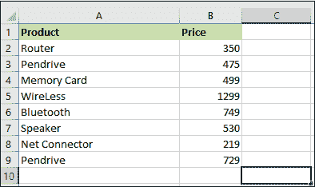

有时，用户出于任何目的需要没有任何网格线的数据。因此， [Excel](https://www.javatpoint.com/excel-tutorial) 提供了启用或禁用 Excel 工作表网格线的选项。使用这种方法，可以很容易地隐藏 Excel 工作表的网格线。

## 移除网格线后 Excel 工作表的外观如何？

请记住，网格线不同于边框。所以，不要混淆它们。当您隐藏/移除 Excel 工作表中的网格线时，一切都不会改变，数据也将保持原样。但是，您的 Excel 工作表将显示为单元格上没有任何网格线。Excel 工作表将显示为没有任何行的简单的普通页面。

查看没有网格线的 Excel 工作表的外观-

**无网格线的 Excel 表格**

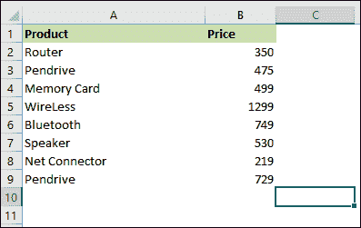

Excel 数据不会错位，格式也不会错位。一切都将是一样的，只是单元格之间的线条将被删除。

#### 注意:您可以从整个 Excel 工作表中删除网格线，也可以在整个工作表中显示网格线。您不能从特定位置或单元格中部分删除网格线。

#### 如何隐藏/移除网格线？

现在，您将了解如何通过几个简单的步骤删除 Excel 工作表中的网格线。我们将向您展示从 Excel 工作表中删除网格线的不同方法。

1.  从整个 Excel 工作表中删除网格线
2.  在 Excel 工作表的某些特定区域显示网格线

我们将以一种非常简单的方式向您介绍情况。

## 从整个 Excel 工作表中删除网格线

在 Excel 中，有两种方法可以删除整个 Excel 工作表的网格线。您可以从**页面布局选项卡**或 Excel 菜单栏中的**视图选项卡**中删除网格线。我们将讨论这两者，以获得清晰的理解。

首先，我们将简要介绍如何从“页面布局”选项卡中删除网格线，然后从“视图”选项卡中删除网格线。这两个步骤没有太大的区别。

### 通过页面布局选项卡

通过执行几个简单的步骤，您可以轻松地从 Excel 工作表中删除网格线。

**步骤 1:** 打开要移除网格线的 Excel 电子表格。

**第二步:**在主菜单选项卡中，转到**页面布局**选项卡并点击。

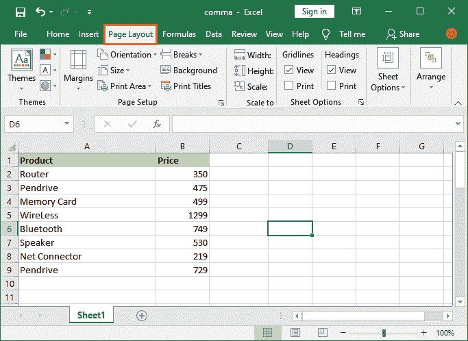

**第三步:**在**工作表选项**部分下，您会看到一个带有网格线的**视图**复选框。可以看到当前**查看**复选框被选中，表示此时网格线被启用。

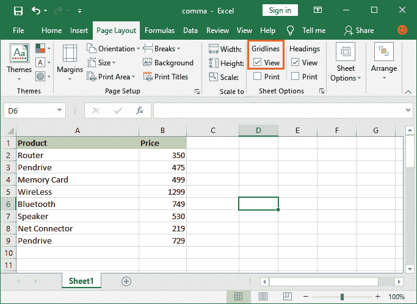

**步骤 4:** 您必须取消标记网格线部分下的**视图**复选框，以隐藏 Excel 工作表中的网格线。

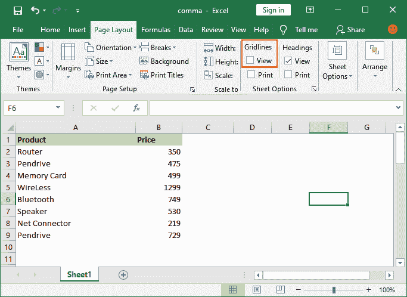

现在，您可以看到网格线被禁用，并且现在不可见。通过在此处标记**查看**复选框，您可以再次向 Excel 工作表显示网格线。

### 从视图选项卡

这种方法与上面的方法没有什么不同。在这两种方法中，我们将取消网格线复选框的标记，以隐藏 Excel 工作表中的网格线。只是两种方法做的方式不同。

使用这些简单的步骤，您可以使用 Excel 工作表中的**视图选项卡**轻松移除网格线。

**步骤 1:** 在您的 Excel 工作表上，转到 Excel 菜单栏中的**视图**选项卡。

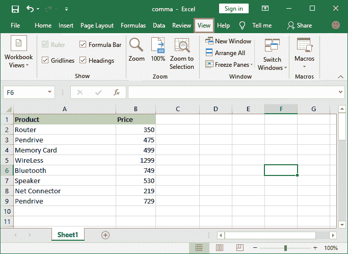

**第二步:**在这里**显示**部分下，你会得到一个名为**网格线**的复选框。您可以看到当前**网格线**复选框被标记，这表明此时网格线被启用。

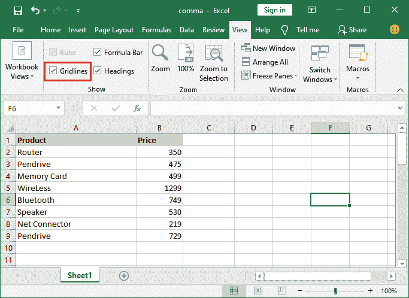

**步骤 3:** 您必须取消标记“显示”部分下的**网格线**复选框，以隐藏 Excel 工作表中的网格线。

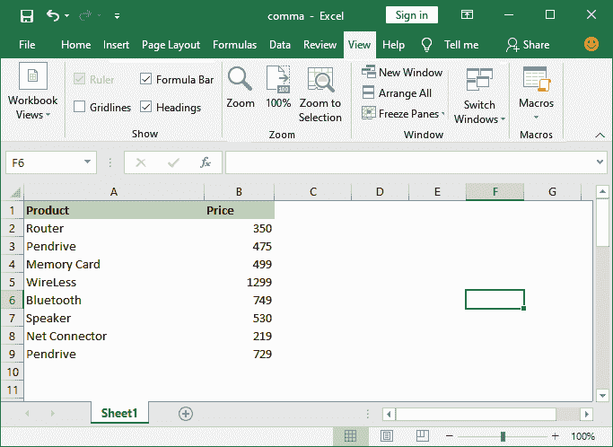

现在，您可以看到网格线被禁用，并且现在不可见。通过在此处标记**网格线**复选框，可以再次向 Excel 工作表显示网格线。

## 在 Excel 工作表的某些特定区域显示网格线

您不能从特定位置或单元格中部分删除网格线。您可以从整个 Excel 工作表中删除网格线，也可以在整个工作表上完全显示网格线。Excel 不提供任何隐藏特定区域或特定单元格的网格线的方法。

除此之外，您可以使用边框为特定单元格赋予网格线效果。Excel 提供了几种类型的边框，看起来完全像网格线效果。所以，你浅灰色的边框。

请按照下面的章节说明如何更改网格线的颜色，以便为某些特定的单元格赋予网格线效果。

**改变网格线的颜色**

选择不同的颜色(浅色)给单元格的特定区域赋予网格线效果。遵循几个简单的步骤:

**第一步:**打开 Excel 表格，转到**文件- >选项**，将打开一个新的对话框。

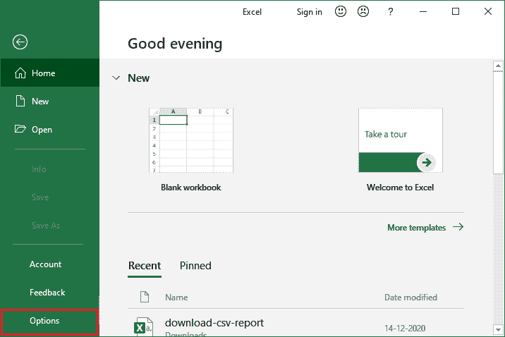

**第二步:**在 Excel 选项对话框中，点击左侧面板的**高级**。

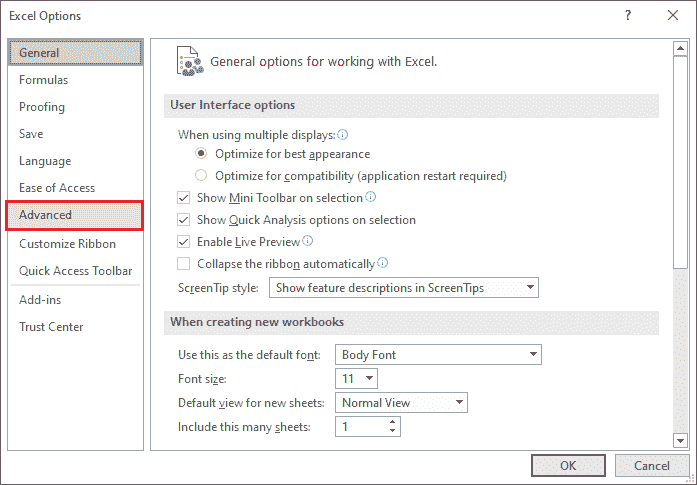

**步骤 3:** 在高级 Excel 面板中，向下滚动并转到该工作表的**显示选项**部分。

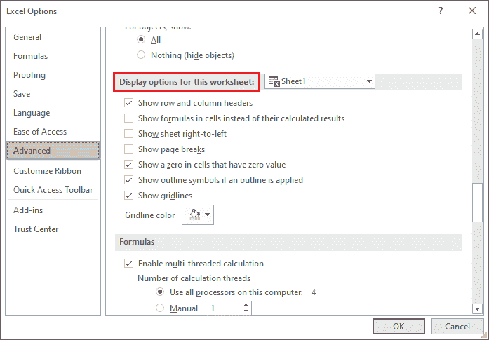

**第 4 步:**从该部分的最后一个选项中，从颜色列表中为网格线选择一种浅色。

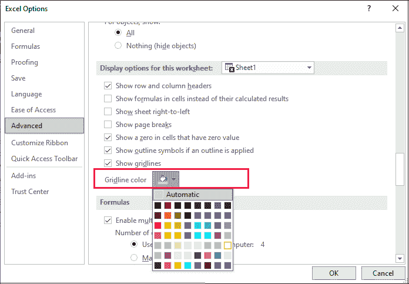

**第五步:**选择颜色后点击**确定**。这将更改网格线的颜色，并将其从 Excel 工作表中隐藏。

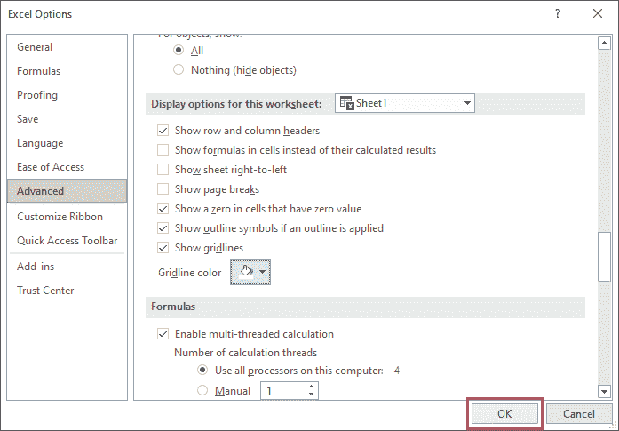

**第六步:**看到网格线已经隐藏成功。

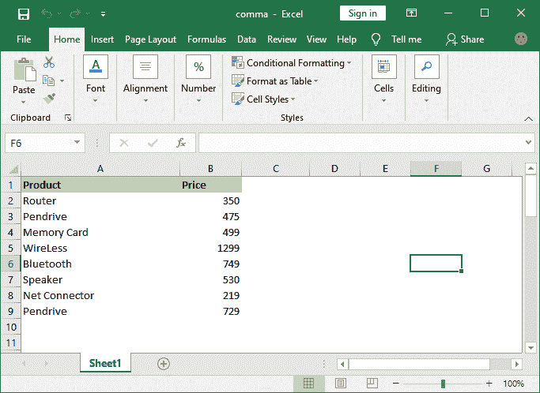

**需要注意的要点:**

*   可以直接使用快捷键 **Alt + W + V + G** 使网格线不可见。如果启用，它将隐藏网格线，如果禁用，它将显示网格线。
*   您打开的特定 Excel 工作表的网格线将被删除。不适用于整个 Excel 应用程序或所有工作表。它将仅从您禁用它的工作表中删除。
*   这意味着如果您从一个工作表中删除网格线，它将在另一个工作表中可见，没有任何冲突。
*   您也可以通过将网格线颜色从 Excel 的高级设置更改为白色或任何其他颜色来隐藏网格线。
*   请注意，默认情况下，网格线不会打印在 Excel 工作表上。

* * *