# 如何将 Excel 转换为 CSV

> 原文：<https://www.javatpoint.com/how-to-convert-excel-to-csv>

术语 **CSV** 代表**逗号分隔值**，这是众所周知且广泛使用的文件格式。CSV 以纯文本的形式存储和保存包含数字和文本的表格数据。一些应用程序和程序支持 CSV 文件格式，因为它是一种替代的导入和导出格式，这就是它流行和使用的原因。但是应该知道，CSV 文件可以在一个电子表格上工作，而不能在单元格、行或列上工作。因此，如果您试图以 CSV 格式保存 excel 行或列数据，这是不支持的。CSV 格式是逗号分隔值文件，它以逗号分隔的方式简单地保存数据。虽然[微软 excel](https://www.javatpoint.com/excel-tutorial) 版本支持将 Excel 电子表格转换为 CSV 文件，但也有其他在线软件和应用程序，用户只需上传文件，就可以将 Excel 文档转换为 CSV 文件，结果输出可以在几秒钟内下载。

在这里，在这一节中，我们将讨论不同的 CSV 格式，因为不仅只有一种，而且还有几种不同的 CSV 格式。此外，我们应该知道为什么需要将 excel 文档转换为 CSV 文件，以及为什么它如此受欢迎。有了这个，我们将看到每个步骤的实际实现，其中我们将获取一个 excel 电子表格，并将其数据转换为 CSV。我们还将了解一些将 excel 文件转换为 CSV 文件格式的在线模式。

## 格式类型

通常，用户可以将 excel 电子表格转换为两种不同的格式:

**1)分隔文本文件或(。txt):** 在这种类型的文件格式中，excel 工作表数据被转换并由制表符分隔。它在所有类型的操作系统上都是可支持的，并且可以支持每一种现代语言。

**2)逗号分隔值文本文件(。csv):** 在这种类型的文件格式中，excel 工作表数据被转换并由逗号字符分隔。

**在 CSV 文本文件中，它有进一步分类的格式，它们是:**

**CSV(逗号分隔)格式:**将 excel 文件保存为逗号分隔的文本，可以在另一个文本编辑器中使用。

**CSV (Macintosh):** 它的变化可以在 MAC OS 中看到，因为它将 excel 文件保存为逗号分隔的文件，以便在 MAC 系统中使用。

**CSV (MS-DOS):** 它的变化可以在 MS-DOS 中看到，因为它将 excel 文件保存为逗号分隔的文件，以便在 MS-DOS 系统中使用。

我们可以根据自己的需求进行更改，从 excel 到文本文件的转换称为 ***导出数据*** 。

### 为什么我们需要将 excel 转换为 CSV

由于以下原因，需要将 excel 电子表格转换为 CSV 文件格式:

*   CSV 格式简单，所有电子表格和数据库系统都支持。
*   CSV 格式允许跨不同软件和应用程序轻松传输数据。
*   CSV 文件是纯文本文件，它使 web 开发人员能够轻松地创建、开发、组织大量数据，并将数据导入 excel 工作表或数据库。

## 将 Excel 转换为 CSV

要将 excel 工作表转换为 CSV 文件格式，需要遵循以下步骤:

**步骤 1:** 通过直接在搜索选项卡上搜索或使用微软 Excel 图标(如果桌面上有)在您的计算机系统上打开微软 Excel。下面显示了一个片段:

**第二步:**如果已经有 excel 文件，使用**文件>打开**在系统中打开，浏览文件后点击**打开**(或直接按 Ctrl + O)或新建 excel 工作表。我们已经打开了一个现有的 excel 文件，如下图所示:

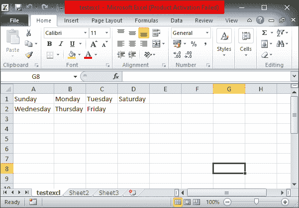

**第三步:**如果你已经创建了一个新文件，首先使用 **Ctrl + S** 保存它，或者转到**文件>保存**并给它一个合适的名称，然后将其保存在系统中你喜欢的位置。如果您已经打开了一个现有文件，*跳过此步骤*。

**第四步:**现在，转到**文件>另存为**，将打开**另存为**对话框，如下图所示:

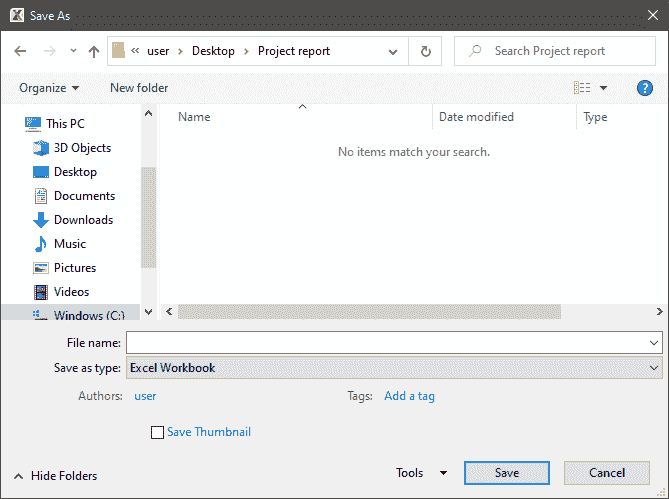

**第五步:**在**文件名**中，给文件取一个新的名称(如果需要)，在**另存为类型**中，点击下拉箭头(面朝下)，可以看到一个选项列表，从中选择 **CSV(逗号分隔)**，如下图快照所示:

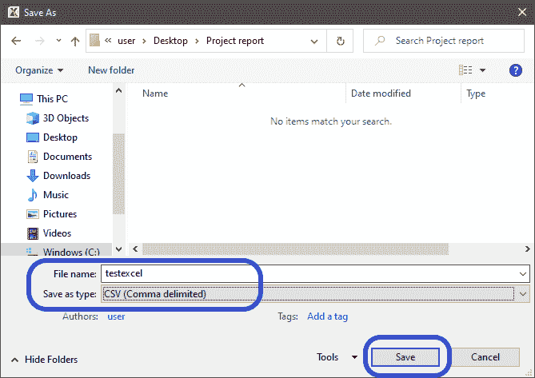

**第六步:**点击**保存**或按**进入**选择要保存文件的位置，点击**确定**，文件将被保存，如下图:

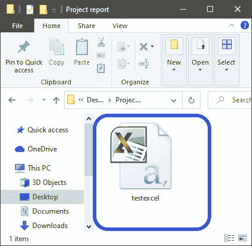

**第七步:**文件将转换为 CSV 文件。

## 如何检查转换

**为了检查 excel 文件是否成功转换为 CSV 文件格式，继续执行以下描述的步骤:**

1)移动到您保存文件的位置，右键单击它，会打开一个选项列表。选择**属性**并点击。快照如下所示:

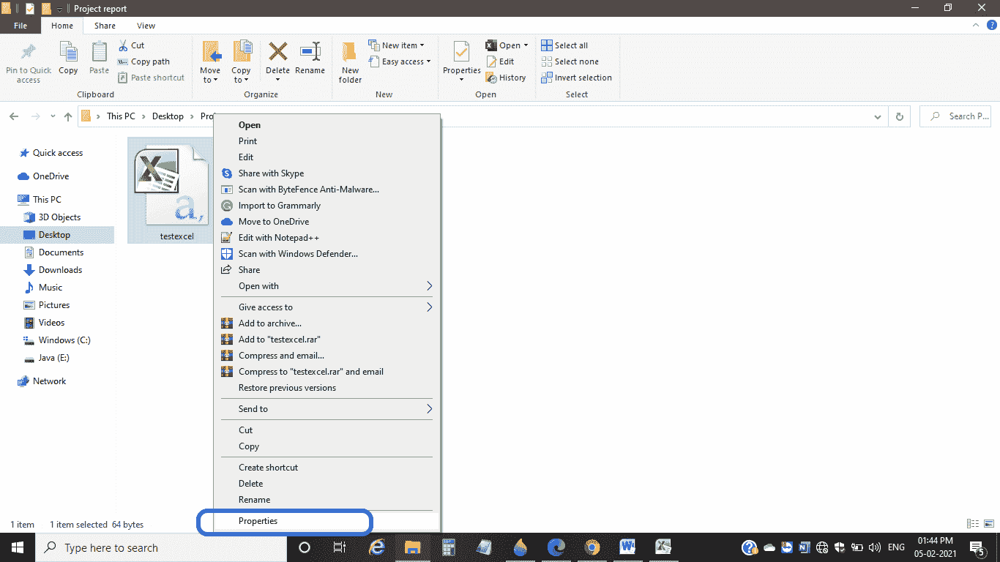

2)在**类型的文件**中，可以看到文件类型为**微软 Excel 逗号分隔值文件(。csv)** 并且可以在下面的快照中看到还:

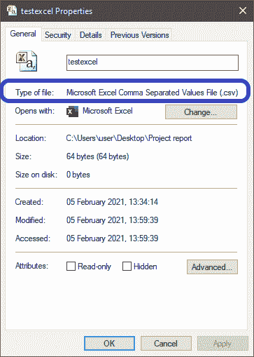

3)表示我们的 excel 表成功转换为 CSV 文件格式。

4)现在，要打开 CSV 转换后的文件，右键单击该文件并用**记事本**或任何其他文本编辑器打开它，您可以看到每个单元格数据通过它们之间的**逗号**分隔开，您将获得如下所示的快照:

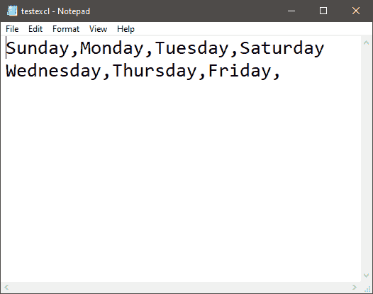

### 将 CSV 导入到 Excel

当用户想要在 excel 工作表中打开转换后的 CSV 文件时，需要在 MS Excel 中导入 CSV 文件，过程称为导入。要在 excel 中导入 CSV 文件，有两种方法:

**方法一:直接开启**

1)通过直接在搜索选项卡上搜索或使用微软 Excel 图标(如果桌面上有)在您的计算机系统上打开微软 Excel。下面显示了一个片段:

2)点击**文件>打开**或按 **Ctrl + O、**，出现**打开**对话框，从该对话框移至该位置，选择转换后的 CSV 文件。点击**打开**或点击进入。excel 将加载该文件，如下图所示:

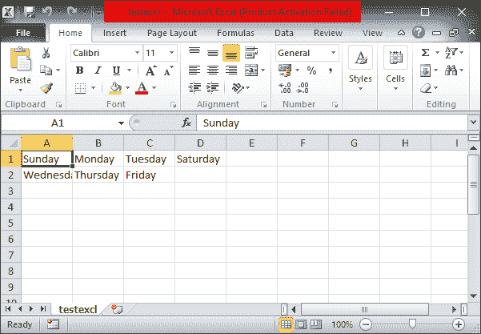

**注意点:**

在 MS Excel 中使用 Ctrl + O 时，转换后的 CSV 文件可能在其位置找不到。这是因为“打开”框根据应用程序过滤文件类型。因此，默认情况下，它只显示 Excel 文件。在文件类型(文件名旁边)中，改为**所有文件**而不是**所有 Excel 文件**，如下图:

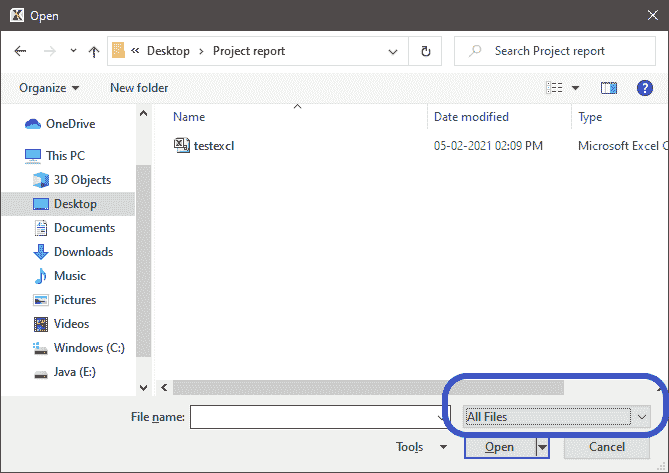

转换后的 CSV 文件现在是可见的，正如您在上面的代码片段中看到的。

### 方法 2:使用导入文本向导

**导入文本向导**方法允许用户更灵活地将列转换为不同的数据格式，因为直接打开 CSV 文件利用了当前默认的数据格式设置，以便知道每列数据的导入方式。**要使用导入文本向导，请按照以下步骤操作:**

1)打开 MS Excel，转到【公式】旁边的**数据**，如下图所示:

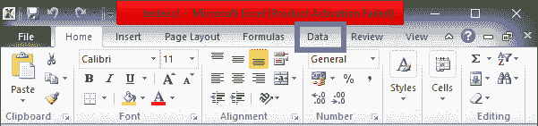

2)在**获取外部数据**剪贴板下，从文本点击**，如下图所示:**

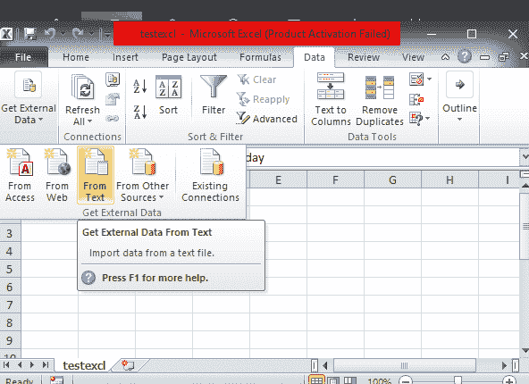

3)将打开**导入文本文件**对话框，移动到该位置并选择 CSV 文件，点击**导入，**，如下图所示:

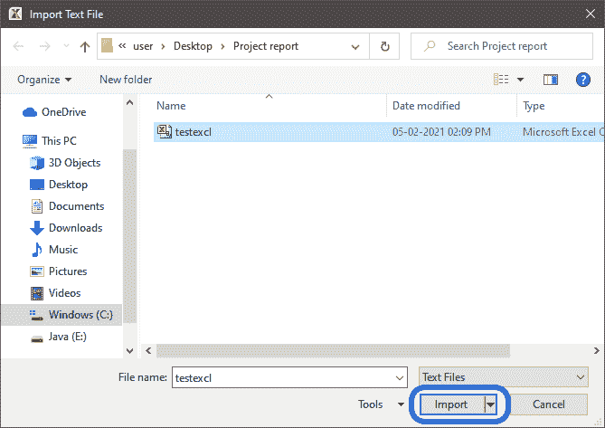

4)**文本导入向导**将以三步循环打开，如下图所示:

*   **第 1 步，共 3 步，**可以选择想要的**文件类型**，点击**下一步**。
    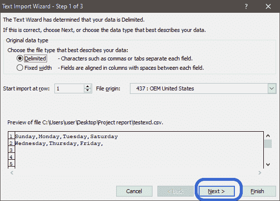
*   **在 3** 的第 2 步中，可以设置数据的**分隔符**，点击**下一步**，如下图所示:
    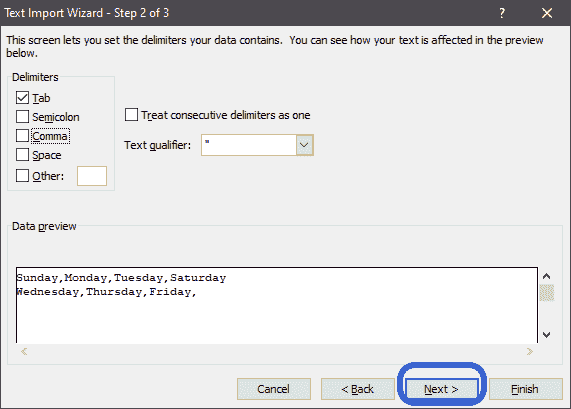
*   **在第 3 步的**中，可以选择每一列并设置想要的**数据格式**，点击**完成**，如下图所示:
    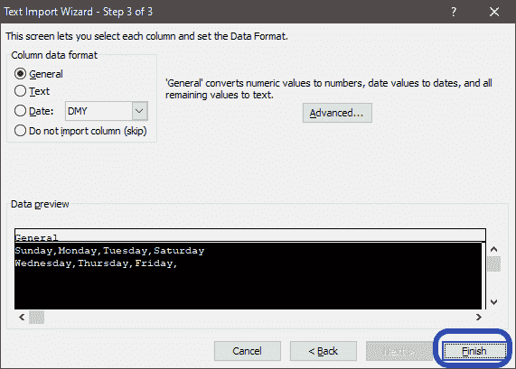

我们没有对文件进行任何更改。

5)接下来，它会问:*“你想把数据放在哪里？”*即要么到**现有工作表**要么到**新工作表**并点击**确定**。相同的快照如下所示:

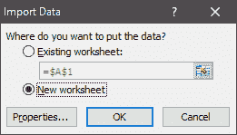

我们已经为文件选择了新工作表。

CSV 文件以您选择的格式类型在 excel 工作表中打开，如下图所示:

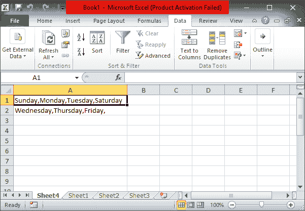

按照以上所有步骤，我们可以轻松地将 Excel 工作表转换为 CSV 文件。

## 在线 Excel 转 CSV

除了上述方法，我们还可以在线将 excel 工作表转换为 CSV 文件。有几种在线转换软件，我们可以通过它们将 Excel 工作表转换为 CSV 文件。一些在线 Excel 到 CSV 转换器包括:

*   扎姆扎尔
*   com
*   总裁
*   com 等。

**要使用这些在线转换模式，需要遵循以下步骤:**

**第 1 步:**将您的电脑与互联网连接，因为我们需要在线转换工作表。

**第二步:**在系统上打开 **Google Chrome** 等网页浏览器，在搜索栏上输入“*online excel to CSV converter”*，如下图快照所示:

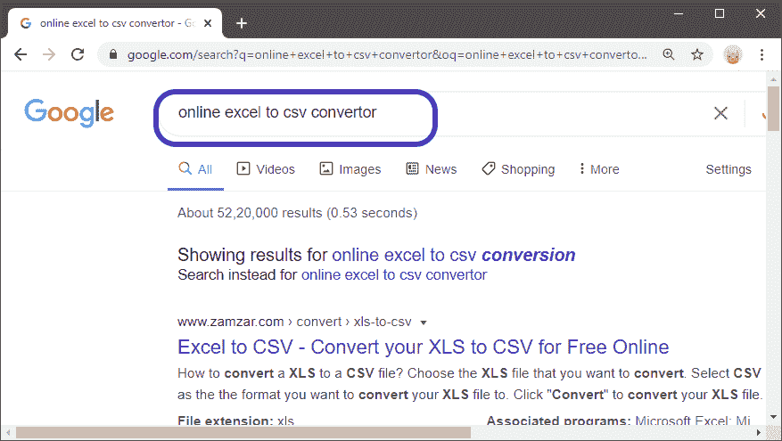

**第三步:**将打开几个链接。选择其中任何一个。上面显示了一个快照。

**第四步:**接下来，所选网站将打开，如下图所示，我们已经在系统上打开了**cloudconvert.com**:

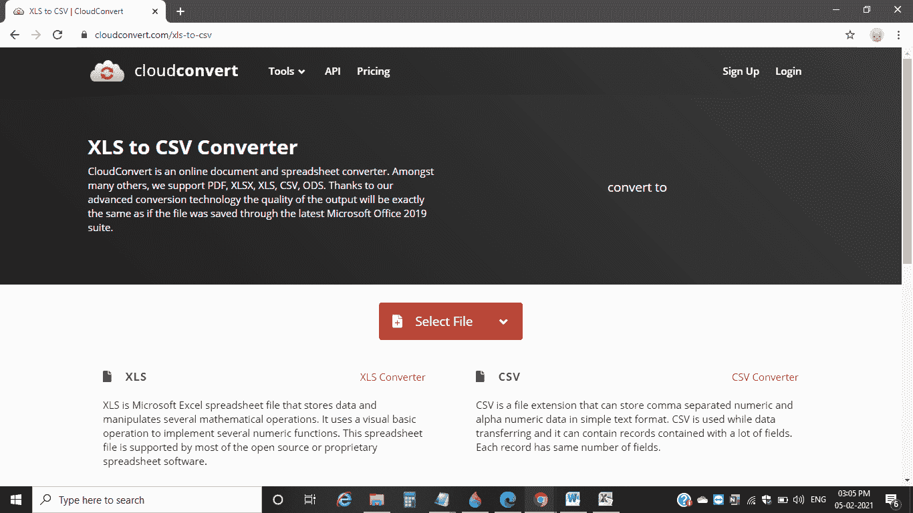

#### 注意:不同网站的主题和外观可能会有所不同，但几乎每个网站或软件的过程都是一样的。

**第五步:**点击**选择文件**选择一个要转换成 CSV 文件格式的 Excel 文件，点击**打开**。相同的快照如下所示:

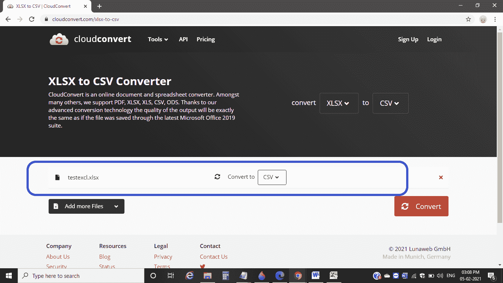

**第六步:**它会要求选择一种格式，您希望将所选文件转换成这样的格式，我们有以下显示的格式:

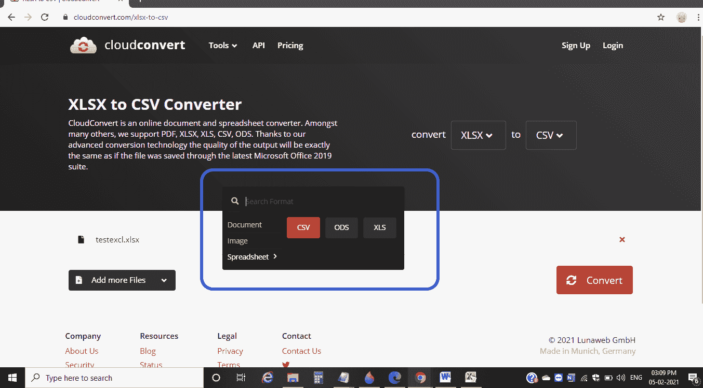

由于我们需要将选定的 excel 文件转换为 CSV，因此无需进行任何更改，然后单击“转换”，如下图所示:

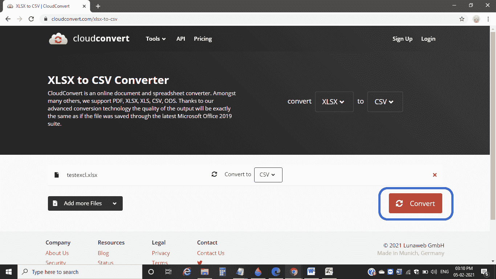

**第七步:**只要点击**转换**按钮，文件将开始上传并转换为 **CSV** 格式，转换成功后，它将开始自动下载，或者让您点击**下载**按钮下载转换后的文件，如下图所示:

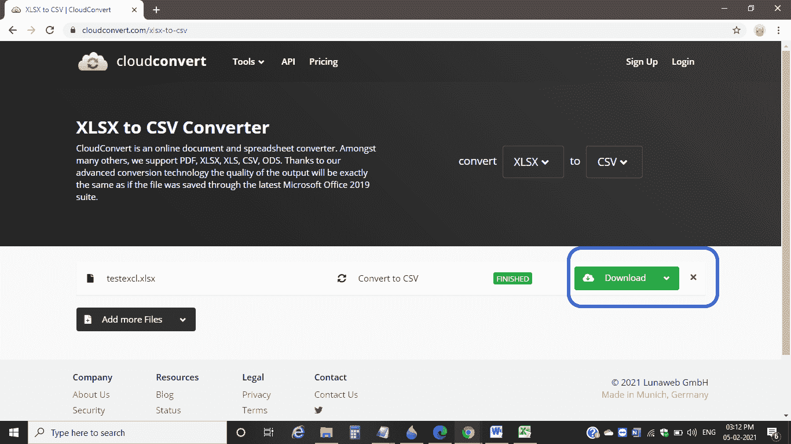

**第八步:**转换后的文件会下载到你默认的**下载**文件夹，你可以在那里找到你的文件。

这些是将 excel 工作表转换为 CSV 文件格式的方法。

* * *