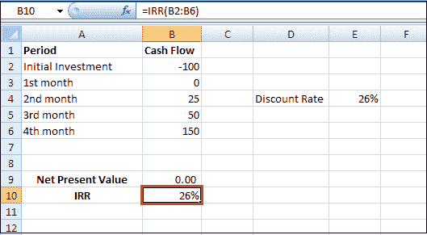

# 如何在 Excel 中计算内部收益率？

> 原文：<https://www.javatpoint.com/how-to-calculate-irr-in-excel>

在 Excel 中，内部收益率函数是一个财务函数，它定期返回一系列现金流的内部收益率。

### 什么是内部收益率？

内部收益率是使净现值等于零的贴现率。当内部收益率只有一个值时，当比较不同投资的盈利能力时，这个标准变得更加有趣。在 [Excel](https://www.javatpoint.com/excel-tutorial) 中，内部收益率的计算公式如下:

```

=IRR(values,[guess])

```

内部收益率函数使用以下参数:

**1。值(必需参数):**这是一组代表现金流系列的值。现金流包括投资和净收入价值。值可以是对包含值的单元格区域的引用。

*   值参数应该至少包含一个 ***正值*** 和一个 ***负值*** 来计算收益的内部收益率。
*   如果数组或引用参数包含逻辑值、空单元格或文本，则忽略这些值。
*   Excel 中的 IRR 根据价值解释现金流的顺序；数值应该按照 ***的顺序*** 排列。
*   现金流不一定必须是均匀的，但它们必须定期出现在*上，例如每月、每季度或每年。*

 ***2。猜测(可选参数):**这是用户猜测的接近预期内部收益率的数字(因为内部收益率可以有两个解)。

*   Excel 使用迭代技术来计算内部收益率。从猜测开始，内部收益率循环计算，直到结果精确到 0.00001%以内。假设 IRR 在 20 次尝试后找不到有效的结果，那#NUM！返回错误值。
*   在大多数情况下，您不需要为内部收益率计算提供猜测。如果省略猜测，则假设为 0.1 或 10 %。
*   假设内部收益率给出了#NUM！错误值，或者如果结果不符合您的预期，请使用不同的猜测值重试。

### 电子表格中的内部收益率函数

用数学计算内部收益率的问题是，必要的计算既复杂又耗时。

基于数学的解决方案包括在试错的基础上使用各种猜测利率计算每个现金流金额的净现值。然后，将这些净现值加在一起。使用多个利率重复这个过程，直到您找到产生总和为零的净现值的确切利率。产生零和净现值的利率已经宣布了内部收益率。

为了简化这个过程，Excel 提供了三个计算内部收益率的函数。与使用基于数学的公式方法相比，每种方法都是更好的选择。这些 Excel 函数是:

1.  **IRR 函数:** IRR 函数计算一系列现金流的内部收益率，假设付款期大小相等。
2.  **XIRR 函数:**XIRR 函数计算更精确的内部收益率，因为它考虑了不同大小的时间段。
    要使用此功能，您必须提供现金流金额和支付这些现金流的具体日期。
3.  **MIRR 函数:**MIRR 函数(修正后的内部收益率)的工作原理与 IRR 函数类似，不同之处在于它还考虑了借入初始投资资金的成本以及通过再投资每个现金流获得的复利。
    MIRR 函数足够灵活，可以适应借贷和投资现金的不同利率。由于 MIRR 函数计算项目收益或现金短缺的复利，因此产生的内部收益率通常与内部收益率或 XIRR 函数产生的内部收益率有很大不同。

### 如何计算内部收益率

要了解如何在 excel 中使用内部收益率函数，请执行以下步骤:

假设你经营一家企业已经三个月了，现在你想算出你现金流的回报率。

**第一步:**将初始投资输入 B2 细胞。既然是外发支付，那就需要一个 ***负*** 号。

在初始投资下方或右侧的单元格中键入后续现金流。这笔钱是通过利润进来的，所以我们把这些输入为 ***正*** 数字。

这是创建的报告，我们希望在月底盈利。


贴现率等于 10%。这是最佳替代投资的回报率。

**第二步:**在 Excel 中使用 NPV 函数计算一系列现金流的现值，并减去初始投资。

```

=NPV(E4,B3:B6)+B2

```


正净现值表示项目的回报率超过贴现率。换句话说，把你的钱投资到这个项目上比把你的钱以 10%的利率存入储蓄账户要好。

**第三步:**下面的 IRR 函数计算项目的**内部收益率**。


**第四步:**内部收益率是使净现值等于零的折现率。你需要用 15%来代替 E4 手机 10%的折扣率。


净现值为 0 表示项目产生的回报率等于贴现率。换句话说，把你的钱投资到一个项目中，或者以 15%的利率把你的钱存入一个高收益的储蓄账户，会产生相等的回报。

### 现值

让我们假设另一个项目需要 100 卢比的初始投资。我们预计第二个月底的利润为 25 卢比，第三个月底为 50 卢比，第四个月底为 152.09 卢比，如下所示:


**第一步:**现在用 NPV 函数计算这个项目一系列现金流的现值。


**第二步:**IRR 函数计算这个项目的内部收益率。


**第三步:**同样，内部收益率是使净现值等于零的折现率。你需要用 39%来代替 E4 手机 15%的折扣率。


净现值为 0 表示项目产生的回报率等于贴现率。换句话说，你把钱投资在这个项目上，或者把钱存入一个高收益的储蓄账户，利率为 39%，收益相等。

**第四步:**首先，我们计算每个现金流的现值(Pv)。接下来，我们将这些值相加，如下所示。


您也可以将 17.95 卢比存入第一个月的储蓄账户，25.77 卢比存入第二个月的储蓄账户，56.28 卢比存入第三个月的储蓄账户，利率等于内部收益率(39%)，而不是在这个项目上投资 100 美元。

### 内部收益率规则

内部收益率规则规定，如果内部收益率大于要求的收益率，你可以接受这个项目。内部收益率值经常被用来比较投资。在下面的例子中，我们以 A 和 B 两个不同的项目为例。

**第一步:**IRR 函数计算项目 a 的内部收益率。


如果要求的回报率等于 15%，你应该接受这个项目，因为这个项目的内部收益率等于 32%。

**第二步:**IRR 函数计算项目 b 的内部收益率。



一般来说，较高的内部收益率意味着较好的投资。因此，项目 A 是比项目 b 更好的投资。

* * **