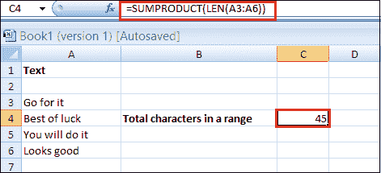
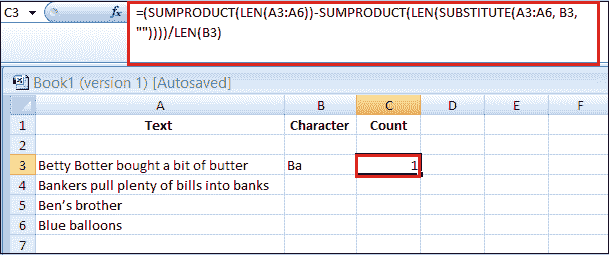

# 如何在 Excel 中计算字符

> 原文:[https://www.javatpoint.com/how-to-count-characters-in-excel](https://www.javatpoint.com/how-to-count-characters-in-excel)

Excel 是用来处理数字的。因此，您始终可以选择三种方式之一来执行任何数字计数操作。

Excel 也有一些文本函数，可以在您处理文本数据时提供帮助。在某些情况下，您可能需要计算单元格中的字符总数或特定字符在单元格中出现的次数。

如果你想知道如何在 [Excel](https://www.javatpoint.com/excel-tutorial) 中计数字符，你需要使用公式 ***=LEN(cell)*** 来计算一个单元格中的字符总数，从而使用 ***LEN*** 函数。以及 ***SUMPRODUCT*** 函数和 ***LEN*** 函数的组合，用于计算一个范围内的字符总数，公式为***= SUMPRODUCT(LEN(range))***。

此外，单元格中特定字符的计数和单元格中字符的特定组合解释如下:

1.  计算单元格中的字符总数
2.  计算一个范围内的字符总数
3.  计算单元格中的特定字符
4.  统计范围内的特定字符
5.  统计单元格或区域中特定的字符组合

### 计算单元格中的字符总数

如果你想得到一个单元格中所有字符的总数，你可以使用 LEN 函数。

LEN 函数接受一个参数，可以是双引号中的文本，也可以是对带有文本的单元格的单元格引用。

```

=LEN(text)

```

该函数计算一个单元格中的字符总数，包括空格、标点符号和符号，不管它们在一个字符串中出现多少次。

例如，假设您有如下所示的数据集，并且您想要计算每个单元格中的字符总数:


LEN 函数将计算一个单元格中的所有字符，如特殊字符、数字、标点符号和空格字符。这就是为什么有时如果单元格中有多余的空格，可能会得到错误的结果。

例如，LEN 函数为单元格 A3 中的文本返回 9，而它应该是 7。但是因为它也计算额外的空格字符，你得到了错误的结果。

如果我们想计算一个单元格中的总字符数，不包括空格，将需要公式 LEN 和 DELETE 的组合。以下公式不包括文本中的空格。

```

=LEN(SUBSTITUTE(text, old_text, new_text, [instance_num]))

```


之后用 LEN 函数很容易统计出字符总数，最终结果是 7 个字符，文本中没有任何空格。

### 计算一个范围内的字符总数

使用 SUMPRODUCT 和 LEN 函数的组合来计算定义范围内的字符总数。

每当我们处理多个单元格或数组时，SUMPRODUCT 函数的使用是一个优雅的解决方案。

```

=SUMPRODUCT(LEN(range))

```

例如，假设您有相同的数据集，这一次，您想知道整个范围内有多少字符，而不是获取每个单元格中的字符数。



函数的 LEN 部分取整个单元格范围，并计算每个单元格的字符数。当你使用 SUMPRODUCT 函数时，它会把所有这些数字相加。

### 计算单元格中的特定字符

除了字符总数之外，Excel 中还有一个选项可以统计特定字符的出现次数。

要计算特定字符在单元格中出现的次数，可以使用基于“替换”和“透镜”函数组合的公式。该单元格包含以下公式:

```

=LEN(cell)-LEN(SUBSTITUTE(cell, "character", ""))

```

例如，您有以下数据集，并且您想要计算定义的单元格 A3 中特定字符(即“b”)的数量。


在上面的例子中，A3 代表单元格地址，“b”代表您想要在文本中计数的字符。

*   LEN 函数用于计算 A3 单元格中的字符总数。
*   replacing 函数用于通过用空字符串替换字符“b”来删除 A3 单元格中出现的所有字符。
*   从原始文本的长度中减去文本中没有“b”字符的文本长度。
*   然后从 LEN(A3)中减去 LEN(代入(A3，“b”，”)的结果。这给出了字符“b”在单元格 A3 中出现的次数。

#### 注意:Excel 函数是区分大小写的函数。

例如，单元格 A3 包含 5 个出现的“b”，两个大写，三个小写。如果你在上面的公式中为替换函数提供了“B”，它会给出一个不同的计数。


在最终结果中，该函数不计算小写字符。

**下、上箱体**

计算没有区分大小写标准的字符的解决方案是使用 UPPER/LOWER 函数，其中所有字符将被转换为大写或小写，并且该函数将变得不区分大小写。

在下面的示例中，函数 LOWER 被嵌套到 replace 函数中，将单元格 A3 中的所有字符串都改为小写，因为条件被定义为小写的“b”:

```

=LEN(cell)-LEN(SUBSTITUTE(UPPER(cell), "character", ""))

```


另一种使函数不区分大小写的解决方案是使用与 LEN 函数相结合的双嵌套替换函数。

在下面的示例中，计数字符将在特定的单元格中，因为有时每次编写来计数公式中的字符是不切实际的，尤其是在处理复杂的范围和公式时。

具有双重嵌套替代函数的公式:

```

=LEN(cell)-LEN(SUBSTITUTE(SUBSTITUTE(cell, LOWER(character), ""), UPPER(character), ""))

```


这个公式看起来可能很复杂，但是下面会一步一步地解释。

*   首先，我们希望从文本中删除小写计数字符:= replace(A3，LOWER(B3)，"")
*   放入一个 LOWER 函数将计数字符翻译成小写，然后 replaces 函数将小写字符替换成空字符串。
*   从定义的文本中消除大写计数字符。这是通过嵌套的 replace 函数解决的:= replace(replace(A3，LOWER(B3)，"")，UPPER(B3)，" ")。
*   在第一个 replaced 函数中，小写字符被替换为空字符串。在第二个 replaced 函数中，大写的计数字符被替换为空字符串，导致文本中没有计数字符“B”和“B”。
*   现在，LEN 函数计算修改后文本的字符数。
*   在最后一步中，计算出的公式结果(没有“B”和“B”的文本)将减去定义单元格中的字符总数。

### 统计范围内的特定字符

每当您处理单元格区域和数组时，SUMPRODUCT 函数必须结合其他函数。为了对一个范围内的特定字符进行计数，对于区分大小写的计数，使用了三个函数的组合:SUMPRODUCT、LEN 和 replace。对于不区分大小写的计数，应该添加额外的公式:UPPER/LOWER。

例如，考虑下面的数据集，您希望计算字符“b”在定义的范围(区分大小写的版本)中出现的次数。

这个公式和解释数数字符的公式差不多。区别来自于嵌套在 SUMPRODUCT 函数和计数区中的 LEN 函数，而不是单元格定义的单元格范围:

```

=SUMPRODUCT(LEN(A3:A6))-SUMPRODUCT(LEN(SUBSTITUTE(A3:A6, B3, "")))

```


对于定义范围内不区分大小写的字符计数，我们可以使用以下公式:

```

=SUMPRODUCT(LEN(A3:A6))-SUMPRODUCT(LEN(SUBSTITUTE(SUBSTITUTE(A3:A6, LOWER(B3), ""), UPPER(B3), "")))

```


#### 注意:无论何时处理单元格区域，都必须使用 SUMPRODUCT 函数。对于范围内区分大小写的字符计数，需要函数组合:SUMPRODUCT、LEN 和 replace，对于不区分大小写的计数，需要函数组合:SUMPRODUCT、LEN、replace 和 UPPER/LOWER。

### 统计单元格或区域中特定的字符组合

也有可能在定义的单元格或范围内计算特定的字符组合。在上面的例子中，我们用区分大小写和不区分大小写的替代方法来覆盖单元格或区域中的单个字符计数。

**在一个单元格中**

计算字符组合的公式是相同的。只是我们要用字符组合中的字符数来除。

对于 ***不区分大小写的*** 版本，公式为:

```

=(LEN(B3)-LEN(SUBSTITUTE(SUBSTITUTE(B3;LOWER(B6);"");UPPER(B6);"")))/LEN(B6)

```


上述公式与计算单个字符相同。只是我们必须用我们正在计算的特定字符数来划分正则公式。最后的结果是 2，意思是“Te”在文本中出现了两次。

而对于 ***区分大小写的*** 版本公式将如下所示:

```

=(LEN(A3)-LEN(SUBSTITUTE(A3, B3, "")))/LEN(B3)

```


文本中有两个“bo”字符组合，一个大写，另一个小写。但是这个公式区分大小写。这就是为什么最终结果给出 1。

**在一定范围内**

计算一个范围内的字符组合与计算单个字符具有相同的逻辑，对于 ***区分大小写的*** 版本公式如下:

```

=(SUMPRODUCT(LEN(A3:A6))-SUMPRODUCT(LEN(SUBSTITUTE(SUBSTITUTE(A3:A6, LOWER(B3), ""), UPPER(B3), ""))))/LEN(B3)

```


在单元格 A3:A6 的范围内，找到了“把”字符的两种组合。

在 ***不区分大小写的*** 版本中，公式如下:

```

=(SUMPRODUCT(LEN(A3:A6))-SUMPRODUCT(LEN(SUBSTITUTE(A3:A6, B3, ""))))/LEN(B3)

```



在上面的示例中，A3:A6 范围内只出现大写“把”字符的一种组合。

* * *