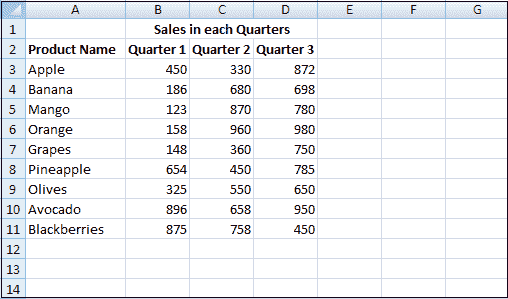
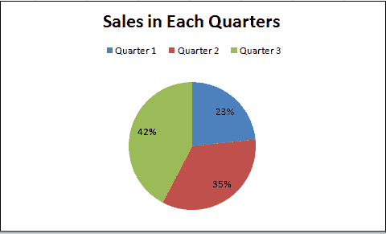

# 如何制作 Excel 表格

> 原文:[https://www.javatpoint.com/how-to-make-an-excel-sheet](https://www.javatpoint.com/how-to-make-an-excel-sheet)

电子表格是一个基于网格的文件，旨在组织信息和管理任何个人或企业数据计算。电子表格在用 excel 维护庞大的数据库方面发挥着重要作用。世界各地的人们都使用电子表格来创建表格，以满足任何个人或业务需求。

微软办公软件和办公软件 365 都有电子表格，用户可以在其中创建电子表格。这里 MS office 是一个内部部署的应用程序，其中 Office 365 基于云。

有 400 多个功能和许多特性，如 ***【透视】【着色】【图形】【图表】******条件格式*** 等等。这使得它成为用户的最佳选择。

该工作簿是“电子表格”的 Excel 术语。MS [Excel](https://www.javatpoint.com/excel-tutorial) 用这个术语强调一个工作簿可以包含多个工作表，每个工作表都有自己的 ***数据网格、图表*** 和 ***图形*** 。

然而，电子表格已经从简单的网格发展到强大的工具，例如在一张纸上执行大量计算的数据库或应用程序。您可以使用电子表格来确定一段时间内您的抵押贷款付款，或者计算资产折旧及其对企业税收的影响。

您也可以将几个工作表之间的数据组合起来，并在彩色编码的表格中可视化，以便于理解。有了所有的新功能，使用电子表格程序对新用户来说可能是令人生畏的。

### 电子表格的主要功能

当我们打开 excel 工作表屏幕时，我们可以看到以下功能:

**1。基本应用功能**

从左到右，随着这个顶部的绿色横幅，你会发现图标，如:重新打开*创建工作簿*页面；保存您的工作；撤消上次执行的操作，并显示记录的操作。重做已撤消的步骤，并选择更多工具。

**2。丝带**

在功能区中，我们有几个选项卡可以使用。这个灰色区域称为功能区，包含用于输入、操作和可视化数据的工具。

有些选项卡侧重于特定功能。默认情况下，选择主页。点击 ***插入*** 、**页面布局**、**公式**、**数据**、**查看**或 ***查看*** 选项卡，显示每个选项卡独有的一组工具。

**3。公式栏**

excel 中的公式栏是查看公式或选定单元格或活动单元格的值的平台。

例如，如果选择了单元格 A1，并且我们在单元格 A1 中有一个值，我们可以在公式栏中看到相同的值。

**4。列标题**

如您所见，每一列都有自己的标题，字母字符分别代表每一列。

**5。行标题**

字母表表示列标题，类似地，行标题由从 1 开始的数字表示。在 Excel 的最新版本中，我们有超过 100 万行。

**6。电子表格区**

默认情况下，工作区是一个网格。这是我们工作的地方。列和行的组合形成一个单元格，即一个矩形框。

每个单元格由一个唯一的单元格地址标识，该地址由一个列标题和一个行标题组成。对于第一个单元格，列标题为 A，行标题为 1，因此第一个单元格地址为 A1。

**7。工作表标签**

这是您可以在工作簿中找到不同工作表的地方。每个工作表都有自己的选项卡，您可以给自己命名。这些对于分离数据非常有用，这样一张表就不会太大。

例如，您可能有一个年度预算，其中每个月是一列，每行是一种费用。不是每一年都保存它，而是在一张纸上跟踪它，然后水平滚动。您可以将每个选项卡设置为不同的年份，仅包含 12 个月。

**8。查看选项**

左侧图标为 ***【正常】*** ，显示了上图中出现的工作表。中间的图标是 ***页面布局*** ，它将您的工作表分成类似打印时的页面，并带有添加标题的选项。右边的图标代表一个 ***分页符预览*** ，你可以通过点击和拖动来调整分页符的位置。

带有“-”和“+”的滑块用于缩放级别。向左或向右拖动滑块以放大或缩小。

这是 excel 电子表格的概述。现在我们将看到如何使用这个电子表格。

### 如何创建电子表格？

假设您想创建一个电子表格来计算不同季度产品的简单销售单。2020 年每个季度都有一些产品和每种产品的销售。以下是在 Excel 中轻松创建报表的步骤:

**第一步:**在系统中打开 ***MS Excel*** 。

**第二步:**进入菜单，选择 ***新增*** 按钮。

**第三步:**点击 ***空白工作簿*** 创建一个简单的工作表。

**或者可以使用快捷键，**按 Ctrl + N 创建新的工作簿或电子表格。

**第 4 步:**工作簿是包含电子表格的文档的名称。

**步骤 5:** 这将创建一个名为**工作表 1** 的空白电子表格，您将在工作表底部的选项卡上看到。

**第 6 步:**转到电子表格工作区。

**步骤 7:** 通过将单元格从 B1 合并到 D1，在第一行中为每个季度的销售额创建标题，在第二行中，给出产品名称和每个季度的名称，如下所示。

**第 8 步:**现在在 ***产品名称*** 栏输入完整的产品名称。

**第九步:**并在每款产品前提供每个季度的销售数据。

**第 10 步:**在下一行，为 Total 放一个表头，计算每个季度的总销售额。

**第 11 步:**现在应用求和函数计算每个季度的总额。应用单元格 B13、C13 和 D13 中的函数。

Excel 最有用的功能之一是它能够根据数学公式查找数据和执行计算。

公式总是以等号(=)开头，后跟函数名(例如，=SUM)。之后，应该在一组括号()之间输入参数。按照以下步骤在 Excel 中为每个季度的销售额自动插入 Sum 函数:

*   点击屏幕顶部的 ***【公式】*** 选项卡。
*   您可以在面板应用程序顶部的工具栏中看到几个标记为“函数库”的图标。
*   选择 B13 单元格。
*   并点击函数库中的 AutoSum 图标。

**第 12 步:**sum 函数计算每个季度的总和。

**第 13 步:**那么让我们通过单击 Excel 功能区中的$按钮来转换($)货币符号的销售值。

**步骤 14:** 现在创建一个结果表，其中包含每个季度的产品总销售额。

**步骤 15:** 现在绘制饼图，以看起来易于理解的专业方式表示客户的数据。

*   选择结果表。
*   在 Excel 功能区点击 ***插入*** 选项卡。
*   再次点击 ***饼图*** 图表图标。

饼图创建了一个简单的可视化以及表格的设置方式。该图表的标题为“每个季度的销售额”，每个美元金额将显示为带有必要标签的饼图的百分比。

**第 16 步:**完成报告后保存文件。要保存文件，

*   点击左上角的*文件菜单。*
**   然后选择 ***【另存为】*** 按钮。根据您的 Excel 版本，您通常会选择将文件保存到您的计算机上。*   现在选择您要在计算机上保存报告的文件位置。*   并点击 ***保存****

 *这是 excel 电子表格的基本介绍。Excel 有各种各样的工具可以使用。

* * **