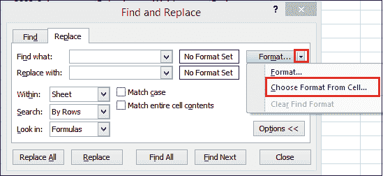

# 如何在 Excel 中替换单词？

> 原文：<https://www.javatpoint.com/how-to-replace-words-in-excel>

在处理海量 Excel 数据时，定位特定信息或数据可能既困难又耗时。

在 Excel 中，您可以使用 ***【查找】*** 和 ***替换*** 功能来搜索工作簿中的内容，例如特定的数字或文本字符串。您可以定位搜索项以供参考，也可以用其他内容替换它。

您可以在搜索词中包含通配符，如 ***问号、波浪号、星号*** 或 ***数字*** 。您可以按行和列搜索，在注释或值中搜索，以及在工作表或整个工作簿中搜索。

### 如何使用查找功能

以下步骤向您展示了如何在一系列单元格、工作表或整个工作簿中查找特定的字符、文本、数字或日期。

考虑一个例子，在这个例子中，我们使用查找命令在这个列表中找到一个特定的部门。


**步骤 1:** 选择要替换文本或数字的单元格区域。若要替换整个工作表中的字符，请单击活动工作表中的任何单元格。

**第二步:**进入 ***首页*** 选项卡，点击功能区编辑组中的 ***查找&选择*** 按钮。

或者按 Ctrl + F 快捷键打开 [Excel](https://www.javatpoint.com/excel-tutorial) ***查找替换*** 对话框。


**第三步:**将出现 ***查找并替换*** 对话框。


**第四步:**在 ***找到什么*** 框中，输入你要找的字符(文字或数字)。

**第五步:**点击 ***查找全部*** 或 ***查找下一个*** 。如果找到内容，您将选择包含该内容的单元格。


点击 ***【查找下一个】*** 时，Excel 选择工作表中第一个出现的搜索值；第二次单击选择第二个匹配项，依此类推。

当您单击 ***【全部查找】*** 时，Excel 会打开一个所有事件的列表，您可以单击列表中的任何项目来导航到相应的单元格。


**第六步:**完成后，点击 ***关闭*** 退出查找替换对话框。

**查找对话框中的附加选项**

要微调您的搜索，请单击 Excel 右上角的 ***选项******查找&替换*** 对话框。它允许执行以下任务，例如:


*   要在当前工作表或整个工作簿中搜索指定值，请在 内的 ***中选择工作表或工作簿***
*   要从活动单元格开始从左到右(逐行)搜索，请在 ***搜索*** 中选择“按行”要从上到下(逐列)搜索，请选择“按列”。
*   要在特定数据类型中搜索，请在 ***中选择 ***公式、值*** 或 ***注释*** 在*** 中查找
*   对于区分大小写的搜索，请勾选 ***匹配大小写检查*** 。
*   要搜索只包含您在 ***中输入的字符的单元格，请选择 ***匹配整个单元格内容*** 。***

#### 注意:如果要在某个范围、列或行中查找给定值，请在 Excel 中打开*查找和替换*之前选择该范围、列或行。例如，将您的搜索限制在特定的列，首先选择该列，然后打开*查找和替换*对话框。

### 如何使用替换功能

有时，您可能会发现您在整个工作簿中反复犯了一个错误，例如拼错了某人的名字，或者您需要将一个特定的单词或短语换成另一个。可以使用 Excel 的 ***【查找并替换】*** 功能快速修改。

要替换 Excel 工作表中的某些字符、文本或数字，请使用 Excel ***中的 ***替换*** 选项卡查找&替换*** 对话框。您需要遵循以下步骤:

**步骤 1:** 选择要替换文本或数字的单元格区域。若要替换整个工作表中的字符，请单击活动工作表中的任何单元格。

**第二步:**转到 ***主页*** 选项卡，点击查找&选择按钮并选择替换功能。

或者按 Ctrl + H 快捷键，打开 Excel ***查找替换*** 对话框的 ***替换*** 选项卡。


如果您刚刚使用了 Excel 查找功能，则切换到 ***替换*** 选项卡。

**第三步:**在 ***找到什么*** 框中，写下要搜索的值。并在 ***替换为*** 框中，键入要替换的值。


**第四步:**现在，点击 ***替换*** 逐个替换找到的事件，或者点击 ***全部替换*** 一次性替换所有条目。


**第五步:**完成后，点击 ***关闭*** 退出查找替换对话框。

#### 注意:如果出现问题，并且您得到的结果与您预期的不同，请单击“撤消”按钮或按 Ctrl + Z 恢复原始值。

### 用无替换数据

要将特定值的所有出现替换为无，请在 ***【找到什么】*** 框中键入要搜索的字符，将 ***替换为*** 框留空，然后单击 ***【全部替换】*** 按钮。


### 如何在 Excel 中查找或替换换行符

要用空格或任何其他分隔符替换一个*换行符，在 ***中输入换行符，通过按 Ctrl + J 找到什么*** 文件。这个快捷键是字符 10(换行符或换行符)的 ASCII 控制代码。*

 *按下 Ctrl + J 后， ***查找什么*** 框第一眼看上去是空的，但仔细一看，你会注意到一个微小的闪烁点，如下图截图所示。在 ***替换为*** 框中输入替换字符，如空格字符，点击 ***【全部替换】*** 。


要用换行符替换某个字符，请执行相反的操作-在 ***框中输入当前字符，在 ***框中输入*** 框中的换行符(Ctrl + J)替换为*** 。

### Excel 查找并替换为通配符

在搜索条件中使用通配符可以自动执行 Excel 中的许多查找和替换任务:

*   使用 ***【星号】*** (*)查找任意字符串。例如， ***Ro**** 找到“ ***罗伯特*** ”和“ ***罗尼*** ”。
*   使用 ***问号*** (？)来查找任何单个字符。比如 ***？ose*** 找到“ ***Rose*** ”和“ ***Jose*** ”。

例如，要获取以“***【Ro】***”开头的名字列表，请使用“***【Ro ****”作为搜索标准。此外，使用默认选项，Excel 将在单元格中的任何位置搜索条件。

在我们的工作表中，它将返回在任何位置都有“***【Ro】***”的所有单元格。要防止这种情况发生，请单击 ***选项*** 按钮，并选中 ***匹配整个单元格内容*** 框。这将强制 Excel 只返回以“***【ad】***开头的值，如下图截图所示。


如果需要在 Excel 工作表中查找实际的星号或问号，请在它们之前键入波浪号字符(~)。

例如，要查找包含星号的单元格，您可以在 ***中键入 ***~**** 找到什么*** 框。要查找有问号的单元格，使用 ***~？*** 作为你的搜索标准。


如下图所示，Excel 成功地在文本和数值中找到并替换了通配符。


### 如何更改工作表中的单元格格式

Excel Replace 允许您更进一步，更改工作表或整个工作簿中所有单元格的格式。您必须遵循以下步骤:

**第一步:**点击 ***查找选择*** 按钮，选择 ***替换*** 功能。

**第二步:**点击**选项**按钮。


**第三步:**点击**格式**按钮。


并指定要查找或替换的格式。点击**确定**按钮。


**或**

在 ***旁边找到*** 框，点击 ***格式的箭头*** 按钮。



**第四步:**选择 ***从单元格*** 中选择格式，点击任意一个要更改格式的单元格。

**第五步:**在 ***替换为*** 框旁，点击 ***格式*** 按钮，使用 Excel ***替换格式*** 对话框设置新格式，或者点击 ***格式*** 按钮的箭头，选择 ***从单元格*** 中选择格式，点击任意一个需要格式的单元格。


假设要替换整个工作簿上的格式，在*框内选择 ***工作簿*** 。如果要仅替换活动工作表中的格式，请保留默认选择。*

 ***第六步:**最后点击 ***替换全部*** 按钮，验证结果。


因此，它用选定的红色字体背景替换了整个第一行背景。

#### 注意:此方法更改手动应用的格式。它不适用于条件格式单元格。

### 高级查找和替换功能

在 Excel 中，高级查找和替换用于查找和替换所有打开的工作簿中的加载项。以下 ***【高级查找和替换】*** 功能使 Excel 中的搜索更加强大，例如:

*   在**中查找并替换所有打开的工作簿**或选定的工作簿&工作表。
*   **在值、公式、超链接和注释中同时搜索**。
*   **我们正在将搜索结果**导出到新工作簿。

按照以下步骤在 Excel 中运行高级查找和替换外接程序:

**第一步:**点击 Excel 功能区图标，该图标位于 ***智能工具*** 选项卡上。

**第二步:**进入 ***搜索*** 组，点击查找替换按钮。也可以按 Ctrl + Alt + F，甚至可以配置成用熟悉的 Ctrl + F 快捷键打开。


将打开“高级查找和替换”窗格，您可以执行以下操作:

*   在 ***中输入要搜索的字符(文本或数字)找到什么***
*   选择要搜索的工作簿和工作表。默认情况下，所有打开的工作簿中的所有工作表都处于选中状态。
*   选择要查找的数据类型:值、公式、注释或超链接。默认情况下，选择所有数据类型。
*   选择 ***匹配大小写*** 选项查找区分大小写的数据。
*   选择 ***【整个单元格】*** 复选框以搜索精确和完整的匹配，即查找仅包含您在 ***中键入的字符的单元格查找什么***


**第三步:**点击 ***查找全部*** 按钮，会在 ***搜索结果*** 选项卡上看到找到的条目列表。

**第 4 步:**现在，您可以用其他值替换所有或选定的出现，或将找到的单元格、行或列导出到新工作簿。

**第五步:**点击 ***替换全部*** 按钮。


**第六步:**点击 ***导出全部*** 按钮或根据需要选择。


因此，它会创建一个结果工作簿，如下所示。


### Excel 中的替换函数

Excel 中的 REPLACE 函数允许您将文本字符串中的一个或多个字符与另一个字符或一组字符交换。下面是 Replace 函数的基本语法。

```

REPLACE(old_text, start_num, num_chars, new_text)

```

Excel REPLACE 函数有四个参数，它们都是必需的。

1.  **Old_text:** 原始文本或对包含要替换部分字符的原始文本的单元格的引用。
2.  **Start_num:** 想要替换的 old_text 中第一个字符的位置。
3.  **Num_chars:** 要替换的字符数。
4.  **New_text:** 替换文本。

#### 注意:如果 start_num 或 num_chars 参数为负数或非数字，Excel Replace 公式将返回错误(#VALUE！).

* * ***