# 如何在 Excel 中按日期排序

> 原文:[https://www.javatpoint.com/how-to-sort-by-date-in-excel](https://www.javatpoint.com/how-to-sort-by-date-in-excel)

Excel 内置的排序选项是强大而有用的工具，但它们在排序日期时并不总是正确工作。在 Excel 中，我们必须有单一格式的日期来排序数据

约会。您也可以使用 Excel 排序选项来重新排列整个表格，而不仅仅是一列。

### 按升序或降序对日期进行排序

按日期对 [Microsoft Excel](https://www.javatpoint.com/excel-tutorial) 中的数据进行排序，最简单的方法是按时间顺序或反时间顺序排序。这将根据您的偏好，从最晚的日期开始对数据进行排序。要对日期进行排序，请执行以下步骤:

**第一步:**转到 ***数据*** 菜单选项卡，在 ***排序&过滤*** 类别下。

**第二步:**选择 ***排序*** 选项。

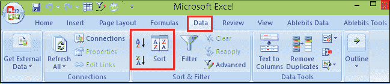

还有另一种方法可以在标题中应用过滤器。然后从“日期”列的下拉列表中，选择“最新到旧”或“反之亦然”，以便在 excel 中对日期进行排序。

**第四步:**如果要从最早到最新排序日期，选择 ***最早到最新*** 按钮。

**第五步:**将出现 ***排序警告*** 对话框。保留默认的 ***展开选择*** 选项选中，点击 ***排序*** 按钮。

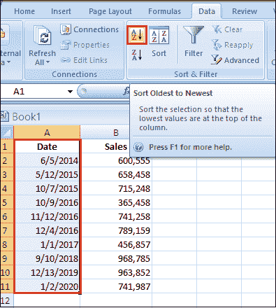

因此，这将首先带来旧的日期，并将最新的日期推到底部。

**第六步:**如果你想从 ***最新到最老*** 的日期排序，那就这样做。

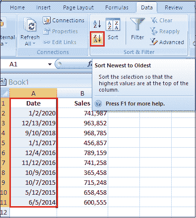

因此，这将把最新的日期放在首位。并将旧日期推到数据的底部。

### 如何在 Excel 中按月排序

假设你想**按月**排序日期，忽略年份，比如把同事分组或者亲戚分组纪念日。在这种情况下，默认的 Excel 排序功能将不起作用，因为它总是考虑年份，即使您的单元格被格式化为仅显示月或月和日。

解决方案是添加一个帮助列，提取月号，并按该列排序。要从日期中获取一个月，请使用 ***【月】*** 功能。

在下面的示例中，我们使用以下公式从 B2 的日期中提取月号:

```

=MONTH(B2)

```

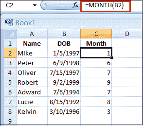

#### 注意:如果结果显示为日期而不是数字，则将*常规*格式设置为公式单元格。

**第一步:**现在，按 ***月*** 列排序你的表。

**第二步:**选择月份号(C2:C8)，点击 ***排序&过滤*** ，选择 ***排序最小到最大*** ，当 Excel 要求你这样做时，展开选择。如果一切正确，您将获得以下结果:

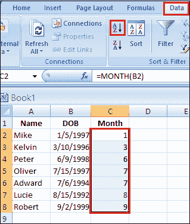

数据现在按月排序，忽略每个月内的年和日。

### 如何按月和日对生日排序

为生日日历安排日期时，最佳解决方案是按月和日对日期进行排序。所以，如果你有一个公式可以从出生日期中提取月和日，这将会有所帮助。

在这种情况下，使用 Excel ***【文本】*** 函数，将日期转换为指定格式的文本字符串。对于我们的功能，“mmdd”或“mm.dd”格式代码将起作用。

在下面的示例中，我们使用以下公式从 B2 的日期中提取月和日:

```

=TEXT(B2, "mm.dd")

```

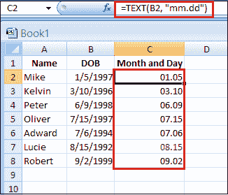

接下来，将 ***【月】和*** 列从大到小排序，您将拥有按每月天数顺序排列的数据。

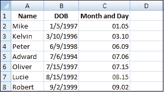

使用下面给出的 ***【日期】*** 公式可以得到相同的结果:

```

=DATE(2000, MONTH(B2),DAY(B2))

```

这个公式通过从 B2 的实际日期中提取月和日，并用一个假日期 2000 替换整年，生成一个日期列表。

想法是让所有日期都是同一年，然后按时间顺序对日期列表进行排序。由于年份相同，日期将按月和日排序，这与上面的结果完全相同。

### 如何按星期几排序

要按工作日对数据进行排序，您需要一个帮助列。在这种情况下，请使用***【WEEKDAY】***公式，该公式返回与一周中的某一天相对应的数字，然后按辅助列排序。从星期日(1)到星期六(7)开始的一周使用以下公式。

```

=WEEKDAY(A2)

```

如果您的一周从周一(1)开始到周日(7)，您可以使用以下公式:

```

=WEEKDAY(A2, 2)

```

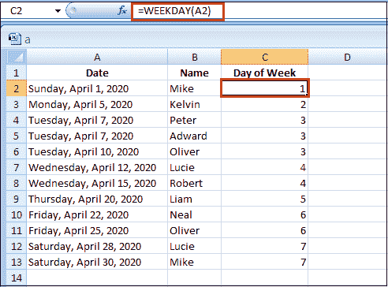

如果工作日名称输入为*，而不是日期，则使用自定义排序功能。*

 *### 如何按月/工作日名称对数据进行排序

如果您有一个月名列表作为 ***文本*** ，而不是在日期格式中只显示月。应用 Excel 的升序排序可能会有问题，因为它将按字母顺序排列月份名称，而不是按 1 月到 12 月的月顺序排序。在这种情况下，您需要使用自定义排序功能，并遵循以下步骤。

**第一步:**选择要按月名排序的记录。

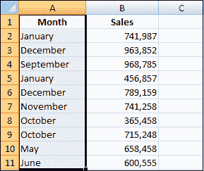

**第二步:**点击 ***数据*** 选项卡，转到 ***排序&过滤*** 组，点击 ***排序*** 按钮。

**第三步:**在 ***排序*** 对话框中，执行以下操作:

*   首先，选择继续当前选择，然后点击 ***【排序】***
    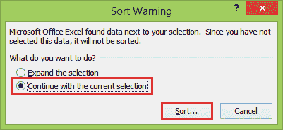
*   在 ***列*** 下，选择包含月份名称的列的名称。
*   在 ***排序开启*** 下，选择 ***单元格值*** 。
*   在*下，选择 ***自定义列表*** 。*

*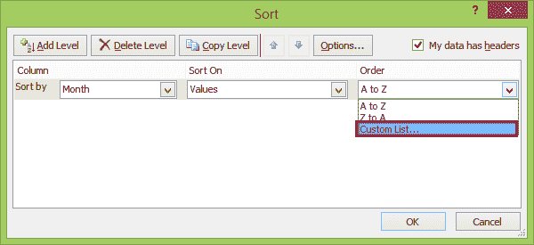

**第 4 步:**再次显示自定义列表对话框，根据月份在工作表中的排列方式，您可以选择完整的月份名称(*1 月、2 月、3 月*、…)或简称(*1 月、2 月、3 月* …)。

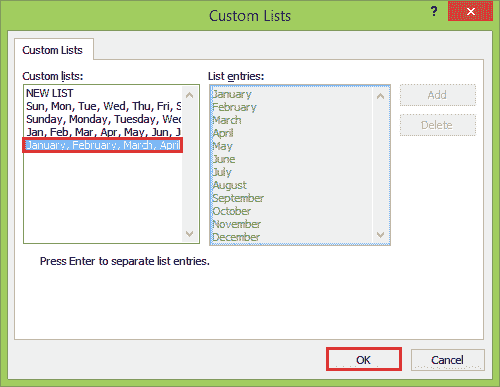

**第五步:**点击 ***确定*** 两次关闭两个对话框。

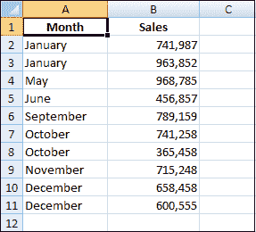

因此，数据是按年月顺序排序的，而不是按字母顺序。

同样，要按星期名称排序，请在 ***自定义列表*** 对话框中选择全名(*星期日，星期一，星期二*，…)或短名称(*太阳，星期一，星期二* …)。

### 如何按日期自动排序

在 excel 中， ***排序*** 功能不是动态的。这意味着每当有新信息添加时，您都必须对数据进行重新排序。有两种方法可以做到这一点，如**T5【宏】T6**和**T9【公式】T10**。

### 1.使用宏自动排序日期

每当工作表中的任何地方发生更改时，都会执行该宏。

假设您的数据在列 A 到 C 中，并且您想要排序的日期在列 C 中。还假设第 1 行包含标题。如果您的记录在不同的列中，请进行以下调整:

*   将 A1 引用更改为目标区域的左上角单元格(包括标题)。
*   将 C2 引用更改为包含日期的最上面的单元格。

```

Private Sub Worksheet_Change(ByVal Target As Range)
           On Error Resume Next
           Range("A1").Sort Key1:=Range("C2"), _
                   Order1:=xlAscending, Header:=xlYes, _
                   OrderCustom:=1, MatchCase:=False, _
                   Orientation:=xlTopToBottom
End Sub

```

如果您正在处理一个包含大量信息的巨大工作表，对工作表中的任何变化进行重新排序都可能会很麻烦。

在这种情况下，将宏的触发限制在特定范围内发生的变化是有意义的。以下 VBA 代码仅在包含日期的 C 列中发生更改时对数据进行排序。

```

Private Sub Worksheet_Change(ByVal Target As Range)
    On Error Resume Next

    If Not Intersect(Target, Range("C:C")) Is Nothing Then
        Range("A1").Sort Key1:=Range("C2"), _
        Order1:=xlAscending, Header:=xlYes, _
        OrderCustom:=1, MatchCase:=False, _
        Orientation:=xlTopToBottom
    End If

End Sub

```

#### 注意:这些宏可用于根据任何数据类型自动排序，而不仅仅是日期。我们的示例代码按升序排序。如果要按降序排序，请将 Order1:=xlAscending 更改为 order 1:= xlAscending。

**2。使用公式自动排序日期**

假设您有一个日期列表，并希望按照时间顺序自动排列在单独的列中，与原始列表并排。您可以通过以下数组公式来实现:

```

=IFERROR(INDEX($A$2:$A$10, MATCH(ROWS($A$2:A2), COUNTIF($A$2:$A$10, "<="&$A$2:$A$10), 0)), "")

```

A2:A10 是原始的(未排序的)日期，包括一些空单元格，用于可能的新条目。

在带有原始日期的列旁边的空白单元格中输入公式，同时按 Ctrl + Shift + Enter 键完成。然后，将公式向下拖动到剩余的单元格中。

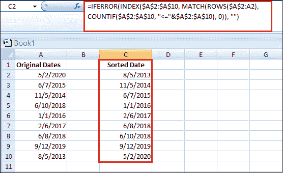

要让新添加的日期自动排序，请确保在引用的范围内包含足够数量的空白单元格。

### 多级数据排序

当您有大量数据集时，可以使用多级数据排序。这意味着您可以基于一列中的值对数据集进行排序，然后基于另一列中的值再次对其进行排序。

例如，假设您有下面显示的数据集，并希望根据两个标准(如国家和销售额)对该数据进行排序。

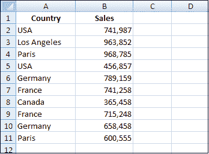

在上面的例子中，我们让数据首先按国家排序，然后在每个国家内，数据进一步按销售额排序。

这可以让我们很快看到哪个国家的销售做得很好，哪个国家做得很差。以下是根据多列对数据进行排序的步骤:

**步骤 1:** 选择要排序的整个数据集。

**第二步:**然后，点击 ***数据*** 选项卡。

**第三步:**点击 ***排序*** 图标。这将打开排序对话框。

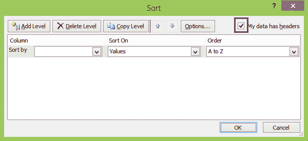

**第 4 步:**在排序对话框中，确保选择了我的数据有标题。如果您的数据没有标题，您可以取消选中此项。

**步骤 5:** 在排序对话框中，进行以下选择:

*   在 ***列*** 下，选择包含国家名称的列的名称。
*   在 上的 ***排序下，选择 ***单元格值*** 。***
*   在 ***顺序*** 下，选择 A 到 z

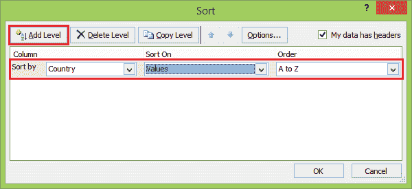

**第六步:**点击 ***添加等级*** 。这将添加另一个级别的排序选项。

**第七步:**在第二级排序中，进行如下选择:

*   在 ***列*** 下，选择包含销售的列的名称。
*   在 上的 ***排序下，选择 ***值*** 。***
*   在 ***顺序*** 下，选择最大到最小。

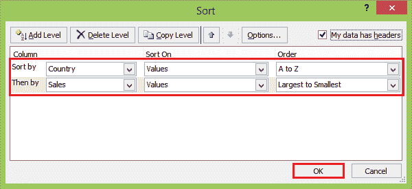

**第八步:**点击 ***确定*** 按钮。

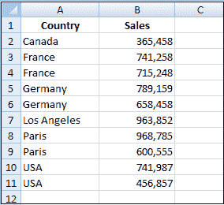

这种排序给出了一个数据集，该数据集根据国家和销售标准将国家按从 A 到 Z 的顺序排序，将销售额按从大到小的顺序排序。

#### 注意:排序对话框有一个“复制级别”的功能。这将快速复制选定的排序级别，然后您可以轻松修改它。这是一个很好了解的特性，可能会节省您的时间，以防您不得不基于多个列进行排序。

* * ***