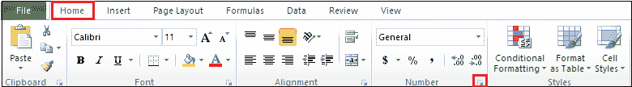

# 如何在 Excel 中隐藏公式

> 原文：<https://www.javatpoint.com/how-to-hide-formulas-in-excel>

当您与其他人共享 Excel 文档时，他们可以对文档中的公式和其他格式选项进行更改。如果您不想在文档中进行更改，则有必要隐藏并保护整个工作表、工作表的某些部分或公式，以便其他用户无法编辑这些工作表。

在 Excel 中隐藏公式之前，我们先来讨论一下如何在 Excel 中显示公式-

默认情况下，当我们点击应用公式的单元格时，公式会出现在**公式栏**中。

要查看单元格中的公式，请转到功能区上的**公式选项卡**，然后单击**公式审核部分下的**显示公式**按钮。**

现在，您可以看到应用的公式出现在单元格上。

### 隐藏公式

在 Excel 中隐藏公式有以下几种方法-

#### 注意:我们使用以下方法在 Microsoft Excel 2007、Excel 2010、Excel 2013、Excel 2016、Excel 2019 以及 Office 365 中显示或隐藏公式。

### 方法 1:隐藏 Excel 中的公式并保护工作表

在[微软 Excel](https://www.javatpoint.com/excel-tutorial) 中，隐藏文档中的公式非常简单，这样别人就看不到你在某个特定的部分使用了哪个公式。

### 在 Excel 中隐藏公式的步骤

下面给出了在微软 Excel 中隐藏公式的分步过程

**第一步:**双击桌面上的微软 Excel 图标，打开微软 Excel 文档。

**注意:**打开新文档转到文件- >新建- >空白文档- >创建或打开现有文档转到文件- >打开- >浏览文件位置- >点击打开按钮。

**第二步:选择或高亮显示**要隐藏公式的单元格。(在我们的例子中，我们想对单元格 B8 隐藏公式)

**第三步:**确保你的微软 Excel 工作表是**未受保护的**。如果您的 Excel 工作表受到保护，请转到功能区上的**查看**选项卡，然后单击**更改**部分下的**取消工作表保护**按钮。

#### 注意:如果您的 Microsoft Excel 工作表已经受到保护，则跳过步骤 3。

**第四步:在选中的单元格上右键**。将出现一个小弹出窗口，点击**设置单元格格式**选项。

#### 注意:您也可以从键盘上按 Ctrl + 1 键来打开格式单元格窗口。

**第五步:**将出现**单元格格式对话框**，选择**编号标签**。要隐藏公式，请单击“单元格格式”对话框中的**保护选项卡**。

**第六步:勾选**隐藏**关联的复选框**，点击**格式单元格对话框底部的**确定**按钮**，如下图所示。

**保护 Excel 表格**

除非保护 Excel 文档，否则隐藏单元格效果无法正常工作。

遵循下面给出的最简单的步骤来保护您的 Microsoft Excel 文档-

**第一步:**在同一个 Excel 文档上，转到功能区的**审核选项卡**。单击**更改**部分下的**保护表**选项卡。

**第二步:**屏幕上将出现一个**保护表**对话框，勾选**选择锁定单元格和选择解锁单元格**复选框。在**解除工作表保护的密码:**部分输入您想要的密码。点击对话框底部的**确定**按钮。

**第三步:**弹出一个小的**确认密码**对话框，在**重新输入密码框中重新输入密码进行**操作，点击屏幕下方的**确定**按钮。

#### 注意:请始终记住您输入的密码，否则，您将无法取消工作表保护。

现在，您可以看到公式隐藏在公式栏中。请看下面给出的截图。

#### 注意:上面提到的步骤保护了整个微软 Excel 文档。

### 仅隐藏 Excel 中的公式(保持其余单元格可编辑)

在前面的方法中，整个文档都受到保护，但是如果您不想保护整个工作表并且只保护包含公式的单元格，请使用以下步骤隐藏公式。

**第一步:**打开一个微软 Excel 文档，在上面输入你想要的数据。

**第二步:**将光标放在包含公式的单元格上。在我们的例子中，细胞 B7 包含一个公式。

**第三步:**现在，您需要禁用所有单元格的**锁定属性**，请按照以下说明操作-

1.单击 Excel 文档左上角的灰色三角形，选择 Excel 文档中的所有单元格。

2.转到功能区上的**主页选项卡**，点击**编号**组中的**对话框启动器图标**。

3.屏幕上会出现一个**单元格格式**对话框。点击**保护标签**。**取消勾选锁定的**复选框，点击设置单元格格式对话框底部的**确定**按钮。

**步骤 4:** 为具有公式的单元格启用**锁定和隐藏**属性-

1.选择或突出显示整个 Excel 文档。

2.转到功能区的**主页选项卡**，点击**编辑组**中的**查找&部分**选项。将出现一个选项列表。点击**转到特殊**。

3.屏幕上将出现**转到特殊对话框**。点击与**公式**相关的单选按钮。点击**确定**按钮。

4.从键盘上按下 **Ctrl + 1** 键。将出现**单元格格式对话框**。**勾选锁定和隐藏复选框**。点击屏幕底部的**确定**按钮。

**第五步:保护 Excel 表格**

1.在同一个 Excel 文档中，转到功能区的**查看**选项卡。点击**变更**部分下的**保护单**标签。

2.屏幕上将出现**保护工作表对话框**，并勾选选择锁定单元格和选择解锁单元格复选框。在**密码中输入您想要的密码以取消工作表保护:第**部分。点击对话框底部的**确定**按钮。

3.弹出一个确认密码的小对话框，在**重新输入密码文本框**中重新输入密码，点击屏幕下方的**确定**按钮。

### 隐藏公式栏

公式栏是 Excel 文档中显示所有公式的地方。

### **使用视图选项卡**隐藏公式栏

在 Microsoft Excel 中，您还可以隐藏公式栏以最大化工作空间，并隐藏我们在文档中用于执行计算的公式。

**隐藏公式栏的步骤**

按照下面给出的最简单的步骤在 Excel 文档中隐藏公式栏-

**步骤 1:** 打开要隐藏公式栏的 Microsoft Excel 文档。

**步骤 2:** 转到功能区的**视图选项卡**并**取消勾选**显示**部分的公式栏**复选框。

现在，您可以看到公式栏隐藏在 Excel 文档中。请看下面的截图-

### 方法 3:使用 Excel 选项隐藏公式栏

Microsoft Excel 还提供了 Excel 选项选项卡来隐藏公式栏。

按照以下步骤使用 Excel 选项隐藏公式-

**第一步:**打开要隐藏公式栏的 Microsoft Excel 文档。

**第二步:**点击 **Office 按钮(在 Excel 2007 中)**或点击文档左上角的**文件选项卡**(在 Microsoft Excel 2010 及以上版本中)

**步骤 3:** 文件选项列表将出现在文档上。点击**选项标签**激活 Excel 选项。

**第 4 步:**将出现一个 Excel 选项对话框，在该对话框中执行以下操作-

1.  点击左窗格中的**高级选项卡**。
2.  **向下滚动**Excel 选项对话框。
3.  **取消勾选显示公式**栏复选框。
4.  点击 Excel 选项对话框底部的**确定**按钮应用更改。

下面的截图显示公式栏隐藏在 Excel 文档中。

* * *