# Excel 中如何将小写改为大写？

> 原文:[https://www . javatpoint . com/如何在 excel 中将小写改为大写](https://www.javatpoint.com/how-to-change-lowercase-to-uppercase-in-excel)

与微软 Word 不同，微软 Excel 没有 ***【变更大小写】*** 按钮来变更大写。但是，[微软 Excel](https://www.javatpoint.com/excel-tutorial) 有三个特殊的功能，可以用来改变文字的大小写。

函数只是为完成特定任务而设计的内置公式。这三个功能分别是***【UPPER】【LOWER】******PROPER***。

**1。上位( )功能**

***upper()*** 功能允许您将文本字符串中的所有小写字母转换为大写字母。

例如，如果您想在单元格 A1 中以大写形式显示单元格 B1，您可以在 B1 中使用下面的函数。

```

=UPPER(A1)

```

**2。降低( )功能**

***lower()*** 功能有助于从文本中排除大写字母。您可以接受任何单元格的值，并将其转换为小写文本。

例如，如果您想在 A1 单元格中以小写文本形式显示单元格 B1，则需要在 B1 中使用下面的函数。

```

=LOWER(A1)

```

**3。正确( )功能**

***professional()***函数将评估所有正确大小写的文本，其中每个单词都以大写字母开头，后跟小写字母。它将每个单词的第一个字母转换为大写，而将其他字母保留为小写(正确大小写)。

通过使用这个函数，您可以轻松地获取任何单元格的值并将其转换为正确的大小写。

例如，如果您想在单元格 A1 中以文本的正确大小写版本显示单元格 B1，那么您需要在 B1 中键入下面的函数。

```

=PROPER(A1)

```

#### 注意:一旦创建了上述任何公式，就可以使用 Excel 填充句柄将函数复制到所需的任意多个单元格中。

### 如何使用 UPPER()函数

在 Excel 中，按照以下步骤将小写文本转换为大写文本。例如，您有根据每个月收集的销售数据。

**步骤 1:** 在包含要转换的文本的列旁边插入一个新列或辅助列，如下所示。

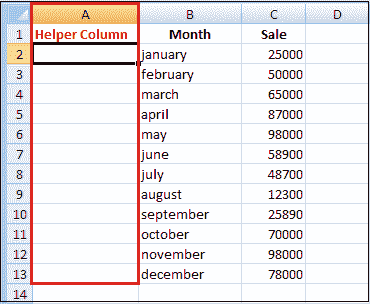

**第二步:**在 A2 列的相邻单元格中输入公式。

```

=UPPER(B2) 

```

B2 是原始列中包含要转换的文本的单元格。

**第三步:**按回车键。

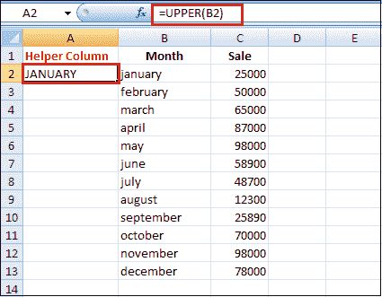

如上图所示，单元格 A2 包含来自单元格 B2 的大写文本。

**第四步:**现在需要将公式复制到辅助列的其他单元格中。

*   选择包含公式的单元格。
*   将鼠标光标移动到小方块或填充选定单元格右下角的手柄，直到看到一个小十字。
    
*   按住鼠标按钮，将公式向下拖动到要应用公式的单元格上。
*   松开鼠标按钮。
    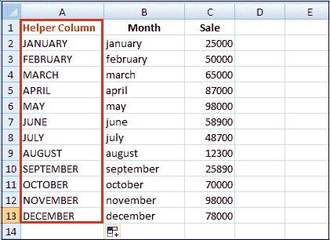

**第五步:**现在，可以移除辅助列了。

因此，您有两列具有相同的文本数据，但情况不同。我想你只会留下正确的。让我们复制 helper 列中的值，然后删除它。

*   突出显示包含公式的单元格，然后按 Ctrl + C 复制它们。
*   右键单击原始列中的第一个单元格。

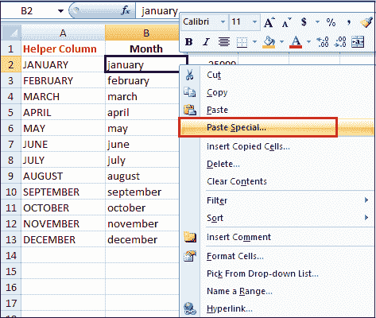

*   点击上下文菜单中的 ***粘贴特殊*** 。
*   并从选项中选择值。
*   点击 ***确定***

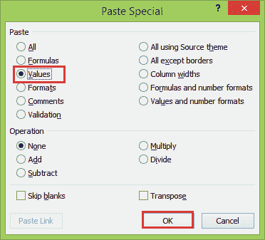

您只需要从“特殊粘贴”对话框中选择文本值选项，以避免以后出现公式错误。

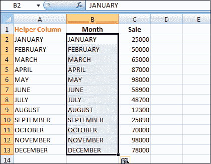

**第六步:**右键点击选中的帮助列，从菜单中选择 ***删除*** 选项。

**第七步:**在 ***删除*** 对话框中选择整列，点击 ***确定*** 按钮。

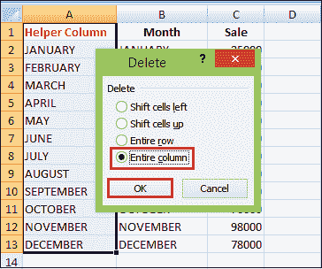

因此，excel 工作表以大写形式提供月份列值，如下所示。

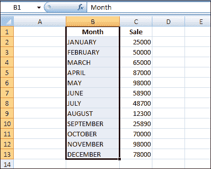

### 使用 Microsoft Word 在 Excel 中更改大小写

如果不想使用 Excel 公式，可以使用特殊命令来更改 word 中的文本大小写。下面是下面的步骤，告诉我们这个方法是如何工作的。

**第一步:**在 Excel 中选择要更改案例的范围。

**第二步:**按 Ctrl + C 或右键选择，从上下文菜单中选择 ***复制*** 选项。

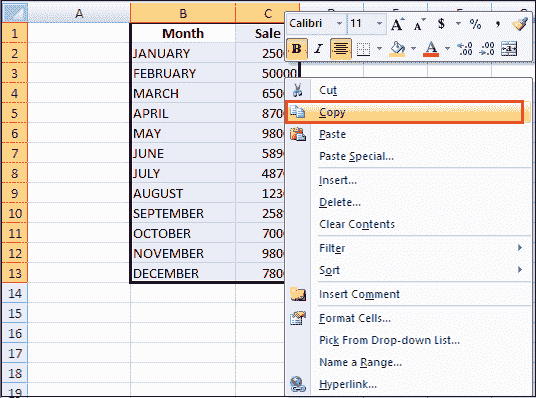

**第三步:**打开一个新的 Word 文档。

**第四步:**在空白页按 Ctrl + V 或右键，从上下文菜单中选择 ***粘贴*** 选项。

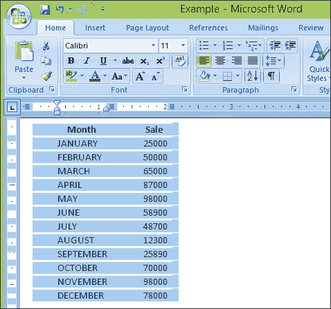

**第五步:**现在，您已经将 Excel 表格输入到 word 中。

**步骤 6:** 突出显示表格中要更改案例的文本。

**第七步:**移至【首页】 选项卡上的 ***字体*** 组，点击 ***变格*** 图标。

**步骤 8:** 从下拉列表中从五个案例选项中选择一个。

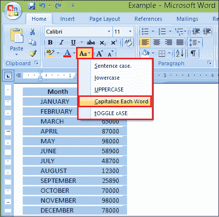

您也可以选择文本并按 Shift + F3，直到应用您想要的样式。使用键盘快捷键，您只能选择大写、小写或句子大小写。

**第 9 步:**现在，您的表格中的文字大小写已转换为 word。复制粘贴回 Excel 即可。

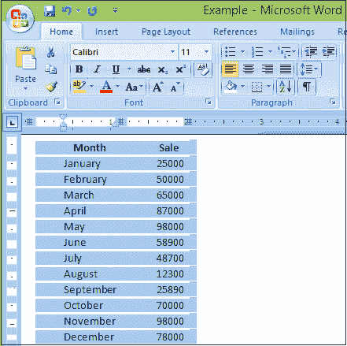

### 使用电池清洁器插件更改案例

看看上面描述的所有方法，你可能仍然认为在 Excel 中没有简单的方法来改变大小写。让我们看看***细胞清洁器****插件可以做些什么来改变这种情况。按照以下步骤应用此方法:*

 ***步骤 1:** 下载外接程序并将其安装到您的系统上。

**第二步:**安装完成后，Excel 中出现新的 ***Ablebits Data*** 选项卡。


**步骤 3:** 选择要更改文字大小写的单元格。

**第四步:**点击 ***启用位数据*** 选项卡上 ***清除*** 组中的 ***变更案例*** 图标。 ***变更案例*** 窗格显示在工作表的左侧。

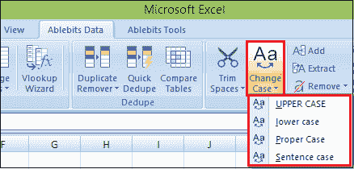

**第五步:**从列表中选择需要的案例。

**第六步:**按 ***换格*** 按钮查看结果。

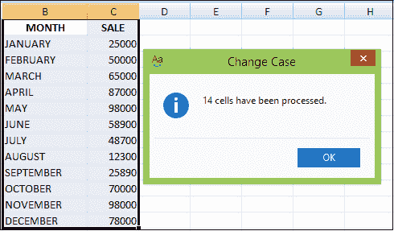

有了 Excel 的 Cell Cleaner，改变案例例程似乎比其他方法舒服得多。

除了更改文本大小写，单元格清理器还可以帮助您将文本格式的数字转换为数字格式，删除 Excel 表格中不需要的字符和多余的空格。

### 如何用宏改变大小写

您也可以在 Excel 2010 和 2013 中使用 VBA 宏来更改大小写。下面是三个简单的宏，它们使 Excel 将文本转换为大写、正确或小写，例如:

1.如果要将文字转换成 ***大写*** ，可以使用下面的 Excel VBA 宏。

```

Sub Uppercase()
    For Each Cell In Selection
        If Not Cell.HasFormula Then
            Cell.Value = UCase(Cell.Value)
        End If
    Next Cell
End Sub

```

2.如果要将大写的 ***改为小写的*** 数据，那么需要将下图所示的代码插入 ***模块***

```

Sub Lowercase()
    For Each Cell In Selection
        If Not Cell.HasFormula Then
            Cell.Value = LCase(Cell.Value)
        End If
    Next Cell
End Sub

```

3.如果要将文本值转换为**正确的**或**标题大小写**，需要使用以下宏。

```

Sub Propercase()
    For Each Cell In Selection
        If Not Cell.HasFormula Then
            Cell.Value = _
            Application _
            .WorksheetFunction _
            .Proper(Cell.Value)
        End If
    Next Cell
End Sub

```

* * **