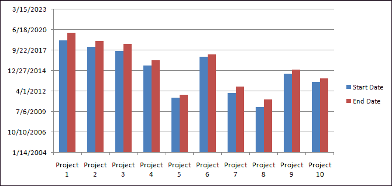

# 如何在 Excel 中创建仪表板？

> 原文：<https://www.javatpoint.com/how-to-create-a-dashboard-in-excel>

**Excel 仪表板是一个可以在一个直观的中心位置跟踪所有业务基本指标、关键绩效指标、指标**和其他数据点的地方。

仪表盘让你对工作有一个**高层次的**看法，快速做出决策，让每个人都了解最新情况。

仪表板是复杂数据的可视化表示，提供了当前状态或性能的实时概览视图。仪表盘由**表格、图表、仪表**和**数字**组成。它们可以用于任何行业的任何目的。

仪表板经常与报告混淆。仪表板可以是报告，但并非所有报告都是仪表板。以下是报告和仪表板之间的主要区别:

*   一份**报告**只会在一个地方收集和显示数据。例如，如果经理想知道过去一段时间的销售额增长情况，以及哪个地区最有利可图，报告不会回答这个问题。这将是所有相关销售数据的简单报告。这些报告然后被用来创建仪表板，这将有助于决策。
*   一个**仪表盘**会立即回答一些重要的问题，比如哪些地区表现更好，管理层应该关注哪些产品。这些仪表盘**可以是静态的，也可以是交互式的，用户可以在其中进行选择和更改视图，数据会动态更新。**

### 仪表板的类型

 中常见的仪表盘类型有三种，如:

**1。战略仪表板:**战略仪表板是一种报告工具，用于监控关键绩效指标的状态，通常由高管使用。战略仪表板背后的数据定期更新，但频率低于运营仪表板。

战略仪表板可以每天查看一次，帮助高管掌握整个业务的关键绩效指标。

**2。分析仪表板:**分析仪表板是一种报告工具，用于分析大量数据，以允许用户调查趋势、预测结果和发现见解。

分析仪表板在商业智能工具中更常见，因为它们通常由数据分析师开发和设计。分析仪表板背后的数据需要准确和最新，并且可能很少更新。

分析仪表板通常包括高级商业智能功能，如**深入**和**临时**查询。

**3。运营仪表板:**运营仪表板是一种报告工具，用于监控经常变化的业务流程，并跟踪关键指标和关键绩效指标的当前绩效。

与其他类型的仪表板相比，数据更新非常频繁，有时甚至是以分钟为单位。

操作仪表盘旨在一天中多次查看。它们经常被用来监控实现目标的进度。

### 创建仪表板前要做的事情

创建 Excel 仪表板是一个多步骤的过程，创建时需要遵循一些事项。即使在 Excel 中，您也需要清楚仪表板的目标。在创建仪表板之前，您必须定义一些要点，例如:

**1。创建仪表板的目的是什么？**

阐明创建仪表板的原因。是为了证明一个观点吗？显示操作的整体状态？还是衡量企业的业绩？

**2。为了实现仪表板的目的，您应该跟踪哪些关键绩效指标或指标？**

为了使您的仪表板更加有效，您必须只突出显示必要的数据。包含不重要的数据只会分散使用仪表板的人的注意力。

**3。谁将使用 Excel 仪表板？**仪表盘是给自己、经理、供应商、主管还是分析师的？您需要构建数据并为将要使用仪表板的人定制仪表板。

4.在那之后，你也将受益于**勾勒你的仪表板结构**。假设您创建了仪表板的框架图，并确定了要放置的关键绩效指标图表或视觉效果以及位置。

5.最后，考虑**将您的原始数据转换为 Excel 表格**。这允许您立即用新信息更新表格，甚至只需点击几下鼠标就可以过滤或重新格式化它们。

### 如何创建仪表板？

下面是在 Excel 中创建仪表板的分步处理器:

**第一步:将数据导入 Excel。**

首先，您必须将数据导入 Excel。可以直接复制粘贴数据，也可以使用***【CommCare】***创建 Excel Connection 导出。

最好的方法是使用***【ODBC】***(或活数据连接器)。它可以将你的应用程序连接到 Excel，将实时数据从你的应用程序传递到 Excel。随着数据在您的应用程序中更新，您的 Excel 仪表板也将更新以反映最新信息。

然后，用另一个选项卡上的原始数据设置一个 Excel 表。使用 Excel 表格，您将能够命名行、列和单元格。这使得以后引用更加容易。

**第二步:设置你的仪表盘标签**

一旦添加了数据，就需要构建工作簿。

*   打开一个新的 Excel 工作簿，创建两到三张工作表。
*   您可以有一张表用于仪表板，一张表用于表格，一张表用于原始数据(您可以隐藏原始数据)。

这将使您的 Excel 工作簿保持有序。

在下面的示例中，我们有三个选项卡，并将仪表板作为第一个选项卡，以便于访问。

**第三步:用原始数据创建表格**

在原始数据表中，导入或复制并粘贴数据。确保信息是表格格式的。这意味着每个项目或数据点都位于一个单元格中。

在下面的示例中，我们添加了项目名称、开始日期、结束日期、持续时间和预算等列。

**第四步:分析数据**

在构建仪表板之前，花一些时间查看您的数据，并找出您想要在仪表板上突出显示的内容。你需要显示所有的信息吗？你想传达什么样的故事？您需要添加或删除任何数据吗？

一旦您必须分析您的数据以反映您的目的，之后您将需要使用不同的 Excel 功能，例如:

*   Excel 公式，如 SUMIF、OFFSET、COUNT、VLOOKUP、GETPIVOTDATA 等
*   数据透视表
*   Excel 表格
*   数据有效性
*   自动形状
*   命名范围
*   条件格式
*   图表
*   Excel 仪表板小部件
*   宏指令

首先弄清楚仪表板的用途，看看需要使用什么工具(特性和功能)来分析数据。

您不需要知道如何使用这些 Excel 工具中的每一个。有了一些图表和数据透视表的基础知识，就可以轻松制作一个 Excel 仪表盘。

**第五步:创建仪表盘**

这一步可以简单地通过在仪表板上插入您需要的图表和视觉效果来总结。

最终结果是一个具有不同视觉效果的电子表格，它将讲述一个关于您的数据的故事，并实现您的仪表板的目的。

考虑在 Excel 中使用作为 Excel 2016 的一部分发布的新图表。如果有时间表的话，你也可以使用*甘特图。或者你可以用一个简单的图表，比如一个 ***条形图*** 。*

 ***添加图表**

我们将添加一个图表来直观地显示您的项目时间表。

**第一步:**进入你的仪表盘，点击 ***插入*** 标签。

**第二步:**在 ***图表*** 部分，点击条形图图标，选择第二个选项。

**第 3 步:**现在，您必须将该条形图链接到原始数据表中的 ***项目名称开始日期*** 和 ***结束日期*** 列。

**更改图表格式**

**步骤 1:** 在你的仪表盘中，点击**插入**并选择你想要制作的图表类型。

**第二步:**右键点击图表，点击**选择**数据。

**第三步:**点击**传奇词条(系列)**中的【添加】。

**第 4 步:**在**系列名称**字段中，单击要添加到原始数据表中的列的标题，然后按回车键。

**步骤 5:** 在**系列值字段**中，选择相应列中的所有数据。按回车键，然后点击**确定**按钮。

如果您的 X 轴标签不正确，则要解决此问题，请单击**水平(类别)轴标签**和原始数据表中的**编辑**，选择您想要在 X 轴上显示的内容。

**第 6 步:**对您想要创建的任何其他图表重复此过程。

现在，您的仪表板表已经创建了所有图表，如下所示:

你也可以 ***在你的视觉效果上增加定制*** 来体现你的品牌。您可以随时更改图表颜色、字体，甚至一点点宏来为仪表板添加样式。

**创建动态图表**

如果您想为您的仪表板添加交互性，您有几个不同的选项。

**1。下拉列表或数据验证列表:**如果你有 Excel 的高级知识，了解 VLOOKUP 和公式，可以使用下拉列表，也称为数据验证列表，来创建交互式图表。

使用此下拉列表，查看者可以选择他们想要过滤的条件，图表将自动更改以反映这些条件。

**2。宏:**可以使用 Excel 的编码语言 Visual Basic 编写一个宏来自动完成任务。

宏可以为您自动执行该过程，而不是手动筛选大量数据并将数据移动到不同的工作表。您也可以使用宏在仪表板上创建一个按钮。

当您单击该按钮并选择特定标准时，所有图表将自动更改以表示这些特定标准。

**3。切片器:**如果要在数据透视表中添加另一层过滤，可以使用切片器。切片器是视觉过滤器，只需单击一下，您就可以过滤数据透视表报表。

切片器包含一组按钮，用于过滤数据并显示您正在查看的过滤器。您可以使用这些切片器来创建交互式图表。设置数据透视表，并为特定筛选器/条件添加切片器。

从数据透视表创建图表，并将切片器移到图表旁边。现在，当您在切片器上选择不同的按钮时，图表将动态变化。

### 须知

尽管下面的一些建议因项目而异，但这些建议通常适用于大多数类型的仪表板。关于创建 Excel 仪表板，需要记住以下几点:

*   **避免在工作簿上使用“NOW”、“TODAY”和“OFFSET”等易变函数**，因为这些函数会降低计算速度。
*   **保持你的仪表盘简单易懂**和直白。添加令人印象深刻的效果和图形可能很诱人，但这样做可能会使您的仪表板难以理解。
*   **避免在仪表盘上插入不必要的视觉效果**。它们会增加空间，只会让你的仪表板看起来很复杂。
*   **使用冻结窗格**，这样仪表板的用户将能够更容易地导航。您可以释放行甚至标题，以便它们始终对用户可见。
*   **为你的仪表盘创建一个用户指南**或者**添加形状或者数字**，这样用户就知道先看哪个视觉了。
*   **使用不同的选项卡**通过对不同的事物使用不同的表格来保持您的仪表板的组织。例如，一个选项卡将保存仪表板本身，另一个选项卡将存储填充仪表板的原始数据。
*   **为重要信息添加提醒**以突出显示仪表板的特定方面或快速传达状态。添加警报或红色、黄色、绿色球。您可以将这些交通灯符号与条件格式一起使用，以便它们根据表格中的值自动更新。

* * **