# 如何在 Excel 中删除重复行

> 原文:[https://www . javatpoint . com/如何在 excel 中删除重复行](https://www.javatpoint.com/how-to-delete-duplicate-rows-in-excel)

[微软 Excel](https://www.javatpoint.com/excel-tutorial) 主要是一个计算工具，它的工作表经常被用作数据库来跟踪库存、制作销售报告或维护邮件列表。

大型数据库出现的一个常见问题是，在处理电子表格、为同一个人创建同一文档的多个副本或在摘要报告中多次计算相同的数字时，会出现许多重复的行。

这可能是一项非常无脑、重复、耗时的任务，但在 Excel 中识别和删除重复行的几种方法使其变得更简单。

使用条件格式查找和突出显示重复数据。这样，您就可以检查重复项，并决定是否要删除它们。

**步骤 1:** 选择要检查是否有重复的单元格。

**第二步:**进入 ***首页*** 选项卡，点击 ***条件格式*** 。

**第三步:**进入 ***高亮单元格规则*** 点击下拉列表中的 ***重复值*** 。

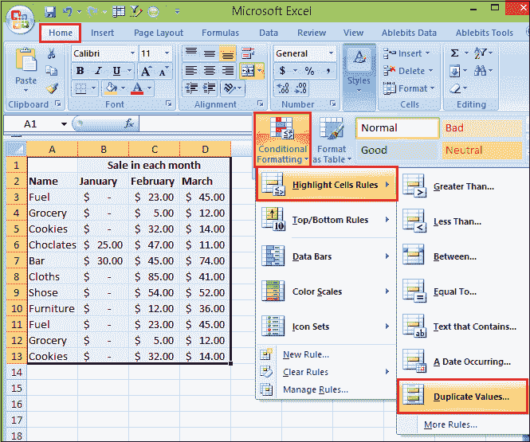

**第 4 步:**然后，出现一个**重复值**框。在带有的**值旁边的框中，选择要应用于重复值的格式。**

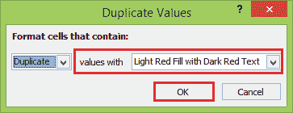

**第五步:**然后点击**确定**按钮。

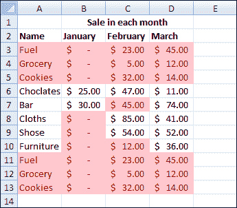

### 使用删除重复命令删除重复行

删除数据中的重复值是一项非常常见的任务。功能区中有一个专门的命令来执行此操作。当您使用**删除重复**功能时，它将永久删除重复数据。

在删除重复数据之前，最好将原始数据复制到另一个工作表中，这样就不会意外丢失任何信息。使用此命令，按照下列步骤删除重复的行。

**步骤 1:** 选择数据中要删除重复数据的单元格。

**第二步:**转到**数据**选项卡。

**第三步:**点击**删除重复项**命令按钮。

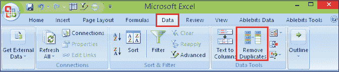

**第 4 步:** Excel 将选择整个数据集，并打开“删除重复项”窗口。

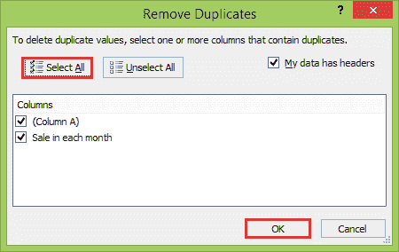

*   您需要告诉 Excel 数据第一行是否包含列标题。如果选中此项，则在查找和删除重复值时将排除第一行数据。
*   此对话框允许您选择数据集的哪些列要包含在重复信息的比较中。
*   然后，您可以选择使用哪些列来确定重复项。如果数据中有一长串列，上面还有方便的 ***【全选】*** 和 ***取消全选*** 按钮可以使用。

**第五步:**一旦确认对话框中的必填字段已勾选，点击 ***确定*** 按钮。

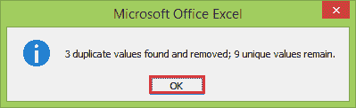

当您按“确定”时，Excel 将删除它找到的所有重复值，并为您提供已删除值和剩余值的汇总计数。

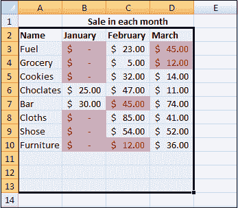

Excel 会根据需要删除重复的行，并且只显示工作表中剩余的唯一记录。

### 使用高级过滤器删除重复项

还有另一种方法可以从功能区中删除数据中的任何重复值。这可以通过高级过滤器来实现。

Excel 高级筛选器有一个选项，允许您筛选电子表格中的唯一记录(数据行)，并将结果筛选列表复制到新位置。

这将为您提供一个数据集，该数据集包含重复行的第一次出现，但不包含任何进一步的出现。按照以下步骤使用 Excel 高级筛选器删除重复行。

**步骤 1:** 选择要删除重复数据的数据。

#### 注意:如果您选择了数据集中的任何单元格，当您激活高级过滤器时，Excel 将自动选择整个数据范围。

**第二步:**进入 ***数据*** 选项卡，点击 ***高级*** 过滤命令按钮。

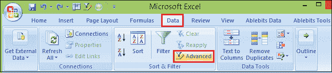

**步骤 3:** 这将打开高级过滤器窗口。

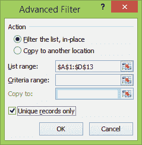

*   您可以选择**就地过滤列表**或**将其复制到另一个位置**。就地筛选列表将隐藏包含任何重复项的行，而复制到另一个位置将创建数据的副本。
*   Excel 会猜测数据的范围，但可以在**列表范围**中调整。
*   **可以将标准范围**留空。
*   如果选择**复制到另一个位置**，则需要填写**复制到**字段
*   仅勾选**唯一记录框**。

**第四步:**点击**确定**按钮，消除重复值。

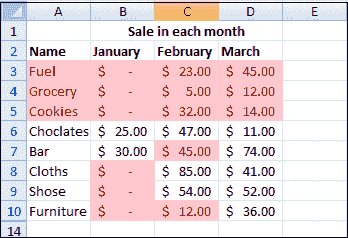

高级过滤器对于消除重复值和同时创建数据副本非常有用。但是高级过滤器只能在整个表上执行这个任务。

### 使用公式删除重复行

只有当单元格内容长度小于 256 个字符时，此方法才有效，因为 Excel 函数无法处理长度超过 256 个字符的文本字符串。

我们将使用一个简单的例子来说明如何使用 Excel 公式来删除电子表格中的重复行。

**步骤 1:** 第一步是在新列中使用串联&运算符将列组合成一列。要输入新单元格的公式是:

```

=A2 & B2 & C2

```

将此公式复制到所有行中，会得到以下电子表格:

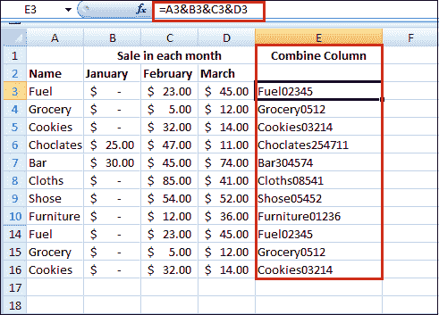

**步骤 2:** 然后在删除这些行之前，突出显示重复值对应的行。

一旦列 A 到 D 的内容被连接到列 E 中，我们需要使用 **COUNTIF** 函数在组合的列 E 中找到重复项。

此函数显示 E 列中每个值的出现次数，仅到当前行。

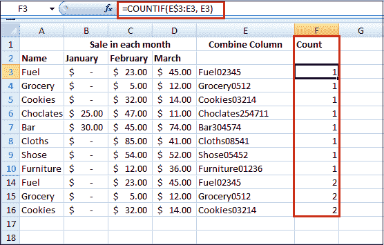

因此，F3 单元格中的公式为文本字符串“Fuel02345”的第一次出现返回值 1，但单元格 F14 中的公式为该文本字符串的第二次出现返回值 2。

**步骤 3:** 一旦我们使用了 **COUNTIF** 函数来突出显示重复的数据，我们需要删除计数大于 1 的行。

在上面的例子中，很容易删除一个重复的行。但是，如果您有几个重复项，您可能会发现使用 **Excel 自动筛选**一次删除所有重复项会更快。

### 使用 Excel 自动筛选删除重复行

以下步骤显示了如何在使用 COUNTIF 函数高亮显示几个重复行后立即删除它们。

**步骤 1:** 选择上例中包含 COUNTIF 函数的 F 列。

或者，如果您选择当前数据集中的任何单元格，当您激活自动筛选时，Excel 将自动选择整个数据范围。

**步骤 2:** 转到**数据**选项卡，点击工作表的**筛选**按钮，将 Excel 自动筛选应用于您的数据。

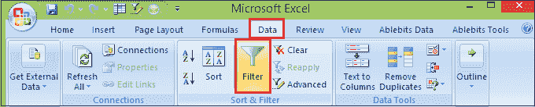

**步骤 3:** 使用 F 列顶部的过滤器选择不等于 1 的行。

**第 4 步:**点击过滤器，从值列表中，取消选中该值。点击 ***确定*** 按钮。

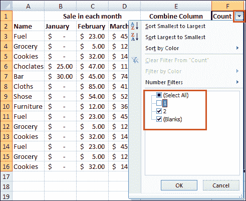

**第 5 步:**现在，将留下一个电子表格，其中每一行的第一次出现都被隐藏。并且只显示重复的行。

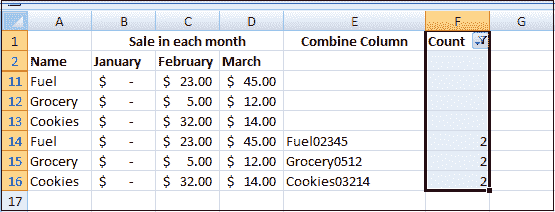

**步骤 6:** 您可以通过高亮显示这些行来删除它们，然后用鼠标右键单击并选择**删除行**。

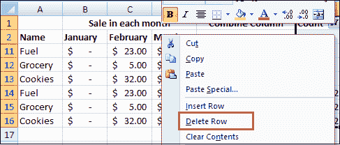

**第 7 步:**移除过滤器，您将留下如下所示的电子表格，其中重复的行已被移除。

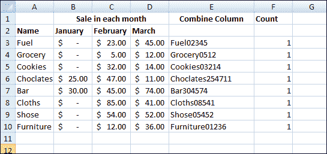

**第 8 步:**现在，您可以删除包含公式的列(工作表中的 E 列和 F 列)以返回到原始电子表格格式。

### 使用透视表删除重复行

数据透视表只是用于分析数据，但您也可以使用它们来删除重复的数据。此方法用于两个目的，从数据中删除重复值或仅显示数据集的唯一值。

按照以下步骤，通过使用透视表从工作表中删除重复的行。

**步骤 1:** 选择数据中的一个单元格或整个数据范围。

**第二步:**进入**插入**选项卡，点击**数据透视表**按钮。

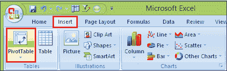

**第三步:**根据你的数据创建一个透视表。

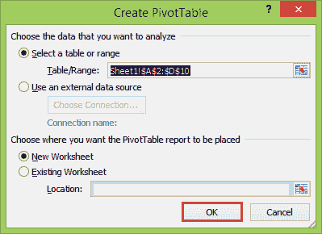

**第四步:**点击【创建数据透视表】对话框中的 ***确定*** 按钮。

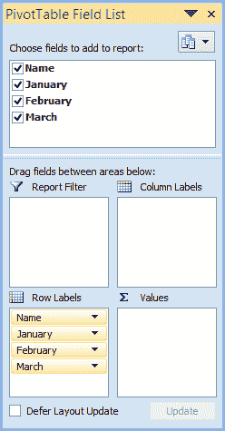

使用新的空白透视表，将所有字段添加到透视表的**行**区域。

**第 5 步:**然后，您需要更改结果透视表的布局，使其采用表格格式。

**第 6 步:**选择透视表后，进入**设计**页签，点击**报表布局**。

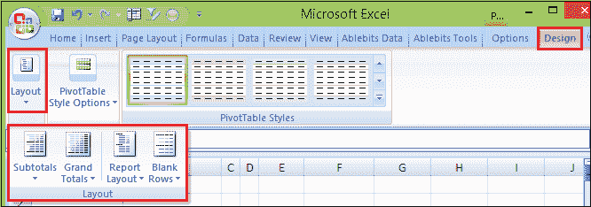

这里有两个选项你需要改变。

*   选择 ***以表格形式显示***
*   选择 ***重复所有项目标签***

**第 7 步:**您还需要从透视表中删除任何小计。

**第八步:**进入 ***设计*** 选项卡，点击 ***小计*** ，然后选择 ***不显示小计*** 。

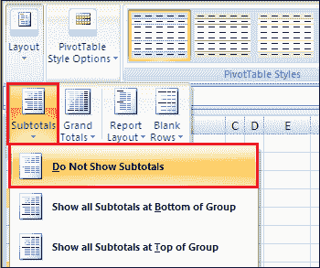

现在您有了一个复制表格数据集的数据透视表。数据透视表仅列出“行”区域中项目的唯一值，因此此数据透视表将自动删除数据中的任何重复项。

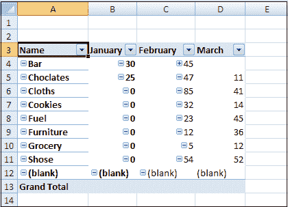

### 使用重复数据消除表工具删除重复行

与内置的 Excel 删除重复项功能不同，Ablebits 重复项删除程序外接程序不仅限于删除重复项。这种多工具结合了所有基本的用例，如**识别、选择、高亮显示、删除、复制**和**移动**唯一或重复的值、绝对重复的行或部分匹配的行，在一个表中或通过比较两个表，有或没有第一次出现。

假设您的系统中安装了我们的终极 Excel 套件，请执行以下简单步骤来消除重复的行或单元格:

**步骤 1:** 选择表格中要**重复数据删除的任意单元格**。

**步骤 2:** 转到**启用位数据**选项卡，点击**快速重复数据消除表**按钮。您的整个表格将被自动选择。

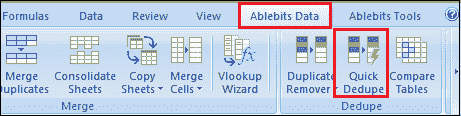

**第三步:**将打开**去重表**对话窗口，默认选择所有列。

*   现在，从**选择动作**下拉列表中选择**删除重复的**。
*   并点击**确定**

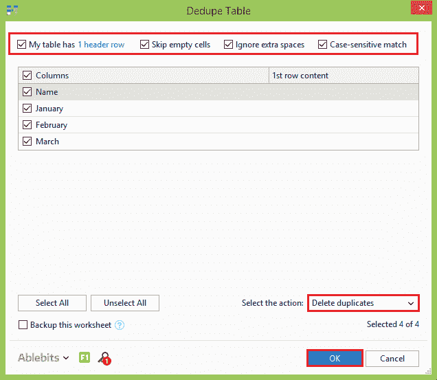

可以看到，除了第一次出现的之外，所有**重复行都被删除。**

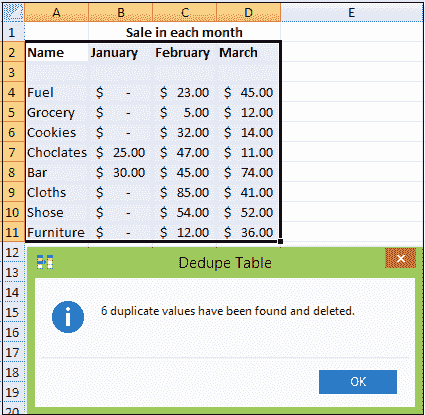

如果您想要**根据键列**中的值删除重复的行，只保留该列被选中，并取消选中所有其他不相关的列。

如果您想**执行一些其他操作**，例如高亮显示重复的行而不删除它们，或者将重复的值复制到另一个位置，请从下拉列表中选择相应的选项。

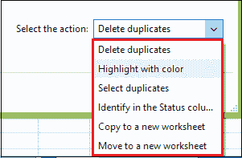

如果您需要更多选项，如删除重复行(包括第一次出现的行)或查找唯一值，请使用提供所有这些功能的**重复项删除向导**。

### 使用删除向导删除重复行

在 Excel 中删除重复项是常见的操作。然而，在每一个特定的情况下，可能有几个特点。虽然重复数据删除表工具侧重于速度，但是**重复数据删除器**提供了几个额外的选项，可以按照您想要的方式对您的 Excel 工作表进行重复数据删除。

**步骤 1:** 选择表格中要删除重复项的单元格。

**第二步:**进入**位数据**选项卡，点击**去重器**按钮。

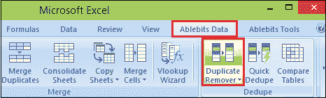

**第三步:**运行**去重器**向导，选择整个表格。外接程序还会建议创建备份副本，因为您将永久删除重复项，所以我们强烈建议您选中此框。确认表格选择正确，点击**下一步**按钮。

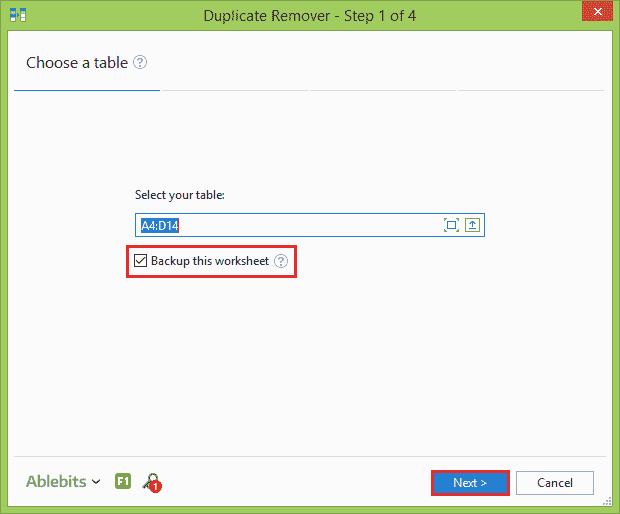

**第 4 步:**选择要查找和删除的记录。

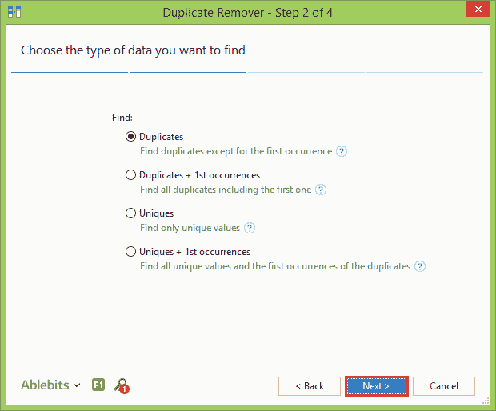

**步骤 5:** 现在，选择要搜索重复项的列。因为我们的目标是消除重复的行，所以一定要选择所有的列。

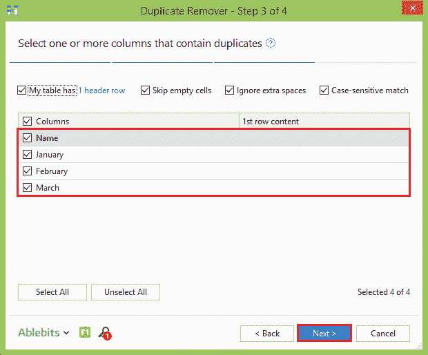

**第 6 步:**最后，选择想要对副本执行的动作，点击 ***完成*** 按钮。

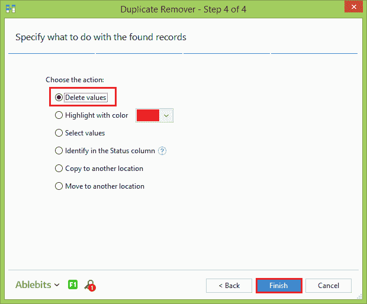

“重复项删除程序”加载项工具会完成它的工作，并通知您找到并删除了多少重复行。


* * *