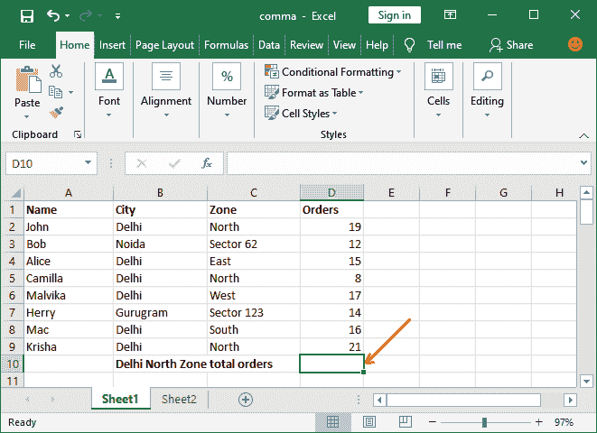

# 如何在 Excel 中使用 sumifs 公式？

> 原文:[https://www . javatpoint . com/使用方法-sumifs-excel 中的公式](https://www.javatpoint.com/how-to-use-sumifs-formula-in-excel)

**SUMIFS** 是 Excel 中使用的一个数学函数，用来得到多准则的单元格的和。它将符合指定标准的单元格数据相加。它是 SUMIF 的替代功能，但具有附加功能。基本上，SUMIFS 是 SUMIF 函数的高级版本。

与 [SUMIF 函数](https://www.javatpoint.com/excel-sumif-function)不同，SUMIFS 允许用户一次应用多个标准，并获得满足指定标准的特定单元格数据的总和。

在本章中，我们将通过示例为您提供 SUMIFS 函数的完整指南。每一步都会被解释，这样你就不会面临任何问题。

### 公式语法

以下是 SUMIFS 函数的语法:

```

SUMIFS(sum_range, criteria_range1, criteria1, criteria_range2, criteria2, . . . criteria_rangeN, criteriaN)

```

该功能允许为此公式输入多达 127 个范围对。

其中参数是-

**求和范围(必需)-** 提供要求和的单元格范围，例如 C2:C15。

**标准 _ 范围 1(必需)-** 提供要应用标准的单元格范围。只是小区范围，比如 B3:B9。

**标准 1(必需)-** 根据指定的标准 _ 范围 1 提供标准进行求和。该值必须在该参数的双引号中传递，即“=北”或“> =50”。

**标准 _ 范围 N，标准(可选)-** N 个额外的单元格范围及其标准。您最多可以传递 127 对，因此它是可选的。

### 返回值

SUMIFS 函数在对单元格的数据求和后返回一个数值。

### SUMIFS 什么时候用？

正如我们已经告诉您的，SUMIFS 函数有助于将单元格数据与多个条件/标准相加。让我们举几个例子，看看这个函数是什么时候使用的。

**例如**

**条件 1:** 如果你也想知道住在德里和北区的人下的订单总数。

```

=SUMIFS(D2:D9,B2:B9,"=Delhi", C2:C9,"=North"

```

**条件 2:** 如果要查找居住在德里的人下的订单总数，订单数量大于等于 15。

```

=SUMIFS(D2:D9,B2:B9,"=Delhi", D2:D9,">=15"

```

这种情况需要一个公式，我们可以将多个标准放在一个公式中并得到结果。现在，我们将展示如何在 Excel 工作表中实际完成。

### 例 1

我们有一个包含一些数据的 [Excel](https://www.javatpoint.com/excel-tutorial) 工作表。该 Excel 表有**名称、城市、区域**和**订单数量**的详细信息。


在这个例子中，我们将找出居住在德里和北区的人下的**订单总数。**

请遵循以下步骤:

**第一步:**创建 Excel 工作表，如上图，学习 SUMIFS 公式的工作。

**第二步:**选择一个你想粘贴计算结果的单元格。



**第三步:**去**公式栏**把 SUMIFS 公式写进去。


**第四步:**在公式栏中复制粘贴以下 SUMIF 公式，得到**居住在德里和北区**的人下的订单总数。

```

=SUMIFS(D2:D9,B2:B9,"=Delhi", C2:C9,"=North"

```


**第五步:**按**回车**键，得到满足指定条件的单元格之和，见下图 Excel 表格中显示的计算结果。


**第六步:**你也可以手动计算，核实住在“**德里北区**的人的订单总数是 48 单。


现在，您已经验证了 SUMIFS 函数工作正常，并且选择了所有正确的参数来获得相应的结果。

## 比较运算符在 SUMIFS 函数中的使用

SUMIFS 函数还允许在其中使用比较运算符(如、<=, > =)。我们可以使用这些运算符对单元格求和，同时在 Excel 数据上放置一个标准范围。基本比较运算符是-

< =(小于等于)

>(大于运算符)

> =(大于等于)

### 例子

现在，我们将再举一个例子来计算具有多个标准的单元格的总和。我们将向您展示比较运算符在 SUMIFS 函数中的使用。

我们将使用与上述示例中相同的 Excel 工作表。该 Excel 表由**名称、城市、区域**和**订单数量**明细组成。


在这个例子中，我们将找出居住在德里的人下的**订单总数，并且下超过 15 个订单**。

请遵循以下步骤:

**第一步:**如上图创建 Excel 工作表，学习 SUMIFS 公式的工作。

**第二步:**选择一个你想粘贴计算结果的单元格。


**第三步:**去**公式栏**把 SUMIFS 公式写进去。


**第 4 步:**复制并粘贴公式栏中的以下 SUMIF 公式，得到居住在德里且订单数量大于等于 15 的**总订单。**

```

=SUMIFS(D2:D9,B2:B9,"=Delhi", D2:D9,">=15")

```


**第五步:**按**回车**键，得到满足指定条件的单元格之和，见下图 Excel 表格中显示的计算结果。


**第 6 步:**你也可以手动计算，验证结果，因为居住在“**德里**的人，订单总数是 88，下单超过 15 个。


现在，你已经验证了结果。您可以看到两个结果是相同的，这意味着 SUMIFS 函数工作正常，并且您已经选择了所有正确的参数。

## SUMIFS 函数中通配符运算符的使用

通配符运算符就是这样的运算符(如*和？)用于实现 SUMIFS 函数中的某些特定目的。这些操作与比较运算符不同，但目的几乎相同。

在 SUMIFS 函数的 criteria 参数中使用这些通配符运算符允许用户找到相似但不准确的匹配项。基本通配符运算符是-

***(星号)-**

该运算符称为星号运算符，用于查找任何字符序列。基本上，它用于部分搜索。它可以在部分搜索数据的条件之前、之后或中间使用。例如，

**abc* -** 表示字符串以 abc 开头，后面跟任何文本。

***abc -** 表示以 abc 结尾的字符串。

***abc* -** 表示字符串中必须包含一定的文本(abc)。

***(问号)-**

这是另一个通配符运算符，称为问号运算符。与星号(*)运算符不同，它引用任何单个字符。例如，如果我在像 **M 这样的字符串之间使用这个字符？r** ，这个可以搭配三月，火星，马克，或者其他任何东西。

**比如**，=SUMIFS(D2:D9，B2:B9，“=D*”，D2:D9，“Mar？”)指的是所有实例都以**三月**开始，以最后一个可以变化的字母结束。

**如果给定的数据包含一个星号或一个实际的问号怎么办？**

有时，数据已经包含星号或问号符号。这时就出现了一个问题——通配符将如何使用。在这种情况下，我们建议您在问号前面使用一个波浪号(~)运算符。只需在问号前键入~即可。

## 带有 SUMIFS 函数的命名范围

您也可以在 SUMIFS 函数中提供命名范围。基本上，它是 Excel 工作表中单元格集合的描述性名称。

## 常见问题

当传递错误的参数或值不正确时会发生什么。

| 问题 | 描述 |
| 结果值为 0，而不是预期的结果数据。 | 确保必须在双引号内传递 criteria1，2，N 参数值。 |
| 当 Sum_range 的值为真或假时，结果不正确。 | 当 Sum_range 参数包含“真”或“假”值时，它们的计算方式不同。 |

## SUMIF 对 sumif

SUMIF 和 SUMIFS 都是 Excel 中使用的数学函数，通过对单元格数据指定一些条件来对单元格数据进行求和。但是它们之间有很大的差异，这使得它们彼此不同。

1.  **SUMIF** 只允许在同一数据内基于关联标准对数据求和，而**SUMIF**功能允许在 Excel 中应用多个标准。这意味着用户可以一次应用多个标准来获得特定单元格数据的总和。
2.  使用 SUMIF 功能，用户只能评估一个条件，而**SUMIF**允许同时使用多个标准。
3.  **SUMIFS** 可称为 SUMIF 的高级版本，可从 **Excel 2007** 中获取。

* * *