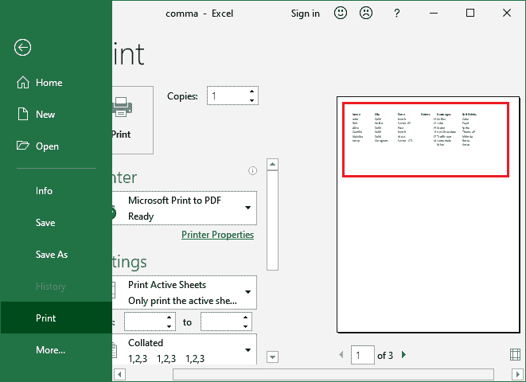

# 如何在 Excel 中添加分页符？

> 原文：<https://www.javatpoint.com/how-to-add-page-break-in-excel>

在打印之前，可以将一张 Excel 表分成多个页面/部分。用户可以使用 Excel 的分页符功能将 Excel 电子表格分成几部分。分页符是 Excel 电子表格中用来将数据分成不同部分的分隔线。

#### 注意:分页符可以垂直和水平插入。

[Excel](https://www.javatpoint.com/excel-tutorial) 自动处理分页符，但有时需要手动管理分页符，以便在垂直分页符中按照您想要的方式插入。

本章将描述使用两种不同方法在 Excel 工作表中插入分页符的每个步骤。每种方法都同样重要。你可以使用任何你觉得简单易行的方法。

### 什么是分页符？它是如何使用的？

分页符通常用于 Excel 电子表格中，当您想要将一个 Excel 工作表数据分成不同的部分或由几个表数据组成的单个 Excel 工作表时。如果用户不希望在页面上打印某一行，分页符会给予他们控制权。

为了分隔这些数据，使用了分页符，以便阅读和理解时变得清晰。

分页符是标记每页边缘的分隔线。您也可以垂直插入分页符**和水平插入分页符**。Excel 分页符有助于用户分析打印 Excel 工作表时分页符将出现的位置。****

 ****### 分页符的属性

*   您可以在 Excel 工作表中添加任意数量的分页符。
*   Excel 允许在 Excel 工作表中插入垂直和水平分页符。
*   添加到 Excel 工作表中的所有分页符都可以一次删除，也可以逐个删除。

## 分页符类型

Excel 提供两种类型的分页符:

1.  实线分页符(手动添加)
2.  虚线分页符(自动添加)

**实线分页符**手动添加到 Excel 电子表格中。如果您想根据自己的需要获得打印结果，需要手动插入实线分隔符。

Excel 自动将列中的**虚线分页符**添加到可见区域。添加任何水平或垂直分页符时，虚线分页符会自动垂直插入到 Excel 工作表中。

## 如何在 Excel 中插入分页符？

在 Excel 中，可以通过两种方式插入分页符:一种是使用**分页符**功能，另一种是使用**页面** **预览**。这两种方法都将使用实线分隔符。请详细查看这两种方法。

## 1.使用分页符功能插入分页符

实际上，这是插入分页符最简单的方法之一。在 Excel 功能区中，您会在**页面布局**菜单中找到一个**断点**选项。从这里，您可以在 Excel 工作表中插入分页符。

### 水平分页符

水平分页符在选定的行单元格正下方插入实线。我们将使用与上一个示例中相同的 Excel 文件。

**步骤 1:** 要将水平分页符插入到 Excel 电子表格中，请选择要添加分页符的行的第一个单元格。**例如**，对于第 9 行，选择 A9 单元格。

**第二步:**转到 Excel 菜单栏上的**页面布局**，在**页面设置**部分下会出现**断点**选项。

**第三步:**点击该分页符下拉按钮，在此选择**插入分页符**。

**第 4 步:**可以看到，在这个 Excel 电子表格中，选中的单元格上方已经成功插入了一条灰色实线(水平分页符)。

按 **Ctrl + P** 快捷打印键打印预览带有分页符的 Excel 工作表如果使用水平分页符，数据将如何打印。

在这里，在打印预览中，您可以看到 Excel 工作表已经来自所选行(水平方向，但不是垂直方向)。

### 垂直分页符

现在，我们将对这个 Excel 表格应用垂直分页符，以获得所需的打印结果。垂直分页符在选定的列单元格之前插入虚线。要将垂直分页符插入到 Excel 电子表格中，请执行以下步骤:

**第 5 步:**选择要从中断开表格数据的列的第一个单元格。**例如**，对于 E 列，选择 E1 单元格。

**第六步:**在 Excel 菜单栏中，转到**页面布局**选项卡，在**页面设置**部分下，您将获得一个名为**断点**的选项。

**第 7 步:**点击该分页符下拉按钮，在此选择**插入分页符**。

**第 8 步:**可以看到在选中的列单元格旁边已经成功插入了一条灰色虚线(垂直分页符)。

现在，按 **Ctrl + P** 快捷打印键打印预览带有分页符的 Excel 工作表，如果使用水平分页符，数据将如何打印。

您可以看到，由于垂直分页符，直到 D 列的数据都显示在这里。所以，这就是在 Excel 文件中使用分页符的主要目的。

## 2.使用页面预览插入分页符

这是通过右键单击从页面预览方法向 Excel 工作表插入分页符的另一种方法。在 Excel 功能区中，**查看**菜单内有**页面预览**选项。从这里，您可以预览 Excel 工作表的分页符。

**步骤 1:** 打开要插入分页符的 Excel 工作表。我们有这张工作表。

**第二步:**导航到 Excel 菜单栏中的**视图**选项卡，您将获得**分页符预览**选项；点击它。

**第 3 步:**此**分页预览**选项将在网格中显示您的 Excel 工作表数据的预览。这里，蓝线定义了页面的边缘。

#### 注意:您也可以在左下角的状态栏中直接获得此分页符预览选项。

**第 4 步:**现在，将分页符水平或垂直插入到工作表中。我们会给你们看的。

### 垂直分页符

这次，我们将首先插入垂直分页符，然后插入水平分页符。请遵循以下步骤:

**步骤 1:** 选择要插入垂直分页符的列的第一个单元格。

**第二步:**右键单击所选单元格上的鼠标/触摸板，并从该列表中选择**插入分页符**。

它将自动在选定的单元格列之前添加分页符。

**第三步:**在预览模式下，可以看到在选中的列单元格前垂直添加了一条实线。请参见下面的截图:

**第四步:**按 **Ctrl + P** 快捷打印键打印预览带有分页符的 Excel 表格，如果使用垂直分页符，数据将如何打印。

这里，在打印预览中，您可以看到分页符后的所有列(蓝色实线)仅在打印时从表格中删除。

**第 5 步:**点击分页符预览选项前的**正常**模式按钮，即可退出该分页符预览模式。

**第 6 步:**它将带您进入正常的 Excel 工作表，但添加了分页符。

### 水平分页符

现在，我们将使用页面预览方法在 Excel 工作表中插入一个水平分页符。为此，如果您当前在**普通视图**中，您必须再次**启用分页预览模式**。

**第一步:**在右下角，点击此按钮可以启用分页符预览模式。

**步骤 2:** 现在，选择要插入水平分页符的行的第一个单元格。**例如**，选择第 9 行的 A9 单元格。

**步骤 3:** 右键单击鼠标/触摸板，并从该列表中选择**插入分页符**。它会自动在选定的单元格行上方添加分页符。

**第 4 步:**查看 Excel 文件中选定单元格正上方水平添加了分页符。请参见下面的截图:

**第五步:**现在，按 **Ctrl + P** 快捷打印键打印预览带有分页符的 Excel 工作表使用分页符(垂直和水平)后数据将如何打印。

您可以看到，由于垂直分页符和水平分页符，直到 D 列和第 8行的数据都显示在这里。此 Excel 表的其他数据已被移到 Excel 表的下一页。

**第 6 步:**现在，点击**正常**选项退出预览模式，看到添加了分页符的正常 Excel 工作表。

**第 7 步:**退出分页符预览模式后，Excel 工作表将正常可见，并清除您插入到 Excel 工作表中的添加分页符。

* * *****