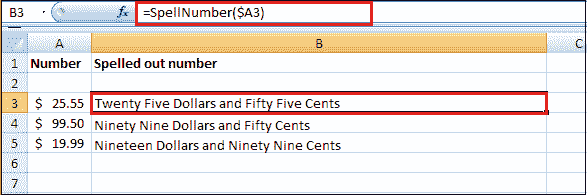
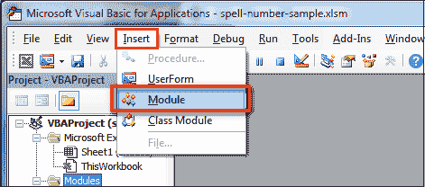
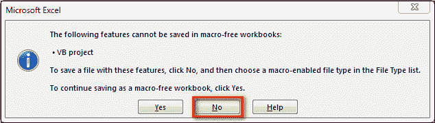
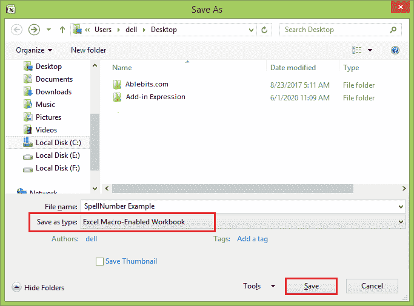

# 如何在 Excel 中将数字转换为文字？

> 原文：<https://www.javatpoint.com/how-to-convert-number-to-words-in-excel>

最初，开发微软 Excel 是为了处理大型数据数组。然而，它也快速有效地创建了诸如发票、评估或资产负债表等会计记录。

在或多或少的付款单据中，有必要将数值以文字形式复制。 [Excel](https://www.javatpoint.com/excel-tutorial) 没有在工作表中将数字显示为英文单词的默认功能。不过，您可以通过将下面的**拼写编号**功能代码粘贴到 VBA (Visual Basic for Applications)模块中来添加此功能。这个功能可以让你用公式把**美元**和**美分**换算成文字。

例如，25.50 将读作 25 美元 50 美分。如果您将 Excel 用作打印支票的模板，这将非常有用。因此，您需要的不仅仅是在 Excel 中将数字转换为单词(123.45 到 123，45)，而是拼出美元和美分(29.95 到 29 美元和 99 美分)，英镑和便士表示英镑，欧元表示欧元，欧元表示欧元，等等。

如果要将数值转换为文本格式而不将其显示为文字，可以使用**文本功能**作为替代。

就连 Excel 2016 都没有内置的数字拼写工具，更不用说早期版本了。但那是 Excel 真正优秀的时候。您始终可以使用公式的所有组合、VBA 宏或第三方加载项来改进其功能。



如果您正在寻找数字到文本的转换，这意味着您希望 Excel 将您的数字视为文本，这有点不同。通常，您需要在 Excel 中更改单元格格式，请执行以下操作:

*   用数字选择您的范围。
*   按下**号**标签上的 Ctrl+1，在**类别**中选择“**文字**

### 如何使用拼写数字 VBA 宏将数字转换为单词

微软不想增加一个数字到单词转换的工具。但是他们在他们的网站上创建并发布了特殊的 VBA 宏。

可以找到提到的宏为“**拼数公式**”。然而，它不是公式，而是一个宏函数或 **Excel 自定义函数** (UDF)。

拼写数字选项可以写美元和美分。如果你需要不同的货币，你可以选择兑换“美元”和“美分”。在下面，您将找到一个 VBA 代码，并按照以下步骤操作，例如:

**第一步:**打开需要将数字拼成单词的工作簿。

**第二步:**按 Alt + F11 打开 Visual Basic 编辑器窗口。

如果您打开了几本书，请使用编辑器左上角的项目列表检查所需的工作簿是否处于活动状态，或者其中一个工作簿元素是否以蓝色突出显示。

**第三步:**在编辑器菜单中，进入**插入**选项卡，点击**模块**按钮。



**第 4 步:**你会看到一个名为 Module1 的窗口。请选择下面框架中的所有代码，并将其粘贴到此窗口。

```

Option Explicit
'Main Function
Function SpellNumber(ByVal MyNumber)
    Dim Dollars, Cents, Temp
    Dim DecimalPlace, Count
    ReDim Place(9) As String
    Place(2) = " Thousand "
    Place(3) = " Million "
    Place(4) = " Billion "
    Place(5) = " Trillion "

    MyNumber = Trim(Str(MyNumber))
    DecimalPlace = InStr(MyNumber, ".")
    If DecimalPlace > 0 Then
        Cents = GetTens(Left(Mid(MyNumber, DecimalPlace + 1) & _
                  "00", 2))
        MyNumber = Trim(Left(MyNumber, DecimalPlace - 1))
    End If
    Count = 1
    Do While MyNumber <> ""
        Temp = GetHundreds(Right(MyNumber, 3))
        If Temp <> "" Then Dollars = Temp & Place(Count) & Dollars
        If Len(MyNumber) > 3 Then
            MyNumber = Left(MyNumber, Len(MyNumber) - 3)
        Else
            MyNumber = ""
        End If
        Count = Count + 1
    Loop
    Select Case Dollars
        Case ""
            Dollars = "No Dollars"
        Case "One"
            Dollars = "One Dollar"
         Case Else
            Dollars = Dollars & " Dollars"
    End Select
    Select Case Cents
        Case ""
            Cents = " and No Cents"
        Case "One"
            Cents = " and One Cent"
              Case Else
            Cents = " and " & Cents & " Cents"
    End Select
    SpellNumber = Dollars & Cents
End Function

Function GetHundreds(ByVal MyNumber)
    Dim Result As String
    If Val(MyNumber) = 0 Then Exit Function
    MyNumber = Right("000" & MyNumber, 3)
    ' Convert the hundreds place.
    If Mid(MyNumber, 1, 1) <> "0" Then
        Result = GetDigit(Mid(MyNumber, 1, 1)) & " Hundred "
    End If
    ' Convert the tens and one's place.
    If Mid(MyNumber, 2, 1) <> "0" Then
        Result = Result & GetTens(Mid(MyNumber, 2))
    Else
        Result = Result & GetDigit(Mid(MyNumber, 3))
    End If
    GetHundreds = Result
End Function

Function GetTens(TensText)
    Dim Result As String
    Result = "" ' Null out the temporary function value.
    If Val(Left(TensText, 1)) = 1 Then   ' If value between 10-19...
        Select Case Val(TensText)
            Case 10: Result = "Ten"
            Case 11: Result = "Eleven"
            Case 12: Result = "Twelve"
            Case 13: Result = "Thirteen"
            Case 14: Result = "Fourteen"
            Case 15: Result = "Fifteen"
            Case 16: Result = "Sixteen"
            Case 17: Result = "Seventeen"
            Case 18: Result = "Eighteen"
            Case 19: Result = "Nineteen"
            Case Else
        End Select
    Else ' If value between 20-99...
        Select Case Val(Left(TensText, 1))
            Case 2: Result = "Twenty "
            Case 3: Result = "Thirty "
            Case 4: Result = "Forty "
            Case 5: Result = "Fifty "
            Case 6: Result = "Sixty "
            Case 7: Result = "Seventy "
            Case 8: Result = "Eighty "
            Case 9: Result = "Ninety "
            Case Else
        End Select
        Result = Result & GetDigit _
            (Right(TensText, 1))  ' Retrieve ones place.
    End If
    GetTens = Result
End Function

Function GetDigit(Digit)
    Select Case Val(Digit)
        Case 1: GetDigit = "One"
        Case 2: GetDigit = "Two"
        Case 3: GetDigit = "Three"
        Case 4: GetDigit = "Four"
        Case 5: GetDigit = "Five"
        Case 6: GetDigit = "Six"
        Case 7: GetDigit = "Seven"
        Case 8: GetDigit = "Eight"
        Case 9: GetDigit = "Nine"
        Case Else: GetDigit = ""
    End Select
End Function

```

**第五步:**按 Ctrl + S 保存更新后的工作表。

您需要重新保存工作簿。当你尝试用宏保存工作簿时，你会得到这样的信息:**以下功能不能保存在无宏工作簿**中。



**第 6 步:**出现 VB 项目对话框。点击**否**按钮。

**第 7 步:**您可以将文件保存为 **Excel 启用宏的工作簿(。xlsm)** 保持文件的当前格式。

*   单击文件选项卡。
*   选择另存为选项。
*   点击**另存为类型**下拉菜单。
*   在**另存为类型**字段中，选择“ **Excel 宏启用工作簿**”文件类型。



**第 8 步:**点击**保存**按钮保存文件。

### 在 Excel 中使用宏拼写数字的缺点

*   首先，你必须知道 VBA 根据你的需要修改代码。有必要为计划更改代码的每个工作簿粘贴代码。否则，您需要创建一个包含宏的模板文件，并配置 Excel 在每次启动时加载该文件。
*   使用宏的主要缺点是，如果您将工作簿发送给其他人，此人将看不到文本，除非宏内置在工作簿中。即使它是内置的，他们也会得到一个警告，工作簿中有宏。

* * *