# 如何在 Excel 中制作表格？

> 原文:[https://www.javatpoint.com/how-to-make-a-table-in-excel](https://www.javatpoint.com/how-to-make-a-table-in-excel)

表格是在 Excel 中对数据进行分组的强大功能。您可以将表格视为电子表格中特定的一组行和列。同一张纸上可以有多个表格。**表格**允许您在 **Excel** 中快速轻松地分析数据。

您可能认为 Excel 电子表格中的数据已经存在于表格中，只是因为它存在于行和列中。但是，除非您使用了特定的 [Excel](https://www.javatpoint.com/excel-tutorial) 数据表功能，否则您的数据不在真正的“表”中。您可以将平面数据转换为数据表，这有几个好处。以下是 Excel 表格的一些优点，例如:

*   **快速样式:**只需单击一下即可添加颜色、带状行和标题样式，从而为数据设置样式。
*   **表名:**给表起一个名字，这样在其他公式中更容易引用。
*   **更干净的公式:**在表格中工作时，Excel 公式更容易读写。
*   **自动展开:** Excel 表格本质上是动态的，这意味着可以轻松地在数据中添加新的行或列，Excel 表格会自动更新以包含新的单元格。
*   **过滤器&分类汇总:**自动添加过滤器按钮和分类汇总，这些按钮和分类汇总会随着您过滤数据而进行调整，例如集成的**排序**和**过滤器**选项或带有**切片器**的视觉过滤。
*   **滚动时列标题**保持可见。
*   **快速总计**允许您对数据进行求和和计数，并通过点击找到平均值、最小值或最大值。
*   **由于使用表格和列名而不是单元格引用的特殊语法，有易于阅读的公式**。
*   **动态图表**会随着您在表格中添加或删除数据而自动调整。

### 如何在 Excel 中创建表格

Excel 电子表格的单个工作表或页面类似于表格，其网格由列和行组成。只需点击几下，您就可以输入数据或将整个数据集导入到 Excel 电子表格中。您也可以将数据组织到表格中，而无需特殊格式。

在源数据按行和列组织的情况下，按照以下步骤将一系列单元格转换为表格:

**步骤 1:** 选择数据集中的任意单元格。

**第二步:**进入**插入**选项卡，点击**表格**组中的**表格**按钮。

也可以按 Ctrl + T 快捷键插入表格。

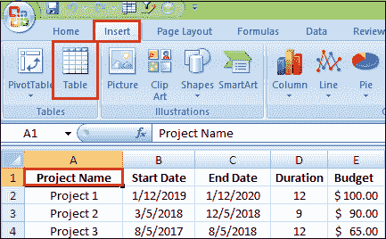

**第三步:**出现**创建表格**对话框，自动为您选择所有数据。您可以调整范围，如果您希望第一行数据成为表格标题，请确保选择了**我的表格有标题**框。

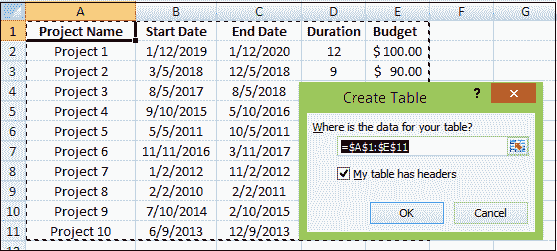

**第四步:**现在点击 ***确定*** 按钮。

因此，Excel 会将您的数据范围转换为具有默认样式的真实表格。

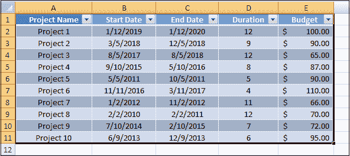

这里有一些在 excel 中创建表格时需要记住的要点。

*   在创建表之前准备并清理数据，删除所有空白行，为每一列指定唯一的名称，并确保每一行都包含一条记录的信息。
*   插入表格时，Excel 会保留您当前拥有的所有格式。为了获得最佳效果，您可能希望删除一些现有格式，例如背景颜色，这样就不会与表格样式冲突。
*   你不仅限于每张桌子一张。你可以想要多少就有多少。为了更好的可读性，在表和其他数据之间插入至少一个空行和一个空列是合理的。

### 如何在 Excel 中给表格命名

每次在 Excel 中制作表格，都会自动得到一个默认名称，如**表 1、表 2** 等。当您处理多个表时，将默认名称更改为更有意义和描述性的名称可以使您的工作更加容易。要重命名表或为表命名，请执行以下步骤:

**步骤 1:** 选择表格中的任意单元格。

**第二步:**进入**表设计**选项卡，在**表名**框中选择现有名称。

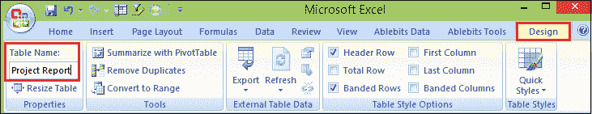

要查看当前工作簿中所有表格的名称，按 Ctrl + F3 打开**名称管理器**。

### Excel 表格公式

为了计算表格数据，Excel 使用一种称为结构化引用的特殊公式语法。与常规公式相比，它们有几个优点，例如:

*   **易创建:**制作公式时选择表格的数据，Excel 会自动为你构建结构化的引用。
*   **易读:**结构化引用按名称引用表格部分，公式更容易理解。
*   **自动填充:**要在每行执行相同的计算，请在任意单个单元格中输入公式，该公式将立即复制到整个列中。
*   **自动更改:**当您在一列中的任意位置修改一个公式时，同一列中的其他公式也会相应更改。
*   **自动更新:**每次调整表格大小或重命名列时，结构化引用都会动态更新。

下图显示了一个对每行数据求和的结构化引用示例:

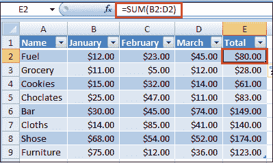

### 求和表列

Excel 表格的另一大特点是无需公式即可汇总数据。该选项称为**总计行。**按照以下步骤对表格数据求和。

**步骤 1:** 选择表格中的任意单元格。

**第二步:**进入**设计**选项卡，在**表格样式选项**组的**总行数框**中打勾。

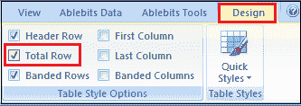

**第 3 步:****总计**行插入表格底部，并在最后一列显示总计。

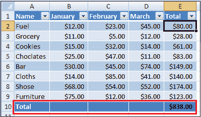

**第 4 步:**点击**合计**单元格，对其他列的数据求和。

**第五步:**然后点击下拉箭头，选择 SUM 函数。要以不同方式计算数据，例如计数或平均值，请选择相应的函数。

无论您选择什么操作，Excel 都将使用 SUBTOTAL 函数，该函数只计算**可见行**中的数据。

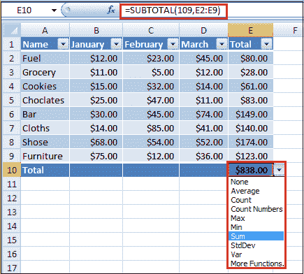

您可以使用 Ctrl + Shift + T 快捷键来打开和关闭“合计行”。

### 如何在 Excel 中扩展表格

当您在相邻单元格中键入任何内容时，Excel 表格**会自动展开**以包含新数据。结合结构化引用，这为您的公式创建了一个动态范围，而无需您付出任何努力。

如果您不希望新数据成为表格的一部分，请按 Ctrl + Z。这将撤消表格扩展并保留您键入的数据。

也可以通过拖动右下角的小手柄**手动扩展表格**。

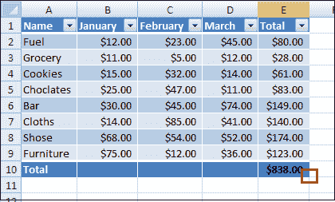

您也可以使用**调整表格大小**命令添加和删除列和行，步骤如下。

**步骤 1:** 单击表格中的任意位置。

**第二步:**进入**设计**选项卡，点击**属性**组中的**调整表格大小**。

**步骤 3:** 当对话框出现时，选择要包含在表格中的范围。

**第四步:**点击**确定**按钮。

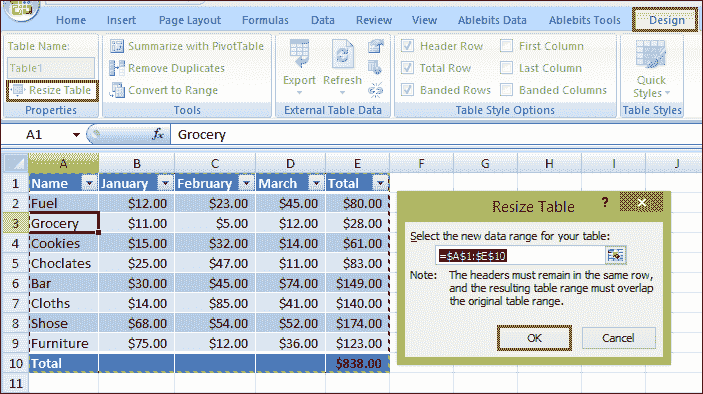

### Excel 表格样式

由于预定义的样式库，表格很容易格式化。此外，您可以使用自己的格式创建自定义样式。

在 Excel 中插入表格时，会自动应用默认样式。要更改表格样式，请执行以下步骤:

**步骤 1:** 选择表格中的任意单元格。

**第二步:**进入**设计**选项卡，从**表格样式**组中点击想要应用的样式。

**第三步:**要查看所有样式，点击右下角的**更多**按钮。

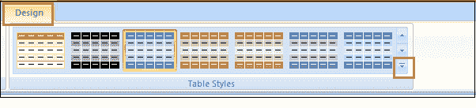

#### 注意:如果您尚未定义表格列的标题，Excel 会在格式化过程中自动向表格中添加标题占位符。

要更改默认表格样式，右键单击所需样式并选择**设置为默认**。您在同一工作簿中创建的任何新表格现在都将使用新的默认表格样式进行格式化。

当您使用任何预定义的样式格式化表格时，Excel 会保留您已经拥有的格式。

**步骤 4:** 要删除任何现有格式，右键单击样式并选择**应用和清除格式**。

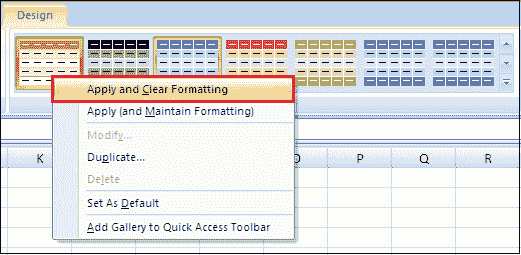

### 如何删除表格格式

如果您希望拥有 Excel 表格的所有功能，但不想要任何格式，如带状行、表格边框等，可以通过以下步骤删除格式，例如:

**步骤 1:** 选择表格中的任意单元格。

**第二步:**进入**设计**选项卡，点击**表格样式**组中的右下角**更多**按钮。

**第三步:**然后点击表格样式模板下方的**清除**。或者在**灯光**下选择第一种风格，称为**无**。

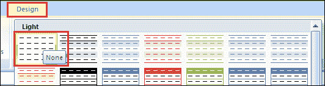

此方法仅删除内置的表格格式，但保留您的自定义格式。要完全删除表格中的所有格式，请遵循以下方法:

**第一步:**进入**首页**选项卡，选择**格式**组，点击**清除格式**按钮。

#### 注意:与自定义表格样式不同，Excel 表格的预定义样式不能删除。但是，您可以选择清除预定义样式和自定义样式。然后，格式被删除，数据以默认表格格式显示。

### 如何在 Excel 中删除表格

移走一张桌子是一个简单的过程。要将表格转换回范围，只需遵循以下步骤:

**步骤 1:** 右键单击表格中的任意单元格。

**第二步:**进入**表**按钮。

**第三步:**然后点击**转换至范围**按钮。

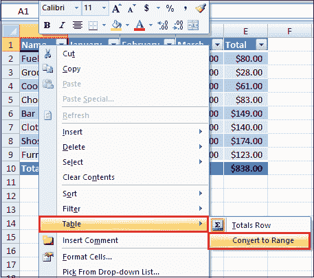

或者转到**设计**选项卡，点击**工具**组中的**转换为范围**按钮。

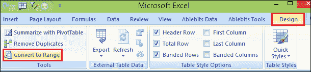

**第四步:**屏幕出现对话框，点击**是**按钮。

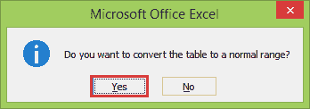

这将删除该表，但保留所有数据和格式。若要仅保留数据，请在将表格转换为区域之前删除表格格式。

### 使用 Excel 表格的缺点

使用已命名的 Excel 表格有一些缺点，因此可能会出现不使用它们的情况，例如:

*   对表格单元格的结构化引用没有“ ***【绝对】*** ”设置，所以跨列复制有点难。
*   即使表格下面的单元格被解锁，表格也不会在受保护的工作表中自动展开。
*   如果任何工作表包含 Excel 表格，则不能对多个工作表进行分组、复制或移动。
*   包含一个或多个 Excel 表的工作簿中不允许自定义视图。

* * *