# 如何在 Excel 中放勾号？

> 原文：<https://www.javatpoint.com/how-to-put-tick-mark-in-excel>

在 Excel 中，复选标记用于显示给定任务是否完成。请记住，它不同于复选框。Excel 中有两种复选标记——交互式复选框和勾号。

一个**勾号框**，也称为**一个复选框**或**勾号框**，是一个特殊的控件，允许通过鼠标点击来选择或取消选择一个选项，即选中或取消选中一个勾号框。

一个**勾号**，被称为一个**勾号**或**勾号**，是一个特殊的符号(？)可以插入单元格(单独或与任何其他字符组合)来表达概念。有时**十字标记** (x)也用于此目的，但更多时候，它表示不正确或失败。

在 excel 中插入勾号有三种简单的方法。第一个只是复制一个勾号粘贴到 [Excel](https://www.javatpoint.com/excel-tutorial) 中，第二个选项是从插入选项卡插入一个符号，第三个选项是当我们将字体改为**绕组 2** 并按下快捷键 SHIFT+P。

### 如何使用符号命令打勾

在 Excel 中插入刻度符号最常见的方法是符号命令。请遵循以下步骤:

**步骤 1:** 选择要插入勾号的单元格。

**第二步:**进入**插入**选项卡，点击**符号**组中的**符号**按钮。

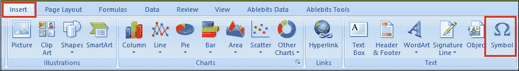

**第三步:**在**符号**对话框中的**符号**选项卡上，点击**字体**框旁边的下拉箭头，选择 **Wingdings** 。

**第 4 步:**在列表底部可以找到几个勾号和十字符号。选择您选择的符号，点击**插入**。

**第五步:**最后点击**关闭**关闭**符号**窗口。

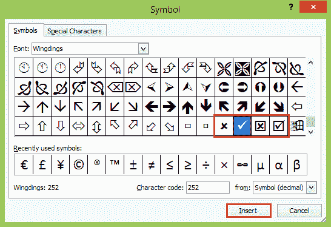

一旦您在**符号**对话框中选择了某个符号，Excel 将在底部的**字符代码**框中显示其代码。

例如，刻度符号的字符代码(？)是 252，如上图所示。了解了这段代码，您就可以很容易地编写一个公式，在 Excel 中插入一个检查符号或计算选定范围内的刻度线。

使用符号命令，您可以在**空单元格**中插入勾号，或者添加一个勾号作为**部分单元格内容**。

### 如何使用 CHAR 函数插入刻度线

也许在 Excel 中添加一个勾号或十字符号并不是一种常规的方式，但是如果你喜欢使用公式，它可能会成为你最喜欢的方式。此方法只能用于在空单元格中插入刻度。了解以下符号代码:

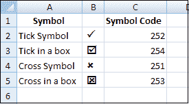

在 Excel 中打**勾号**的公式就这么简单:

```

=CHAR(252) or =CHAR(254)

```

要添加**十字符号**，请使用以下任一公式:

```

=CHAR(251) or =CHAR(253)

```

#### 注意:为了正确显示刻度和十字符号，公式单元格应使用 *Wingdings* 字体。

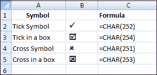

一旦在一个单元格中插入了公式，就可以像在 Excel 中复制公式一样，快速地将刻度复制到其他单元格中。

要删除公式，请使用**特殊粘贴**功能用值替换公式:

*   选择公式单元格。
*   按 Ctrl + Cto 复制它。
*   右键单击选定的单元格。
*   然后点击**粘贴特殊**
*   点击**值**

### 通过键入字符代码插入刻度

在 Excel 中插入检查符号的另一种快速方法是按住 Alt 键直接在单元格中键入其字符代码。详细步骤如下:

**第一步:**选择要打勾的单元格。

**第二步:**转到**首页**选项卡，在**字体**组中将字体改为 **Wingdings** 。

**第三步:**按住 ALT 的同时在**数字键盘**上输入以下字符代码之一。

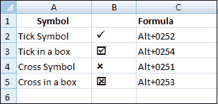

您可能已经注意到，字符代码与我们在 CHAR 公式中使用的代码相同，只是前导零不同。

#### 注意:要使字符代码起作用，请确保 NUM LOCK 打开，并使用*数字键盘*而不是键盘顶部的数字。

### 使用键盘快捷键插入刻度符号

如果您不特别喜欢我们到目前为止添加的四个检查符号的外观，请查看下表了解更多变化:

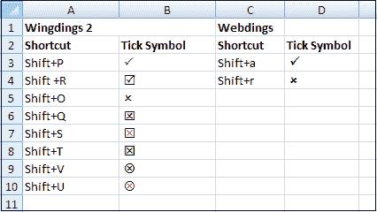

要在 Excel 中获得上述任一刻度，请将 **Wingdings 2** 或 **Webdings** 字体应用到要插入刻度的单元格，然后按下相应的键盘快捷键。

### 如何在 Excel 中使用“自动更正”进行勾号

如果你需要每天在你的工作表中插入刻度线，以上方法似乎都不够快。幸运的是，Excel 的自动更正功能可以为您自动完成这项工作。要做到这一点，您需要遵循以下步骤:

**步骤 1:** 使用上述任何技术在单元格中插入所需的检查符号。

**第二步:**在公式栏中选择符号，按 Ctrl + C 复制。

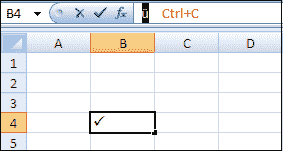

不要因为公式栏中符号的出现而气馁。即使它看起来与您在上面截图中看到的不同，也只是意味着您使用了另一个字符代码插入了一个勾号符号。

**第三步:**看**字体**框，记好字体主题，因为后面“**自动插入**”其他单元格打勾时会用到。

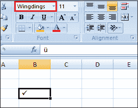

**第四步:**点击**文件**选项卡，进入 Excel **选项**，选择**打样**。

**第 5 步:**点击**自动更正选项**。

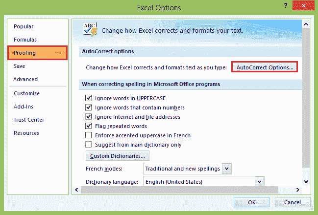

**第 6 步:**将打开**自动更正**对话框，您可以执行以下操作:

*   在**替换**框中，键入要与复选符号相关联的单词或短语，例如“tickmark”。
*   在**带**框中，按 Ctrl + V 将复制的符号粘贴到公式栏中。

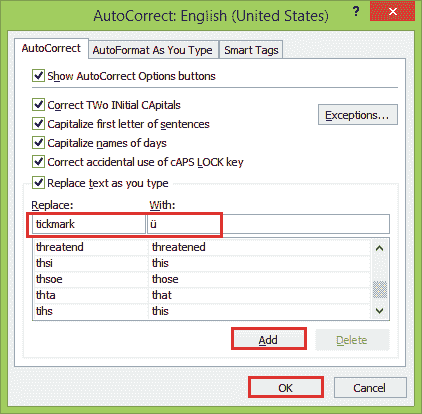

**第 7 步:**点击**添加**按钮，然后点击**确定**按钮关闭自动更正对话框窗口。

现在，每当您想在 Excel 工作表中打勾时，请执行以下操作:

*   用勾号输入你链接的单词，按**进入**。
*   符号ü(或从公式栏复制的其他符号)将出现在单元格中。要将其转换为 Excel 刻度符号，请对单元格应用适当的字体。

在这种方法中，您只需配置一次“自动更正”选项。从现在开始，每当您在单元格中键入相关单词时，Excel 都会自动为您添加一个勾号。

### 基于刻度符号有条件地格式化单元格

如果单元格除了刻度线之外不包含任何数据，您可以创建一个条件格式规则，自动将所需格式应用于这些单元格。

这种方法的一大优点是，当您删除一个刻度符号时，您不必手动重新格式化单元格。要创建条件格式规则，请执行以下步骤:

**步骤 1:** 选择要格式化的单元格。

**第二步:**进入**首页**选项卡，点击**样式**组中的**条件格式**。

**第三步:**现在点击**新规则**按钮。

**第 4 步:**在**新格式规则**对话框中，选择**使用公式确定要格式化的单元格**。

**第 5 步:**在**格式值(此公式为真)**框中，输入 CHAR 公式:

```

=$B2=CHAR(252)

```

其中，B2 是可能包含刻度的最上面的单元格，252 是插入工作表中的刻度符号的字符代码。

**第六步:**点击**格式**按钮，选择想要的格式样式，点击**确定**。

结果将类似于这样:

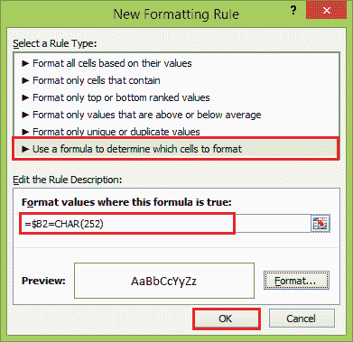

#### 注意:这种格式化技术仅适用于通过符号命令、字符函数或字符代码添加了已知字符代码的刻度符号。

### 如何在 Excel 中计算刻度线

经验丰富的 Excel 用户一定已经根据前面几节的信息启动并运行了公式。使用 CHAR 函数检测包含检查符号的单元格，使用 COUNTIF 函数计数这些单元格:

```

=COUNTIF(B2:B9,CHAR(252))

```

B2:B9 是您想要计算复选标记的范围，252 是复选符号的字符代码。

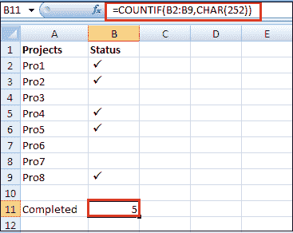

#### 注意:与条件格式一样，上述公式只能处理具有特定字符代码的刻度符号，并且适用于除了检查符号之外不包含任何数据的单元格。

如果使用 Excel **勾号框**(复选框)而不是勾号符号，可以通过将复选框链接到单元格，然后计算链接单元格中的真值数量来计算选定(选中)的勾号。

* * *