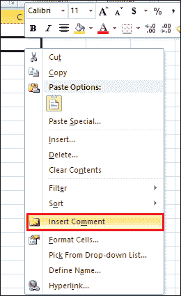

# 如何在 Excel 中插入注释

> 原文:[https://www.javatpoint.com/how-to-insert-comments-in-excel](https://www.javatpoint.com/how-to-insert-comments-in-excel)

注释通常是程序代码、脚本、简短语句或观察中的注释、建议、文本串，用于使源代码更易于人类理解。一些特殊字符(如/*、" "、//、" # "，以及<！--->)用于在字符串的开头或结尾插入注释。

例如在 [HTML](https://www.javatpoint.com/html-tutorial) 中，下面的语法用来写注释。

<!-- Write HTML comment here -- >

#### 注意:注释语句不被编译器和解释器执行。

### 评论类型

有以下两种评论-

**1。单行注释**

单行注释允许您一次只写一行注释。

**2 .复线 comment**

多行注释允许您同时为多行编写注释。

### 插入注释的优势

插入注释的优势列表如下所示-

1.  注释有助于用户轻松理解代码。
2.  它指出了需要避免的潜在问题领域。
3.  注释是用一般的文字写的，这就是为什么与代码相比更容易阅读的原因。
4.  它帮助你在一个地方收集信息。
5.  注释更容易表达，比实际代码更精确。
6.  一般来说，注释比代码短。

### 插入注释的缺点

1.  注释需要更多的空间和内存，这就是性能缓慢的原因。
2.  添加评论需要更多时间。
3.  有时，注释会破坏文档。
4.  与代码本身相比，注释不太可靠。
5.  它鼓励糟糕的代码。
6.  添加评论可能是一个高风险。

### 在 Excel 中插入注释的方法

在 Excel 中插入注释的方法列表讨论如下-

### 在 Excel 中插入注释

在 Excel 文档中插入注释为解释公式、单元格和其他重要数据提供了一个很好的方法。[微软 Excel](https://www.javatpoint.com/excel-tutorial) 提供了在文档中插入注释最简单快捷的方法。

### 在 Excel 中插入注释的步骤

在 Excel 中插入注释有以下步骤-

#### 注意:使用以下步骤，您可以在 Excel XP/2003、Excel 2007、Excel 2010、Excel 2013、Excel 2016、Excel 2019 和 Office 365 中插入注释。

**第一步:**进入底部窗口的**搜索栏**，输入**微软 Excel** ，然后从键盘上按下**回车键**。或者可以**双击微软 Excel 图标**打开微软 Excel 文档。

**第二步:**点击**文件选项卡- >新建- >空白文件- >创建**打开**新空白文件**。点击**文件- >打开- >浏览文件位置- >打开**打开**一个已有的微软 Excel 文档**。

#### 注意:在我们的例子中，我们将打开一个新的微软 Excel 文档。

**第三步:**准备一个文档列表，在 Excel 中插入注释。

**第 4 步:**将光标放在文档中您希望注释出现的单元格上。(我们使用单元格 C2 显示评论)

**第五步:在选中的单元格上右键**，会出现一个小弹出窗口，里面有选项列表。点击**插入评论**选项，如下图所示。

**第六步:**屏幕上出现一个**小插评论**弹出。写下您想添加到文档中的任何注释。

**第七步:**从键盘按下**回车键**或在评论框外点击。现在，您可以看到注释被插入到您想要的单元格中。

### 方法 2:使用“审阅”选项卡插入注释

**插入评论的步骤**

下面讨论了在 Excel 文档中插入注释的步骤列表-

**第一步:**双击桌面或任务栏中的微软 Excel 图标，打开微软 Excel 文档**。**

**第二步:**点击**文件- >新建- >空白文档- >创建**打开新的 Excel 文档。要打开一个现有文档，点击**文件- >打开- >浏览文件位置- >打开按钮**。

#### 注意:在我们的例子中，我们使用一个现有的微软 Excel 文档。

**第三步:**点击想要插入评论的单元格。之后，点击功能区的**评论选项卡**，然后点击**评论区**的**新评论**选项。

**第四步:**屏幕上会出现一个**小插入注释对话框**，插入注释后，在文档中的任意位置按下。

**第五步:**你可以看到你插入的评论会出现在你想要的单元格中。请看下面给出的截图。

### 在 Excel 中显示/隐藏注释

Microsoft Excel 还允许您使用功能区中的“全部显示”按钮来显示/隐藏 Excel 文档中的注释。

#### 注意:默认情况下，Excel 是用来隐藏注释的。

**在 Excel 中显示/隐藏注释的步骤**

按照下面给出的步骤在 Excel 文档中显示/隐藏注释-

**步骤 1:** 打开要显示/隐藏注释的新的或现有的 Microsoft Excel 文档。

**第二步:右键单击任意单元格上的**。一个选项列表将出现在屏幕上，点击**显示或隐藏评论选项。或者**点击功能区的**评论**选项卡，然后点击**评论组**下的**显示所有评论选项**，在 Excel 文档中显示或隐藏和隐藏或显示评论。

### 在 Excel 中编辑注释

在 Microsoft Excel 文档中插入注释后，还可以根据需要对插入的注释进行更改(编辑)。

要编辑插入的注释，请遵循下面给出的步骤列表-

**第一步:**打开**一个现有的微软 Excel** 文档，编辑文档中的注释。

**第二步:在选中的单据上右键**。屏幕上将出现一个选项列表。点击**退出编辑文本选项，**或者您也可以将鼠标指针放在所选评论上来编辑评论，如下图所示。

**第三步:**删除之前的注释，添加想要插入的注释，然后点击文档中的任意位置。

现在，您可以看到您想要的内容被编辑到微软 Excel 文档中。

### 在 Excel 中删除注释

在 Microsoft Excel 文档中添加注释后，您也可以根据文档的要求将其删除。按照下面给出的最简单的步骤删除微软 Excel 文档中的注释-

**步骤 1:** 打开要删除注释的现有 Microsoft Excel 文档。

#### 注意:单击文件->打开选项->浏览现有文件位置->单击打开按钮打开现有的 Microsoft Excel 文档。

**第二步:**点击要从 Excel 文档中删除的注释。

**第三步:**转到功能区的**审核选项卡**。在**评论区**下，点击**删除按钮**。

**第四步:**完成上述步骤后，可以看到插入的注释从微软 Excel 文档中删除。

### Excel 文档中注释的格式

微软 Excel 自动使用电脑上的*字号为 9 的 **Tahoma 样式字体**和苹果电脑上的*字号为 10 的*在文档中插入注释。您还可以根据您对 Windows 和 Mac 的要求更改默认注释格式。*

**格式化注释的步骤**

格式化注释的步骤列表如下-

**步骤 1:** 打开新的或现有的微软 Excel 文档。

**步骤 2:** 选择要更改格式的注释，例如(更改颜色、样式、字体大小等)

**第三步:在选中的评论上右键**，屏幕上会出现一个选项列表。点击**格式评论**选项。请看下面给出的截图。

**第四步:屏幕上会出现一个格式注释对话框**，在该对话框中执行以下操作-

1.  在“字体”部分选择要应用的字体。
2.  在“字体样式”部分选择字体样式。
3.  在大小部分选择大小。
4.  使用颜色部分下的下拉菜单选择颜色。
5.  在预览部分，您可以看到评论的预览。

对预览感到满意后，单击“格式注释”对话框底部的“确定”按钮。

#### 注意:在我们的例子中，我们改变了前面给出的注释的字体、字体样式和大小。

现在下面的截图显示，根据您的要求，注释是格式。

* * *