# 如何在 Excel 中排序？

> 原文：<https://www.javatpoint.com/how-to-sort-in-excel>

数据排序是数据分析的一个重要部分。在 Excel 中，可以通过排序重新排列数据，快速找到记录。可以用各种方式对数据进行排序，例如按字母顺序(从 A 到 Z，从 Z 到 A)，从最高到最低，从最低到最高，按日期和时间，以及使用许多其他方式。

快速搜索总是需要对数据进行排序；它以一种使数据易于搜索的方式排列数据。如果对数据进行排序，很容易在表格或 Excel 工作表中找到任何记录。它通过在分类数据中快速搜索来节省用户的时间。Excel 提供了名为 **SORT()** 的内置函数，对数据进行排序。

本章将定义如何在 Excel 中对数据进行排序。

### 不同的数据如何排序？

*   文本数据可以按字母顺序排序，即 A 到 Z 或 Z 到 A
*   数字数据可以按范围排序，即最高到最低或最低到最高。
*   日期和时间方面，即最新到最早或最早到最新。

您可以使用任何技术对 Excel 数据进行排序。在 Excel 工作表/表格中，可以对一列或多列进行排序。例如，对员工表记录进行排序，首先按他们的工资，然后按他们的姓氏。

## 如何在 Excel 中排序？

在这里，我们将为您定义如何在 Excel 中对数据进行排序。 [Excel](https://www.javatpoint.com/excel-tutorial) 提供 **SORT** 功能，对数据进行有条不紊的整理。您可以通过输入公式并提供所需的参数来手动对表数据进行排序。否则，Excel 会提供快捷方式来对 Excel 的数据进行排序。

首先，我们将向您描述什么是 sort()函数，然后将通过不同的示例向您展示对数据进行排序的步骤。

## 什么是 sort()函数？

SORT()是 Excel 中用来对列进行排序和排列表格数据的函数。它允许用户按字母、数字或日期对数据进行排序。您也可以创建组，然后将此 sort()函数单独应用于这些组。

默认情况下，它使用第一列按升序对 Excel 表中的数据进行排序。

### 句法

以下是具有四个参数的 sort()函数的语法，其中一个是永久的，另外三个是可选的:

```

=SORT(array, [sortIndex], [sortOrder], [byColumn])

```

### 因素

**数组:**是 Excel 表格中选择排序的范围或数组。

**【排序索引】:**为可选参数。在此参数中，指定用于对表数据进行排序的列号。它的默认值是 1，这意味着它选择 Excel 表格的第一列。

**【排序顺序】:**也是可选参数。使用此参数，您可以指定排序的顺序。它的默认值也是 1，表示升序排序。

传递 1 表示升序排序，传递-1 表示降序排序。

**【按列】:**表示按列或按行排序。它的默认值是 FALSE。

真-按列排序

假-按行排序

### 返回值

sort()函数在对数据进行排序后返回数组。

### sort()公式的实现(适用于 Excel 365 订阅用户)

现在，我们将向您展示如何在 Excel 工作表中实现这个公式。但这只能由 Excel 365 订阅用户来实现。在 Excel 2016、2019 中，这种排序方式是行不通的。我们有另一种方法在本章下面讨论。

**第 1 步:**我们有这组包含姓名和年龄数据的数据，它们的顺序没有排序。我们将使用 sort()函数并重新排列它。

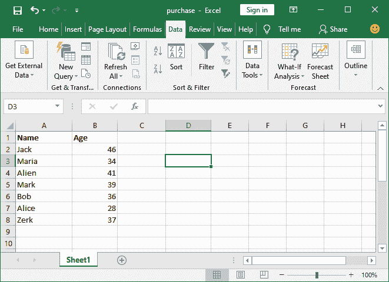

### 升序排序

**第二步:**在 Excel 首页，进入公式栏，输入这个 sort()公式，得到相对于**年龄**列排序的数据。

```

=SORT(A2:B8, 2, 1)

```

*   这里 **A2:B8** 是排序的数组的来源/范围
*   2 是用于排序的指定列 2(年龄)
*   1 是排序的升序

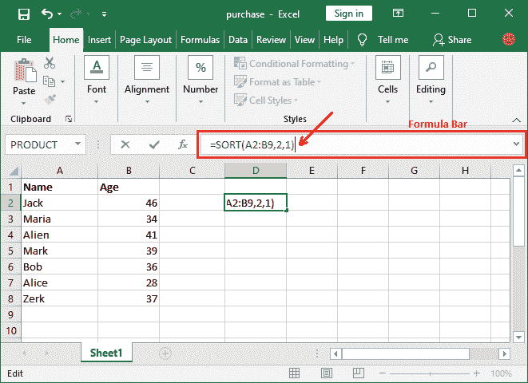

**步骤 3:** 现在，按**回车**键，看到排序结果已经自动粘贴到新的单元格(D 和 E)中。


### 降序排序

在本例中，我们将按照**名称**的字母顺序降序对 Excel 数据进行排序。

**第一步:**在 Excel 首页，进入公式栏，输入这个 sort()公式，得到相对于**名称**列排序的数据。

```

=SORT(A2:B8, 1, -1)

```

*   这里 **A2:B8** 是排序的数组的来源/范围
*   1 是用于排序的指定列 1(名称)
*   -1 是排序的降序

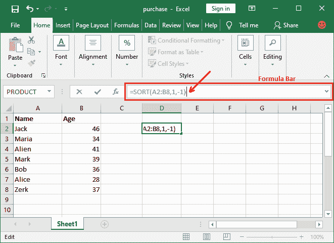

**第二步:**现在，按**回车**键，看到排序结果已经自动粘贴到新的单元格(D 和 E)中。

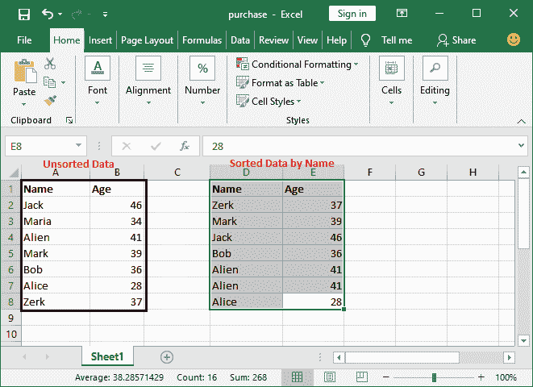

## Excel Sort()函数提示

*   目前，sort()函数无法在所有 Excel 版本中手动键入和访问。它仅适用于微软 365 订阅。
*   Excel 2016、2019 不支持 sort()函数。但是，这些版本有另一种方法可以使用 Excel 功能区中的公式，这将在本章下文中讨论。
*   如果您试图在除 Microsoft 265 之外的其他 Excel 中访问此公式，它将显示此错误。

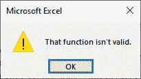

## 对 Excel 功能区中的数据进行排序(适用于所有 Excel)

不可能每次都记住 Excel 的所有公式及其参数。所以，Excel 也提供了另外一种使用这些公式的方法。除了这个方法，我们还将描述使用 sort()函数对 Excel 数据进行排序的其他方法。

Excel 在其功能区中添加了一些最需要的公式，以便快速方便地访问，这对非 excel 用户来说非常有效。使用任何你觉得简单易行的方法。这里，我们有几个使用不同参数值的例子。

### 对整个表数据进行排序的步骤

我们有一个简单的数据 Excel 表，有两列，名字和年龄。表的数据还没有整理。现在，我们将按照名称列的字母顺序对这个数据表进行排序。

### 按文本排序

这里，我们将按文本字符串对整个表数据进行排序。我们有一些简单的步骤来按字母顺序对数据进行排序。

**第一步:**创建一个表，和我们的一样，或者打开你现有的 Excel 表，你要对它的数据进行排序。

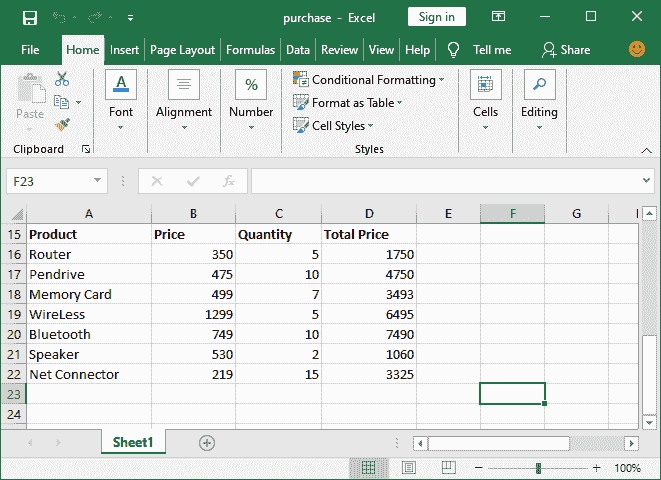

**第二步:**选择工作表的所有数据，使用一个列值对整个 Excel 工作表进行排序。这意味着当列值排序时，其关联的列数据也将被排序。

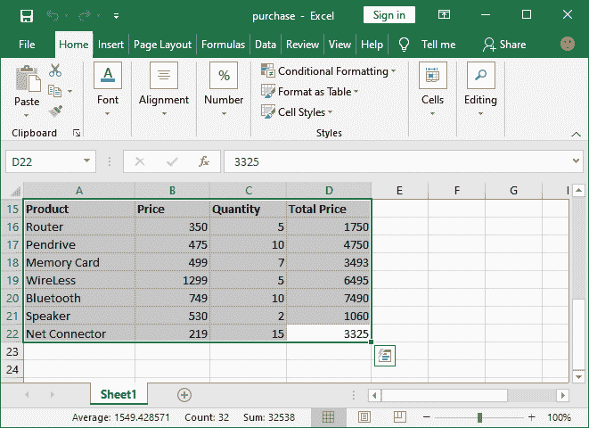

**第三步:**现在，导航到 Excel 菜单栏中的**数据**选项卡，在**排序&过滤**组中会出现一个**排序**功能选项。

点击此**排序**选项，将打开一个弹出对话框。

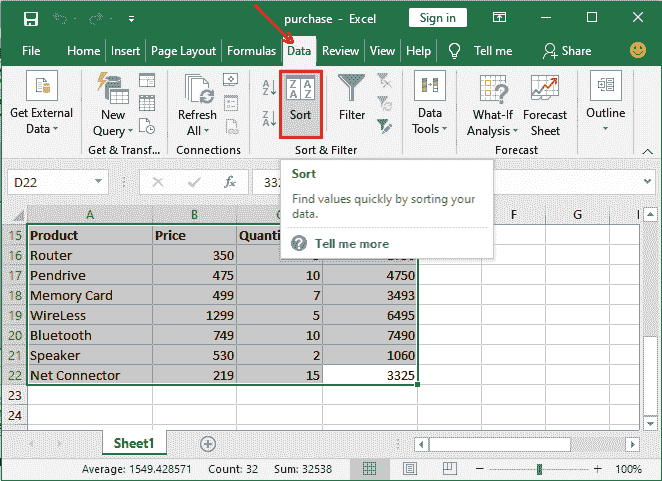

**第五步:**在该对话框中，从列表中指定/选择一列，根据该列对数据进行排序。例如**产品**对表格进行排序。

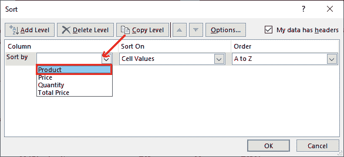

**第 6 步:**指定从 A 到 Z 或从 Z 到 A 的排序顺序，点击**确定**按钮。我们将选择升序(从 A 到 Z)。

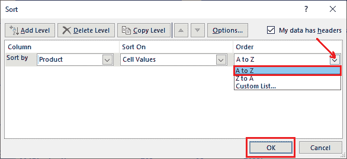

**第 7 步:**查看整个表格数据已经根据您选择的列(产品)和排序顺序成功排序。它们相关联的行数据也被排序。

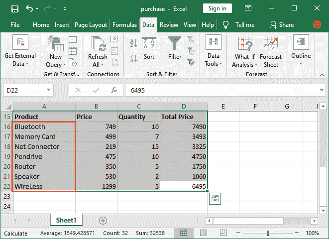

### 仅排序一列

有时，您只需要对单个列数据进行排序，但不想对整个表数据进行排序。所以，我们将显示一列可以排序。请记住，对一列进行排序比对整个表进行排序更容易。

**第一步:**打开已有的 Excel 工作表，对数据进行排序，选择一列要排序的数据。

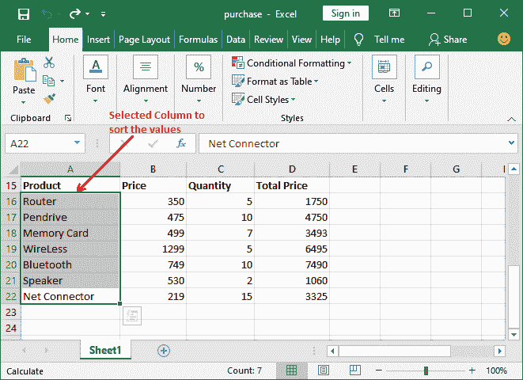

**第二步:**导航到 Excel 菜单栏中的**数据**选项卡，在此您将获得排序功能选项。

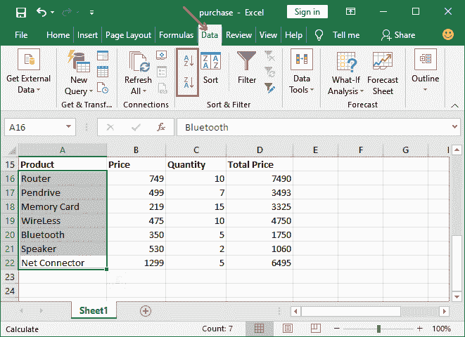

**第三步:**如果要按照从低到高的排序顺序进行排序，点击 **A 到 Z 排序按钮**进行排序。

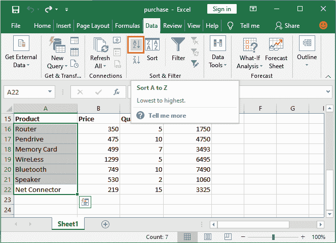

**第四步:**如果要按字母顺序从低到高排序，点击 **Z-to-A 排序按钮**。

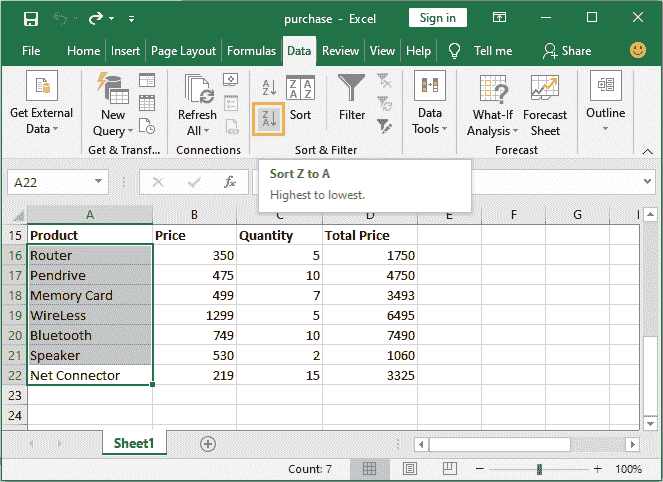

**第五步:**选择排序顺序时会弹出对话框，如下图。如果您想要展开排序并重新排列整个表格数据，请标记**展开选择**选项。

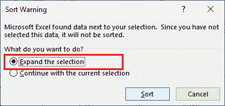

**第 6 步:**如果只对选中的列数据进行排序，标记**继续当前选择**选项。

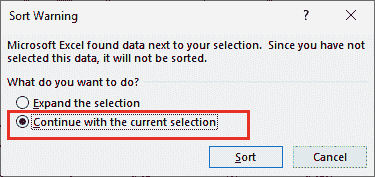

这一次，我们将只对单个列值进行排序。因此，我们将在该对话框中选择**继续当前选择**选项，并点击此处的**排序**按钮。

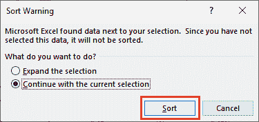

**第六步:**见下图截图；只对选定的列值进行了排序(从 A 到 Z 的顺序)，其余列数据保持不变。

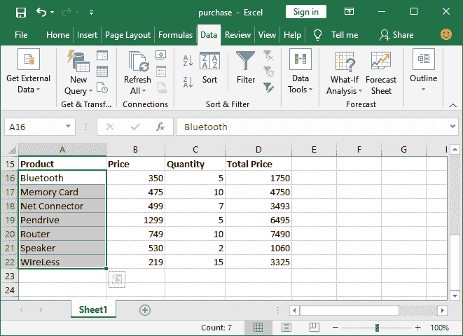

### 按数字排序

Excel 不仅允许按字母顺序对数据进行排序；它还允许使用数字数据列数据对表数据进行排序。所以，我们现在将按数字对数据进行排序。使用数字列对 Excel 工作表进行排序的过程与使用字符串参数对表格进行排序的过程几乎相同。这意味着它几乎与文本排序相同。

下面是一些简单的步骤，可以按照升序或降序对数据进行排序。

**第一步:**创建一个表，和我们的一样，或者打开你现有的 Excel 表，你要对它的数据进行排序。


**步骤 2:** 选择数值数据列，对该列数据及其关联列进行排序。这意味着整个表数据将被排序。**例如**，我们将根据采购产品的数量对该表数据进行排序。

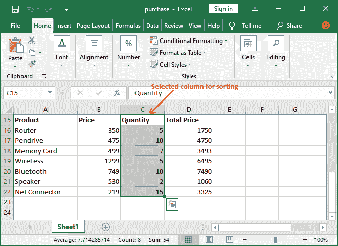

**第三步:**现在，导航到 Excel 菜单栏中的**数据**选项卡，在**排序&过滤**组中会出现一个**排序**功能选项。

点击此**排序**选项，该选项将通过对数据进行排序来帮助快速找到值。

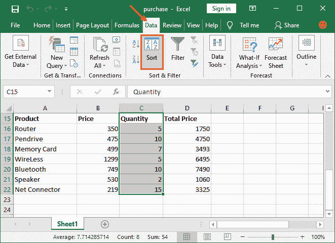

**步骤 5:** 将打开一个对话框，要求展开选择或继续当前选择。在这里，标记**展开选择**单选按钮，点击下面的**排序**按钮。

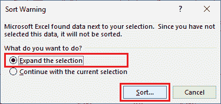

**第 6 步:**另一个对话框将显示从列表中指定/选择一列的位置，您要根据该列对数据进行排序。例如**数量**对表格进行排序。

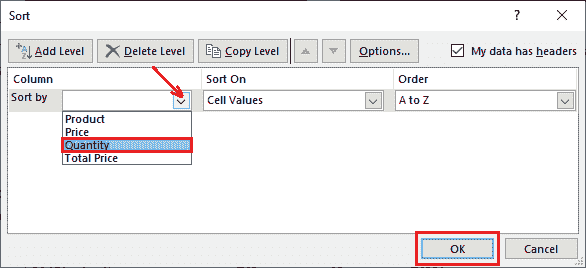

**步骤 6:** 现在，从列表中选择从最小到最大或从最大到最小的排序顺序，并点击**确定**按钮。我们将选择降序(从大到小)。

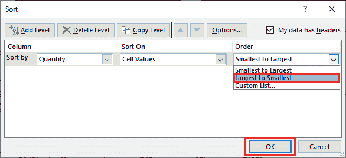

**第 7 步:**查看整个表格数据已经根据您选择的列(产品)和排序顺序成功排序。它们相关联的行数据也被排序。

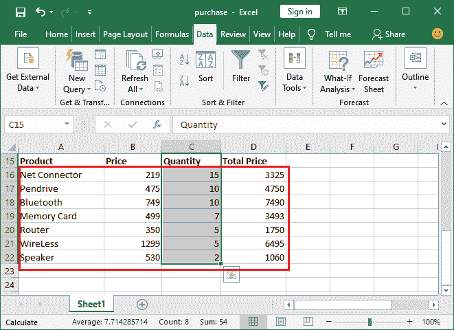

其他列也已按照所选列数据按采购数量降序排序。

* * *