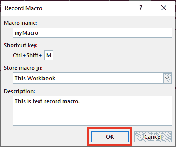
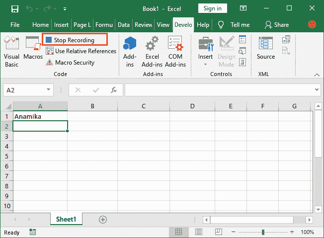

# 如何在 Excel 中记录一个宏？

> 原文:[https://www.javatpoint.com/how-to-record-a-macro-in-excel](https://www.javatpoint.com/how-to-record-a-macro-in-excel)

**宏**是 MS Excel 最有用、最本质的功能之一。宏基本上是一个**开发者特性**，用于通过在其中记录来执行重复的任务。因此，它节省了用户完成需要多次执行重复操作的任务的时间。您可以将该任务记录在宏中并自动执行。

宏是 Excel 的一个特殊功能，也是一个程序。在本章中，我们将简要介绍宏以及如何使用它。我们将描述在 Excel 中记录和执行宏的每个步骤。

在此之前，我们将简要介绍一些关于宏观的重要内容。

*   什么是宏观？
*   宏观基础
*   需要宏
*   获取 Excel 功能区中的“开发人员”选项卡
*   如何创建宏？
*   测试录制的宏
*   创建具有数学任务的宏
*   查看宏信息
*   使用宏从 CSV 文件导入数据

## 什么是宏观？

宏是 Excel 的一项开发功能，用于自动执行重复性任务以节省时间。在 Microsoft Excel 中，可以使用宏记录和执行需要重复执行的任务。

通常你会发现一个宏被称为 VBA 码。这是因为宏的代码是用 VBA (Visual Basic for Application)编程编写的。宏只不过是写在 [VBA](https://www.javatpoint.com/vba) 的一步代码。

在 [Excel](https://www.javatpoint.com/excel-tutorial) 中，当你记录一个宏，保存该宏，然后运行它，Excel 转到为相应任务生成的 VBA 代码，并开始执行相同的步骤。它允许在后台执行为记录的宏创建的代码，并在需要时执行操作。

## 宏观基础

在这里，我们有一些关于宏的基本点需要了解。

*   正如我们告诉您的，宏是一个开发人员功能，但是开发人员选项卡不显示在 Excel 菜单栏中。用户需要通过自定义报表明确添加。
*   宏在 Excel 中被禁用。因此，您必须启用宏来运行它们。
*   若要在 Excel 工作簿中保持启用已创建的宏，请选择**宏启用格式** (*)。保存 Excel 文件时从文件类型中删除。
*   请记住-宏名称不应包含任何空格。
*   您不需要熟悉 VBA 就可以使用宏自动完成任务。

## 获取 Excel 功能区中的“开发人员”选项卡

首先，我们将在 Excel 功能区中获得“开发人员”选项卡，该选项卡将包含与宏相关的所有必需选项以及一些其他工具。

最初打开 Excel 时，在 Excel 菜单栏中看到**无开发者选项卡/选项**。

以下是在 Excel 功能区中获取“开发人员”选项卡的步骤:

**步骤 1:** 在 Excel 主页上，**右键单击 Excel 功能区中显示包含不同选项列表的任何选项卡上的**。

点击这里的**自定义功能区**。

#### 注意:如果您的 Excel 已经在菜单栏中有此开发人员选项，请跳过以下步骤，直接进入下一步录制宏。

**第二步:**当你点击列表中的**自定义功能区**时，它会直接导航到一个 Excel 对话框，该对话框将包含自定义 Excel 功能区的各种设置。

**第三步:**在该 Excel 对话框中，在面板右侧标记**开发者**选项，然后点击下方**确定**按钮。

**第 4 步:**现在，您会看到开发人员选项已经添加到 Excel 菜单栏中。

## 在 Excel 功能区中录制宏

在 Excel 菜单栏中获得开发人员选项卡后，下一步是录制宏。如果您的 Excel 在菜单栏中已经有了开发人员选项卡/选项，您也可以直接转到这一步。

现在一切都在我们需要记录宏的地方。那么，让我们从如何在 Excel 中记录宏开始。

这里，我们有一些简单的步骤；小心跟随他们:

**第一步:**我们有一张空白的 Excel 表。在这里，导航到 Excel 菜单栏中的**开发者**选项卡。

**第二步:**在代码组部分，你会发现一个**记录宏**按钮；单击“录制宏”按钮。它将打开一个对话框，包含录制宏所需的所有设置。

**第三步:**在该对话框中，提供所有需要的详细信息。

**1。输入宏**的名称。请记住，宏名的名称中不包含空格。比如**我的宏**正确，**我的宏**不正确。

2.也可以**在这里提供快捷键**来创建宏。请记住，新的快捷键将覆盖工作簿中现有的快捷键。例如，Ctrl + S。因此，保存快捷键将被覆盖。

3.现在，在下一个**存储宏**字段中，始终选择**此工作簿**(当前打开的工作簿)。它确保宏是工作簿的一部分。因此，创建的宏将始终与此工作簿相关联。

4.**在该描述字段中提供宏**的简要描述。此字段是可选的。

**第四步:**提供所有需要的信息后，点击**确定**按钮，开始记录你的动作。

**第五步:**在**开发者**选项卡中，您现在将看到一个选项，即**停止录制**。它表示宏录制已经开始，目前正在进行中。

**第六步:**在 Excel 中这里选择任意单元格，比如 A1 单元格，在这里输入任意文本，比如你的名字或者其他什么。

#### 注意:录制时禁用了开发者标签(当你用 Excel 表写/执行某件事时)，你可以在上面的截图中看到。

**第 7 步:**按**进入**键，再次启用显影剂标签。光标也将自动移动到下一个单元格 A2。

**第 8 步:**现在，点击开发者标签内的**停止录制**按钮，暂停宏录制任务。

您的第一个宏(名为“我的宏”)已成功录制并保存。完成录制后，此停止录制按钮将从“开发者”选项卡中隐藏。

**第九步:**保存你宏记录的 Excel 文件。但是你保存这个文件的时候会看到；一个弹出窗口会显示给你。点击**否**按钮，返回选择启用宏的工作簿。

**步骤 10:** 从格式列表中选择文件类型- **宏启用工作簿**，再次尝试保存您的 Excel 文件。

此时间将以启用宏的工作簿格式成功保存。启用宏的工作簿的扩展名为. xlsx。

## 在 Excel 中运行记录的宏

现在，我们将测试我们记录的宏是否创建成功，以及是否工作正常。使用一些简单的步骤，我们可以测试宏并运行它来完成我们的任务。我们将看到记录的文本宏将如何在 Excel 中工作。

请参见以下步骤:

**第一步:**要测试宏，请删除您在录制宏时写在 A1 单元格中的文本，并选择 A1 单元格以外的另一个单元格，以测试宏是否会选择 A1 单元格。

**步骤 2:** 转到开发者选项卡。

**第三步:**在**代码**部分，点击这里的**宏**按钮，启动宏运行。

**第 4 步:**将打开一个对话框，选择要运行的已保存宏。例如，我的宏，点击对话框中的**运行**按钮。

**第五步:**运行宏时会看到，myMacro 中记录的文字粘贴到选中的 A4 单元格中。

同样，当您再次运行此宏时，宏中记录的文本将粘贴到选定的单元格中。

**步骤 6:** 例如，我们为五个不同的单元格运行宏 5 次。现在，请看下面的结果。

## 用数学任务记录宏

有时，我们需要对一列(几个单元格)执行相同的数学任务。在这种情况下，您可以录制一个宏来加快工作速度。

在下面的示例中，您将了解如何使用宏对 Excel 中的几个单元格执行数学任务。请遵循以下说明:

**第一步:**打开一个空白的新文件，进入 Excel 菜单栏的**开发者**选项卡。

**第二步:**在代码部分，点击**记录宏**按钮。

**第三步:**在此记录宏对话框中指定需要的细节，如宏名称，点击**确定**按钮。

您创建的宏已经开始录制。

**第 4 步:**右键单击所选单元格，例如 A1。从列表中选择**格式单元格**。

**第五步:**在此选择**百分比**(数学运算)，点击**确定**按钮。

**第 6 步:**结束时，点击位于开发者选项卡中的**停止录制**按钮。

您的宏已通过百分比数学运算成功录制。

**运行录制的宏**

现在，是时候运行录制的宏来查看它是否可以将数字格式更改为百分比了。

**第 7 步:**在列中输入一些数字，并选择它们。

**第 8 步:**进入**开发者**选项卡，点击**宏**按钮，运行录制的宏。

**步骤 9:** 将出现一个对话框，您可以从列表中选择您的宏，然后点击面板左侧的**运行**按钮。

**第 10 步:**在宏中对所选单元格执行记录的任务后，查看结果。

## 查看宏信息

宏信息基本上是用户创建的宏背后的编码步骤。当用户创建宏时，Microsoft Excel 会自动为该宏编写 VBA 代码。用户不需要知道如何编码；他们只需要一个接口。但是，您可以看到在您创建的宏后面编写的 VBA 代码。

为此，前往**开发者**选项卡> **宏** > **选择宏** >点击**步骤信息**。通过执行此步骤，您将获得为您创建的宏创建的代码。

例如，参见上例中百分比宏 **(Macro2)** 的 VBA 代码。

* * *