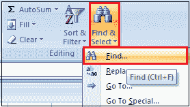
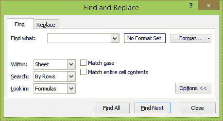
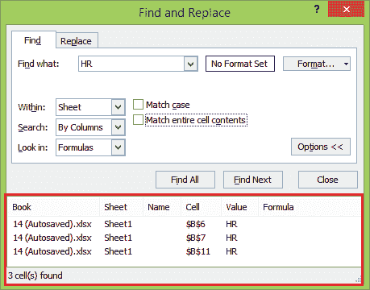
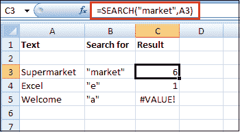
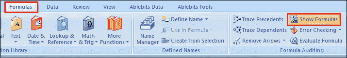
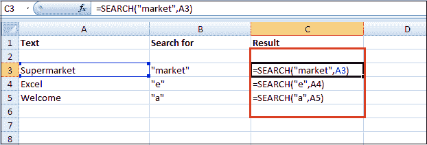
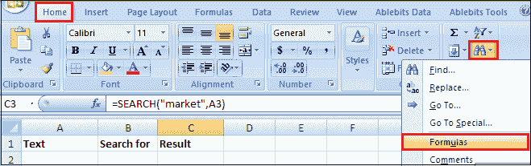
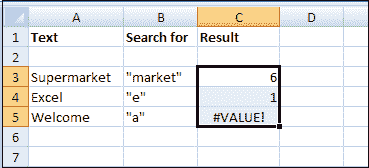

# 如何在 Excel 中搜索？

> 原文：<https://www.javatpoint.com/how-to-search-in-excel>

在 Excel 中有多种搜索方式。第一个选项是在海量电子表格中的一个单元格或一组单元格中查找特定的数据。

第二个选项包括使用类似 **VLOOKUP** 或 **HLOOKUP** 的搜索功能，让您在一张工作表中搜索数据，并在第二个单元格位置或不同的工作表中输出结果。

大多数情况下，在 Excel 电子表格中搜索很容易。如果无法扫描所有行和列，可以使用 Ctrl + F 打开搜索对话框。如果您正在处理一个非常大的电子表格，使用这四个查找函数之一可以节省大量时间。

### 如何使用搜索栏进行搜索

按照以下步骤使用搜索工作表栏在 excel 中搜索特定数据。

**第一步:**点击电子表格右上角带有模糊文字“**搜索表单**的任务栏，在表单中输入想要搜索的文字或数字。

**第二步:**如果使用 Mac 查找数据，请按**进入**或**返回**。然后使用搜索词旁边的箭头跳转到下一个或上一个数据。

**第三步:**另外，在 Mac 上使用“command + F”键盘快捷键，在 PC 上使用“Control + F”快捷键，可以快速访问这个搜索栏。

### 如何使用查找功能进行搜索

随着 [Excel](https://www.javatpoint.com/excel-tutorial) 打开您的带有数据的电子表格，您可以使用直接的单词搜索或使用特殊的通配符在电子表格上找到任何内容。按照以下步骤在 Excel 中使用查找功能:

**步骤 1:** 转到**主页**选项卡。在编辑组中选择**查找&选择**按钮，然后选择**查找**功能。



**步骤 2:** 您将看到一个简单的查找和替换窗口。此外，您可以通过选择 ***选项*** 来查看所有高级选项。



您可以使用以下选项来微调您的搜索:

*   **查找内容:**键入要在工作表中查找的文本或数字。
*   **格式:**选择此按钮，仅搜索在“查找格式”窗口中定义的格式文本。
*   **在:**内选择 ***工作表*** 或 ***工作簿*** 在当前工作表内或整个工作簿内搜索。
*   **搜索** **:** 选择 ***【按行】*** 或 ***【按列】*** 进行一次一行或一次一列的搜索(找到结果时停在该行或该列上)。
*   **向内搜索:**通过告诉搜索者向内搜索****值、注释*** 或 ***注释*** ，可以加深对电子表格其他区域的搜索。*
**   **匹配大小写:**这将使用区分大小写的文本匹配进行搜索。*   **匹配整个单元格内容:**这将搜索只包含您键入的文本的单元格。*

 *如果您选择 ***【查找下一个】*** 按钮，您将在电子表格中看到文本高亮显示的每个事件。再次选择按钮，进入下一个结果。如果您想一次查看全部，请选择 ***查找全部*** 按钮。

**步骤 3:** 这将在窗口底部的列表中显示所有结果，以及找到它们的工作表和单元格编号。只要选择其中任何一个，就可以看到工作表中的单元格。



### Excel 搜索通配符

当您在“查找内容”字段中键入搜索字符时，您必须了解通配符的工作原理。这些选项允许您自定义更高级的搜索，以便您可以在 Excel 中搜索并在工作表中找到您想要的内容。

*   **问号(？):**替换任何单个字符或数字。例如，键入 **c？t** 查找任何以 c 开头、以 t 结尾的三字母单词，如 cat、cut 或 cot。
*   **星号(*):** 替换部分单词。例如，键入 **c*t** 从购物车中查找任意长度的单词，并进行计数和计算。
*   **颚化符(~):** 使用该字符覆盖上面的特殊字符。例如，如果你想找到“用户”这个词包括问号，可以输入**用户~？**这将覆盖特殊？要搜索的字符，包括问号。

### Excel 搜索功能

Excel 中的 SEARCH 函数与 FIND 函数非常相似。它还返回子字符串在文本字符串中的位置。与 FIND 不同，SEARCH 函数是 ***不区分大小写的*** ，它允许使用通配符。

**语法**

下面是 SEARCH 函数的基本语法。

```

SEARCH(find_text, within_text, [start_num])

```

**例**

这里有一些例子来评估搜索功能。

**=SEARCH(“市场”、“超市”)**返回 6，因为子串“市场”从单词“超市”的第 6 个<sup>字符开始。</sup>

**= SEARCH(“e”，“Excel”)**返回 1，因为“e”是单词“Excel”中的第一个字符，忽略大小写。



和 FIND 函数一样，Excel 的 SEARCH 函数也返回#VALUE！错误如果:

*   ***find_text*** 参数的值未找到。
*   ***start_num*** 的参数大于 ***的长度 _text*** 。
*   ***Start_num*** 等于或小于零。

### 如何使用函数进行搜索

在 Excel 中，许多有用的函数允许您搜索列、行或表来查找信息并返回相关信息。

以下是在 Excel 中最常用的搜索函数的几个例子。

**1。VLookup 功能**

此函数允许您指定一列和值。它将从不同列的相应行中返回一个值。下面是函数的语法:

```

=VLOOKUP([lookup_value], [table_array], [col_index_num], [range_lookup])

```

*   **【lookup _ value】**是你已经拥有的信息。
*   **【table _ array】**允许您指定函数将在其中查找和返回值的单元格。选择范围时，请确保数组中包含的第一列是将包含查找值的列。
*   **【col _ index _ num】**是包含返回值的列的编号。
*   **【range _ lookup】**是可选参数，取 1 或 0。如果输入 1 或省略此参数，函数将查找您输入的值或倒数第二个数字。

**2。HLOOKUP 功能**

其中 VLOOKUP 在另一列中找到相应的值，HLOOKUP 在不同的行中找到相应的值。因为通常最简单的方法是扫描列标题，直到找到正确的标题，并使用过滤器来查找您要查找的内容，所以当您有非常大的电子表格，或者您正在处理按时间组织的值时，HLOOKUP 最适合使用。

下面是函数的语法:

```

=HLOOKUP([lookup_value], [table_array], [row_index_num], [range_lookup])

```

*   **【lookup _ value】**是您知道并想要为其找到对应值的值。
*   **【table _ array】**是要搜索的单元格。
*   **【row _ index _ num】**指定返回值将来自的行。
*   **【range _ lookup】**与 VLOOKUP 中相同。如果可能，请将其留空以获取最近的值，或者输入 0 以仅查找完全匹配的值。

**3。索引和匹配功能**

索引和匹配是两个不同的函数，但是当它们一起使用时，它们可以使搜索大型电子表格变得更快。这两种功能都有缺点，但是通过结合它们，我们将建立在两者的优点之上。

下面是这两个函数的语法:

```

=INDEX([array], [row_number], [column_number])

```

*   **【数组】**是你要搜索的数组。
*   **【row _ number】****【column _ number】**可以用来缩小搜索范围(我们一会儿来看看。)

```

=MATCH([lookup_value], [lookup_array], [match_type])

```

*   **【lookup _ value】**是一个搜索词，可以是字符串，也可以是数字。
*   **【lookup _ array】**是微软 Excel 查找搜索词的数组。
*   **【match _ type】**是可选参数，可以是 1、0 或-1。1 将返回小于或等于您的搜索词的最大值。0 将只返回您的准确术语，而-1 将返回大于或等于您的搜索术语的最小值。

### 如何搜索 Excel 公式

在 Excel 中，对公式的搜索略有不同，因为公式在单元格中显示数字。很难知道哪些单元格包含数字，哪些单元格包含公式。

为了帮助您找到哪些单元格包含公式，Excel 提供了两种选择:

1.  在单元格中显示公式(而不是数字)。
2.  突出显示包含公式的单元格。

要在电子表格中显示(或隐藏)公式，有两种方法，例如:

**方法 1:** 按 Ctrl +(一个重音庄重字符，与~号出现在同一个键上，通常在靠近键盘顶部的数字 1 键的左边)。

**方法二:**点击 ***公式*** 选项卡，然后在 ***公式审核*** 组中点击 ***显示公式*** 按钮。



此图像显示了当公式出现在单元格内时电子表格的外观。



要突出显示包含公式的所有单元格，请按照下列步骤操作:

**第一步:**转到 ***首页*** 选项卡。

**第二步:**点击 ***在编辑组中找到&选择*** 图标。出现一个下拉菜单。



**第三步:**然后点击**公式**。Excel 突出显示所有包含公式的单元格。



### 搜索和查找功能的区别

在 Excel 中，***【FIND】******【SEARCH】***函数在语法和用法上非常相似。但是，仍然存在一些区别，使它们在 Excel 中解决查询时具有选择性。

| 查找功能 | 搜索功能 |
| 查找功能用于查询字符串和文本流中的某个子字符串或字符。 | 搜索函数用于获取子字符串或字符串中文本的初始字符。 |
| 使用 find 函数查询字符串的语法如下所示:

```
Syntax: =FIND(find_text, within_text,[start_num])
```

 | SEARCH 函数的语法可以描述如下:

```
Syntax: =SEARCH(find_text, within_text,[start_num])
```

 |
| 使用查找功能对文本进行精确搜索。使用查找功能时确认字符的敏感度，因为它是区分大小写的功能。 | 搜索函数在搜索过程中不区分大小写字符，因为它是一个不区分大小写的函数。 |
| 查找功能不允许通配符。 | 搜索功能允许通配符，如“*”、“？”。

*   A question mark (? ) matches a character,
*   The asterisk (*) matches any series of characters.

 |

* * **