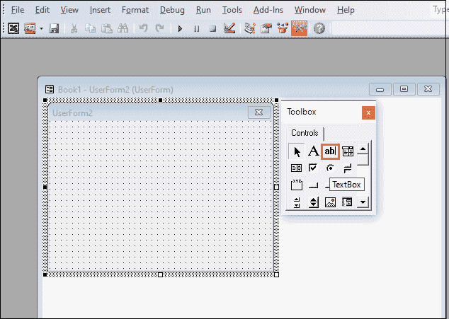

# 如何在 Excel 中添加文本框

> 原文：<https://www.javatpoint.com/how-to-add-a-text-box-in-excel>

文本框也称为**文本字段**。它是一个**矩形容器**，用于在页面(如网页浏览器、门户网站、文字处理器、登录或注册页面、Gmail 等)**上输入信息**(文本)。

### 文本框的类型

主要有以下两种不同格式的文本框-

**1。单行文本框**

单行文本框是一个简单/小的框，用于输入单行信息，如个人姓名、号码、电子邮件地址或其他简短信息。

**2。多行文本框**

多行文本框用于输入大量信息(多行信息)，如教育详情、关于您自己、工作经历等。

### 文本框的优点

1.  文本框帮助我们在链接单元格中存储键入的文本。
2.  它可以帮助您在不改变列宽的情况下创建一个大的数据输入点。

### 在 Excel 中添加文本框

[Microsoft Excel](https://www.javatpoint.com/excel-tutorial) 提供了在文档中添加文本框以增加工作表功能的简单易行的方法。在 Excel 中，可以根据需要创建文本框。

在 Microsoft Excel 文档中添加文本框有以下几种最简单的方法-

#### 注意:以下方法用于在 Microsoft Excel 2007、Excel 2010、Excel 2013、Excel 2016、Excel 2019 以及 Microsoft Office 365 中添加文本框。

**方法 1:使用开发者选项卡**手动添加文本框

开发人员选项卡是在 Microsoft Excel 文档中添加文本框最简单快捷的方法之一。

**在 Excel 中添加文本框的步骤**

在微软 Excel 文档中添加文本框的步骤列表如下-

**第一步:**在桌面双击微软 Excel 图标，打开 Excel 文档。

**第二步:**转到**文件- >新建- >空白文档- >创建**打开新的微软 Excel 文档。**点击文件- >打开- >浏览你的文件位置- >打开按钮**打开一个已有的微软 Excel 文档。(我们将打开一个新的微软 Excel 文档。)

**第三步:**点击功能区的**显影剂标签**。如果功能区上没有显示“开发人员”选项卡，则首先启用功能区的“开发人员”选项卡。

#### 注意:要启用开发人员选项卡，请转到文件->选项->自定义功能区->主选项卡->勾选开发人员选项卡复选框->确定。

**步骤 4:** 点击**控件**部分下的**插入下拉图标**。将出现一个选项列表。在 **ActiveX 控件**下，点击**文本框工具** (ActiveX 控件)，如下图截图所示。

**第五步:**将光标放在要添加文本框的文档位置。根据需要拖动电子表格/工作表中的文本框。

现在，下面给出的截图显示了一个文本框被添加到微软 Excel 文档中。

#### 注意:右键单击文本框，然后单击格式控件选项卡以指定控件属性。

### 方法 2:使用“插入”选项卡添加文本框

Microsoft Excel 还允许您使用功能区中**插入选项卡**下的文本框选项在文本框中添加所需的文本。

**插入文本框的步骤**

下面讨论在微软 Excel 文档中插入文本框的步骤列表-

**第一步:**进入桌面下方的**搜索框**。键入**微软 Excel** 并按**回车键**打开微软 Excel 电子表格。

**第二步:**点击**文件- >新建- >空白文档- >创建**打开**新的微软 Excel 文档**。点击**文件- >打开- >浏览文档位置- >打开按钮**打开一个**现有的微软 Excel 文档**。

#### 注意:在我们的例子中，我们将打开一个现有的微软 Excel 文档。

**第三步:**在功能区，点击**插入选项卡**，然后点击**文本部分**下的**文本框**选项。

#### 注意:在 Microsoft Excel 2013 和更高版本中，请转到“格式”选项卡，然后单击“插入形状”部分中的“文本框”图标。

**第四步:**用鼠标指针拖动工作表上的文本框。根据您的要求调整文本框的高度和宽度。

**第五步:**将光标放在文本框内，开始书写要添加到文本框中的文本。请看下面给出的截图。

**第六步:**完成文本框内的文字后，按 **Esc** 取消编辑模式或点击文本框外的任意位置。现在，下面的截图显示文本被添加到微软 Excel 电子表格中。

### 方法 3:添加一个带有 VBA 的文本框

在 Microsoft Excel 文档中，还可以使用编程概念添加文本框。在这种方法中，您可以使用**插入选项卡**中的**用户表单**选项来添加文本框。用户表单是最常用的工具，包含各种不同的控制选项，如**文本框、消息框、输入框等。**

**添加文本框的步骤**

按照下面给出的最简单的步骤添加带有 VBA 的文本框-

**步骤 1:** 打开**一个新的或现有的微软 Excel 文档**添加一个文本框。

**第二步:**从键盘上同时按下或击下 **Alt + F11** 键，打开/导航至 **VBA 窗格**。

**第三步:**进入**插入选项卡**，屏幕上会出现一个选项列表。点击**用户表单**选项，在 VBA 插入用户表单。

**第 4 步:**一个小的**工具箱对话框**将出现，带有用户表单窗口。从工具箱对话框中选择**文本框**，如下图所示。

**第 5 步:**将文本框拖动到用户表单窗口。

#### 注意:按键盘上的 F4 键查看用户表单的所有属性。使用这些属性，您可以轻松地进行必要的更改，如更改用户表单、字体、标题、高度等的名称。

**第 6 步:**在文本框中键入您想要的文本(我的第一个 VBA 文本框)。

* * *