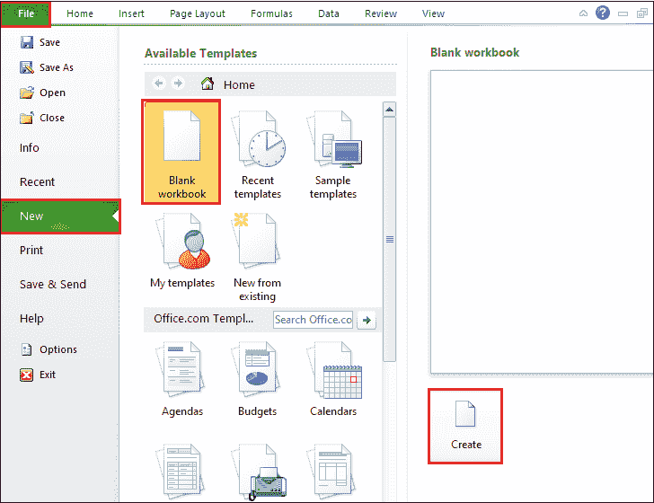
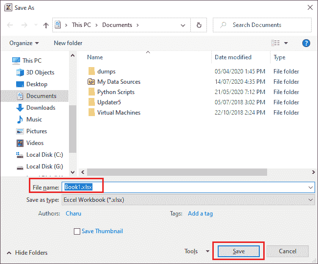
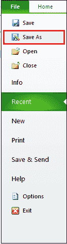
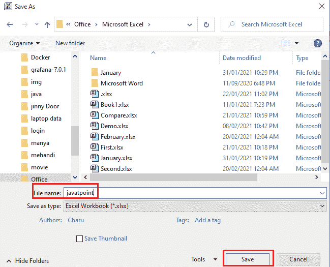
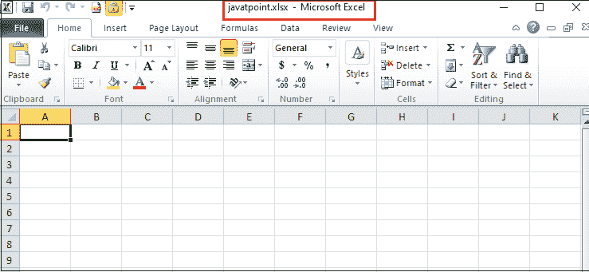
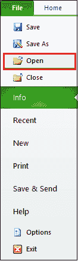
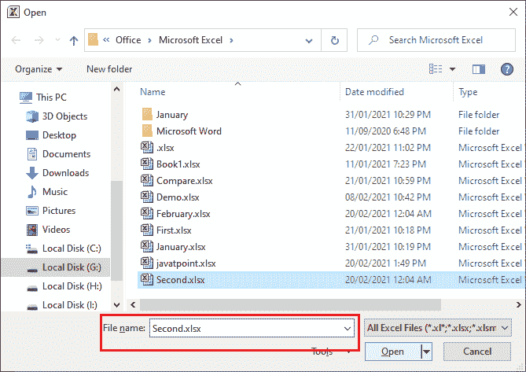
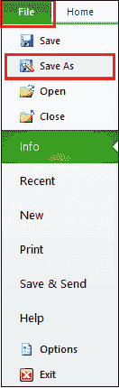
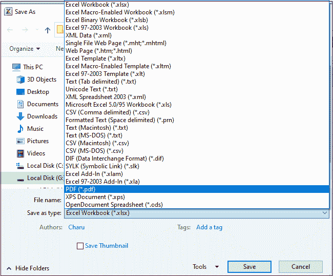

# 如何保存 Excel 文档

> 原文:[https://www.javatpoint.com/how-to-save-excel-document](https://www.javatpoint.com/how-to-save-excel-document)

众所周知，保存选项几乎在每个平台上都可用。保存选项用于将您的书写数据存储在安全的地方，如软盘、本地系统驱动器、特定文件夹(如我的文档、桌面等)、硬盘、USB 以及闪存驱动器。

#### 注意:一些在线平台和网站会自动保存您的文档以及您在文档中所做的更改。

我们需要保存文档，因为如果我们不保存文档，那么当系统崩溃、重新启动或断电时，数据就会丢失。

在[微软 Excel](https://www.javatpoint.com/excel-tutorial) 中，保存选项位于文档左上角的**文件选项卡**下。

#### 注意:在“文件”选项卡下，您还可以使用“另存为”选项来重命名已创建的文档，或者制作已创建的 Excel 文档的类似副本。

### 保存 Excel 文档的方法

保存 Excel 文档的方法列表如下-

1.  [使用键盘快捷键](#keyboard-shortcut-keys)保存 Excel 文档
2.  [使用功能区](#File-tab)上的文件选项卡保存 Excel 文档
3.  [将 Excel 文档保存为 PDF 文件格式](#PDF-file-format)

### 方法一:使用键盘快捷键保存 Excel 文档

快捷键是将 Microsoft Excel 电子表格保存到所需位置的最简单快捷的方法。按照以下步骤使用键盘快捷键保存 Excel 文档-

**第一步:**进入**搜索框底部，在搜索框中输入微软 Excel** ，然后从键盘上按下**回车键**。

**第二步:**屏幕上会出现一个微软 Excel 文档。点击**文件- >新建- >空白文档- >创建**打开一个新的微软 Excel 文档。点击**文件- >打开- >浏览文档位置- >打开**打开一个已有的微软 Excel 文档。

#### 注意:在我们的案例中，我们将打开一个新的空白微软 Excel 文档。

**第 3 步:**在文档中键入或准备要保存以备将来使用的数据。

**第四步:**按 **Ctrl + S** 键。屏幕上将出现**另存为对话框**。**浏览想要保存文档的位置**。**在**文件名文本框**中输入所需的文件名**。点击【另存为】对话框底部的**保存**按钮，如下图所示。

#### 注意:如果您打开一个现有的 Microsoft Excel 文档，请从键盘上按 Ctrl + S 键。Microsoft Excel 文档将自动保存更改。

现在，您可以看到您的 Microsoft Excel 文档将保存到您想要的位置。

### 方法 2:使用功能区上的“文件”选项卡保存 Excel 文档。

这是将微软 Excel 文档保存在本地驱动器或计算机特定文件夹中的最古老的方法。

**保存 Excel 文档的步骤**

下面讨论使用“文件”选项卡保存微软 Excel 文档的分步过程

**注意:**以下步骤用于保存 Excel 2019、Excel 2016、Excel 2013、Excel 2010、Excel 2007、Microsoft Office 365 中的 Microsoft 文档。

**第一步:**双击微软 Excel 图标，打开一个新的微软 Excel 文档。

**第 2 步:**创建或准备一个您想要保存以备将来使用的数据列表。

**第三步:**点击微软 Excel 文档左上角的文件选项卡。屏幕上将出现文件选项列表。点击**另存为**选项，如下图所示。

#### 注意:您也可以单击文件->保存现有的微软 Excel 文档。

**第 4 步:**屏幕上将出现**另存为对话框**，在该对话框中执行以下操作-

1.**浏览想要保存当前文档的位置**。

#### 注意:要选择驱动器中的文件夹，请单击桌面选项，然后选择所需的位置来保存 Microsoft Excel 文档。

2.在新的微软 Excel 文档的**文件名文本框**中输入您想要的文件名。(例如，我们使用文件名作为 javatpoint)

3.点击另存为对话框底部的**保存按钮**保存文档。见下面给出的截图。

现在，下面的截图显示，您当前的 Excel 文档是用文件名 javatpoint 保存的。

### 方法 3:将 Excel 文档保存为 PDF 格式

微软 Excel 还允许我们将 Excel 文档保存为 PDF 文件格式。将 Excel 文档保存为 pdf 格式的优点是，PDF 文档易于共享、维护文档，并且加载文档所需的数据较少。

**将 Excel 文档保存为 pdf 文件格式的步骤**

以下是将 Excel 文档保存为 PDF 文件格式的最简单的步骤。

**第一步:**双击微软 Excel 图标，屏幕上弹出一个微软 Excel 文档窗口。

**第二步:**转到微软 Excel 文档的左上角，点击**剪贴板**部分下的**文件选项卡**。

**步骤 3:** 屏幕上将出现文件选项列表。点击**打开**选项打开现有文档。

**第四步:**屏幕上弹出**打开对话框**。选择要保存为 PDF 的文档。您选择的 excel 文档将出现在“文件名”部分。点击文档底部的**打开**按钮。

**第 5 步:**现在，您想要的文档出现在屏幕上。点击**文件**选项卡，将出现一个选项列表，其中点击**另存为**按钮。

**第 6 步:**将出现**另存为对话框**，执行以下操作-

1.  **在文件名文本框中输入您的文件名**。
2.  点击与**保存为类型部分**相关的下拉图标。文件格式列表将出现在屏幕上，点击 **PDF(*。pdf)选项**。
3.  点击**另存为对话框**底部的**保存按钮**，如下图截图所示。

现在，您可以看到您想要的 Excel 文档将以 PDF 文件格式保存。

* * *