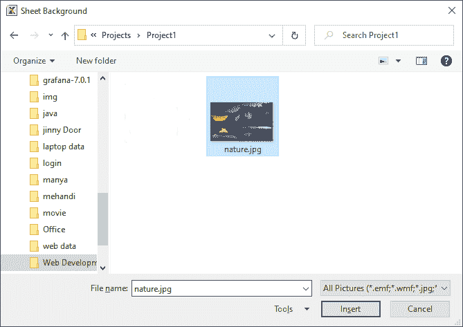

# 如何在 Excel 中设置背景图像

> 原文：<https://www.javatpoint.com/how-to-set-background-image-in-excel>

背景图像也称为**水印。**微软 Excel 允许您在文档中添加背景**图像、徽标和背景颜色**，以使文档更加**吸引人、美观和醒目**。

#### 注意:在 Microsoft Excel 文档中，不能同时向多个 Microsoft Excel 文档添加背景图像。

**设置背景图像的方法**

按照以下方法在 Excel 中设置背景-

1.  [使用页面布局选项卡](#Page-Layout-tab)在 Excel 中添加背景
2.  [使用键盘快捷键](#keyboard-shortcut-keys)添加背景图像
3.  [用填充颜色工具](#fill-color-tool)添加背景
4.  [用 Excel 的 Kutools 添加背景图](#Kutools-for-Excel)

### 方法一:使用页面布局选项卡在 Excel 中添加背景

**在 Excel 中添加背景的步骤**

在 Excel 中添加背景有以下步骤-

#### 注意:使用以下步骤，您可以在 Microsoft Excel 2007、2010、2013 和 2019 中设置背景图像。

**第一步:**打开新的[微软 Excel](https://www.javatpoint.com/excel-tutorial) 文档**(文件- >新建- >空白文档- >创建**或现有的微软 Excel 文档**(文件- >打开- >浏览文档位置- >打开按钮)**在其中添加背景。

**第二步:**点击功能区的**页面布局选项卡**。点击**页面设置**部分中休息选项旁边的**背景**。请看下面给出的截图。

#### 注意:在微软 2003 中，点击格式->工作表->背景。

**步骤 3:** 电子表格上将出现一个小的**工作表背景对话框**。**浏览想要设置的背景图片**，点击对话框底部的**插入**按钮，如下图截图所示。

现在，下面的截图显示您想要的背景图像将出现在微软 Excel 文档中。

### 方法 2:使用键盘快捷键在 Microsoft Excel 中添加背景图像

微软 Excel 还允许我们使用键盘快捷键快速轻松地添加或设置背景图像。

**设置背景的步骤**

下面列出的步骤显示了如何在微软 Excel 文档中设置背景图像-

**第一步:双击微软 Excel 图标上的**打开一个微软 Excel 文档。

**步骤 2:** 打开新的或现有的微软 Excel 文档。

1.  点击**文件- >新建- >空白文档- >创建打开**一个新的空白微软 Excel 文档。
2.  点击**文件- >打开- >浏览文档位置- >打开按钮**打开一个已有的微软 Excel 文档。

**注意:**在我们的案例中，我们将打开一个现有的 Microsoft Excel 文档。

**第三步:**从键盘上同时按下 **Alt + P + G 键**打开**图纸背景对话框**。在 Excel 文档上浏览需要设置的背景，点击【工作表背景】对话框底部的**插入按钮**。

**第 4 步:**现在，可以看到您首选的背景添加到了 Microsoft Excel 文档中。

**步骤 5:** 转到功能区上的**页面布局**选项卡和**取消勾选**工作表选项**组中与视图**相关联的复选框，以从背景中移除网格线并使背景更具吸引力。请看下面给出的截图。

### 方法 3:使用填充颜色工具添加背景

微软 Excel 还允许你用**填充颜色**工具添加背景。在该方法中，使用**填充颜色选择器**来添加背景颜色。

**在微软 Excel 文档中添加背景的步骤**

在微软 Excel 文档中添加背景的步骤列表如下-

**第一步:**打开**一个新的或现有的微软 Excel** 文档，在该文档中你要用填充颜色工具添加背景。

**第二步:**从键盘上按下 **Ctrl+A 键**选择整个微软 Excel 文档。

**第三步:**在微软 Excel 文档的左上角，点击**单元格选择**菜单下的**垂直箭头**，如下图所示。

**第四步:**现在，点击**首页选项卡**，点击**字体组**下的**填充颜色下拉菜单**图标。文档上将出现一个颜色选择器。选择要在 Excel 文档中用作背景的颜色。

下面的屏幕截图显示，您选择的背景颜色应用于微软 Excel 文档。

### 方法四:在 Excel 中添加可打印背景

微软 Excel 通过其**插入水印功能**帮助您在微软 Excel 文档中添加**可打印背景图像**。这是根据您的要求在电子表格中插入背景图像或文本水印的最快方法。

**在 Excel 中添加可打印背景的步骤**

下面讨论了在 Excel 中添加可打印背景的步骤列表-

**步骤 1:** 打开要添加可打印背景的新的或现有的 Microsoft Excel 电子表格。

**第二步:**点击首页选项卡旁边的**插入选项卡**，然后点击**插图**组中的**形状**下拉图标。文档上会出现一个形状列表，选择一个**矩形形状**，见下图截图。

**第 3 步:**在电子表格中绘制一个您需要的任意大的形状。

**步骤 4:****绘图工具**处于活动状态，并出现在电子表格的顶部。点击**形状填充按钮**，**选择要填充形状的颜色**。

#### 注意:在我们的例子中，我们用白色填充形状。

**第五步:**现在，点击**外形轮廓**选项。一个**颜色选择器**将出现在屏幕上，在其中选择您想要应用到形状的轮廓颜色。

**第六步:右击形状上的**，弹出一个小对话框，里面有选项列表。点击**格式形状**选项。

**第 7 步:**屏幕上会出现一个**格式图片对话框**，在该对话框中执行以下操作-

1.  点击左窗格中的**填充选项**。
2.  点击**图片或纹理填充**单选按钮。
3.  点击**从**插入部分的**文件**按钮，浏览要用作背景图像的图像。
4.  勾选平铺图片作为纹理复选框。
5.  **根据您的要求添加透明度**。
6.  现在，点击【图片格式】对话框底部的**关闭**按钮。

下面的截图显示您想要的背景设置为微软 Excel 文档。

* * *