# 如何在 Excel 中从 CSV 文件导入数据

> 原文：<https://www.javatpoint.com/how-to-import-the-data-from-csv-file-in-excel>

CSV 指的是**逗号分隔值**，表示存储数据的方法。CSV 文件基本上是一个逗号分隔的值文件，以纯文本形式保存表格数据。它被许多流行的电子表格程序使用，如 Excel 电子表格和谷歌电子表格。

> CSV 数据是由逗号分隔的纯文本值，但以表格形式存储。

CSV 文件是一个**简单文本文件**，不包含任何格式、编辑、宏或数学操作。除此之外，CSV 文件不允许数据操作。因此，CSV 文件也被称为**平面文件**。它以表格形式存储数据，与 [Excel](https://www.javatpoint.com/excel-tutorial) 相同，扩展名为. csv。

## 为什么 CSV 数据需要导入 Excel 文件

CSV 文件是一个简单的文本文件，不包含任何格式、编辑、宏或数学操作。CSV 文件也称为**平面文件**，因为 CSV 文件不允许数据操作。因此，您必须将数据导入到 Excel 工作表中才能对数据进行操作。

将 CSV 文件数据导入 Excel 工作表，然后允许对其进行操作。我们通过一个例子讨论了将数据导入 Excel 文件的步骤。

本章将向您展示 Excel 用户如何轻松地将 CSV 文件数据导入 Excel 工作表。让我们看看怎么做。

## 将 CSV 数据导入 Excel 文件的步骤

以下是将 CSV 文件数据导入 Excel 文件的步骤:

**第一步:**首先打开一个空白的 Excel 文件，导航到 Excel 菜单栏中的**数据**选项卡。

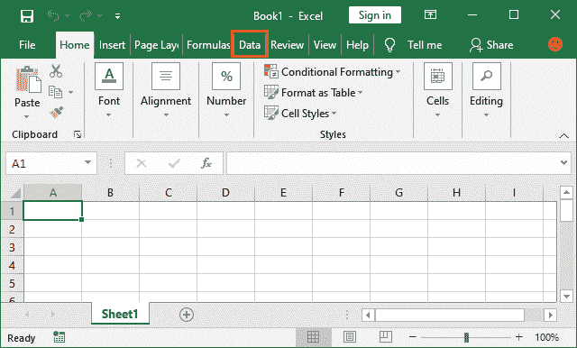

**第二步:**在数据功能区，你会看到**获取外部数据**下拉按钮；点击它。

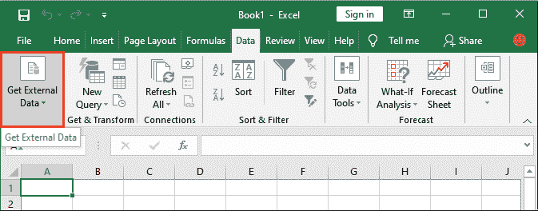

**第三步:**从下拉列表中，点击**从文本**选项。“从文本”选项允许将纯文本数据(CSV 数据)导入 Excel 工作表。

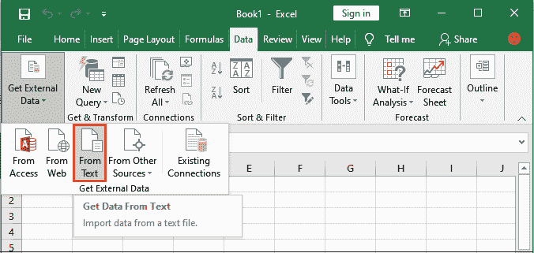

**第四步:**浏览系统文件夹中的 CSV 文件，选中后点击**导入**按钮。

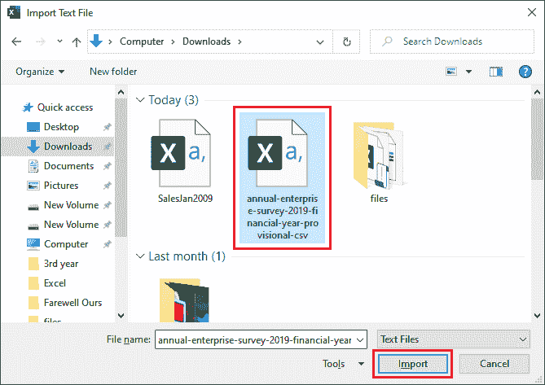

现在，您必须完成三个步骤:

1.  选择最能描述数据的文件类型，并指定数据是否有标题。
2.  设置数据将包含在 Excel 中的分隔符。
3.  将列数据格式设置为**常规**。

**第五步:**将打开文本导入向导。这里，选择最能描述我们的数据的文件类型**分隔的**。

在同一个向导中，标记“**我的数据有表头”**，然后点击**下一步**按钮。

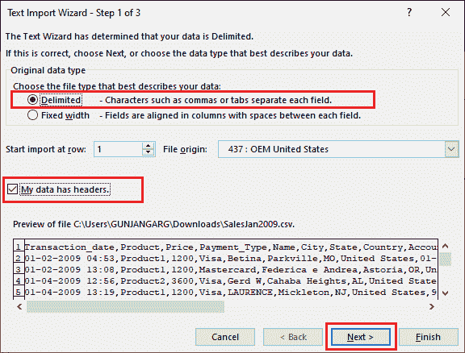

**第 6 步:**在此设置逗号分隔符。选中逗号复选框，查看导入后数据在 Excel 工作表中的显示预览。点击**下一步**按钮。

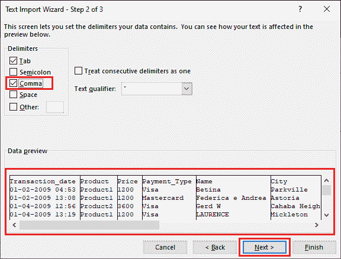

**第七步:**第三步/最后一步，通过标记单选按钮将列格式设置为**通用**，完成任务。

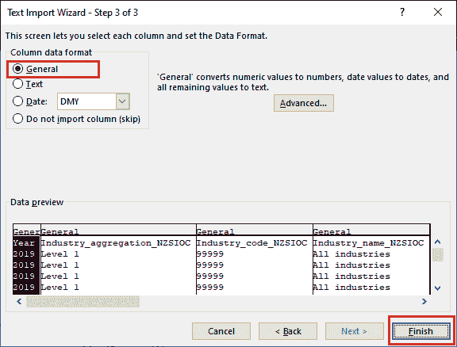

**第 8 步:**将打开一个新的弹出面板，选择要导入 CSV 文件数据的单元格，然后点击**确定**按钮。

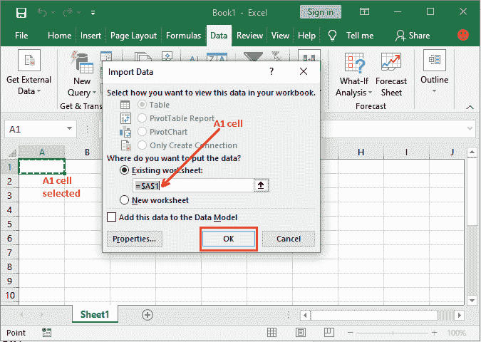

您也可以在 Excel 工作表上选择另一个单元格，CSV 文件将从该单元格开始导入。

**第 9 步:**您的 CSV 文件数据已成功导入 Excel 文件。现在，你可以对它进行数据操作了。

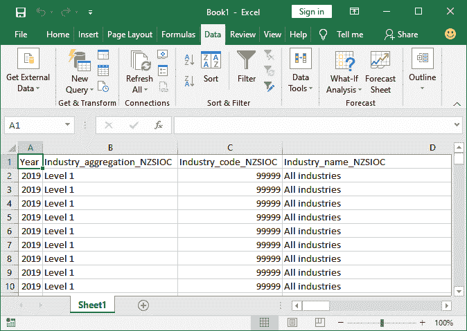

CSV 文件数据已导入到不同的列中，因为您已在步骤 6 中标记了逗号分隔符复选框。

## 如果不标记逗号分隔符选项呢？

如果没有标记逗号分隔符，一行中的所有数据将插入到由逗号分隔的一列中，如下面的预览部分所示。

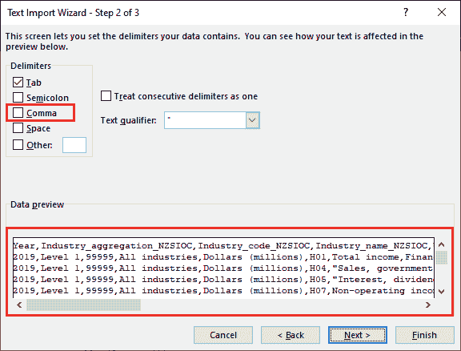

查看在 Excel 工作表中导入数据后的外观。它不太可读，因为所有内容都在一列中调整。

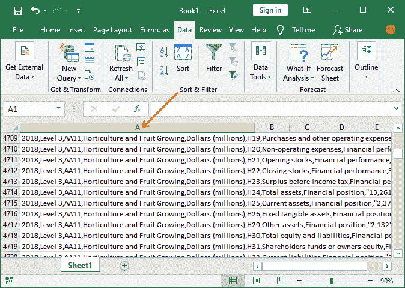

## CSV 文件与 Excel 文件有何不同

CSV 文件和 Excel 工作表都用于以表格形式存储数据。但两者都有一些区别；请参见下面的列表:

| CSV 文件 | excel 文件 |
| CSV 文件是一个简单的纯文本文件，它以表格形式存储数据，不包含格式、编辑、宏或数学运算。 | Excel 文件以表格形式存储数据，可以对数据进行格式化、宏、操作等操作。 |
| CSV 文件不允许数据操作。要对 CSV 数据执行操作，必须将其导入到 Excel 工作表中。 | 与 CSV 文件不同，Excel 允许对其数据执行数据操作。 |
| CSV 文件可以被任何文本编辑器编辑，像记事本，写字板。 | Excel 文件不能在任何文本编辑器中编辑。意味着 Excel 只能在 MS Excel 中打开。 |
| CSV 文件很容易以编程方式操作，因为它们是简单的文本文件。 | 作为开发人员，以编程方式操作 Excel 文件并不容易，因为 Excel 是合适的。 |
| CSV 文件限制对其数据执行各种功能。 | Excel 允许数据操作以及从外部来源获取数据。 |
| 在 CSV 文件中，您不能添加图表或图形。它只是将每条记录存储为一行文本文件，用逗号分隔。 | 在 Excel 文件中，您可以向 Excel 数据添加图表、图形和格式。 |
| 。csv 是 CSV 文件的扩展名。 | 。xls 或 xlsx 是 Excel 文件的文件扩展名。 |

* * *