# Excel 中的单元格是什么？

> 原文：<https://www.javatpoint.com/what-is-a-cell-in-excel>

单元格是微软电子表格必不可少的一部分。它是 Excel 工作表的一个对象。每当打开 Excel 时，Excel 工作表都会包含存储信息的单元格。在这些单元格中输入内容和数据。单元格是 Excel 工作表的构造块。所以，你应该知道每一点。

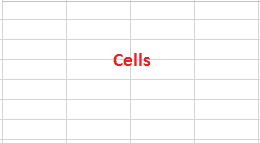

在 Excel 工作表中，单元格是一个矩形框。它是 Excel 电子表格的一个小单元。一张 Excel 工作表中大约有 170 亿个单元格，这些单元格用水平线和垂直线连接在一起。

Excel 工作表包含行和列中的单元格。行被标记为数字，列被标记为字母。这意味着行由数字标识，列由字母标识。

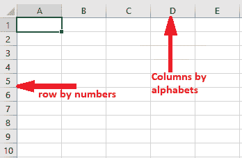

## 哪些数据可以进入单元格

Excel 由工作表中的一组单元格组成。您可以在这些单元格中输入数据。Excel 允许用户在 Excel 单元格中输入任何类型的数据，如数字、文本、日期和时间数据。无论您在单元格中输入什么，它都会出现在单元格内和公式栏中。

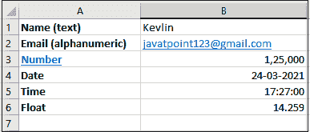

双击任一单元格使其可编辑，并将数据写入其中。在 [Excel](https://www.javatpoint.com/excel-tutorial) 中，可以在 Excel 单元格中输入任意类型的数据，如数字、字符串、文本、日期、时间等。此外，用户还可以对其进行操作。

## 如何识别手机号？

在 Excel 中，您可以轻松识别当前所在的单元格编号。您可以在**名称框**中找到单元格编号，也可以从行和列标题中找到。

选中单元格时，标题中突出显示的行和列是单元格编号。请看下面的截图:

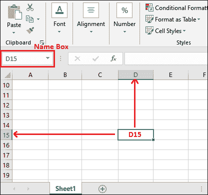

否则查看当前选中单元格的**名称框**内的单元格编号，得到单元格编号，如 D15。

## 在单元格中输入数据

要在单元格中输入数据/信息，双击任意单元格使其可编辑，并将数据写入其中。让我们用一个例子来理解。

## 删除单元格数据

选择单元格以及其中的数据，然后按**退格**或**删除**按钮删除单元格的内容。它将一次删除一个字母，这意味着 1 次点击退格/删除将只删除该单元格的一个字母。

您也可以一次删除单元格数据。为此，选择单元格数据，然后按下**退格**或**删除**按钮。选定的单元格内容将被删除。

也可以使用此**删除**按钮删除多个单元格的内容。为此，您必须选择包含要删除数据的单元格，然后按键盘上的**删除**键。所选单元格的数据将被删除。

## 删除单元格

删除单元格数据和删除单元格本身有很大的区别。所以，不要混淆他们。要删除单元格，您必须执行一些不同的步骤，如下所述:

**步骤 1:** 选择一个或多个要删除的单元格。例如 A3、A4 和 B3、B4。

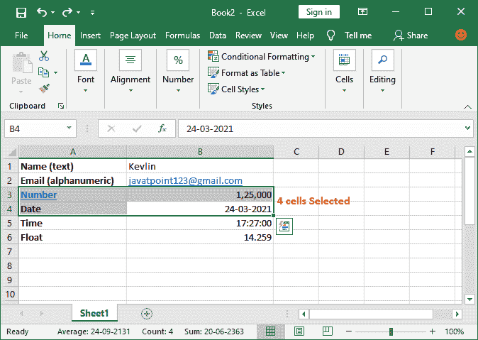

**步骤 2:** 右键单击任意选定的单元格，然后单击列表中的**删除**命令。

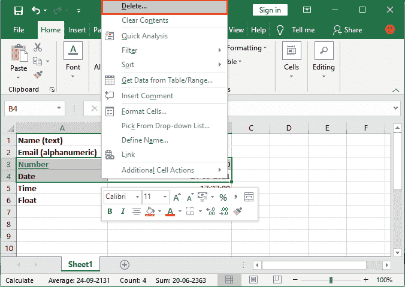

**第三步:**标记相关单选按钮，点击**确定**按钮。我们选择了**上移单元格**选项，将所选列的剩余单元格数据移到上一行。

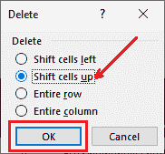

**第四步:**选中的单元格将被删除，剩余的单元格将在被删除的单元格处上移。

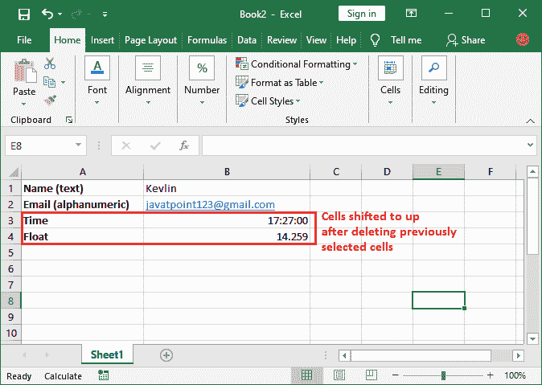

## 单元格范围

单元格区域是一个有起点和终点的区域。当多个单元格按顺序被选中时，称为**单元格区域**。单元格区域显示从开始单元格到结束单元格。选定的单元格必须按顺序排列，在选择时没有任何间隙。

**例如**，

**单元格区域 A1:A8**

在此范围内选择单元格 A1 至 A8。这意味着总共选择了 8 个单元格。

**单元格区域 A1:B8**

在该单元格范围内选择单元格 A1 至 A8 和 B1 至 B8。这意味着总共选择了 16 个单元格。

## 如何选择多个单元格

有时，需要在 Excel 工作表中选择大范围的单元格数据。您可以通过两种方式轻松选择更大的单元格组或单元格区域。用鼠标或 shift 和箭头键。

### 1.继续选择

首先，我们将使用这两种方法向您展示多个单元格的连续选择。

*   **用鼠标选择单元格**

单击一个单元格，按住鼠标左键并拖动，直到选择所有需要的单元格。

*   **用 Shift 和箭头键选择单元格**

还有一种方法可以同时选择多个单元格。您可以使用 **Shift** 键和**箭头键**(选择方向)来选择多个单元格。

首先，单击 Excel 工作表中的一个单元格。继续按 shift 键，并根据选择使用所需的箭头键来选择多个单元格。

### 2.分散选择

Excel 还允许从不同的行和列中选择多个单元格，而无需遵循上述任何连续的选择范围过程。我们只能用 Ctrl 键来做。

*   **用 CTRL 键选择分散的单元格**

Excel 提供了一种选择不同行和不同列的两个或多个单元格的方法。您可以使用 **CTRL** 键按住选择，然后选择要选择的单元格。

请记住，只有那些有数据的单元格才会被选中。即使使用 Ctrl 键也无法选择空白单元格。

## 剪切、复制和粘贴单元格数据

剪切、复制和粘贴是每个工具最常用的操作。Excel 允许其用户从一个位置复制或剪切内容，并将其粘贴到 Excel 中的另一个单元格。

Excel 还为这些操作提供了快捷命令。在 Excel 中使用 **CTRL + C** 复制、 **CTRL + P** 粘贴复制的内容、 **CTRL + X** 剪切。这些快捷键对于几乎所有工具都是一样的。

### 复制并粘贴单元格数据

**第一步:**选择要复制数据的单元格，按 CTRL+C 命令复制数据。

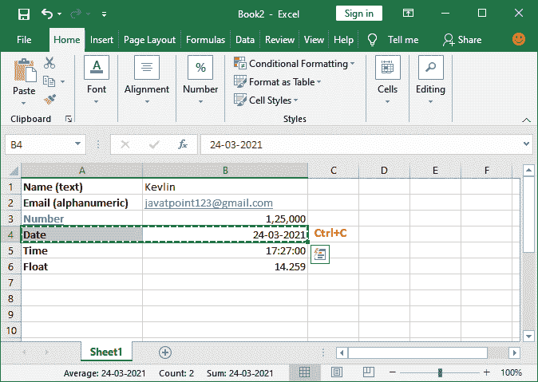

**第二步:**现在，转到要粘贴复制数据的地方，按 **CTRL+P** 快捷命令将数据放在那里。

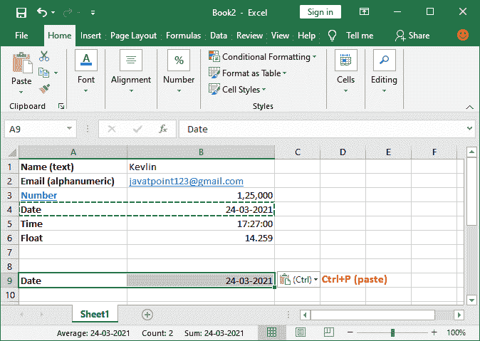

**步骤 3:** 您的数据已经从一个单元格复制并粘贴到另一个单元格。

### 剪切并粘贴单元格数据

**第一步:**选择要剪切数据的单元格，按 **CTRL+X** 命令。

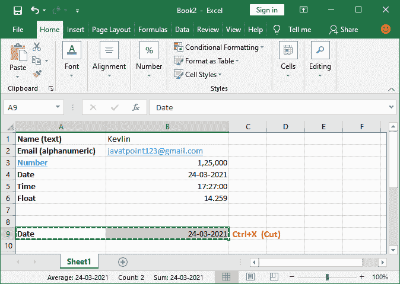

**第二步:**现在，转到要粘贴剪切数据的单元格，按 **CTRL+P** 快捷命令将数据放在那里。

**步骤 3:** 您的数据已经从一个单元格放入并粘贴到另一个单元格。

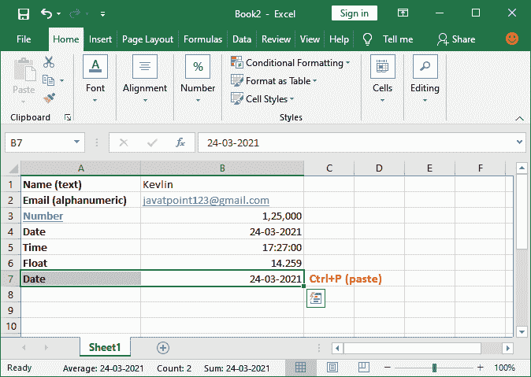

### 如何增加细胞的大小

在 Excel 中，可以通过以下方式增加单元格的大小:

1.  从行标题开始增加行的高度
2.  从列标题增加列的宽度
3.  合并两个或多个单元格以增加单元格大小
4.  增加字体大小，使单元格变大

您可以根据需要使用这些方法中的任何一种。

* * *