# 微软电子表格的使用

> 原文:[https://www.javatpoint.com/uses-of-ms-excel](https://www.javatpoint.com/uses-of-ms-excel)

微软 Excel 或微软 Excel 是微软开发的微软办公套件必不可少的软件程序。它是最强大的电子表格软件之一，使用行和列来组织数据。

Excel 似乎是一个必不可少的数据处理软件，主要用于管理家庭开支或生成一些基本报告。然而，excel 不仅仅是一个简单的报表程序。Excel 是功能强大的软件，可以帮助完成各种个人或商业用途的工作。所以 MS excel 的用途很多，列表还在继续。

在本文中，我们将讨论微软 Excel 的一些主要**用途，这些用途将有助于我们了解这一强大软件的潜力，以及不同的人或组织如何使用它来满足他们的需求。它们如下:**

*   数据输入和存储
*   执行计算
*   数据分析和解释
*   报告和可视化
*   会计和预算
*   业务数据的收集和验证
*   日历和日程
*   行政和管理职责
*   预测
*   自动化重复性任务

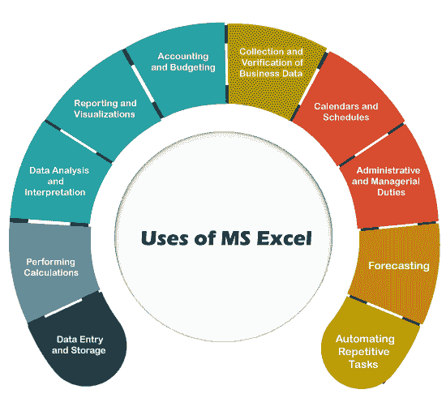

让我们详细讨论每一个:

## 数据输入和存储

当需要数据录入和数据存储时，excel 是满足基本需求的优秀软件。 [Excel](https://www.javatpoint.com/excel-tutorial) 是存储大量数据的绝佳选择。但是，excel 文件的大小受到设备计算能力和内存可用性的限制。通常，excel 工作表在表格形式中可以有 **1，048，576 行和 16，384 列**。一旦数据被组织在 excel 文件中，我们就可以将其用于各种目的。使用多种工具和公式，我们可以对数据进行大量操作。

除此之外，excel 中的数据表单等功能使输入和查看数据变得更加容易。使用这个，用户可以根据他们的业务需求构建定制的数据输入表单。此外，我们还可以使用 excel 为各种需求创建不同的列表。例如- **客户邮件列表、员工工作报告、员工轮班等**。

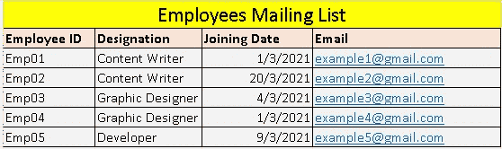

## 执行计算

微软 Excel 有很多内置的函数或公式可以用来处理数据。excel 中有 450 多个函数被相应地分类。excel 函数库中一些最常见的函数包括**金融、逻辑、文本、日期&时间、数学、**和**三角学**。我们可以在电子表格中的任何行、列和单元格上使用必要的函数或公式。

除了现有的函数之外，我们还可以通过一些编程技巧或使用宏来创建自定义公式。因此，我们不需要一次又一次地完成整个任务。一旦我们创建了特定的函数集，我们就必须放入相应的值来获得期望的结果。有了 excel，我们几乎可以进行每一种类型的计算(**加减乘除等。**)，而且是 MS Excel 的最佳使用之一。

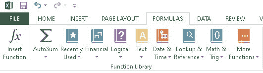

## 数据分析和解释

数据分析是微软 excel 必不可少的一部分。分析数据有助于做出改进决策。当数据在电子表格中更新后，我们可以使用**公式**和**透视表**来有效地分析数据和解释数字。使用这些功能，我们可以整合数据，并轻松地将重点放在大型数据集的关键部分。

通过应用排序、过滤或交换数据段等功能，可以更系统地管理表，以执行所需的数据字段。此外，我们可以截取特定部分的屏幕截图，并将其附加到 excel 中的特定区域，以创建具有精确可传达结果的交互式摘要报告。

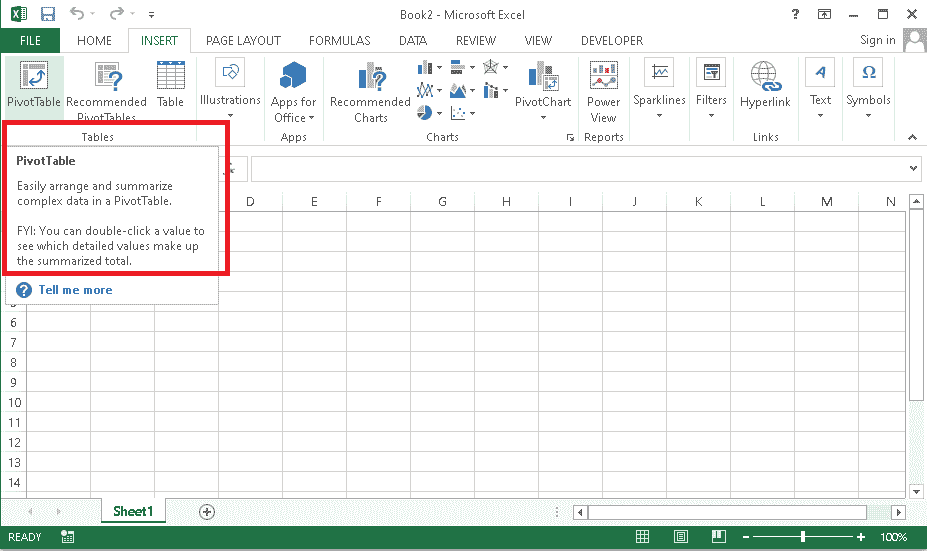

## 报告和可视化

图表、图形或其他可视化可以使任何简单的报告更有吸引力和意义。使用不同的图表以汇总的形式显示结果总是一种更好的方法，这也更有吸引力。一个简单的图表有时比数据范围相对较长的大表格更能覆盖和表达期望的结果。

由于可视化可能会有所帮助，微软 excel 提供了广泛的**内置图表模板**，我们可以轻松使用，无需太多努力。我们需要选择模板并输入数据来执行 excel 文件中的特定图表。此外，该软件还提供各种工具，使用特定的颜色样式、轴值、文本注释等创建自定义样式。

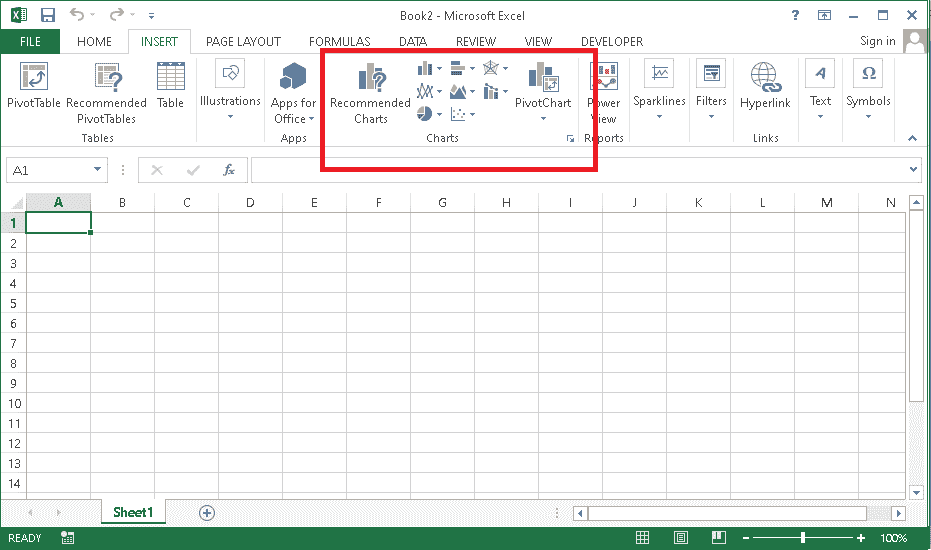

## 会计和预算

客户和预算经理最常使用 MS excel 来**维护客户记录**。使用 excel 软件的简单编辑工具来组织数据并保持数据最新是一种简单的方法。保持记录是客户经理的主要任务之一，因为这有助于他们与客户建立牢固的关系。这最终使会计或预算经理能够赢得客户的忠诚度，从而进一步产生重复销售。此外，他们可以很容易地从 excel 中找到细节，并在必要时与他人轻松共享。

为了简单起见，excel 还附带了许多会计和预算模板，可以相应地使用或修改。一些高级模板也可能包含一些公式或函数来执行基本到复杂的计算。因此，excel 是一个高效的会计和预算软件，帮助我们在相应的领域综合快速的结果。

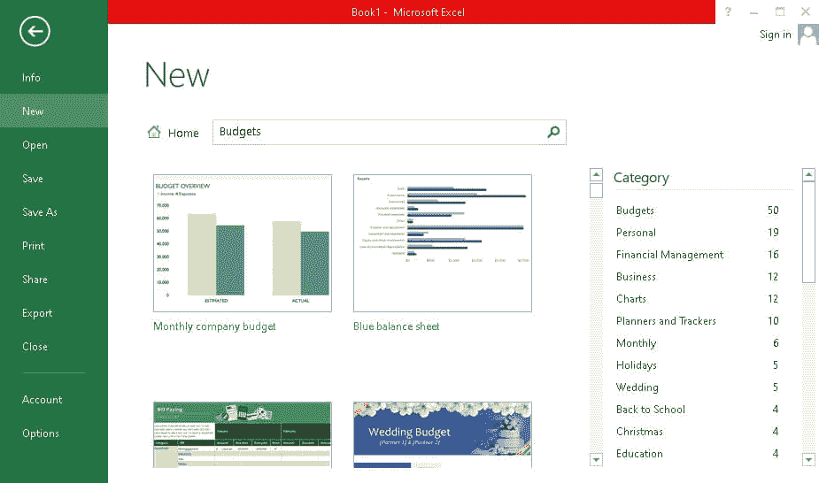

## 业务数据的收集和验证

大多数公司实施多个系统(如客户关系管理、库存等。)来分别管理它们的数据库和日志。对于特定的任务可以有不同的软件。由于 MS excel 是一个流行且应用广泛的软件，大多数第三方商业软件程序都是为了适应 MS excel 的特点而设计的。大多数软件的**记录可以导出到 excel** 中，方便访问。此外，excel 还可以进一步帮助编辑数据，例如删除重复条目。在 excel 中组织数据要容易得多，充分管理的数据无疑会影响未来的分析或结果。

除此之外，MS excel 由于其简单的交互式用户界面，可以很容易地被不同的人管理。人们也可以很快学会这个软件。除此之外，excel 报表易于共享，因此，数据可以交给其他员工或新经理。因此，使用 excel 从各种来源收集数据并验证其细节变得更加容易管理。

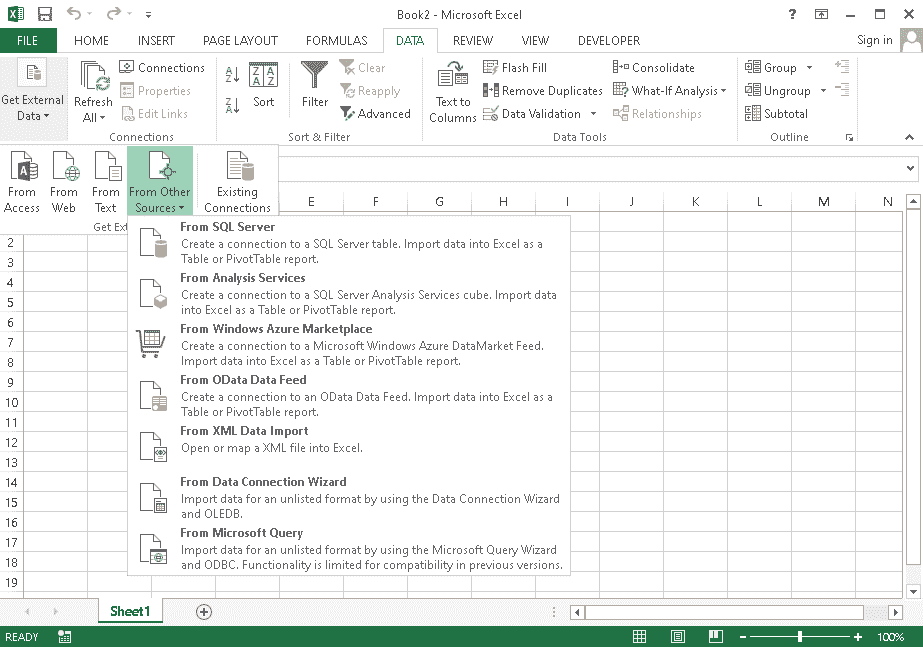

## 日历和日程

excel 的另一个重要用途是制作日历和日程表。Excel 提供了一些自动功能，可以帮助开发相应的连续日期或天数。我们不需要手动输入所有日期或天数。此外，我们可以使用 excel 中的行和列来适当地组织日期和天数，以**创建格式良好的日历**。创建日历后，我们还可以使用注释或文本来相应地添加特定日期或日期的日程或任务。

使用日历，公司也可以有效地设定他们的目标。他们还可以根据数据大小，在相同的工作表或不同的工作表中创建业务流程的年度报告。MS excel 最好的一点是，一些内置的即用日历模板可以从 excel 软件中下载并进行相应的修改。此外，excel 还允许用户使用不同的样式和可视化创建自定义模板，并保存它们以供进一步使用。

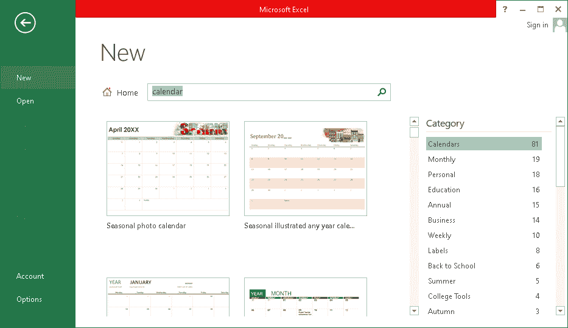

## 行政和管理职责

行政或管理职责的一个重要方面是**创建和维护多个业务流程**。MS Excel 就是解决方案。该软件不再仅仅用于记录。它在办公室管理中有利于许多其他任务，如**开具发票、支付账单、跟踪利润、损失、费用等。**

此外，办公室管理人员还使用 MS excel 存储财务报告、会计、业务分析和员工进度报告所需的数据。对于大多数中小型办公室来说，微软 excel 无疑是一个万能软件，管理着最大限度的办公活动。

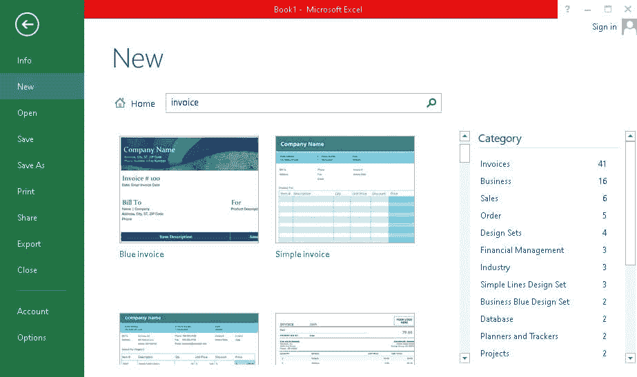

## 预测

企业需要组织数据并经常审查数据，以实现持续增长和改进。然而，了解作为应用输入的结果可能出现的各种场景或结果也是至关重要的。生成连续报告有利于未来的假设。这意味着可以通过使用过去的数据在一些基本层面上做出假设。

除此之外，当没有过去的数据但我们有目标时。Excel 有助于为我们计划实现的特定结果找到正确的输入。具体来说，可以使用功能**目标搜索分析**来完成。通过恰当地给出正确的目标，我们可以确定为实现既定目标需要采取的进一步措施。

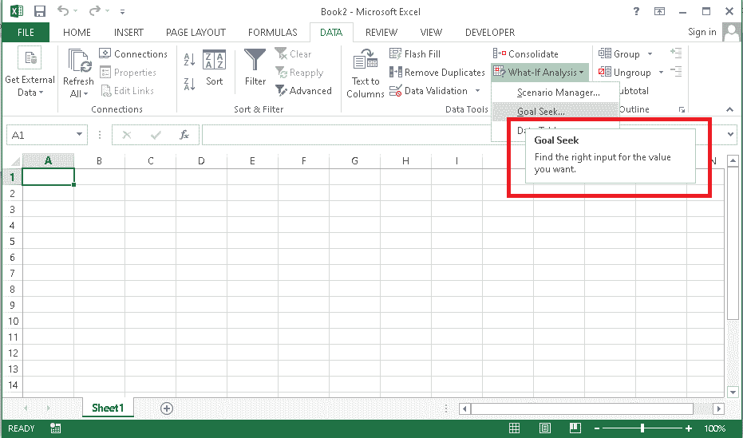

## 自动化重复性任务

Excel 是功能强大的软件，有一些高级功能可以帮助轻松解决复杂的问题。微软 excel 中的一个这样的功能是“Visual Basic”，它为开发人员提供了实现常规任务自动化的高级技能。一旦我们知道了微软 Excel 的高级水平，我们就可以使用**微软 visual basic 编辑器**自动生成报告。编辑器主要支持[VBA(Visual Basic for Applications)](https://www.javatpoint.com/vba)编码语言。

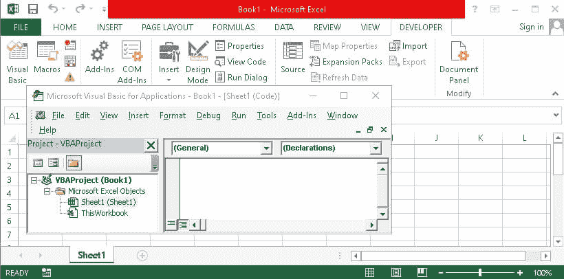

本文讨论了微软 excel 的十大用途；然而，这个功能强大的软件还有很多其他用途。如果说 MS Excel 的潜在用途几乎数不胜数，那也没有错。

* * *