# 如何减小 Excel 文件的大小

> 原文：<https://www.javatpoint.com/how-to-reduce-excel-file-size>

微软办公套件已经成为大多数商业环境中公司必不可少的软件包。MS Excel，也叫微软 Excel，是 Office 套件的一个软件程序，允许我们使用表格(带行和列)来放置我们的数据，并使用不同的 Excel 功能应用各种操作。Excel 已经成为大多数公司和个人不可替代的软件。

由于其令人印象深刻的功能，excel 在世界各地被广泛使用。然而，大多数人遇到了 excel 文件过大的问题。过大的文件大小会导致各种问题，例如:

*   通过使用大量资源(如内存和 CPU)来降低整个系统或操作系统的速度
*   保存时间长，当文件在网络上并且需要频繁更新数据时，会进一步对工作效率产生负面影响。
*   由于文件太大，超出了电子邮件或其他平台附件的限制，共享文件很困难。

因此，尽可能减小 excel 文件的大小是很重要的。这将提高工作流程的整体性能和生产率。我们可以利用一些技巧和方法来最大限度地减小 excel 文件的大小。

在本文中，我们讨论了两种不同的方法，可以用来最大限度地减少 excel 文件的大小。它们是:

*   手动减小 Excel 文件大小
*   一键缩小 Excel 文件大小

#### 注意:在尝试减小 excel 文件大小之前，请始终保留原始文件的副本。这将有助于在出现任何问题时恢复数据。始终建议创建原始文件的副本，并尝试仅处理此重复文件。它还将帮助我们在尝试方法之前和尝试减小文件大小的方法之后比较文件之间的结果。

让我们逐一讨论这两种方法:

## 方法 1:手动减小 Excel 文件大小

虽然这种方法有时会很长，但它可以确保数据安全，并对减少 Excel 文件大小有很大影响。该方法包括几个技巧或技术，可以帮助任何人减少 Excel 文件的大小。我们不需要遵循所有的技巧；有时，以下几个技巧可能足以进行进一步的处理。让我们讨论减少 Excel 文件大小的每种主要方法:

### 删除不必要的工作表

我们知道 excel 文件通常包含多个工作表。如果有些工作表不需要发送，或者是空的，我们可以删除这些工作表。这有利于减小 excel 文件的大小。但是，根据特定工作表中显示的数据，大小的减少可能是最小到最大的。要删除不必要的工作表，我们需要右键单击工作表名称，然后从菜单列表中单击“**删除**”选项。

在我们的情况下，我们有两张不必要的床单。它看起来像下图:

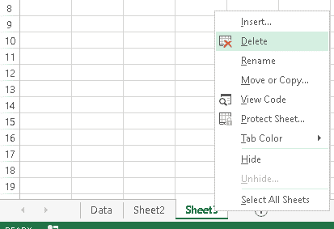

### 移除隐藏的工作表

有时，excel 文件也可能包含一些隐藏的工作表。虽然保持某些工作表的私密性是 MS excel 的一大特色，但有时也可能包含不必要的工作表。因此，最好取消隐藏此类工作表，并确保它们是重要的还是无用的。要找到隐藏的工作表，我们需要右键单击工作表名称，然后从菜单列表中单击“**取消隐藏**”选项。

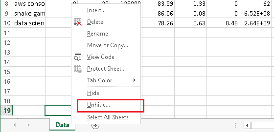

一旦我们点击取消隐藏选项，一个新的窗口将会打开，它将显示所有隐藏的工作表。

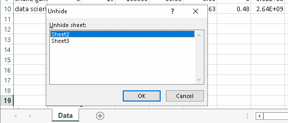

接下来，我们需要通过选择工作表并单击“确定”按钮来取消隐藏所有工作表。我们需要一遍又一遍地重复整个过程，直到我们取消隐藏所有工作表。之后，我们可以逐个检查每个工作表。由于所有工作表都是可见的，我们可以按照上面讨论的方法删除不必要的工作表。

### 拆分工作簿

如果一个 excel 文件中有多个工作表，并且它们都很重要，我们可以将它们拆分成单独的文件。这将有助于轻松共享庞大的数据。假设我们在工作簿“数据”中有一些工作表。每张表由不同的数据组成，即数据 1、数据 2 和数据 3。

我们可以将这三张不同的工作表分割成三个不同的 excel 文件。我们需要右键单击工作表名称，然后单击菜单列表中的“**移动和复制**”选项。

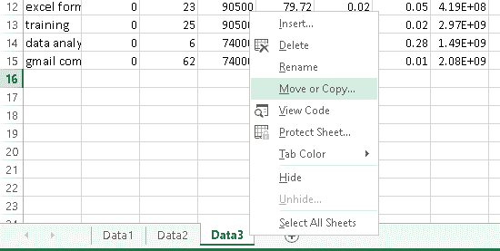

接下来，我们需要从下拉列表中选择“**新书**”选项，然后点击“确定”按钮。之后，特定工作表的全部数据被移动到一个新的 excel 文件中。我们可以相应地保存这个新的 excel 文件。

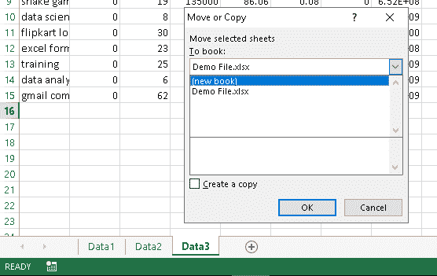

我们必须对所有工作表重复整个过程，以将数据移动到新的 excel 文件中。通过这样做，我们将获得多个大小相对较小的 excel 文件，而不是一个巨大的文件。

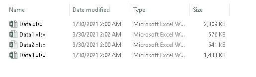

### 删除隐藏的行和列

有时，excel 工作表中可能有几个隐藏的行或列，甚至两者都有。此外，这些行或列可能包含一些不必要的数据，包括文本、图像等。我们可以通过观察行和列的序列号来识别隐藏的行和列。此外，还会有隐藏行和列的双线。它通常看起来像下图:

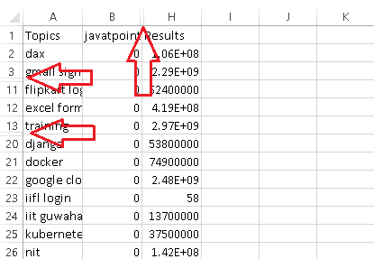

将所有这样隐藏的行和列取消隐藏，并检查相应的数据以确保是否有必要，这是一个很好的主意。要取消隐藏这些行和列，我们需要选择特定的行或列，右键单击它们，并从菜单列表中选择名为“**取消隐藏**”的选项。

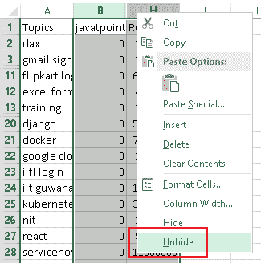

我们还可以在隐藏对象的排序区域中的双线上单击两次，以显示它们各自的行和列。

### 删除数据格式

过多的数据格式化也可能是文件大小稍微增加的一个原因。术语“数据格式”通常指的是字体样式、颜色、类型和粗细等样式特征。这也可以包括背景颜色、表格边框、下划线等。有时，空单元格有一些这样的格式，这甚至没有意义。因此，分析 excel 工作表并找出不必要的格式来删除它们是至关重要的。但是，对文件缩减的影响很小。

要从 excel 文件中删除数据格式，我们需要使用键盘快捷键 **Ctrl + A** 或者点击**全选**按钮来选择整个数据。

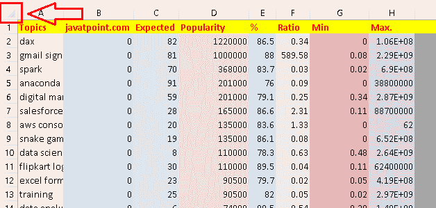

接下来，我们需要点击“**主页**”选项卡，并从“编辑”工具中点击“**清除**”。它将打开一个包含更多选项的列表。然后，我们需要从列表中点击“**清除格式**”。

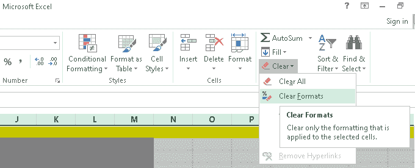

单击“清除格式”按钮后，所有格式或样式都将被删除，而不会对数据进行任何更改。

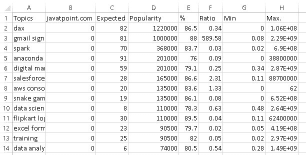

### 删除条件格式

条件格式也可以增加一点 excel 文件的大小。因此，建议删除所有不必要的条件格式，以在一定程度上减小 excel 文件的大小。上面讨论的使用“清除格式”按钮的方法将删除所有格式。但是，如果只需要删除条件格式，保留其他格式和数据不变，我们也可以这样做。以最小的结果减少 excel 文件的大小将是有益的。

要删除整个工作表的条件格式，我们需要点击**主页>条件格式>清除规则>清除整个工作表的规则**。此外，我们还可以从特定单元格中清除条件格式，方法是只选择那些单元格，然后相应地清除规则。

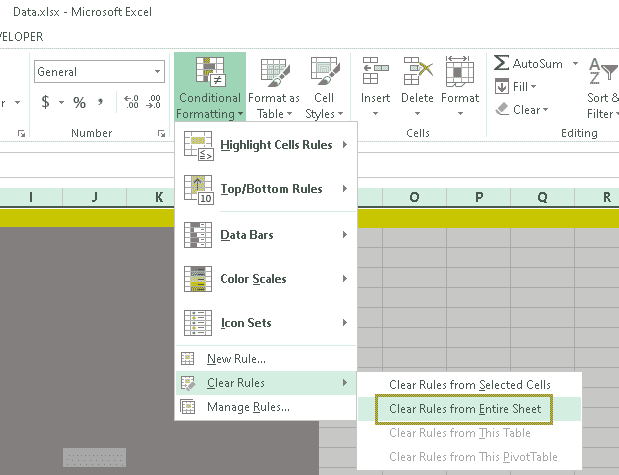

与前面的过程不同，此方法仅移除条件格式。

### 删除不必要的公式

如果我们有一个 excel 文件，里面有这么多公式，我们需要检查我们是否需要它们。此外，我们可能已经使用这些公式来计算过去的值，但我们可能不会在未来使用这些公式进行更多的计算。在这种情况下，最好从 excel 工作表中删除这些公式，并将之前的结果转换为正常值。通过这样做，我们将不会改变所需的数据，而是减少 excel 文件的大小。

在从文件中删除不必要的公式之前，我们需要找到使用过公式的特定单元格。首先我们需要到**首页>找到&选择(从编辑区)>转到特别**。我们也可以按下键盘上的 **F5** 按钮，然后点击“特殊”按钮。

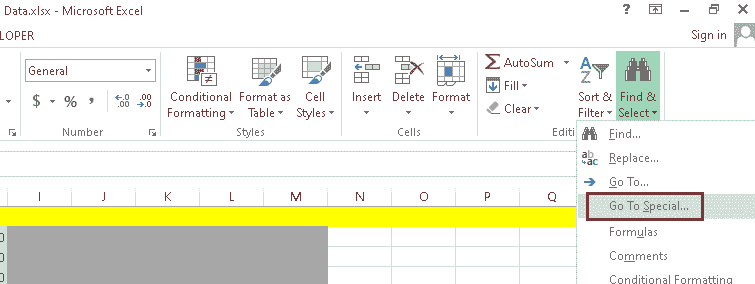

将出现一个弹出窗口，如下图所示:

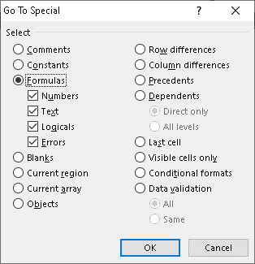

在这里，我们需要点击“公式”下给出的所有复选框，然后点击“确定”按钮。通过这样做，我们确保突出显示与公式相关的所有元素。接下来，我们需要选择所有已应用公式的突出显示的单元格。我们可以使用快捷键 **Ctrl + C** 复制选中的数据。

现在，我们需要将数据粘贴回相应的单元格，但不需要公式。如果我们用快捷键 **Ctrl + V** 粘贴数据，它也会粘贴各自的公式。因此，我们不能用这条捷径。我们只需要值，因此，我们需要转到**主页>粘贴(从剪贴板部分)>粘贴值>值**。

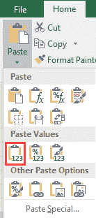

这只会粘贴单元格的值，这将略微减小 Excel 的整体大小。

### 压缩图像

图像有时会导致 excel 文件过大。特别是，与文本或数字相比，图像占用的空间更大。因此，如果 excel 文件中有多个图像，那么压缩和替换图像可以帮助节省大量空间。可以使用两种方法压缩图像:

*   第一种方法是使用 Photoshop 工具并降低图像的分辨率或 DPI。
*   另一种方法是使用外部应用程序。其中一个常用的应用是“ **tinypng** ”。使用这个应用程序，我们可以拖放或上传图像文件，并减少图像大小，而不会失去明显的图像质量。它通过网络浏览器在线工作，允许压缩多达 20 幅图像。png 或。仅 jpg)同时执行。此外，每个图像文件最多只能有 5 MB。

在我们的例子中，名为“Excel Analytical Data.jpg”的图像文件的大小从大约 912 KB 减少到大约 200 KB。图像文件大小减少了 70%以上。因此，压缩一个 Excel 文件中使用的多个图像可以在很大程度上帮助减少 Excel 文件的大小。

### 将 Excel 文件转换(另存为)为二进制格式(。xlsb)

一般 excel 文件都是以 XLSX 格式保存的，这是一种开放式的 XML 电子表格文件格式。这种格式主要将 excel 文件存储在不同的 XML 文件中，并以 xlsx 扩展名压缩所有文件。要检查 excel 文件中的 XML 文件，我们可以通过重命名文件将 XLSX 文件的扩展名更改为 ZIP 扩展名。接下来，我们可以提取 zip 文件来获取所有的 XML 文件。XLSX 格式主要是帮助第三方软件轻松导出 XLSX 文件中的数据。但是，它通常会增加 excel 文件的大小。

但是，我们可以通过将电子表格保存为二进制工作簿来减小文件大小。xlsb 格式)。出于一般目的，二进制格式就足够了，并且可以帮助将文件大小节省高达 50%。此外，二进制工作簿的读写速度相对较快。

要将现有的 excel XLSX 文件转换为 XLSB 格式，我们需要打开一个文件，然后转到**文件>选项>另存为**。在下一个屏幕上，我们需要点击名为“**另存为类型**的选项。它将打开 excel 文件支持的各种格式的列表，例如(如下图):

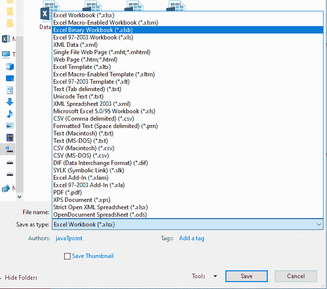

在这里，我们需要选择' Excel 二进制工作簿(。xlsb)并点击“确定”按钮保存文件。这将把现有 excel 工作簿的副本保存为二进制工作簿；但是，它们(二进制文件)不能在 Office 套件之外打开。

### 删除透视缓存

每次我们在 excel 中创建数据透视表时，都会创建一个额外的数据透视表缓存，其中包含一个原始表的副本，以方便其他应用程序使用。每当我们对透视表进行更改时，Excel 都会使用缓存而不是原始表来提高性能。此外，如果我们对原始表进行更改，excel 会相应地修改透视缓存。

当我们在 excel 工作表中创建数据透视表时，excel 文件的大小会显著增加。以下文件显示了不带数据透视表的 excel 文件和带数据透视表的 excel 文件之间的区别:

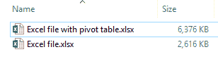

在这种情况下，很少有方法可以减小 excel 文件的大小:

*   **删除透视表**:如果不需要透视表，删除整个透视表是一个很好的主意。这将自动删除透视缓存数据，并且文件的大小将会减小。
*   **删除透视表缓存**:如果我们的 excel 文件中需要一个透视表，最好只删除透视表缓存，减少 excel 文件大小。要只删除数据透视表缓存，我们需要首先选择数据透视表所在的单元格。接下来，我们需要转到**数据透视表工具>分析**并在**数据透视表组**中选择**选项**。在“数据透视表选项”窗口中，我们需要点击“**数据**”选项卡，并根据下图进行更改:

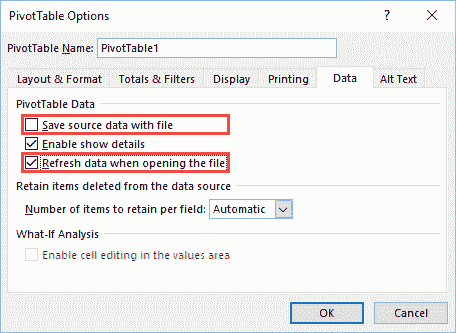

进行更改后，我们需要单击“确定”按钮，数据透视表缓存将被删除。之后，我们可以比较 excel 文件大小的变化:

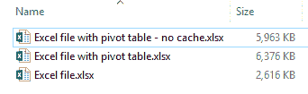

删除透视缓存后，Excel 文件大小略有减小，如上图第一个文件所示。

### 在压缩文件中压缩

有时，在 zip 文件中压缩 excel 文件也会有所帮助。假设我们需要通过电子邮件发送一个 excel 文件，并且文件的大小稍微超过了附件的限制。在这种情况下，在发送之前压缩 excel 文件是个好主意。为了创建一个压缩文件，我们需要右击特定的 excel 文件，并选择**发送到>压缩(压缩)文件夹**。之后，我们可以为 zip 文件输入所需的名称。

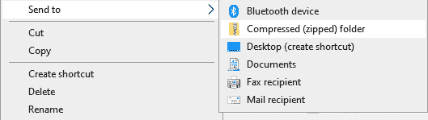

内置的 windows 应用程序没有那么强大，因此，它只能在一定程度上帮助我们压缩文件。下图显示了 excel 的原始 excel 文件(1430 KB)和压缩 zip 文件(1412 KB)。

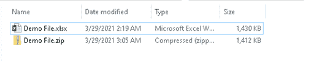

此外，一些强大的第三方压缩软件可以帮助显著减小压缩 ZIP 文件的大小。例如 **WinRAR** 和 **7zip** 。

## 方法二:一键缩小 Excel 文件大小

这种方法非常简单，可以快速减小 excel 文件的大小。从技术上讲，这种方法不是一键点击的方法。该方法包括几个简单的步骤，比我们上面讨论的第一种方法更容易遵循。很多线上网站和线下软件都可以最大限度地减少 excel 文件的大小。其中一个流行的选项是“ **wecompress** ”。

Wecompress 是一个在互联网上工作的软件/工具，允许我们上传不同的文件并减小文件大小。除此之外，这个工具还有一个桌面版，可以离线工作。但是，免费版本只允许压缩高达 50 MB 的文件。

在这里，我们讨论通过网络浏览器使用“wecompress”工具的步骤:

**第一步**:首先，启动网页浏览器，使用下面给出的链接导航到‘we compress’官方网站:

[https://www . wecompress . com/en/](https://www.wecompress.com/en/)

它将打开一个网页，如下图所示:

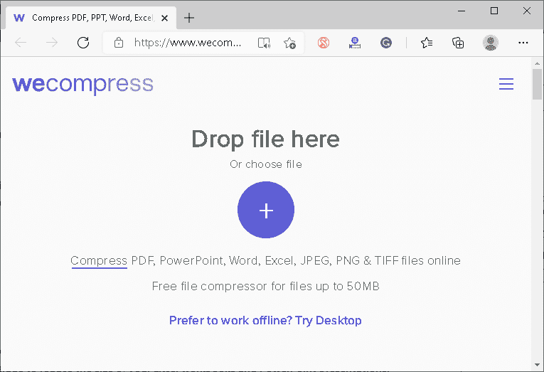

**第二步**:接下来，直接将 excel 文件拖放到网页中，或者点击**加号图标**使用文件浏览器选择文件。选择文件后，工具会自动上传文件并开始压缩。根据 excel 文件的大小，这可能需要一些时间。

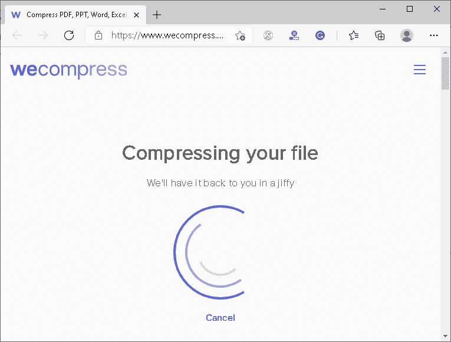

**第三步**:以上步骤成功完成后，会出现**下载按钮**。我们需要点击这个下载按钮，将压缩的 excel 文件保存到我们的设备中。在我们的例子中，名为“演示文件. xlsx”的文件的原始大小是 **1.40 MB，**，在使用“wecompress”后，它被缩减为 **614 KB** 。

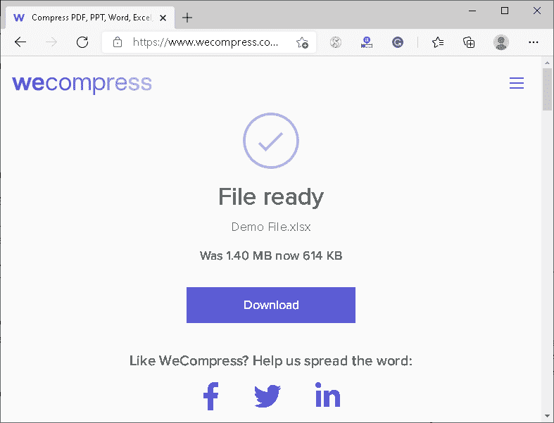

#### 注意:当使用“wecompress”工具减小文件大小时，我们不对 Excel 文件的数据安全负责。强烈建议查看他们的隐私政策或条款和条件，以了解“wecompress”如何使用上传到其服务器的 Excel 文件中的数据。

* * *