# 从光盘系统到电子表格

> 原文：<https://www.javatpoint.com/ods-to-excel>

微软 Excel 或微软 Excel 是最流行的电子表格软件之一，它允许我们将数据放入表格中。有时，数据以行和列的形式存储在 ODS 文件中。ODS 格式经常导致混乱，因为它不是一种非常流行的文件格式。但是，Windows 和其他操作系统上的各种软件可以打开 ODS 文件进行进一步操作，包括编辑和操作。此外，ODS 文件可以转换成其他电子表格格式，包括 Excel 格式，如 XLSX、XLS 等。

在本文中，我们将讨论从 ODS 到 Excel 的转换过程。在讨论这个过程之前，让我们了解一下 ODS 文件的基本信息，并讨论一下在 Excel 中打开它。

## 什么是 ODS 文件？

ODS 文件是基于 XML 的 **OpenDocument 电子表格**文档格式。这种格式通常是 OpenOffice 软件支持的开放文档格式(ODF)家族的一个子类型。这个软件是由 Apache 开发的，一般叫做 **Apache OpenOffice** (以前叫 OpenOffice.org)。Apache OpenOffice 是免费使用的，微软 Office 套件的开源替代品， **Calc** 是一个相当于 MS Excel 的 OpenOffice 工具。Calc 可以执行大部分 MS Excel 任务；但是，它以 **ODS** 格式保存电子表格。ODS 文件几乎和 Excel 的 XLSX 文件差不多。

## 如何在 Excel 中打开一个 ODS 文件？

我们可以通过各种电子表格程序打开 ODS 文件，包括 MS Excel。其他受欢迎的程序包括 Google Sheets、OpenOffice Calc、LibreOffice、NeoOffice 等。但是，当我们在 OpenOffice 或 LibreOffice 以外的程序中打开 ODS 文件时，可能会遇到一些格式问题。

要在 Excel 中打开 ODS 文件，我们可以遵循两种不同的方法。但是我们必须在我们的设备上安装微软 Excel。让我们讨论这两种方法:

### 方法一:通过微软 Excel 打开

首先我们需要**从开始菜单或者桌面启动 MS Excel** :

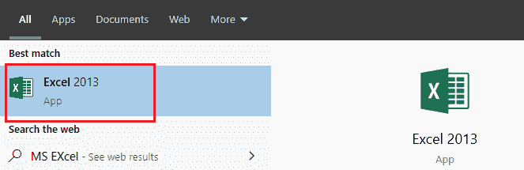

接下来，我们需要在 MS Excel 中点击“**文件**”选项卡:

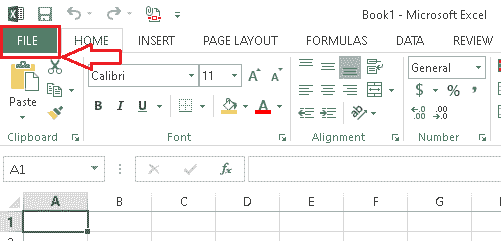

之后我们需要导航到**打开>电脑>浏览**从本地存储找到 ODS 文件，我们要通过 MS Excel 打开。

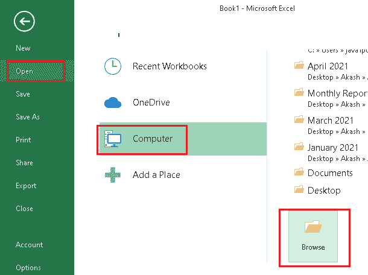

我们可以点击“**打开文档电子表格(。ods)**‘文件名’输入字段旁边给出的列表中的选项，仅显示 ODS 文件。通过这样做，我们将只看到包含 ODS 格式的文件。

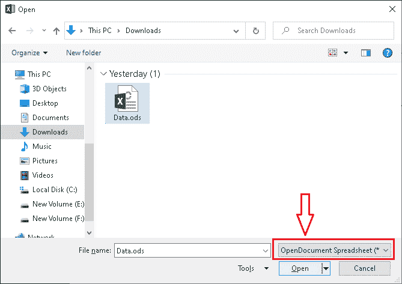

我们既可以双击具体的 ODS 文件，也可以点击文件后点击**打开**按钮，在 Excel 中打开 ODS 文件。

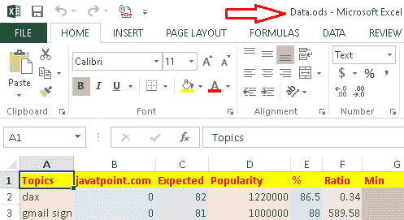

### 方法 2:通过文件资源管理器打开

此方法通过窗口文件资源管理器工作。首先，我们需要使用文件资源管理器应用程序和**来定位**我们想要在 Excel 中打开的特定 ODS 文件。

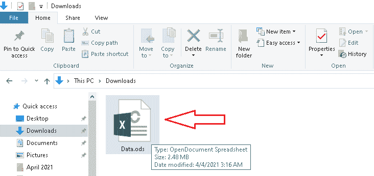

接下来，我们需要在 ODS 文件上**右键**，然后从菜单选项中点击**用**打开选项。

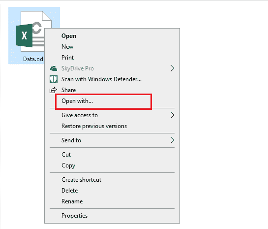

点击“打开方式”按钮后，我们将获得安装在我们设备上的软件列表，我们可以选择任何特定的软件来打开 ODS 文件。在这里，我们必须选择 MS Excel，然后点击确定按钮，在 Excel 中打开它。

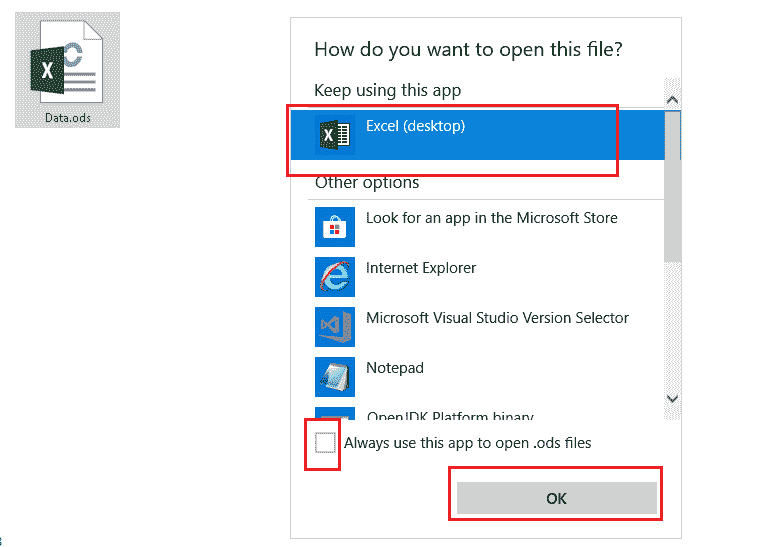

在上图中，我们可以选择复选框将 ODS 文件与 MS Excel 相关联。这意味着我们只需要遵循这个过程一次，之后，每当我们双击一个 ODS 文件，它就会在 Excel 中打开。

## 如何将 ODS 文件转换成 Excel？

许多工具和方法可以将 ods 文件转换成其他格式，包括 Excel 的主要格式，如 XLSX、XLS 等。他们中的一些人在网上工作，而另一些人在网下工作。这里，我们讨论两个简单的方法；其中一个离线工作，另一个通过网络浏览器在线工作。

#### 注意:在将其转换为 excel 或其他格式之前，请始终保留原始文件(ODS 文件)的副本。这将有助于比较原始文件和转换文件之间的数据。万一出了什么问题，我们可以从原始文件中恢复数据。

让我们逐一讨论这两种方法:

### 方法一:使用微软 Excel 软件

这种方法可以在脱机模式下工作，并且需要在设备上安装微软 Excel 软件。它很容易使用，大多数人使用这种方法将 ODS 文件保存为其他格式，包括 MS excel 格式。

根据这种方法，我们首先需要**通过 MS Excel** 软件使用上面讨论的两个程序中的任何一个打开一个 ODS 文件。接下来，我们需要点击“**文件**选项卡，如下图所示:

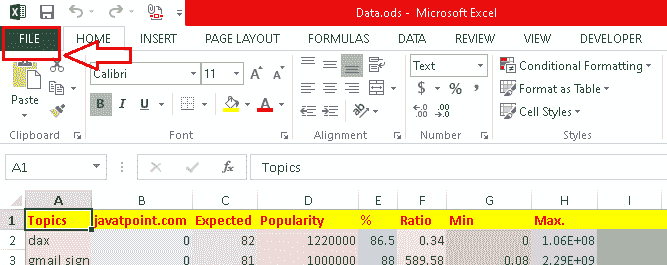

在下一个屏幕上，我们需要点击“**另存为**”按钮:

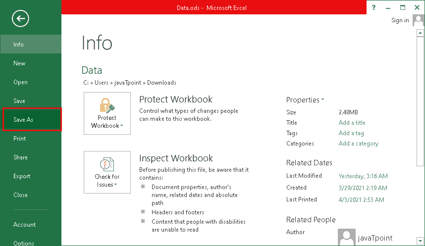

单击“另存为”按钮后，将显示一个新窗口，要求我们选择目标文件夹或位置，将 ODS 文件保存为所需格式。我们可以去**电脑>浏览**按钮选择本地存储中的具体位置路径或地址:

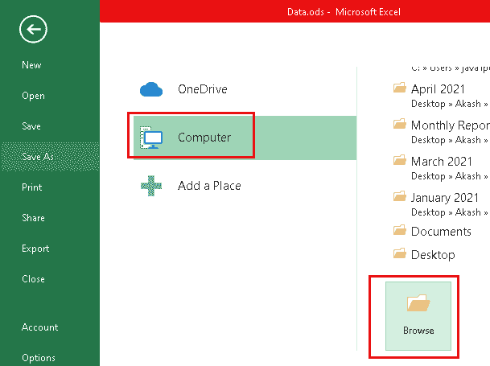

之后，我们需要输入想要的文件名，点击“**另存为类型**选项旁边的下拉列表。列表将显示许多文件格式，您可以为输出文件选择所需的格式。要将 ODS 转换为 Excel，我们需要选择' **Excel 工作簿(。xlsx)** 选项，然后点击**确定**按钮。

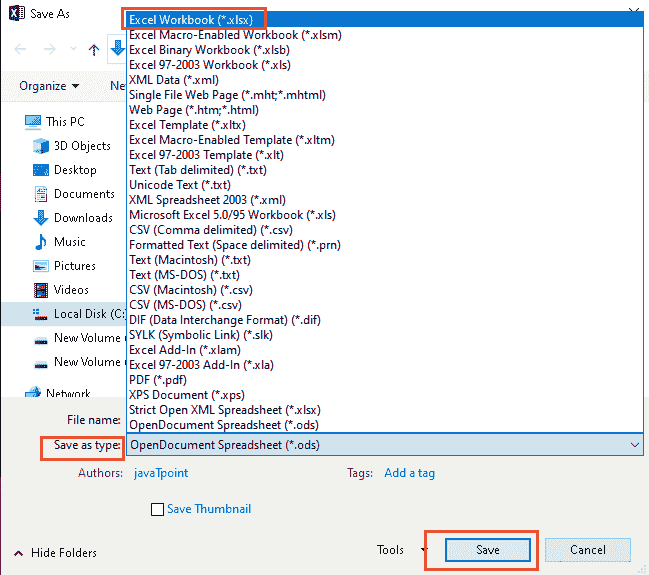

它将在选定的位置创建 ODS 文件的 excel 版本。

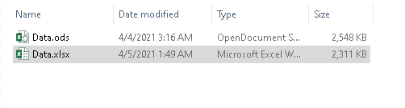

#### 注意:建议在创建 excel 文件后对其进行检查。这是因为转换后的文件中有时可能存在不正确的格式，因为开放文档电子表格应用程序和 Excel 都支持不同的功能和选项。

### 方法 2:使用一次点击转换

这种方法非常简单，可以保存或转换 OpenDocument 电子表格(。ODS)文件转换成 Excel 文件(。XLSX)文件。从技术上讲，这种方法不是一键点击的方法。该方法包括几个简单的步骤，比我们上面讨论的方法更容易遵循。此外，该方法不需要在设备上安装微软 Excel 软件。

广泛的在线工具和离线软件可以帮助我们将 ODS 文件保存/转换为 excel 文件。其中一个受欢迎的选项是“T0”ZAMZAR。

ZAMZAR 是一个软件/工具/服务，它在互联网上工作，允许我们上传不同的文件，并将它们转换成其他格式。在我们的例子中，我们使用这个服务将一个 ODS 文件转换成一个 excel 文件并保存在我们的设备上。此外，它可以自由使用，但有一些限制(例如，仅在免费版本中，每个文件的最大允许文件大小为 50 MB)。

让我们讨论创建 ODS 文件的 XLSX 版本并将其保存到本地存储的所有步骤:

**第一步**:首先我们需要打开任何一个网页浏览器(即谷歌 Chrome、火狐、Edge 等。)并使用下面给出的链接导航到“ZAMZAR”的官方网站:

[https://www.zamzar.com/](https://www.zamzar.com/)

它将打开一个网页，如下图所示:

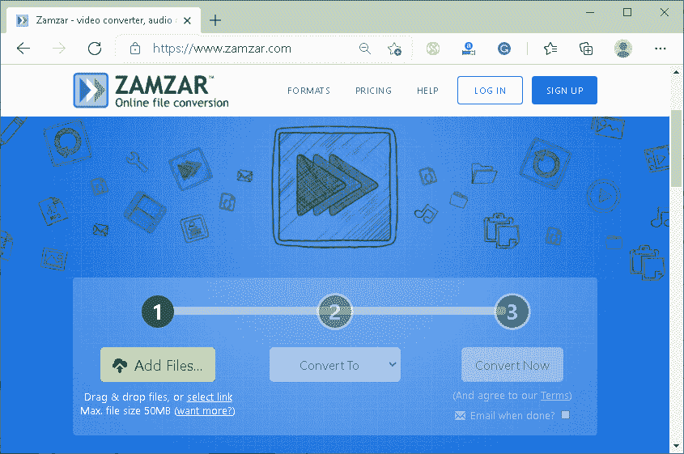

**第二步**:接下来我们需要点击**添加文件**按钮，选择要转换的 ODS 文件。此外，我们还可以在此窗口中拖放文件，或者单击“选择链接”来使用在线来源的任何 ODS 文件。下面将显示所选文件以及一些基本细节:

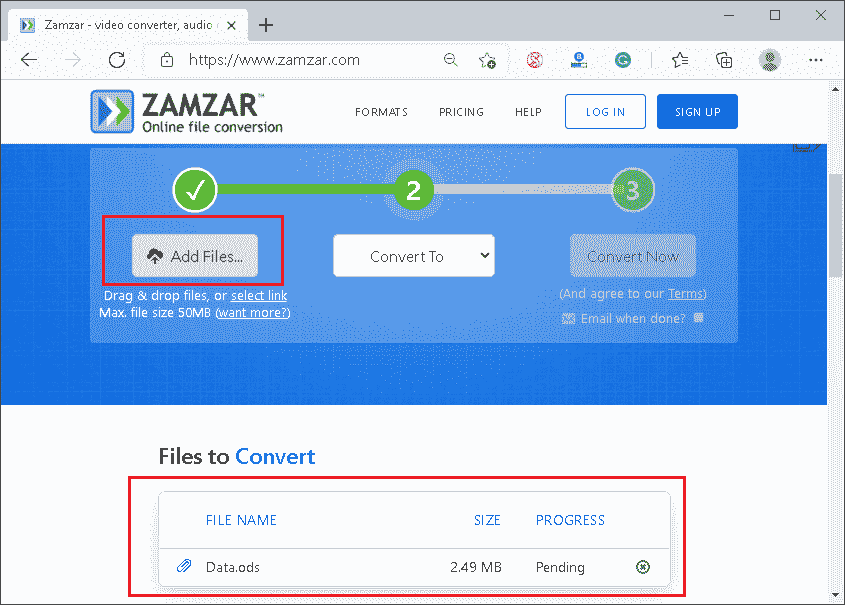

**第三步**:一旦选择了文件，我们需要点击**转换为**按钮，从列表中选择 **XLSX** 文件格式。

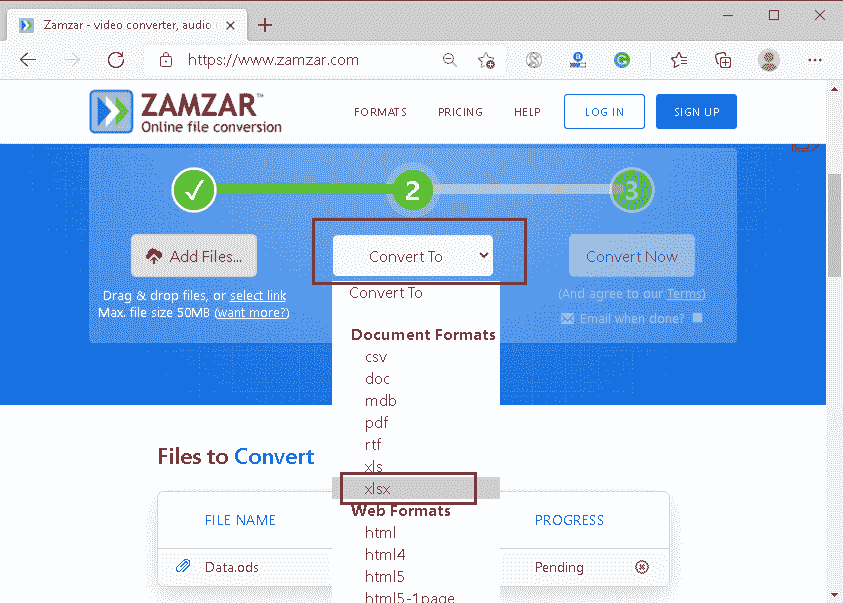

在这里，我们有许多其他文档格式和其他 excel 格式。您可以为输出文件选择所需的文件格式，然后进入下一步。

**第四步**:选择好想要的文件格式后，我们必须点击**立即转换**按钮。文件将被上传到服务器，转换过程将自动开始。

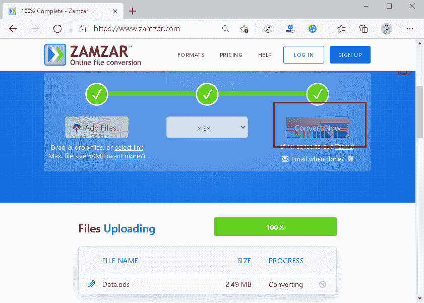

转换可能需要时间，具体取决于文件大小和不同的文件格式。

**第五步**:最后会出现**下载**按钮，我们可以点击这个按钮将转换后的 ODS 文件或者一个 Excel 文件保存到本地存储。

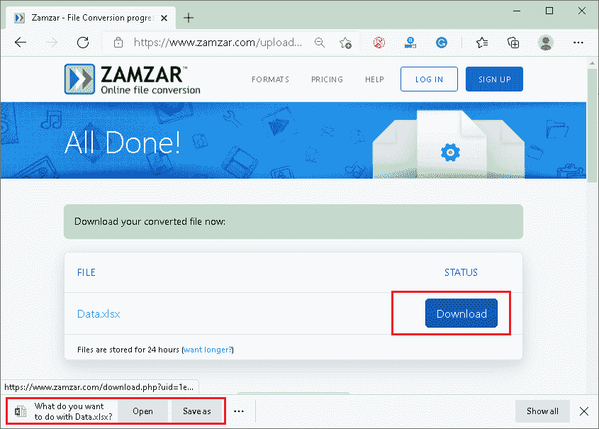

#### 注意:当使用“ZAMZAR”工具将 ODS 转换为 Excel 时，我们不对文件的数据安全负责。强烈建议查看他们的隐私政策或条款和条件，以了解“ZAMZAR”如何读取、使用或共享上传到其服务器的文件中的数据。

* * *