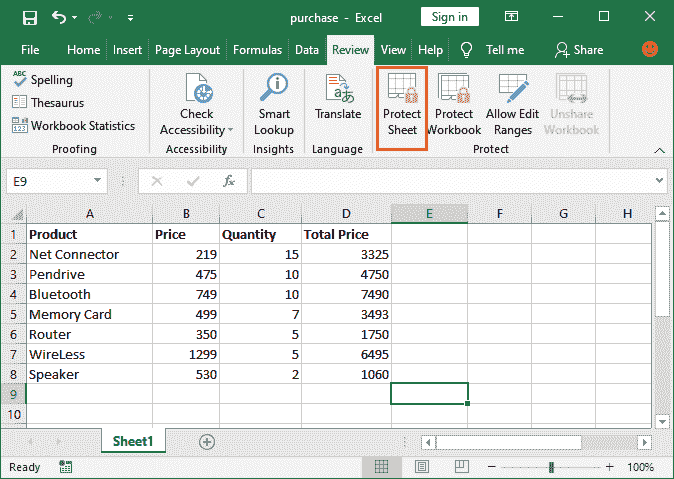
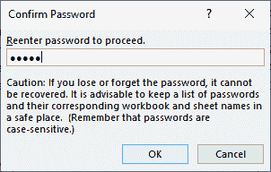
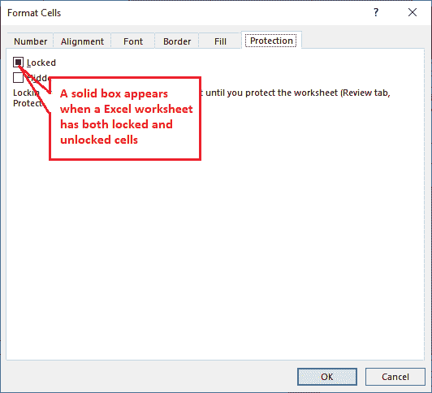

# Excel 中如何锁定单元格？

> 原文：<https://www.javatpoint.com/how-to-lock-cells-in-excel>

锁定单元格意味着限制单元格被编辑。当您锁定 Excel 中的单元格时，任何人都不能对其进行任何更改。用户不能更改公式和受保护单元格的内容。

#### 注意:锁定功能与保护单元功能一起工作。这两种功能结合在一起完全有意义。

在 [Excel](https://www.javatpoint.com/excel-tutorial) 中，可以锁定单元格使其不可编辑。它可以保存 Excel 工作表中不需要的数据。您可以锁定 Excel 工作表中的单个单元格、单元格区域甚至所有单元格。默认情况下，Excel 中所有单元格都是锁定的，您只需要保护它们就可以完全锁定它们。

本章将向您描述锁定单元格的每一步。但是请记住，只有锁定细胞才能起作用，除非你保护这些细胞。

## 为什么要锁牢房？

在本章中，我们指定了锁定单元格或整个工作表的两个最常见但最重要的原因。

### 原因 1

通常，当您使用 Excel 工作表时，您不小心按下了 **DELETE、退格键**或任何字母或数字键，数据可能会丢失或被错误编辑。如果你发现了错误，那么很好，你可以改正它；否则，您可能会得到错误的结果。

### 原因 2

锁定单元格的另一个原因可能是，您不希望任何人在未经您允许的情况下编辑您的 excel 工作表。因此，您可以锁定单元格，以便用户只能打开和读取您的工作表，而不能编辑它。

### 解决办法

Excel 提供了一种防止这种情况发生的方法。您可以锁定单元格并保护它们不被编辑，还可以保存文件以避免不必要的更改。您也可以自定义工作表的保护。这意味着，即使工作表被锁定/保护，您也可以允许用户对其执行某些操作。

## 锁定细胞需要哪些操作？

为了保护您的 Excel 工作表免受不必要的更改，您必须在工作表中依次执行以下操作。

1.  锁定细胞
2.  保护细胞

操作顺序很重要。我们将通过一个恰当的例子来详细描述这两种方法。首先，我们将指示您锁定 Excel 工作表的所有单元格，然后锁定一些特定的单元格。

### 锁定所有单元格

之前我们告诉过你，默认情况下所有单元格都是锁定的。在进行下一步保护单元格之前，请确认单元格是否被锁定。如果单元格没有被锁定，您必须先锁定它们。

首先，我们将验证所有的细胞最初都是锁定的。为此，请遵循以下步骤:

**第一步:**使用 **Ctrl+A** 快捷键选择 Excel 工作表的所有单元格。

**第二步:**现在。右键单击这些选定的单元格，然后从打开的列表中选择**设置单元格格式**。

**步骤 3:** 将打开一个格式单元格面板，转到**保护**选项卡，并验证当前所有单元格都已锁定。

按下 **Ctrl+1** 快捷键，直接打开单元格格式面板。

**第 4 步:**如果锁定单元格复选框未被标记，则表示单元格未被锁定。因此，通过选中此复选框锁定单元格。

**第五步:**结束时，点击**确定**按钮，完成单元格锁定过程。

现在，移动以保护您的单元格内容和应用的公式。

### 保护所有单元格

锁定细胞后，你必须再走一步才能达到目标。保护细胞的步骤和锁定细胞一样重要。这两个步骤同样重要。如果单元格没有被锁定，那么这将不起作用，并且单元格的内容将保持可编辑状态。因此，不要忘记锁定细胞。

通过以下步骤保护单元格内容:

**第 1 步:**在同一张工作表上，转到 Excel 功能区的**查看**选项卡。

**第二步:**在审核选项卡中，点击**保护**组下的**保护单**选项。

**第三步:**会打开一个保护单元格窗口面板，如果你想给用户一些权限，即使单元格被锁定，你也可以在这里自定义单元格限制。

选中此处的复选框以授予相应的操作权限。

默认情况下，前 2 个选项在此列表中标记。

**第四步:**可以设置密码，也可以不设置密码直接保护单元格，点击【确定】。对于完全受保护的单元格，使工作表受密码保护。

取消保护 Excel 单元格时需要此密码。此外，您还可以在不设置密码的情况下保护单元格。

**第五步:**检查所有单元格是否锁定成功，现在不可编辑。一旦单元格被锁定和保护，您将不允许在不解除保护的情况下进行任何更改。

**第六步:**如果你试图编辑被锁定保护的单元格，你会得到一条警告消息，如下所示。

## 锁定 Excel 工作表的特定单元格

有时，我们不想锁定 Excel 工作表的所有单元格，而只想锁定两三个单元格。在这种情况下，您只需锁定和保护一些特定的单元格，其余的就保持原样。

Excel 也只允许锁定某些特定的单元格。因此，使整个工作表不可编辑，它允许您只锁定那些我们不希望更改其数据/内容的单元格。因此，我们现在将只锁定几个单元格，并保护它们免受不必要的更改。

### 锁定少数细胞前要记住的事情

如您所知，默认情况下，Excel 工作表中的所有单元格都是锁定的。因此，在开始并继续之前，请确保只有您想要保护的单元格被锁定，其余单元格未被锁定。

在进入下一步之前，请锁定您想要保护的单元格并解锁其他单元格。如果您试图用所有锁定的单元格保护工作表，所有单元格都将被锁定。

让我们从一个例子开始-

### 锁定特定单元格的步骤

请仔细按照以下步骤锁定 Excel 工作表中的几个单元格:

**第一步:**选择不想被锁定的单元格或单元格范围( **A 到 C 列单元格**)。这意味着，这一次，您必须选择那些您允许更改其内容的单元格。

**步骤 2:** 右键单击所选单元格，从列表中选择**设置单元格格式**选项，将打开设置单元格格式面板。

**第三步:**在单元格格式窗口中，转到**保护**选项卡和**取消锁定复选框**以使所选单元格解锁，然后单击**确定**按钮。

现在，只有您想要保护的单元格被锁定，其余的被解锁。因此，当您遵循保护单元格的过程时，它将只对锁定的单元格起作用，而不是对整个工作表起作用。

**第 4 步:**在同一张工作表上，转到 Excel 功能区的**查看**选项卡。

**第 5 步:**在审核选项卡中，点击**保护**组下的**保护单**选项。

**步骤 6:** 一个保护表窗口面板，在该面板中，选中复选框以给予相应的操作权限。

**第七步:**这一次，输入你想要设置的密码，点击**确定**按钮。取消保护单元格以使其再次可编辑时，需要此密码。

虽然您也可以在不设置密码的情况下保护单元格，这不会在再次取消保护单元格时要求任何密码，并且只需单击一下即可直接取消对文件的保护。

**第八步:**会要求重新输入密码，确认与你输入的第一个密码匹配。再次输入密码，点击**确定**按钮。

**第 9 步:**锁定的细胞现在被成功保护。因此，未锁定的单元格仍可编辑，而锁定的单元格则不可编辑。

您可以检查如果您单击 A、B 或 C 列中的任何单元格，它们都是可编辑的。但是在 D 列，单元格是不可编辑的。请看下面的截图:

**第十步:**另一方面，如果你试图编辑 D 列的任意单元格，它会显示一条警告消息，如下图截图所示。

结论是您选择的单元格已被成功锁定。如果不使用您设置的密码解除对锁定单元格的保护，任何人现在都无法编辑它们。

### 混合锁定状态

Excel 电子表格既可以有锁定的单元格，也可以有解锁的单元格。当您保护的单元格很少而不是全部时，则只有受保护的单元格被锁定，其他单元格被解锁。但问题是，如果一个工作表同时包含这两种类型的单元格，该如何查找呢？

您可以找到工作表是否同时包含锁定和解锁的单元格。Excel 用一个实心的方框显示出来。请参见以下步骤了解混合锁定状态。

**第一步:**选择工作表的所有单元格或单元格区域，按 **Ctrl+1** 快捷键。

**第二步:**在保护选项卡下的位置将打开一个格式单元格面板；您将会看到，如果“锁定”复选框包含一个实心的方形框，表示工作表既有锁定的单元格，也有解锁的单元格。

如果标记了“锁定”复选框，则意味着所有选定的单元格都被锁定。

第三种也是最后一种情况是，如果“锁定”复选框未被标记并显示为空白，则意味着所有选定的单元格都已解锁。

同样，您可以检查其他工作表和单元格区域。这些是不同的锁定表示状态。

**锁定状态表示**

1.  通过选中复选框锁定单元格。
2.  通过未标记的复选框解锁单元格。
3.  实心方框混合单元格。

* * *